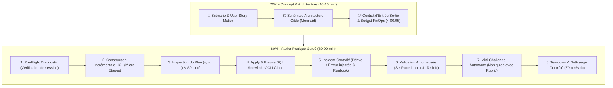
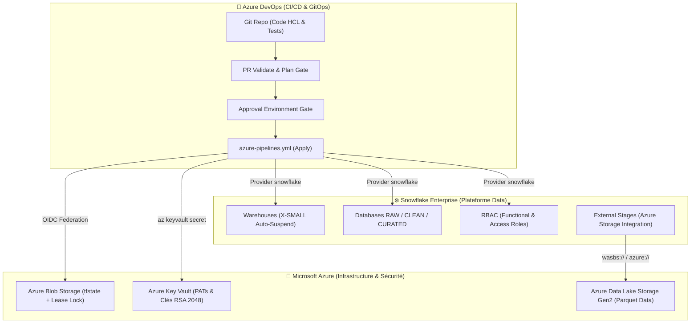
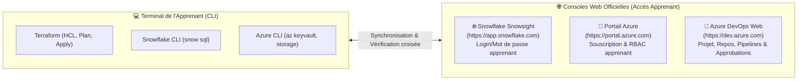
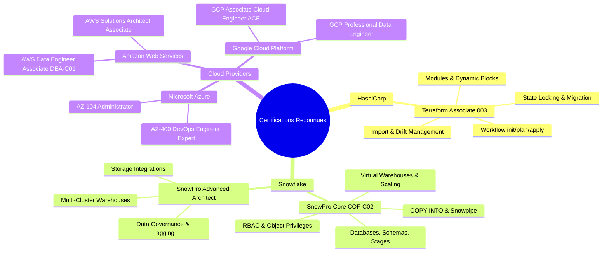

# 📋 Plan Directeur — Filière Académique & Professionnelle d'Excellence
## Cœur Industriel Obligatoire : Terraform · Snowflake · Microsoft Azure · Azure DevOps
### Parcours d'Autoformation Pratique à 80% Labs (*Self-Paced Learning Path*)

---

## 📑 Sommaire
1. [Socle Technique Obligatoire : Azure + Terraform + Snowflake + Azure DevOps](#1-socle-technique-obligatoire--azure--terraform--snowflake--azure-devops)
2. [Diagnostic de l'Existant (`courses/`)](#2-diagnostic-de-lexistant-courses)
3. [Architecture Pédagogique 80% Labs / 20% Théorie](#3-architecture-pédagogique-80-labs--20-théorie)
4. [Détail de la Stack Azure & Snowflake](#4-détail-de-la-stack-azure--snowflake)
5. [Alignement sur les Certifications Internationales](#5-alignement-sur-les-certifications-internationales)
6. [Standard Universel des Labs d'Autoformation](#6-standard-universel-des-labs-dautoformation)
7. [Feuille de Route Module par Module (M00 à M14)](#7-feuille-de-route-module-par-module-m00-à-m14)
8. [Architecture du Moteur d'Auto-Évaluation (*Self-Paced Engine*)](#8-architecture-du-moteur-dauto-évaluation-self-paced-engine)
9. [Planning Opérationnel de Déploiement](#9-planning-opérationnel-de-déploiement)

---

## 1. Socle Technique Obligatoire : Azure + Terraform + Snowflake + Azure DevOps

Ce plan confirme le **socle technologique officiel et exclusif des laboratoires pratiques (80% Hands-on)** :
- ⚙️ **Terraform (v1.14.5+)** : Langage HCL, Providers `snowflake` (v2.14.0) et `azurerm` (v3.x/v4.x).
- ❄️ **Snowflake Enterprise** : Warehouses auto-suspendus, RBAC à moindre privilège, Storage Integrations, Data Products.
- 🔵 **Microsoft Azure** :
  - **Azure Blob Storage** pour le backend d'état distant Terraform (*State distant chiffré avec verrouillage Blob Lease*).
  - **Azure Key Vault** pour le coffre-fort de secrets (tokens PAT Snowflake et paires de clés privées RSA 2048 pour authentification JWT).
  - **Azure Data Lake Storage Gen2 (ADLS Gen2)** pour les zones de stockage externe et l'ingestion Snowflake via `STAGE`.
- 🚀 **Azure DevOps** :
  - Dépôt Git centralisé.
  - **Azure Pipelines** (`azure-pipelines.yml`) multi-stages : `Validate` -> `Plan` -> `Approval Gate` -> `Apply` -> `Drift Audit`.
  - Pools d'agents dédiés et Service Connections via fédération d'identité OIDC (Workload Identity Federation).

> 💡 *Note comparative : Les équivalents AWS et GCP sont traités exclusivement sous forme d'**annexes comparatives d'architecture** `[ANNEXE]`, garantissant 100% de focalisation pratique sur le cœur **Azure + Terraform + Snowflake + Azure DevOps**.*

---

## 2. Diagnostic de l'Existant (`courses/`)

### 2.1 Points Forts Constatés
- **Structure modulaire propre** : 15 modules ($M_{00}$ à $M_{14}$) découpés logiquement en 5 étapes.
- **Rigueur de sécurité enterprise** : Utilisation d'authentification PAT, clés privées RSA 2048, Azure Key Vault, et convention de nommage stricte `<PREFIXE>_<ZONE>_<ENV>` interdisant toute collision.
- **Contrôle FinOps natif** : Warehouses configurés avec auto-suspension courte et taille minimale (`X-SMALL`).

### 2.2 Axes d'Amélioration Majeurs
| Domaine | Situation Actuelle | Cible du Plan |
|---|---|---|
| **Diversité Cloud** | Centré quasi-exclusivement sur Azure. AWS et GCP sont en simples notes annexes. | **Tri-Cloud natif** : Modules et options d'ateliers transposables (Azure ADLS Gen2, AWS S3, GCP GCS). |
| **Ratio Pratique** | ~60-65% de pratique, cours magistraux écrits encore longs. | **80% de manipulation active**, 20% de micro-concepts illustrés (Mermaid). |
| **Validation Autonome** | `student-track/` n'a de validateur que pour M00 et M01. M02 à M14 n'ont pas d'auto-évaluation interactive. | **15 validateurs automatisés** (`validate.ps1` & `validate.sh`) avec feedback en temps réel. |
| **Certifications** | Compétences orientées produit sans cartographie formelle. | **Mapping explicite** vers Terraform Associate, SnowPro Core/Advanced, Azure AZ-104/400, AWS DEA, GCP ACE. |

---

## 3. Architecture Pédagogique 80% Labs / 20% Théorie

Chaque module d'apprentissage est calibré pour une session de 1h30 à 2h30 en autonomie, respectant la séquence **P.A.T.H.S.** :



---

## 4. Architecture d'Exécution Obligatoire : Azure · Terraform · Snowflake · Azure DevOps

Toutes les manipulations pratiques (80% du temps) sont intégralement réalisées et testées sur la pile d'entreprise suivante :

### 4.1 Répartition des Responsabilités Techniques


### 4.2 Spécifications des Composants Azure & Snowflake
- **Backend Terraform** : Stockage du state dans un conteneur Azure Blob Storage chiffré au repos, protégé par un bail exclusif (*Blob Lease*) garantissant le verrouillage sans recours à une base externe.
- **Gestion des Secrets** : Clés privées RSA 2048 de l'utilisateur technique Snowflake et tokens PAT hébergés dans Azure Key Vault, récupérés au runtime via Azure CLI (`az keyvault secret show`).
- **Ingestion Externe** : Configuration d'un `snowflake_storage_integration` connecté à un compte ADLS Gen2 via un Principal de Service Microsoft Entra ID (sans clé d'accès partagée).
- **Orchestration CI/CD** : Pipeline Azure DevOps multi-étapes avec agents auto-hébergés ou Microsoft-hosted, vérification de conformité, estimation FinOps, et approbation requise pour l'environnement PROD.

*(Note : Pour les profils recherchant une vue transversale, une annexe comparative AWS S3/DynamoDB et GCP GCS est documentée à titre conceptuel sans impacter le déroulé des labs).*

---

## 5. L'Expérience Hybride : Terminal CLI + Consoles Web (Snowflake, Azure, Azure DevOps)

L'un des atouts pédagogiques majeurs de ce parcours est l'**expérience d'ingénierie hybride**. L'apprenant dispose d'identifiants individuels (`APP01`, `APP02`, etc.) lui permettant d'interagir à la fois en ligne de commande (Terraform, CLI) et au travers des interfaces graphiques officielles :



### 5.1 Rôles des Consoles Web dans les Laboratoires (80% Labs)

| Console Web | Accès Apprenant | Cas d'Usage Pédagogique Normal | Cas d'Usage "Chaos Lab" (Dérive Manuelle) |
|---|---|---|---|
| **❄️ Snowflake Snowsight** | Compte individuel (ex: `APP01` / `SYSADMIN`) | - Visualiser les databases, schemas, tables et warehouses créés par Terraform.<br/>- Inspecter l'historique des requêtes (*Query History*) et le graphe de profiling.<br/>- Tester les rôles RBAC et le masquage dynamique dans les worksheets SQL. | **Injection délibérée de dérive (*Drift*) :**<br/>L'apprenant modifie manuellement un paramètre dans l'UI (ex: taille ou auto-suspend du warehouse, ajout d'une colonne ou commentaire) puis revient dans son terminal pour observer comment `terraform plan` détecte l'écart. |
| **🔵 Portail Microsoft Azure** | Compte d'entreprise / Souscription dédiée | - Visualiser le conteneur Azure Blob Storage hébergeant le fichier `.tfstate`.<br/>- Inspecter le bail exclusif de verrouillage (*Blob Lease*).<br/>- Vérifier la présence des secrets et clés RSA dans Azure Key Vault.<br/>- Explorer les fichiers Parquet dans Azure Data Lake Gen2. | **Simulation d'incident Cloud :**<br/>Modifier les tags du conteneur ou simuler une coupure de droits pour observer l'échec fail-closed de Terraform. |
| **🚀 Azure DevOps Web Portal** | Compte de formation / Projet Git | - Naviguer dans le dépôt Git, créer des branches et soumettre des Pull Requests.<br/>- Consulter le rapport de `terraform plan` publié automatiquement sous forme de commentaire dans la PR.<br/>- **Valider les Gates d'approbation manuelle** (*Manual Approval Gate*) sur l'environnement PROD.<br/>- Consulter en direct les logs des jobs et des stages de pipeline. | **Audit CI/CD :**<br/>Rejeter intentionnellement une approbation de pipeline pour vérifier l'interruption sécurisée du déploiement en production. |

---

## 6. Alignement sur les Certifications Internationales

Le cursus couvre les objectifs des certifications officielles les plus demandées sur le marché :



---

## 6. Standard Universel des Labs d'Autoformation

Chaque fichier `lab.md` des modules doit obligatoirement respecter la structure suivante :

1. **Header Métrique** : Durée, Coût estimé (< $0.05), Prérequis vérifiables, Certifications alignées.
2. **Mission & Modèle Mental** : Scénario d'entreprise réel + diagramme d'architecture Mermaid.
3. **Pre-flight Diagnostic** : Script PowerShell / Bash pour valider l'environnement avant tout démarrage.
4. **Micro-Steps de Code HCL** :
   - Écriture d'un seul fichier à la fois.
   - Justification de chaque argument d'attribut.
   - Sortie console exacte attendue dans un bloc rétractable.
5. **Plan & Apply avec Preuve Fonctionnelle** : Interrogation SQL via Snowflake CLI (`snow sql`) ou CLI Cloud (`az`/`aws`/`gcloud`).
6. **Chaos Engineering Lab** : Une panne réelle introduite manuellement (ex : modification via Snowflake UI, corruption du state, expiration de token) suivie de sa résolution méthodique.
7. **Validation Automatisée par Script** : Commande `.\scripts\SelfPacedLab.ps1 -Module XX -Task N`.
8. **Défi Autonome (Challenge)** : Énoncé sans solution affichée, barème sur 100 points.
9. **Teardown FinOps** : Procédure de destruction vérifiée et commande de confirmation zéro résidu.

---

## 7. Feuille de Route Détaillée Module par Module (M00 à M14)

---

### JOUR 0 — PRÉPARATION & TOOLCHAIN

#### M00 — Setup & Audit d'Environnement
- **Objectif (20% Théorie - 10 min)** : Architecture de formation, modèle de nommage `<PREFIXE>_<ZONE>_<ENV>` et transit sécurisé des secrets sans mot de passe en dur.
- **Atelier Pas-à-Pas (80% Lab - 40 min)** :
  1. Vérifier Git, Terraform (= 1.14.5), Azure CLI et Snowflake CLI.
  2. Créer `.env` depuis `.env.example` et vérifier son exclusion Git (`git check-ignore .env`).
  3. Valider la session Azure CLI (`az login` et `az account set`).
  4. Valider la session Snowflake CLI (`snow connection test -c training`).
  5. Extraire le PAT d'amorçage depuis **Azure Key Vault** via `az keyvault secret show`.
- **🌐 Vérification Console Web** : Connexion à **Snowflake Snowsight** (`https://app.snowflake.com`) avec le login/mot de passe apprenant ; vérification du rôle actif `SYSADMIN`.
- **🐛 Chaos Lab** : Injecter un format de préfixe invalide dans `.env`, constater le rejet par regex et corriger.
- **🤖 Auto-Validation** : `SelfPacedLab.ps1 -Module 0 -All`.

---

### JOUR 1 — FONDATIONS IAC, STATE & VARIABLES

#### M01 — Premier Déploiement & Idempotence
- **Objectif (20% Théorie - 10 min)** : Cycle de vie HCL (`init -> validate -> plan -> apply`), rôle du provider et idempotence.
- **Atelier Pas-à-Pas (80% Lab - 60 min)** :
  1. Écrire `versions.tf` avec Terraform `= 1.14.5` et provider Snowflake `= 2.14.0`.
  2. Écrire `provider.tf` utilisant le profil Snowflake CLI.
  3. Déclarer `snowflake_database.raw` et appliquer (`terraform apply`).
  4. Ajouter `snowflake_schema.ingestion` (dépendance implicite).
  5. Ajouter `snowflake_warehouse.etl` (`X-SMALL`, `auto_suspend = 60`, `initially_suspended = true`).
- **🌐 Vérification Console Web** : Ouvrir **Snowflake Snowsight** > *Admin > Warehouses*, constater la présence du warehouse suspendu et sa taille X-Small.
- **🐛 Chaos Lab (Drift Manuelle via Snowsight)** : Modifier manuellement la taille du warehouse à la souris dans Snowsight (de `X-Small` à `Small`), lancer `terraform plan` au terminal pour observer la dérive, puis ré-appliquer pour restaurer la vérité du code.
- **🤖 Auto-Validation** : `SelfPacedLab.ps1 -Module 1 -All`.

#### M02 — State Distant Azure Blob Storage & Verrouillage
- **Objectif (20% Théorie - 10 min)** : Rôle critique du state, risques de corruption en équipe et verrouillage par bail exclusif (*Blob Lease*).
- **Atelier Pas-à-Pas (80% Lab - 70 min)** :
  1. Inspecter le state local existant (`terraform state list` et `show`).
  2. Vérifier le conteneur Azure Blob via Azure CLI (`az storage container show`).
  3. Déclarer le bloc `backend "azurerm"` dans `backend.tf`.
  4. Migrer le state vers Azure : `terraform init -migrate-state` avec confirmation `yes`.
  5. Constater la suppression automatique du fichier local `terraform.tfstate`.
- **🌐 Vérification Console Web** : Ouvrir le **Portail Microsoft Azure (`portal.azure.com`)** > *Comptes de stockage > Conteneurs > tfstate > APP01/*, auditer le fichier de state et son bail.
- **🐛 Chaos Lab (Lock Concurrency)** : Ouvrir deux terminaux, lancer `terraform plan` simultanément dans les deux, constater l'erreur `blob is already leased`, et apprendre à gérer le bail sur Azure Portal.
- **🤖 Auto-Validation** : `SelfPacedLab.ps1 -Module 2 -All`.

#### M03 — Brownfield Import & Alignement de Dérive
- **Objectif (20% Théorie - 10 min)** : Rapatriement de ressources existantes dans le state sans recréation via les blocs `import {}` et `generate-config-out`.
- **Atelier Pas-à-Pas (80% Lab - 60 min)** :
  1. Se connecter à **Snowsight Web UI**, ouvrir une worksheet et créer un schema non managé : `CREATE SCHEMA APP01_RAW_DEV.LEGACY_STAGING;`.
  2. Écrire le bloc `import { to = snowflake_schema.legacy_staging id = "APP01_RAW_DEV.LEGACY_STAGING" }`.
  3. Générer le code : `terraform plan -generate-config-out=generated.tf`.
  4. Nettoyer et intégrer le code dans `main.tf`.
  5. Appliquer avec preuve zéro modification (`0 to add, 0 to change, 0 to destroy`).
- **🐛 Chaos Lab** : Passer un nom en minuscules, analyser le comportement de casse Snowflake et corriger.
- **🤖 Auto-Validation** : `SelfPacedLab.ps1 -Module 3 -All`.

#### M04 — Variables, Validations FinOps & Outputs
- **Objectif (20% Théorie - 10 min)** : Typage strict, règles de validation bloquantes et masquage des données sensibles.
- **Atelier Pas-à-Pas (80% Lab - 50 min)** :
  1. Déclarer les types stricts dans `variables.tf`.
  2. Écrire une validation FinOps bloquante interdisant les tailles supérieures à `SMALL` :
     ```hcl
     validation {
       condition     = contains(["XSMALL", "SMALL"], var.warehouse_size)
       error_message = "Politique FinOps: Seules les tailles XSMALL et SMALL sont admises."
     }
     ```
  3. Déclarer une validation regex sur l'environnement (`DEV`, `UAT`, `PROD`).
  4. Calculer les noms de ressources dans `locals.tf` et exposer les outputs typés.
- **🐛 Chaos Lab** : Forcer une taille `MEDIUM` via CLI (`-var="warehouse_size=MEDIUM"`), observer l'arrêt net sans appel réseau.
- **🤖 Auto-Validation** : `SelfPacedLab.ps1 -Module 4 -All`.

---

### JOUR 2 — INDUSTRIALISATION, MODULES & CI/CD AZURE DEVOPS

#### M05 — Modules Réutilisables & Landing Zone
- **Objectif (20% Théorie - 10 min)** : Encapsulation HCL, pattern Landing Zone et contrat d'interface (Inputs/Outputs).
- **Atelier Pas-à-Pas (80% Lab - 75 min)** :
  1. Créer le répertoire `modules/landing-zone/`.
  2. Migrer les définitions Database, Schemas, Warehouses dans le module.
  3. Déclarer les entrées dans `variables.tf` et les sorties dans `outputs.tf`.
  4. Appeler le module dans la racine `main.tf` via `module "landing_zone" {}`.
  5. Exécuter `terraform init` pour indexer les modules.
- **🌐 Vérification Console Web** : Constater dans **Snowsight** que les objets restent inchangés sans recréation.
- **🐛 Chaos Lab** : Modifier un nom d'output dans le module sans ajuster l'appelant, observer le diagnostic `terraform validate` et corriger.
- **🤖 Auto-Validation** : `SelfPacedLab.ps1 -Module 5 -All`.

#### M06 — Logique Dynamique & Meta-Arguments (`for_each`)
- **Objectif (20% Théorie - 10 min)** : Avantages de `for_each` sur `count` pour l'immutabilité des adresses de ressources.
- **Atelier Pas-à-Pas (80% Lab - 60 min)** :
  1. Déclarer une variable `map(object)` pour les couches de données (`RAW`, `CLEAN`, `CURATED`).
  2. Itérer sur les schemas avec `for_each = var.layers` et `each.key` / `each.value`.
  3. Appliquer des expressions ternaires pour adapter le Time-Travel selon l'environnement (`PROD ? 30 : 1`).
  4. Utiliser des blocs imbriqués `dynamic "tag" {}`.
- **🌐 Vérification Console Web** : Observer dans **Snowsight** l'arborescence des 3 schemas créés dynamiquement.
- **🐛 Chaos Lab** : Supprimer une couche au milieu de la map et constater que seule cette ressource est détruite sans impact sur les autres.
- **🤖 Auto-Validation** : `SelfPacedLab.ps1 -Module 6 -All`.

#### M07 — Pipeline CI/CD Azure DevOps
- **Objectif (20% Théorie - 10 min)** : Cycle GitOps d'entreprise avec branches, Pull Requests, plans automatisés et approbations manuelles.
- **Atelier Pas-à-Pas (80% Lab - 80 min)** :
  1. Configurer `azure-pipelines.yml` avec agents dédiés et Service Connection.
  2. Pousser une branche Git `feature/add-analytics-wh` vers Azure Repos.
  3. Ouvrir **Azure DevOps Web (`dev.azure.com`)**, créer la Pull Request vers `main`.
  4. Observer le stage automatique `Validate & Plan` et consulter le plan commenté dans la PR.
  5. Fusionner la PR, observer le stage `Deploy PROD`, **valider l'Approval Gate à la souris** et observer l'apply en direct.
- **🌐 Vérification Console Web** : Vérifier dans **Snowsight** la disponibilité immédiate du nouveau warehouse.
- **🐛 Chaos Lab** : Pousser une PR avec une erreur de syntaxe HCL, observer le pipeline Azure DevOps bloquer le merge.
- **🤖 Auto-Validation** : `SelfPacedLab.ps1 -Module 7 -All`.

#### M08 — Stratégie Multi-Environnements (DEV / UAT / PROD)
- **Objectif (20% Théorie - 10 min)** : Isolation par répertoires dédiés (*Directory-Based Layout*) vs Workspaces.
- **Atelier Pas-à-Pas (80% Lab - 60 min)** :
  1. Structurer `environments/dev/` et `environments/prod/`.
  2. Déclarer des clés de state isolées dans `backend.tf` (`dev.terraform.tfstate` vs `prod.terraform.tfstate`).
  3. Instancier le module Landing Zone avec des variables adaptées à chaque cible.
  4. Déployer successivement DEV puis PROD.
- **🌐 Vérification Console Web** :
  - *Portail Azure* : Vérifier les deux fichiers de state distincts dans le conteneur Blob.
  - *Snowsight* : Vérifier la coexistence hermétique des objets `_DEV` et `_PROD`.
- **🐛 Chaos Lab** : Modifier un fichier dans DEV et prouver par `terraform plan` dans PROD qu'aucune dérive n'affecte la production.
- **🤖 Auto-Validation** : `SelfPacedLab.ps1 -Module 8 -All`.

---

### JOUR 3 — SÉCURITÉ, SECRETS & INGESTION AZURE

#### M09 — Ingestion ADLS Gen2 & External Stages
- **Objectif (20% Théorie - 10 min)** : Pattern `Storage Integration` Snowflake sans clé de compte partagée (*Zero Shared Secrets*).
- **Atelier Pas-à-Pas (80% Lab - 70 min)** :
  1. Déclarer `snowflake_storage_integration` pointant sur Azure Data Lake Gen2.
  2. Définir le format Parquet via `snowflake_file_format`.
  3. Déclarer le `snowflake_stage` externe lié à l'intégration.
  4. Déployer avec Terraform.
  5. Ouvrir le **Portail Azure**, uploader un fichier Parquet d'exemple dans le conteneur ADLS Gen2.
  6. Ouvrir **Snowsight Web UI**, exécuter `LIST @azure_stage;`, puis `COPY INTO` et inspecter les données ingérées.
- **🐛 Chaos Lab** : Révoquer temporairement le rôle RBAC du Principal de Service Snowflake sur le Blob Azure, constater l'erreur 403 et restaurer.
- **🤖 Auto-Validation** : `SelfPacedLab.ps1 -Module 9 -All`.

#### M10 — Identité Technique, Clés RSA & Azure Key Vault
- **Objectif (20% Théorie - 10 min)** : Fin des mots de passe en production, authentification asymétrique RSA 2048 (JWT) et coffre-fort Azure Key Vault.
- **Atelier Pas-à-Pas (80% Lab - 75 min)** :
  1. Générer une paire de clés RSA 2048 PKCS#8.
  2. Déposer la clé privée dans **Azure Key Vault** via `az keyvault secret set`.
  3. Créer le `snowflake_user` technique avec l'attribut `rsa_public_key`.
  4. Configurer le provider Terraform pour s'authentifier avec la clé privée extraite de Key Vault au runtime.
  5. **Procédure de Rotation Zéro-Downtime** : Configurer la clé secondaire `rsa_public_key_2`, basculer la connexion du script, puis révoquer la clé primaire.
- **🌐 Vérification Console Web** :
  - *Portail Azure* : Auditer les versions du secret dans Azure Key Vault.
  - *Snowsight* : Exécuter `DESCRIBE USER ...` et valider l'empreinte publique RSA.
- **🐛 Chaos Lab** : Tenter une connexion avec une clé privée invalide, analyser l'erreur `JWT token is invalid` et auditer les logs.
- **🤖 Auto-Validation** : `SelfPacedLab.ps1 -Module 10 -All`.

---

### JOUR 4 — GOUVERNANCE, RBAC, FINOPS & CAPSTONE

#### M11 — RBAC as Code & Sécurité au Moindre Privilège
- **Objectif (20% Théorie - 10 min)** : Matrice RBAC d'entreprise : Rôles d'Accès (`AR_*`) vs Rôles Fonctionnels (`FR_*`) et Future Grants.
- **Atelier Pas-à-Pas (80% Lab - 80 min)** :
  1. Déclarer les rôles d'accès `AR_RAW_READ` et `AR_RAW_WRITE` via `snowflake_account_role`.
  2. Attribuer les privilèges via `snowflake_grant_privileges_to_account_role`.
  3. Définir les **Future Grants** pour automatiser les droits sur les futures tables.
  4. Créer le rôle fonctionnel `FR_DATA_ANALYST` et attribuer `AR_RAW_READ`.
  5. Déployer via Terraform.
- **🌐 Vérification & Test dans Snowsight Web UI** :
  1. Dans Snowsight, basculer sur le rôle actif `FR_DATA_ANALYST`.
  2. Exécuter un `SELECT` sur la table RAW -> **Succès**.
  3. Exécuter un `DROP TABLE` ou `DELETE` -> **Échec 403 (Privilege insufficient)**.
- **🐛 Chaos Lab** : Omettre le droit `USAGE` sur la database parente, observer la rupture de l'arborescence dans Snowsight et réparer.
- **🤖 Auto-Validation** : `SelfPacedLab.ps1 -Module 11 -All`.

#### M12 — Projet Fil Rouge (Enterprise Capstone Challenge)
- **Objectif (20% Théorie - 10 min)** : Grille d'évaluation des 5 piliers du *Well-Architected Framework* appliquée à la plateforme composée.
- **Atelier Pas-à-Pas (80% Lab - 120 min - Autonomie)** :
  1. L'apprenant reçoit le cahier des charges d'entreprise complet : assembler Landing Zone, state distant Azure Blob, Key Vault, RBAC, et pipeline Azure DevOps.
  2. Réalisation autonome sans solution affichée.
  3. Audit de conformité automatisé et vérification du zéro-drift (`0 to add, 0 to change, 0 to destroy`).
- **🌐 Vérification Globale** :
  - *Azure Portal* : State Blob et Key Vault validés.
  - *Azure DevOps* : Pipeline complet exécuté avec approbation PROD.
  - *Snowsight* : Plateforme complète navigable et opérationnelle.
- **🤖 Auto-Validation & Score** : `SelfPacedLab.ps1 -Module 12 -All -Report` (score noté sur 100 points).

#### M13 — FinOps & Observabilité Snowflake avec dbt
- **Objectif (20% Théorie - 10 min)** : Facturation Snowflake (Compute, Storage, Cloud Services) et bridage budgétaire par Resource Monitors.
- **Atelier Pas-à-Pas (80% Lab - 50 min)** :
  1. Déclarer `snowflake_resource_monitor` avec quota mensuel, alertes à 80% et suspension stricte à 100%.
  2. Rattacher le moniteur aux warehouses de l'apprenant.
  3. Déployer avec Terraform.
  4. Exécuter des requêtes dbt d'analyse de coût sur `SNOWFLAKE.ACCOUNT_USAGE.WAREHOUSE_METERING_HISTORY`.
- **🌐 Vérification Console Web** : Dans **Snowsight** > *Admin > Cost Management*, observer la jauge de crédit et les seuils de suspension.
- **🐛 Chaos Lab** : Abaisser artificiellement le quota sous la consommation courante, tenter d'activer le warehouse et observer le blocage Snowflake.
- **🤖 Auto-Validation** : `SelfPacedLab.ps1 -Module 13 -All`.

#### M14 — Data Products, Tagging & Masquage Dynamique
- **Objectif (20% Théorie - 10 min)** : Principes du Data Mesh : Data Product gouverné, métadonnées sémantiques (*Object Tagging*) et protection des données PII par masquage dynamique.
- **Atelier Pas-à-Pas (80% Lab - 50 min)** :
  1. Créer les tags de gouvernance (`snowflake_tag`) : `CostCenter`, `DataOwner`, `PII_Level`.
  2. Associer les tags aux tables et colonnes via `snowflake_tag_association`.
  3. Déployer une politique de masquage dynamique (*Masking Policy*) masquant les emails (`***@***.com`).
  4. Déployer avec Terraform.
- **🌐 Vérification & Test dans Snowsight Web UI** :
  1. Dans Snowsight, requêter avec le rôle `SYSADMIN` : les emails sont visibles en clair.
  2. Basculer sur `FR_DATA_ANALYST` : **les emails sont automatiquement masqués**.
- **🧹 Teardown Final (Nettoyage FinOps Certifié)** : Exécuter `terraform destroy -auto-approve` pour supprimer toutes les ressources et vérifier dans Snowsight et Azure Portal que le compte ne conserve aucun résidu facturable.
- **🤖 Auto-Validation** : `SelfPacedLab.ps1 -Module 14 -All`.

---

## 8. Architecture du Moteur d'Auto-Évaluation (*Self-Paced Engine*)

Pour garantir l'autonomie totale de l'apprenant sans nécessiter d'intervention humaine en continu :

```text
student-track/
├── module-00-setup/             → validate.ps1 / validate.sh
├── module-01-iac-workflow/      → validate.ps1 / validate.sh
├── module-02-state-management/  → validate.ps1 / validate.sh
├── ...                          → [Généralisé à tous les 15 modules]
└── module-14-data-products/     → validate.ps1 / validate.sh
```

### Fonctionnalités du Dispatcher `SelfPacedLab.ps1` :
1. **Validation par Tâche** : `.\scripts\SelfPacedLab.ps1 -Module 2 -Task 3` teste uniquement l'étape en cours.
2. **Diagnostic d'Erreur Explicite** : En cas d'échec, le script affiche :
   - Ce qui a été trouvé vs ce qui était attendu.
   - L'explication du mécanisme défaillant.
   - La commande de remédiation recommandée.
3. **Rapport de Score Markdown** : Génération d'un bilan horodaté dans `.reports/` pour attester de la réussite académique.

---

## 9. Planning Opérationnel de Déploiement

| Phase | Intitulé | Livrables Clés |
|---|---|---|
| **Phase 1** | **Standardisation 80% Labs** | Refonte des 15 `lab.md` selon le template d'autoformation (Preflight, Micro-Steps, Chaos Lab, Défi). |
| **Phase 2** | **Moteur de Validation Autonome** | Implémentation de `validate.ps1` et `validate.sh` pour chacun des modules M00 à M14. |
| **Phase 3** | **Enrichissement Tri-Cloud** | Ajout des guides et snippets Terraform pour AWS (S3/DynamoDB/KMS) et GCP (GCS/Secret Manager). |
| **Phase 4** | **Documentation & Grille Académique** | Mise à jour de `PROGRAMME_FORMATION.md`, `TRAINING_PROGRAM.md` et création du guide d'émulation locale sans frais. |

---
*Document approuvé pour exécution — Référence Architecture Académique Data2AI Academy.*
