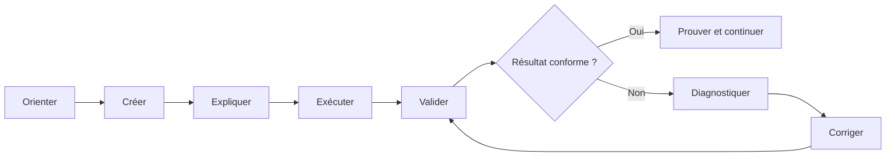
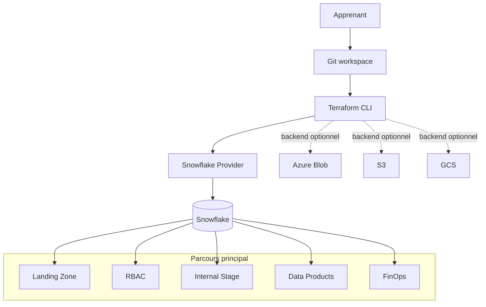

# Programme de formation professionnelle — Terraform & Snowflake

> **Document maître du parcours** — Version française de référence

| Élément | Valeur |
|---|---|
| **Durée** | 5 jours × 6 heures — **30 heures** |
| **Modalité** | Formation accompagnée ou autoformation guidée (*self-paced*) |
| **Approche** | 65 à 70 % de pratique, fil rouge construit depuis zéro |
| **Niveau d’entrée** | Intermédiaire IT |
| **Plateformes** | Windows/PowerShell et Linux/macOS/Bash |
| **Cœur technique** | Terraform, Snowflake, Git et Snowflake CLI |
| **Cloud** | Cœur cloud-agnostique; pistes Azure, AWS et GCP optionnelles |
| **Langue** | Français pédagogique; termes techniques et commandes en anglais |

---

## 1. Finalité professionnelle

Cette formation apprend à construire, sécuriser et exploiter une plateforme Snowflake avec Terraform. L’apprenant ne reçoit pas un projet final à simplement ouvrir ou modifier : il crée progressivement l’arborescence, les fichiers HCL, les scripts et les contrôles nécessaires, puis exécute et dépanne chaque étape.

Le parcours reprend les mécanismes éprouvés des formations pratiques professionnelles :

- scénario métier et tâche professionnelle pour chaque module;
- environnement vérifié avant de commencer;
- instructions atomiques et copiables;
- résultat attendu après chaque action importante;
- checkpoints automatiques et preuves fonctionnelles;
- erreurs contrôlées pour apprendre le troubleshooting;
- challenge avec moins de guidage en fin de module;
- nettoyage explicite pour limiter les coûts et les risques;
- capstone évalué à partir de critères observables.

## 2. Public cible

- Data Engineers et Analytics Engineers;
- ingénieurs DevOps, Cloud et Platform Engineering;
- administrateurs Snowflake et responsables Data Platform;
- architectes Cloud/Data souhaitant pratiquer l’Infrastructure as Code;
- équipes techniques préparant l’industrialisation de Snowflake.

## 3. Prérequis apprenant

L’apprenant doit savoir :

- naviguer dans un terminal et reconnaître un chemin de fichier;
- utiliser les commandes Git essentielles (`status`, `add`, `commit`, `diff`);
- lire une requête SQL simple;
- expliquer les notions de compte, utilisateur, rôle et ressource Cloud;
- éditer un fichier texte dans VS Code ou un éditeur équivalent.

Aucune expérience préalable de Terraform ou d’administration avancée de Snowflake n’est obligatoire.

### Auto-évaluation avant inscription

L’apprenant est prêt s’il peut réaliser au moins quatre actions sur cinq :

- [ ] ouvrir un terminal dans un dossier donné;
- [ ] créer un dossier et un fichier texte;
- [ ] exécuter `git status` et expliquer son résultat;
- [ ] exécuter une requête `SELECT` simple;
- [ ] distinguer une variable, un secret et une valeur publique.

## 4. Résultats d’apprentissage

À l’issue des 30 heures, l’apprenant sera capable de :

1. préparer et diagnostiquer un poste Terraform/Snowflake sur Windows ou Unix;
2. créer de zéro une configuration Terraform structurée;
3. exécuter et expliquer le workflow `fmt → init → validate → plan → apply`;
4. inspecter, protéger et déplacer un state Terraform;
5. importer une ressource existante et corriger une dérive;
6. concevoir un module réutilisable et des environnements isolés;
7. automatiser databases, schemas, warehouses, monitors et tags Snowflake;
8. concevoir un RBAC avec rôles d’accès, rôles fonctionnels et moindre privilège;
9. comparer PAT de formation et authentification JWT key-pair de production;
10. provisionner les composants d’ingestion de base;
11. intégrer formatage, validation, plan et détection de dérive dans CI/CD;
12. produire des indicateurs FinOps avec `ACCOUNT_USAGE` et dbt;
13. publier un Data Product structuré avec Terraform et Snowflake CLI;
14. démontrer une plateforme composée, idempotente, documentée et nettoyable.

## 5. Principes pédagogiques

### 5.1 Construire plutôt qu’observer

Chaque lab démarre dans un workspace presque vide. Les fichiers pédagogiques sont créés un par un :

```text
student-workspace/
└── module-XX/
    ├── README.md
    ├── .gitignore
    └── validate.ps1 / validate.sh
```

Les datasets, certificats publics de démonstration et validateurs peuvent être fournis. Le code que l’objectif demande d’apprendre n’est pas prérempli.

### 5.2 Boucle d’apprentissage



### 5.3 Convention des pistes

| Badge | Signification |
|---|---|
| **[CORE]** | Obligatoire et indépendant d’un Cloud public |
| **[AZURE]** | Variante Azure optionnelle |
| **[AWS]** | Variante AWS optionnelle |
| **[GCP]** | Variante Google Cloud optionnelle |
| **[WINDOWS]** | Commande PowerShell |
| **[UNIX]** | Commande Bash Linux/macOS |
| **[CHECK]** | Validation automatique ou preuve attendue |
| **[SECURITY]** | Action liée aux identités, secrets ou privilèges |
| **[CLEANUP]** | Action de nettoyage contrôlée |

### 5.4 Validation hybride

Chaque module utilise plusieurs niveaux de contrôle :

1. **structure** — dossiers, fichiers et placeholders;
2. **statique** — formatage, syntaxe et validation Terraform;
3. **plan** — types et nombre de ressources attendus;
4. **fonctionnel** — requêtes Snowflake, Snow CLI ou tests dbt;
5. **idempotence** — second plan sans modification inattendue;
6. **challenge** — réalisation autonome évaluée par critères.

## 6. Environnement sans panique

Deux scénarios sont officiellement supportés.

### Scénario A — Sandbox préprovisionnée

Recommandé pour une session encadrée :

- compte Snowflake de formation fourni;
- identifiant individuel ou préfixe unique par apprenant;
- PAT temporaire remis hors Git;
- quotas, rôles et ressources autorisées préparés par le formateur;
- procédure de réinitialisation documentée;
- date d’expiration et nettoyage connus.

### Scénario B — Snowflake Trial personnel

Recommandé pour l’autoformation :

- création guidée du compte Trial;
- vérification de l’édition, de la région et des droits disponibles;
- création d’une identité technique dédiée;
- PAT pour démarrer, puis JWT key-pair comme pratique de production;
- garde-fous de consommation et procédure de suppression des ressources.

### Outils requis

| Outil | Usage | Validation minimale |
|---|---|---|
| Git | versionnement et preuves | `git --version` |
| Terraform | Infrastructure as Code | `terraform version` |
| Snowflake CLI | connexion, SQL et publication | `snow --version` |
| VS Code ou équivalent | édition | ouverture du workspace |
| PowerShell 5.1+ ou Bash | exécution des labs | script préflight |
| dbt | FinOps du Jour 5 | `dbt --version` |

Les versions exactes testées sont centralisées dans la politique de versions du dépôt et non répétées arbitrairement dans chaque lab.

## 7. Architecture du fil rouge



Le parcours principal ne requiert aucun abonnement Azure, AWS ou GCP. Les services Cloud servent d’extensions comparatives pour le backend distant, les secrets et les external stages.

---

## 8. Programme détaillé — 5 jours × 6 heures

## Jour 1 — Préparer, créer et déployer (6 h)

**Capacité professionnelle :** construire un premier projet Terraform Snowflake à partir d’un dossier presque vide.

| Durée | Séquence | Activité et preuve |
|---:|---|---|
| 0 h 45 | Orientation et sécurité | Comprendre le fil rouge, les coûts, les secrets, les rôles et le cleanup. |
| 1 h 00 | Préflight Windows/Unix | Installer ou vérifier les outils; produire le rapport `Ready for Day 1`. |
| 1 h 00 | Accès Snowflake | Choisir sandbox ou Trial, créer/tester une connexion PAT. |
| 2 h 15 | Premier projet | Créer l’arborescence et écrire `versions.tf`, `provider.tf`, `variables.tf`, `main.tf`, `outputs.tf`. |
| 0 h 45 | Workflow Terraform | Exécuter `fmt`, `init`, `validate`, `plan`, `apply`, puis vérifier dans Snowflake. |
| 0 h 15 | Évaluation et cleanup | Quiz, preuve de résultat et nettoyage contrôlé. |

### Ressources créées

- une database Snowflake;
- un schema;
- un warehouse `X-SMALL`, initialement suspendu et avec `auto_suspend`;
- un state local inspecté;
- un dépôt Git avec un premier commit pédagogique.

### Critères de réussite

- [ ] tous les fichiers ont été créés par l’apprenant;
- [ ] `terraform validate` réussit;
- [ ] le plan ne contient que les ressources annoncées;
- [ ] les ressources sont visibles via SQL;
- [ ] le second plan ne propose aucune modification inattendue;
- [ ] aucun secret n’apparaît dans `git status`.

## Jour 2 — Maîtriser le state et le changement (6 h)

**Capacité professionnelle :** faire évoluer une infrastructure existante sans perdre le contrôle du state.

| Durée | Séquence | Activité et preuve |
|---:|---|---|
| 0 h 45 | State local | Lire les adresses, outputs et limites de sécurité du state. |
| 1 h 00 | Variables et conventions | Créer validations, locals, collections et fichiers `.tfvars.example`. |
| 1 h 00 | Logique dynamique | Ajouter schemas et ressources avec `for_each`; observer le graphe. |
| 1 h 15 | Brownfield | Créer un objet hors Terraform, l’importer et le refactoriser sans recréation. |
| 0 h 45 | Drift et lifecycle | Provoquer une dérive sûre, la détecter, choisir une remédiation. |
| 0 h 45 | Backend distant | Comprendre verrouillage/chiffrement; choisir une piste Azure, AWS ou GCP optionnelle. |
| 0 h 30 | Challenge | Restaurer un état cohérent et prouver l’idempotence. |

### Critères de réussite

- [ ] l’apprenant explique la différence entre configuration, state et infrastructure réelle;
- [ ] l’import ne détruit pas la ressource existante;
- [ ] le drift est détecté et corrigé intentionnellement;
- [ ] le backend optionnel est isolé du cœur du lab;
- [ ] aucune commande de state destructive n’est exécutée sans sauvegarde et justification.

## Jour 3 — Concevoir des modules et des environnements (6 h)

**Capacité professionnelle :** transformer un projet monolithique en composants réutilisables.

| Durée | Séquence | Activité et preuve |
|---:|---|---|
| 0 h 45 | Contrat de module | Définir entrées, sorties, responsabilités et limites. |
| 2 h 00 | Module Landing Zone | Créer `variables.tf`, `main.tf`, `outputs.tf`, `versions.tf` et README. |
| 0 h 45 | Collections avancées | Déployer RAW/SILVER/GOLD et plusieurs warehouses sans duplication. |
| 1 h 00 | DEV et TEST | Créer deux root modules et isoler variables, noms et states. |
| 0 h 45 | Qualité/versioning | Valider, documenter et comparer source locale et source Git immuable. |
| 0 h 45 | Challenge | Étendre le module avec monitor et tags sans casser le contrat. |

### Critères de réussite

- [ ] le module ne contient aucun nom d’environnement en dur;
- [ ] DEV et TEST ne partagent ni noms ni state;
- [ ] les outputs servent réellement à composer les modules suivants;
- [ ] les deux environnements passent les validations;
- [ ] le challenge n’introduit pas de copier-coller structurel.

## Jour 4 — Sécuriser Snowflake et automatiser le RBAC (6 h)

**Capacité professionnelle :** appliquer le moindre privilège avec une identité technique et un RBAC testable.

| Durée | Séquence | Activité et preuve |
|---:|---|---|
| 0 h 45 | Modèle de privilèges | Distinguer account roles, database roles, access roles et functional roles. |
| 1 h 30 | RBAC as Code | Créer rôles, hiérarchie et affectations via Terraform. |
| 1 h 00 | Grants | Ajouter grants actuels/futurs et vérifier les droits positifs/négatifs. |
| 0 h 45 | Authentification | Comparer PAT temporaire et JWT key-pair; pratiquer la rotation guidée. |
| 0 h 45 | Ingestion de base | Créer file format et internal stage; external stages dans les pistes Cloud. |
| 0 h 45 | Troubleshooting | Diagnostiquer rôle incorrect, privilège absent et clé invalide. |
| 0 h 30 | Challenge RBAC | Accorder exactement les droits demandés, sans `ACCOUNTADMIN`. |

### Critères de réussite

- [ ] un analyste peut lire la couche autorisée mais pas écrire;
- [ ] un data engineer peut utiliser le warehouse et écrire dans la zone prévue;
- [ ] les future grants sont vérifiés;
- [ ] le provider quotidien n’utilise pas `ACCOUNTADMIN` par défaut;
- [ ] la clé privée et le PAT ne sont ni dans Git ni affichés dans les rapports.

## Jour 5 — Industrialiser et démontrer la plateforme (6 h)

**Capacité professionnelle :** intégrer qualité, CI/CD, FinOps et Data Products dans un capstone exploitable.

| Durée | Séquence | Activité et preuve |
|---:|---|---|
| 0 h 45 | Pipeline portable | Construire `fmt → validate → lint → plan → approval → apply → drift`. |
| 0 h 45 | CI/CD as Code | Implémenter GitHub Actions; mapper les étapes vers Azure DevOps. |
| 0 h 45 | FinOps | Créer resource monitors et exécuter des modèles dbt sur `ACCOUNT_USAGE`. |
| 0 h 45 | Data Products | Définir et publier SALES/FINANCE avec ownership, zones et contrat. |
| 2 h 15 | Capstone challenge | Composer Landing Zone, RBAC, ingestion, FinOps et Data Products. |
| 0 h 45 | Soutenance et cleanup | Démonstration, score, revue sécurité/coût, zero-drift et nettoyage. |

### Critères de réussite

- [ ] la CI bloque un code non formaté ou invalide;
- [ ] le plan est revu avant application;
- [ ] au moins un indicateur FinOps est produit et interprété;
- [ ] les Data Products ont owner, rôles producer/reader et zones documentées;
- [ ] le capstone atteint le seuil de réussite;
- [ ] le dernier plan ne contient aucun drift inattendu;
- [ ] les ressources temporaires sont nettoyées ou justifiées.

---

## 9. Ateliers et niveau de guidage

| Type | Guidage | Usage |
|---|---:|---|
| Démonstration courte | 100 % | Montrer une notion difficile avant pratique. |
| Lab guidé | 80–90 % | Créer une compétence pour la première fois. |
| Exercice de consolidation | 50–60 % | Réutiliser la compétence avec des indices. |
| Challenge | 10–20 % | Résoudre un scénario à partir de critères. |
| Capstone | Objectifs seulement | Démontrer l’autonomie et justifier les choix. |

Chaque lab guidé inclut les commandes exactes, le contenu complet des nouveaux fichiers, une explication des blocs, des checkpoints et une voie de récupération. Le challenge ne révèle pas immédiatement la solution.

## 10. Évaluation

### Pondération

| Évaluation | Poids |
|---|---:|
| Checkpoints automatisés des modules | 30 % |
| Preuves fonctionnelles Snowflake/Terraform | 25 % |
| Challenges quotidiens | 20 % |
| Capstone et soutenance | 25 % |

**Seuil recommandé : 75 %.** Une validation sécurité manquante ou un secret commité bloque la réussite jusqu’à correction.

### Rubrique du capstone

| Domaine | Points |
|---|---:|
| Structure et qualité Terraform | 20 |
| Idempotence et gestion du state | 15 |
| Architecture modulaire et environnements | 15 |
| RBAC et sécurité | 20 |
| CI/CD et drift | 10 |
| FinOps et Data Products | 10 |
| Documentation, diagramme et démonstration | 10 |
| **Total** | **100** |

## 11. Troubleshooting sans panique

Chaque incident est présenté avec la même grille :

| Élément | Question |
|---|---|
| Symptôme | Qu’observez-vous exactement ? |
| Portée | Quelle commande, quel fichier, quel compte et quel rôle ? |
| Diagnostic | Quelle commande non destructive confirme l’hypothèse ? |
| Correction | Quelle action minimale restaure le lab ? |
| Validation | Comment prouver que le problème est résolu ? |
| Prévention | Quel contrôle évitera sa répétition ? |

Les parcours prévoient des points de reprise. L’apprenant ne doit pas réinstaller tout son environnement ou recopier la solution complète après une erreur locale.

## 12. Sécurité, coûts et opérations

- aucun secret réel dans les supports, exemples, captures ou dépôts;
- `.gitignore` et scan de secrets validés avant le premier commit;
- préfixe de ressources unique par apprenant;
- warehouses économiques, suspendus automatiquement et limités;
- PAT temporaires pour la sandbox; JWT key-pair pour la cible production;
- privilèges minimaux après les opérations de bootstrap;
- avertissement et portée explicite avant `apply`, `destroy`, policy réseau ou grant élevé;
- cleanup vérifié à la fin de chaque journée et du capstone;
- état Terraform considéré comme donnée sensible;
- distinction explicite entre simplification de formation et exigence de production.

## 13. Pistes Cloud optionnelles

Les pistes partagent les mêmes objectifs et ne modifient pas la progression principale.

| Capacité | Azure | AWS | GCP |
|---|---|---|---|
| Backend distant | Blob Storage | S3 | Cloud Storage |
| Verrouillage/coordination | mécanisme backend supporté | mécanisme backend supporté | mécanisme backend supporté |
| Secrets | Key Vault | Secrets Manager | Secret Manager |
| External stage | Azure Blob | S3 | Cloud Storage |
| CI/CD complémentaire | Azure DevOps | CodePipeline en extension | Cloud Build en extension |

Chaque piste possède ses propres prérequis, commandes d’authentification, contrôles de coût, dépannage et cleanup.

## 14. Supports remis

- programme et guide apprenant;
- cours courts par module;
- labs Windows et Unix;
- workspace initial presque vide;
- validateurs PowerShell et Bash;
- résultats attendus et troubleshooting;
- solutions de référence séparées;
- diagrammes d’architecture Mermaid;
- logos officiels uniquement lorsque leur licence et leur source sont documentées;
- guide formateur;
- grille d’évaluation et rapport de progression;
- code final du fil rouge et variantes Cloud optionnelles.

## 15. Définition de terminé de la formation

La formation est considérée prête à publier lorsque :

- [ ] les 30 heures sont réparties et testées en conditions réelles;
- [ ] chaque objectif possède une activité et une preuve;
- [ ] tous les labs fonctionnent depuis un workspace vierge;
- [ ] Windows et Unix produisent les mêmes résultats;
- [ ] sandbox et Trial atteignent le même checkpoint initial;
- [ ] le cœur ne requiert aucun abonnement Cloud public;
- [ ] toutes les solutions passent formatage, validation, plan, apply, preuve et cleanup;
- [ ] tous les liens, commandes, diagrammes et validateurs sont testés;
- [ ] aucun secret, state, plan ou provider téléchargé n’est livré dans les starters;
- [ ] les licences et attributions des logos sont vérifiées;
- [ ] un pilote apprenant termine le capstone sans consulter directement le code final.
