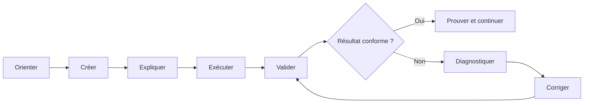

# Programme de formation professionnelle — Terraform & Snowflake sur Azure

> **Document maître du parcours** — Version française de référence

| Élément | Valeur |
|---|---|
| **Durée** | 5 jours × 6 heures — **30 heures** |
| **Modalité** | Formation accompagnée ou autoformation guidée (*self-paced*) |
| **Approche** | 65 à 70 % de pratique, fil rouge construit depuis zéro |
| **Niveau d’entrée** | Intermédiaire IT |
| **Plateformes poste** | Windows/PowerShell et Linux/macOS/Bash |
| **Cœur technique** | Terraform, Snowflake Enterprise, Azure, Azure DevOps, Git, Snowflake CLI, dbt |
| **Environnements** | DEV, UAT, PROD dans un compte Snowflake unique |
| **Langue** | Français pédagogique; termes techniques et commandes en anglais |

**Références obligatoires :** [Architecture de référence](docs/reference-architecture.md) · [Politique de versions](docs/version-policy.md)

---

## 1. Finalité professionnelle

Cette formation apprend à construire, sécuriser, automatiser et exploiter une plateforme Snowflake avec Terraform sur Azure, en reproduisant l’environnement réel de l’entreprise.

L’apprenant ne reçoit pas un projet final à ouvrir : il crée progressivement l’arborescence, les fichiers HCL, les modules, le pipeline et les contrôles, puis exécute et dépanne chaque étape.

Le parcours reprend les mécanismes des formations pratiques professionnelles :

- scénario métier et tâche réelle pour chaque module;
- environnement vérifié avant de commencer;
- instructions atomiques et copiables;
- résultat attendu après chaque action importante;
- checkpoints automatiques et preuves fonctionnelles;
- erreurs contrôlées pour apprendre le diagnostic;
- challenge avec moins de guidage en fin de module;
- nettoyage explicite pour limiter coûts et risques;
- capstone évalué sur critères observables.

## 2. Environnement cible

La formation s’exécute sur la plateforme suivante.

| Couche | Technologie |
|---|---|
| Data Cloud | Snowflake Enterprise, compte unique |
| Isolation | Nommage `DEV`, `UAT`, `PROD` |
| Infrastructure as Code | Terraform |
| État distant | Azure Blob Storage |
| Secrets | Azure Key Vault |
| CI/CD | Azure DevOps, agents auto-hébergés |
| Ingestion et stockage | Azure Data Lake Storage Gen2 |
| Transformation et FinOps | dbt sur `ACCOUNT_USAGE` |
| Outils | Git, Snowflake CLI, Azure CLI, Python |

Les équivalents AWS et GCP sont traités en **annexe comparative** uniquement, sans lab exécutable.

## 3. Public cible

- Data Engineers et Analytics Engineers;
- ingénieurs DevOps, Cloud et Platform Engineering;
- administrateurs Snowflake et responsables Data Platform;
- architectes Cloud/Data pratiquant l’Infrastructure as Code.

## 4. Prérequis apprenant

L’apprenant doit savoir :

- naviguer dans un terminal et reconnaître un chemin de fichier;
- utiliser Git au quotidien (`status`, `add`, `commit`, `diff`, branches);
- lire une requête SQL;
- expliquer compte, utilisateur, rôle et ressource Cloud;
- éditer un fichier texte dans VS Code ou équivalent.

Aucune expérience préalable de Terraform n’est obligatoire.

### Accès requis

| Accès | Utilisation |
|---|---|
| Compte Snowflake Enterprise | Objets de la plateforme |
| Préfixe apprenant unique | Isolation entre participants |
| Souscription Azure | Backend, Key Vault, stockage |
| Projet Azure DevOps | Pipelines et approbations |

## 5. Résultats d’apprentissage

À l’issue des 30 heures, l’apprenant sera capable de :

1. préparer et diagnostiquer un poste Terraform/Snowflake sur Windows ou Unix;
2. créer de zéro une configuration Terraform structurée et versionnée;
3. exécuter et expliquer `fmt → init → validate → plan → apply`;
4. inspecter, protéger et migrer un state vers Azure Blob Storage;
5. importer une ressource existante et corriger une dérive;
6. concevoir des modules réutilisables et isoler DEV, UAT et PROD;
7. automatiser databases, schemas, warehouses, monitors et tags;
8. concevoir un RBAC Snowflake au moindre privilège et le tester;
9. passer d’un PAT de démarrage à une identité technique JWT avec Key Vault;
10. provisionner les composants d’ingestion vers Azure Data Lake Storage;
11. construire un pipeline Azure DevOps avec validation, plan, approbation, apply et détection de dérive;
12. produire des indicateurs FinOps avec `ACCOUNT_USAGE` et dbt;
13. publier un Data Product gouverné;
14. démontrer une plateforme composée, idempotente, documentée et nettoyable.

## 6. Principes pédagogiques

### 6.1 Construire plutôt qu’observer

Chaque lab démarre dans un workspace presque vide :

```text
$HOME/Data2AI-Labs/
└── module-XX/
    ├── README.md
    ├── .gitignore
    └── validate.ps1 / validate.sh
```

Les jeux de données et validateurs peuvent être fournis. Le code que l’objectif demande d’apprendre n’est jamais prérempli.

### 6.2 Boucle d’apprentissage



### 6.3 Convention des marqueurs

| Badge | Signification |
|---|---|
| **[CORE]** | Obligatoire : Terraform, Snowflake, Azure, Azure DevOps |
| **[ANNEXE]** | Comparaison AWS ou GCP, non exécutée |
| **[WINDOWS]** | Commande PowerShell |
| **[UNIX]** | Commande Bash Linux/macOS |
| **[CHECK]** | Validation automatique ou preuve attendue |
| **[SECURITY]** | Identité, privilège ou secret |
| **[COST]** | Ressource facturable |
| **[CLEANUP]** | Nettoyage contrôlé |

### 6.4 Validation hybride

1. **structure** — dossiers, fichiers, placeholders;
2. **statique** — formatage, syntaxe, lint;
3. **plan** — types et nombre de ressources attendus;
4. **fonctionnel** — Snowflake, Azure, Snow CLI ou dbt;
5. **idempotence** — second plan sans modification inattendue;
6. **challenge** — réalisation autonome évaluée sur critères.

## 7. Modèle d’isolation et de sécurité

### Isolation à deux niveaux

```text
<PREFIXE_APPRENANT>_<ZONE>_<ENVIRONNEMENT>
```

Exemple : `ABC_RAW_DEV`, `ABC_ETL_UAT`.

- le **préfixe apprenant** évite les collisions entre participants;
- le **suffixe d’environnement** reproduit l’isolation de production.

### Authentification progressive

| Étape | Méthode | Raison |
|---|---|---|
| Day 0 à Jour 3 | PAT temporaire via profil Snowflake CLI | Démarrer sans friction, aucun secret dans le code |
| Jour 4 et suivants | Identité technique et JWT key-pair, clé dans Key Vault | Pratique de production |
| CI/CD | Identité fédérée Azure et secrets de pipeline | Aucun secret en clair |

### Règles non négociables

- aucun mot de passe Snowflake dans un fichier du dépôt;
- aucun PAT, clé privée ou state commité;
- aucun rôle d’administration comme correction générique;
- warehouses économiques, suspendus automatiquement;
- plan revu avant chaque apply;
- cleanup vérifié côté Snowflake **et** côté Azure.

## 8. Programme détaillé — 5 jours × 6 heures

## Jour 1 — Préparer, créer et déployer (6 h)

**Capacité :** construire un premier projet Terraform Snowflake depuis un dossier presque vide.

| Durée | Séquence | Activité et preuve |
|---:|---|---|
| 0 h 45 | Orientation | Architecture cible, coûts, secrets, rôles, cleanup |
| 1 h 00 | Préflight | Installer/vérifier Git, Terraform, Snowflake CLI, Azure CLI |
| 1 h 00 | Accès Snowflake | Profil PAT testé, préfixe apprenant attribué |
| 2 h 15 | Premier projet | Créer `versions.tf`, `provider.tf`, `variables.tf`, `locals.tf`, `main.tf`, `outputs.tf` |
| 0 h 45 | Workflow | `fmt`, `init`, `validate`, `plan`, `apply`, preuve SQL |
| 0 h 15 | Évaluation | Quiz, idempotence, cleanup contrôlé |

**Preuve :** database, schema et warehouse créés par un projet écrit par l’apprenant, second plan sans changement.

## Jour 2 — State, backend Azure et changement maîtrisé (6 h)

**Capacité :** faire évoluer une infrastructure sans perdre le contrôle du state.

| Durée | Séquence | Activité et preuve |
|---:|---|---|
| 0 h 45 | State local | Adresses, outputs, données sensibles |
| 1 h 15 | Backend Azure Blob | Créer le stockage, migrer le state, vérifier le verrouillage |
| 1 h 00 | Variables et conventions | Validations, locals, nommage DEV/UAT/PROD |
| 1 h 00 | Logique dynamique | Collections, dépendances, `lifecycle` |
| 1 h 15 | Brownfield et dérive | Importer un objet existant, provoquer et corriger une dérive |
| 0 h 45 | Challenge | Restaurer un état cohérent et prouver l’idempotence |

**Preuve :** state distant chiffré et verrouillé, import sans recréation, dérive corrigée intentionnellement.

## Jour 3 — Modules et environnements DEV/UAT/PROD (6 h)

**Capacité :** transformer un projet monolithique en composants réutilisables.

| Durée | Séquence | Activité et preuve |
|---:|---|---|
| 0 h 45 | Contrat de module | Entrées, sorties, responsabilités, limites |
| 2 h 00 | Module Landing Zone | Créer `variables.tf`, `main.tf`, `outputs.tf`, `versions.tf`, README |
| 0 h 45 | Couches de données | RAW, CLEAN, CURATED et warehouses sans duplication |
| 1 h 15 | Environnements | Racines DEV et UAT, states séparés, promotion vers PROD |
| 0 h 45 | Qualité et versioning | Lint, documentation, source Git immuable |
| 0 h 30 | Challenge | Étendre le module avec monitors et tags |

**Preuve :** module réutilisable, environnements isolés, aucun nom d’environnement en dur.

## Jour 4 — Sécurité, RBAC et identité technique (6 h)

**Capacité :** appliquer le moindre privilège avec une identité vérifiable.

| Durée | Séquence | Activité et preuve |
|---:|---|---|
| 0 h 45 | Modèle de privilèges | Rôles de compte, rôles de base, rôles d’accès et fonctionnels |
| 1 h 30 | RBAC as Code | Rôles, hiérarchie, affectations via Terraform |
| 0 h 45 | Grants | Grants actuels et futurs, tests positifs et négatifs |
| 1 h 00 | Identité et Key Vault | Créer l’identité technique, la clé RSA, la stocker et la faire tourner |
| 0 h 45 | Ingestion Azure | Storage integration, external stage vers ADLS, file formats |
| 0 h 45 | Incidents contrôlés | Rôle incorrect, privilège absent, clé invalide |
| 0 h 30 | Challenge | Accorder exactement les droits demandés |

**Preuve :** droits vérifiés par tests, secret hors Git, provider quotidien sans rôle d’administration.

## Jour 5 — CI/CD, FinOps, Data Products et capstone (6 h)

**Capacité :** industrialiser et démontrer la plateforme.

| Durée | Séquence | Activité et preuve |
|---:|---|---|
| 1 h 00 | Pipeline Azure DevOps | Validate, plan, approbation, apply, audit de dérive |
| 0 h 30 | Policy as Code | Lint, scan sécurité, estimation de coût, règles |
| 0 h 45 | FinOps | Resource monitors et modèles dbt sur `ACCOUNT_USAGE` |
| 0 h 45 | Data Products | Domaines gouvernés avec ownership et rôles |
| 2 h 15 | Capstone | Composer la plateforme complète |
| 0 h 45 | Soutenance et cleanup | Démonstration, score, zero-drift, nettoyage |

**Preuve :** la CI bloque un code non conforme, un indicateur FinOps est interprété, le capstone atteint le seuil, le dernier plan est sans dérive.

## 9. Niveaux de guidage

| Type | Guidage | Usage |
|---|---:|---|
| Démonstration | 100 % | Notion difficile avant pratique |
| Lab guidé | 80–90 % | Première acquisition |
| Consolidation | 50–60 % | Réutilisation avec indices |
| Challenge | 10–20 % | Scénario et critères seulement |
| Capstone | Objectifs | Autonomie et justification |

## 10. Évaluation

| Composante | Poids |
|---|---:|
| Checkpoints automatisés | 30 % |
| Preuves fonctionnelles | 25 % |
| Challenges quotidiens | 20 % |
| Capstone et soutenance | 25 % |

**Seuil : 75 %.** Un secret exposé ou un contrôle de sécurité non résolu bloque la validation jusqu’à correction.

### Rubrique du capstone

| Domaine | Points |
|---|---:|
| Structure et qualité Terraform | 20 |
| State, idempotence et dérive | 15 |
| Modularité et environnements | 15 |
| RBAC et sécurité | 20 |
| Pipeline Azure DevOps | 10 |
| FinOps et Data Products | 10 |
| Documentation et démonstration | 10 |
| **Total** | **100** |

## 11. Troubleshooting sans panique

| Élément | Question |
|---|---|
| Symptôme | Qu’observez-vous exactement ? |
| Portée | Quelle commande, quel fichier, quel compte, quel rôle ? |
| Diagnostic | Quelle commande non destructive confirme l’hypothèse ? |
| Correction | Quelle action minimale restaure le lab ? |
| Validation | Comment prouver la résolution ? |
| Prévention | Quel contrôle évite la répétition ? |

Chaque module possède des points de reprise. L’apprenant ne réinstalle jamais tout son environnement après une erreur locale.

## 12. Coûts et cleanup

- annoncer les ressources facturables avant création;
- warehouses `X-SMALL` avec suspension automatique;
- resource monitors avec seuils d’alerte;
- stockage Azure de démonstration en réplication locale;
- agents arrêtés hors session;
- cleanup quotidien et cleanup final vérifiés côté Snowflake et Azure;
- toute ressource conservée est explicitement justifiée.

## 13. Supports remis

- programme, catalogue et guide formateur;
- runbook d’animation minuté;
- cours courts et labs Windows/Unix;
- workspace initial presque vide;
- validateurs PowerShell et Bash;
- résultats attendus et troubleshooting;
- solutions de référence séparées;
- pipeline Azure DevOps;
- projet dbt FinOps;
- diagrammes d’architecture;
- grille d’évaluation et rapports de progression.

## 14. Definition of Done

- [ ] les 30 heures sont réparties et testées;
- [ ] chaque objectif possède une activité et une preuve;
- [ ] tous les labs fonctionnent depuis un workspace vierge;
- [ ] Windows et Unix produisent les mêmes résultats;
- [ ] les versions correspondent à la politique de versions;
- [ ] DEV, UAT et PROD sont cohérents partout;
- [ ] le pipeline Azure DevOps s’exécute;
- [ ] `dbt deps` et `dbt build` réussissent;
- [ ] aucun secret, state, plan ou provider téléchargé n’est distribué;
- [ ] aucun identifiant de compte réel n’apparaît dans les supports;
- [ ] un pilote apprenant termine le capstone sans lire les solutions.
