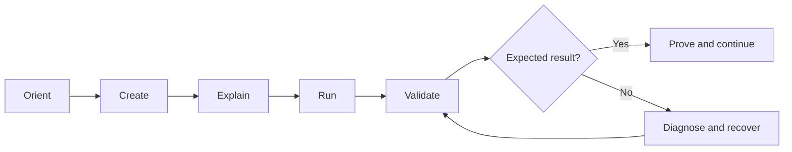

# Professional Training Program — Terraform & Snowflake

> **English companion document.** The authoritative curriculum is the French [`PROGRAMME_FORMATION.md`](PROGRAMME_FORMATION.md). If the two documents diverge, `PROGRAMME_FORMATION.md` takes precedence.

| Item | Definition |
|---|---|
| **Duration** | 5 days × 6 hours — **30 hours** |
| **Delivery** | Instructor-led or guided self-paced learning |
| **Practice ratio** | 65–70%, using a project built from an almost empty workspace |
| **Entry level** | Intermediate IT |
| **Platforms** | Windows/PowerShell and Linux/macOS/Bash |
| **Core** | Terraform, Snowflake, Git, and Snowflake CLI |
| **Cloud scope** | Cloud-agnostic core; optional Azure, AWS, and GCP tracks |
| **Language** | French learning content; official English technical terms and commands |

## Purpose

Learners build, secure, automate, and operate a Snowflake platform with Terraform. They create the project structure and code one file at a time instead of merely inspecting a prebuilt solution. Every important action includes an expected result, a validation checkpoint, and a recovery path.

## Target audience

- Data and Analytics Engineers;
- DevOps, Cloud, and Platform Engineers;
- Snowflake administrators and Data Platform owners;
- Cloud/Data architects who need practical Infrastructure as Code skills.

## Entry requirements

Learners should be able to use a terminal, edit files, run basic Git commands, read simple SQL, and distinguish users, roles, resources, configuration values, and secrets. Previous Terraform experience is not required.

## Professional outcomes

By the end of the course, learners can:

1. prepare and troubleshoot a Terraform/Snowflake workstation on Windows or Unix;
2. create a structured Terraform project from scratch;
3. run and explain `fmt → init → validate → plan → apply`;
4. inspect, protect, and migrate Terraform state;
5. import existing resources and remediate drift;
6. design reusable modules and isolated environments;
7. automate Snowflake platform objects and cost controls;
8. implement and verify least-privilege RBAC;
9. distinguish training PAT authentication from production key-pair JWT;
10. build ingestion foundations, CI/CD controls, FinOps models, and Data Products;
11. demonstrate an idempotent, documented, and cleanable capstone platform.

## Supported environment scenarios

### Pre-provisioned sandbox

A training account, learner-specific prefix, temporary PAT, quotas, roles, expiration date, and reset procedure are supplied outside Git.

### Personal Snowflake Trial

Learners follow a guided account setup, configure consumption safeguards, start with a PAT, and then learn a production-oriented service identity with key-pair authentication.

The core path requires no Azure, AWS, or GCP subscription. Remote state, secret managers, and external stages are optional provider tracks.

## Learning model

Each practical unit follows this cycle:

Each module contains prerequisites, measurable objectives, concepts, a step-by-step lab, Windows and Unix commands, expected outputs, automated checks, troubleshooting, a challenge, cleanup, and a knowledge check.

## Five-day outline

### Day 1 — Prepare, create, and deploy (6 hours)

- Orientation, security, cost, and cleanup rules — 45 min
- Windows/Unix tool preflight — 60 min
- Sandbox or Trial Snowflake access — 60 min
- Build the first Terraform project file by file — 135 min
- Run and inspect the Terraform workflow — 45 min
- Assessment and controlled cleanup — 15 min

**Evidence:** learner-created configuration deploys a database, schema, and cost-controlled warehouse; a second plan reports no unexpected changes.

### Day 2 — Control state and change (6 hours)

- Local state inspection and security — 45 min
- Variables, locals, validation, naming — 60 min
- Collections, dependencies, lifecycle — 60 min
- Brownfield import and safe refactoring — 75 min
- Deliberate drift, diagnosis, remediation — 45 min
- Provider-neutral remote-state concepts and optional cloud track — 45 min
- Challenge and idempotence check — 30 min

**Evidence:** an existing object is imported without recreation, drift is remediated intentionally, and state remains consistent.

### Day 3 — Design modules and environments (6 hours)

- Module contract and boundaries — 45 min
- Build a Landing Zone module from scratch — 120 min
- RAW/SILVER/GOLD and warehouses with collections — 45 min
- Isolated DEV and TEST roots — 60 min
- Quality, documentation, and immutable module sources — 45 min
- Extension challenge — 45 min

**Evidence:** a reusable module produces isolated, validated environments without hard-coded environment names.

### Day 4 — Secure Snowflake and automate RBAC (6 hours)

- Snowflake privilege model — 45 min
- Access and functional roles as code — 90 min
- Current/future grants and positive/negative tests — 60 min
- PAT versus key-pair JWT and rotation — 45 min
- File format, internal stage, and optional cloud external stages — 45 min
- Controlled troubleshooting scenarios — 45 min
- Least-privilege challenge — 30 min

**Evidence:** users can perform only the allowed actions, credentials stay outside Git, and daily work does not default to `ACCOUNTADMIN`.

### Day 5 — Industrialize and demonstrate (6 hours)

- Portable CI/CD workflow — 45 min
- GitHub Actions implementation and Azure DevOps mapping — 45 min
- Snowflake FinOps with monitors, `ACCOUNT_USAGE`, and dbt — 45 min
- SALES and FINANCE Data Products — 45 min
- Independent capstone challenge — 135 min
- Demonstration, scoring, zero-drift, and cleanup — 45 min

**Evidence:** CI validates the code, FinOps evidence is interpreted, Data Products are governed, and the composed platform reaches the capstone threshold.

## Assessment

| Component | Weight |
|---|---:|
| Automated module checkpoints | 30% |
| Terraform/Snowflake functional evidence | 25% |
| Daily challenges | 20% |
| Capstone and demonstration | 25% |

Recommended pass mark: **75%**. A leaked secret or an unresolved security control must be corrected before completion.

## Definition of ready

The course is publication-ready only when all 30 hours have been piloted, every objective has an activity and evidence, all labs run from a clean workspace on Windows and Unix, both access scenarios reach the same Day 0 checkpoint, the core requires no public-cloud subscription, solutions pass validation/deployment/idempotence/cleanup, links and diagrams are checked, and distributed starters contain no secret, state, plan, provider binary, or `.terraform/` directory.
