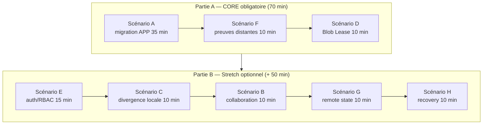
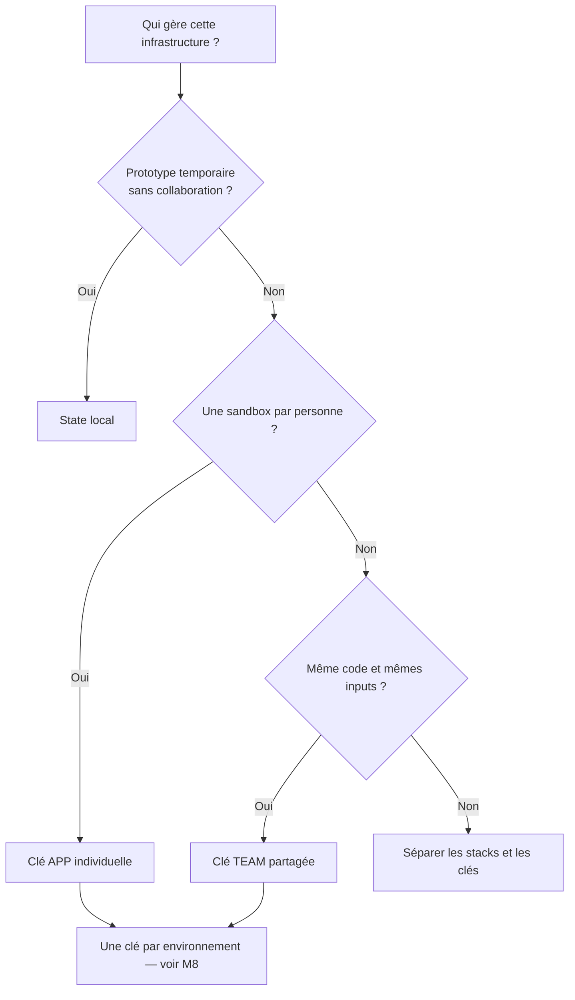
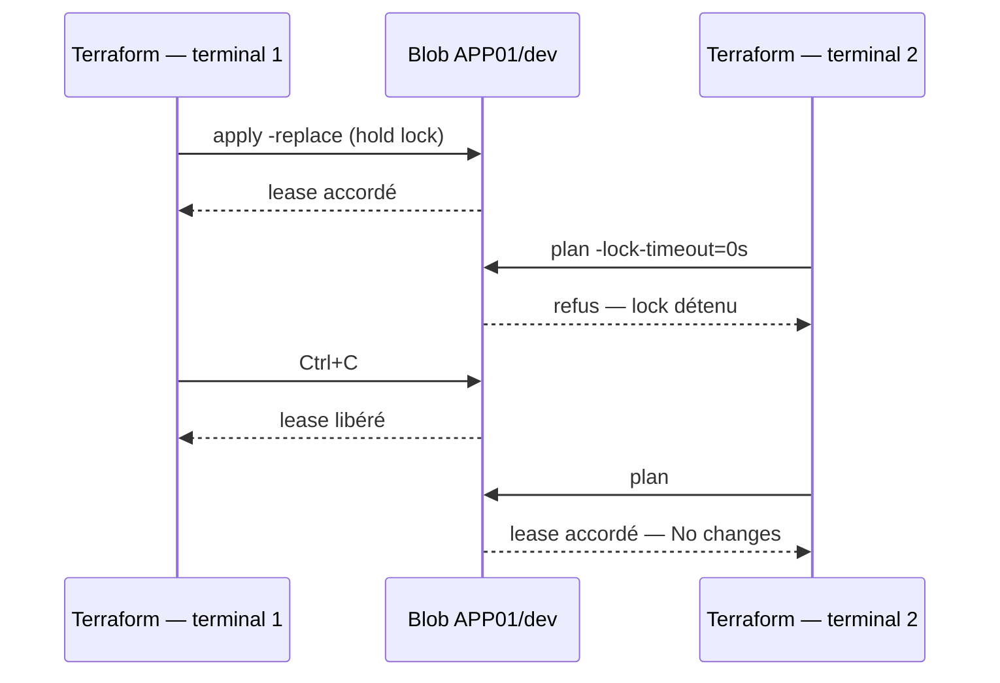
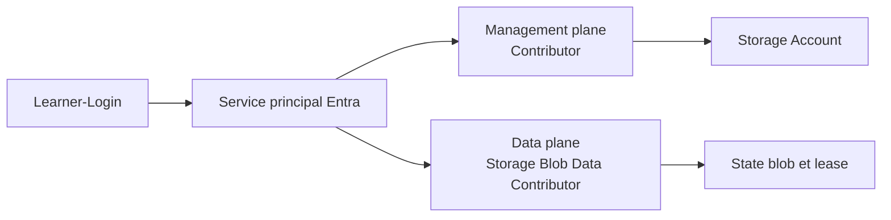
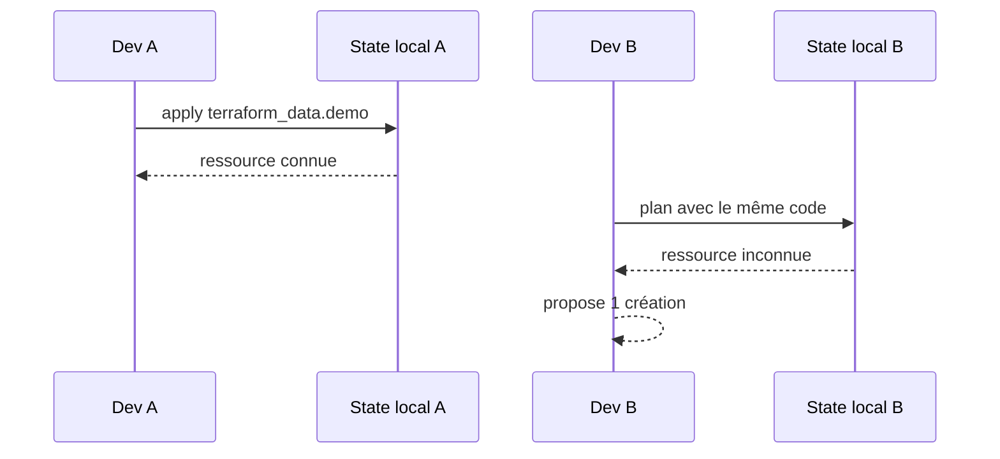
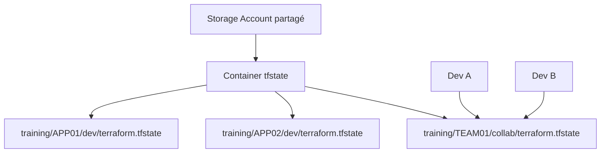
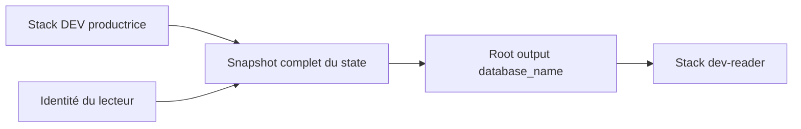
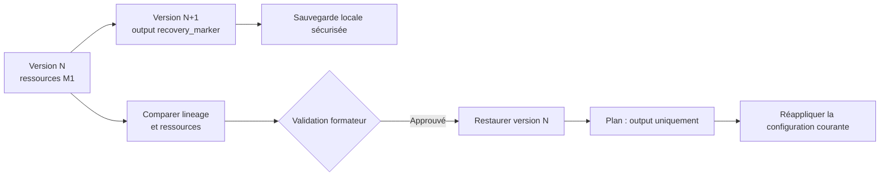

# 🧪 Lab M2 — State Terraform distant sur Azure Blob Storage

| Élément | Valeur |
|---|---|
| **Durée CORE** | 70 min — objectif #2 (state distant + locking natif) |
| **Durée stretch** | + 50 min optionnel (collab, divergence, remote state, recovery) |
| **Pistes** | `[CORE]` obligatoire · `[COLLAB]` `[INCIDENT]` `[PRODUCTION]` stretch |
| **Workspace principal** | `$HOME/Data2AI-Labs/data-platform` |
| **Dossier Terraform** | `environments/dev/` |
| **Coût** | Storage Account `Standard_LRS`, volume de state minimal |
| **Cleanup** | Conserver le state APP et les ressources Snowflake pour M3 |

## 🎯 Mission

Vous êtes Data Platform Engineer. Le state créé dans M1 se trouve encore sur votre poste. Vous devez le migrer vers Azure Blob Storage avec authentification Microsoft Entra ID, vérifier le basculement distant et observer le verrouillage natif (Blob Lease).

> 💡 **Stretch optionnel** : si le temps le permet, des scénarios avancés couvrent le diagnostic auth/RBAC, la divergence du state local, la collaboration à deux développeurs, `terraform_remote_state` et le recovery guidé formateur.

## 🎁 Résultat final

**CORE (70 min) — obligatoire :**

- votre state M1 est stocké dans `training/APP01/dev/terraform.tfstate` — avec votre préfixe réel ;
- un nouveau terminal retrouve les mêmes ressources avec un simple `terraform init` ;
- le verrouillage Blob Lease empêche deux écritures concurrentes sur la même clé ;
- vous utilisez `--auth-mode login` et `use_azuread_auth = true` pour un accès sécurisé.

**Stretch (+ 50 min) — optionnel :**

- un mini-projet `terraform_data` démontre la collaboration sans modifier Snowflake ;
- vous distinguez authentification management plane et data plane ;
- vous lisez un output distant avec `terraform_remote_state` en connaissant sa frontière de sécurité ;
- vous savez identifier une version antérieure et restaurer un state sous contrôle formateur.

## 🗺️ Vue globale des scénarios



**Lecture :** le parcours CORE construit le backend individuel, prouve le basculement distant et observe le verrouillage natif. Le stretch optional traite les incidents, la collaboration, le remote state et le recovery.

## 🎯 Objectifs pédagogiques

**CORE :**

- ✅ expliquer le rôle de `terraform.tfstate`, `serial` et `lineage` ;
- ✅ migrer un state local vers Azure Blob Storage sans recréer les ressources ;
- ✅ utiliser Microsoft Entra ID pour accéder au data plane Azure Blob ;
- ✅ vérifier l’isolation et le verrouillage du state.

**Stretch :**

- ✅ diagnostiquer un mauvais dossier, une mauvaise clé, un warning Azure ou un problème RBAC ;
- ✅ choisir entre state local, state APP, state TEAM et states par environnement ;
- ✅ utiliser `terraform_remote_state` en connaissant sa frontière de sécurité ;
- ✅ exécuter un recovery de state avec des garde-fous professionnels.

## 📋 Prérequis vérifiables

- [ ] M1 terminé dans `environments/dev/` ;
- [ ] `terraform state list` affiche les trois ressources M1 ;
- [ ] `terraform plan` affiche `No changes` avant migration ;
- [ ] Terraform affiche exactement `v1.14.5` ;
- [ ] Azure CLI est installé ;
- [ ] `.env` contient `ARM_RESOURCE_GROUP`, `ARM_STORAGE_ACCOUNT`, `ARM_CONTAINER`, `ARM_LOCATION` et `LEARNER_PREFIX` ;
- [ ] le service principal partagé possède `Storage Blob Data Contributor` sur le Storage Account ou le conteneur ;
- [ ] aucun secret ou state n’est suivi par Git.

## 🚀 Préflight

<details>
<summary>🪟 <b>Windows (PowerShell)</b></summary>

```powershell
cd "$HOME\Data2AI-Labs\data-platform"
.\scripts\Learner-Login.ps1 -LearnerPrefix APP01

terraform version
az account show --query "{subscription:name, tenant:tenantId}" -o table

Write-Host "Prefix:          $env:LEARNER_PREFIX"
Write-Host "Resource Group:  $env:ARM_RESOURCE_GROUP"
Write-Host "Storage Account: $env:ARM_STORAGE_ACCOUNT"
Write-Host "Container:       $env:ARM_CONTAINER"
Write-Host "Location:        $env:ARM_LOCATION"

cd .\environments\dev
terraform state list
terraform plan
```
</details>

<details>
<summary>🐧 <b>Linux/macOS (Bash)</b></summary>

```bash
cd "$HOME/Data2AI-Labs/data-platform"
source ./scripts/learner-login.sh APP01

terraform version
az account show --query '{subscription:name, tenant:tenantId}' -o table

printf 'Prefix:          %s\n' "$LEARNER_PREFIX"
printf 'Resource Group:  %s\n' "$ARM_RESOURCE_GROUP"
printf 'Storage Account: %s\n' "$ARM_STORAGE_ACCOUNT"
printf 'Container:       %s\n' "$ARM_CONTAINER"
printf 'Location:        %s\n' "$ARM_LOCATION"

cd ./environments/dev
terraform state list
terraform plan
```
</details>

Remplacez `APP01` par votre préfixe.

✅ **Checkpoint 0** : Terraform 1.14.5, bonne souscription Azure, cinq variables non vides, trois ressources M1 et `No changes`.

> 🔒 **Security** : n’affichez jamais `ARM_CLIENT_SECRET`, `SNOWFLAKE_PAT` ou `TF_VAR_snowflake_token`.

## 🧭 Choisir le bon modèle de state

| Modèle | Propriétaire | Clé | Usage |
|---|---|---|---|
| State local | Une personne | `terraform.tfstate` sur le poste | Prototype court uniquement |
| Sandbox individuelle | `APP01` | `training/APP01/dev/terraform.tfstate` | Parcours `[CORE]` |
| Stack collaborative | `TEAM01` | `training/TEAM01/collab/terraform.tfstate` | Scénarios `[COLLAB]` (stretch) |
| Environnements séparés | `APP01` | `training/APP01/<env>/terraform.tfstate` | Traité dans M8 |



**Règle essentielle :** partager un state signifie gérer la **même stack**, avec le même code et les mêmes inputs. Les sandboxes `APP01` et `APP02` ne doivent jamais utiliser la même clé.

> 💡 **Note** : un bloc `backend` ne peut pas utiliser `var.learner_prefix`. Le préfixe doit être écrit explicitement dans la clé avant `terraform init`.

> 💡 **Note** : l'isolation DEV/UAT/PROD par clé distincte est traitée dans M8. M2 se concentre sur la migration et le locking d'un seul environnement DEV.

---

# Partie A — CORE obligatoire (70 min)

> **Objectif #2 :** Gérer de manière sécurisée l'état Terraform distant via Azure Blob Storage avec State Locking natif.

---

## 🧑‍💻 Scénario A `[CORE]` — Migrer vers une sandbox APP isolée

**Durée : 35 min.**

### A.1 — Vérifier ou créer le backend Azure partagé

Le Resource Group, le Storage Account et le conteneur sont partagés par la classe. Leur création est idempotente : ils peuvent déjà exister.

<details>
<summary>🪟 <b>Windows (PowerShell)</b></summary>

```powershell
cd "$HOME\Data2AI-Labs\data-platform"

az group create `
    --name $env:ARM_RESOURCE_GROUP `
    --location $env:ARM_LOCATION `
    --output table

az storage account create `
    --name $env:ARM_STORAGE_ACCOUNT `
    --resource-group $env:ARM_RESOURCE_GROUP `
    --location $env:ARM_LOCATION `
    --sku Standard_LRS `
    --min-tls-version TLS1_2 `
    --allow-blob-public-access false `
    --encryption-services blob `
    --output table

az storage container create `
    --name $env:ARM_CONTAINER `
    --account-name $env:ARM_STORAGE_ACCOUNT `
    --auth-mode login `
    --output table
```
</details>

<details>
<summary>🐧 <b>Linux/macOS (Bash)</b></summary>

```bash
cd "$HOME/Data2AI-Labs/data-platform"

az group create \
    --name "$ARM_RESOURCE_GROUP" \
    --location "$ARM_LOCATION" \
    --output table

az storage account create \
    --name "$ARM_STORAGE_ACCOUNT" \
    --resource-group "$ARM_RESOURCE_GROUP" \
    --location "$ARM_LOCATION" \
    --sku Standard_LRS \
    --min-tls-version TLS1_2 \
    --allow-blob-public-access false \
    --encryption-services blob \
    --output table

az storage container create \
    --name "$ARM_CONTAINER" \
    --account-name "$ARM_STORAGE_ACCOUNT" \
    --auth-mode login \
    --output table
```
</details>

✅ **Checkpoint A1** :

- Storage Account : `ProvisioningState = Succeeded` ;
- `Created: True` signifie que le conteneur vient d’être créé ;
- `Created: False` signifie qu’il existait déjà — résultat également valide.

> 💡 **Note** : `A storage account with the provided name is found` est un succès idempotent, pas une erreur.

> 🔍 **Région indisponible** : si Azure retourne `locationineligible`, modifiez `ARM_LOCATION` dans `.env`, relancez `Learner-Login`, puis réessayez avec une région disponible.

### A.2 — Activer versioning et soft delete

Ces protections sont nécessaires pour le scénario de recovery (stretch).

<details>
<summary>🪟 <b>Windows (PowerShell)</b></summary>

```powershell
az storage account blob-service-properties update `
    --account-name $env:ARM_STORAGE_ACCOUNT `
    --resource-group $env:ARM_RESOURCE_GROUP `
    --enable-versioning true `
    --enable-delete-retention true `
    --delete-retention-days 7 `
    --output table

az storage account blob-service-properties show `
    --account-name $env:ARM_STORAGE_ACCOUNT `
    --resource-group $env:ARM_RESOURCE_GROUP `
    --query "{versioning:isVersioningEnabled,softDelete:deleteRetentionPolicy.enabled,days:deleteRetentionPolicy.days}" `
    --output table
```
</details>

<details>
<summary>🐧 <b>Linux/macOS (Bash)</b></summary>

```bash
az storage account blob-service-properties update \
    --account-name "$ARM_STORAGE_ACCOUNT" \
    --resource-group "$ARM_RESOURCE_GROUP" \
    --enable-versioning true \
    --enable-delete-retention true \
    --delete-retention-days 7 \
    --output table

az storage account blob-service-properties show \
    --account-name "$ARM_STORAGE_ACCOUNT" \
    --resource-group "$ARM_RESOURCE_GROUP" \
    --query '{versioning:isVersioningEnabled,softDelete:deleteRetentionPolicy.enabled,days:deleteRetentionPolicy.days}' \
    --output table
```
</details>

✅ **Checkpoint A2** : `versioning = True`, `softDelete = True`, `days = 7`.

### A.3 — Vérifier l’accès data plane

```powershell
az storage container exists `
    --name $env:ARM_CONTAINER `
    --account-name $env:ARM_STORAGE_ACCOUNT `
    --auth-mode login `
    --query exists -o tsv
```

✅ **Checkpoint A3** : `True` sans warning de récupération d’account key.

> 🔒 **Security** : `Contributor` gère les ressources Azure mais ne donne pas automatiquement accès aux données Blob. Le service principal doit également posséder `Storage Blob Data Contributor`.

### A.4 — Sauvegarder le state local

```powershell
cd "$HOME\Data2AI-Labs\data-platform\environments\dev"
terraform plan
Copy-Item terraform.tfstate terraform.tfstate.pre-migration.backup
```

✅ **Checkpoint A4** : `No changes` et fichier `terraform.tfstate.pre-migration.backup` présent.

> ⚠️ **IMPORTANT** : une seule personne migre un state donné. Arrêtez tout autre `plan` ou `apply` sur cette stack avant de continuer.

### A.5 — Créer `backend.tf`

Si `backend.tf` existe déjà, ouvrez-le au lieu de le recréer :

```powershell
if (-not (Test-Path backend.tf)) {
    New-Item -ItemType File -Path backend.tf | Out-Null
}
code backend.tf
```

Ajoutez ce contenu en remplaçant `APP01` par votre préfixe :

```hcl
terraform {
  backend "azurerm" {
    resource_group_name  = "rg-data2ai-tf-state"
    storage_account_name = "sadata2aitfstatemsn"
    container_name       = "tfstate"
    key                  = "training/APP01/dev/terraform.tfstate"
    use_azuread_auth     = true
  }
}
```

Vérifiez avant toute migration :

```powershell
Get-Content backend.tf
terraform fmt
terraform fmt -check
```

✅ **Checkpoint A5** : la clé contient votre APP, l’environnement `dev` et `use_azuread_auth = true`.

> ⚠️ **IMPORTANT — une seule méthode** : le parcours CORE utilise un `backend.tf` complet. N’ajoutez pas `-backend-config=backend.hcl`. La configuration partielle est présentée uniquement en annexe.

### A.6 — Migrer

```powershell
terraform init -migrate-state
```

Vérifiez les quatre identifiants affichés, puis répondez `yes` à la demande de copie.

✅ **Checkpoint A6** :

```text
Successfully configured the backend "azurerm"!
Terraform has automatically migrated your state from "local" to "azurerm".
```

Puis :

```powershell
terraform validate
terraform state list
terraform plan
```

✅ **Checkpoint A7** : trois ressources M1 et `No changes`.

---

## 🔍 Scénario F `[CORE]` — Prouver le basculement distant

**Durée : 10 min.**

### F.1 — Interpréter les fichiers locaux

<details>
<summary>🪟 <b>Windows (PowerShell)</b></summary>

```powershell
Get-Item terraform.tfstate* -ErrorAction SilentlyContinue
```
</details>

<details>
<summary>🐧 <b>Linux/macOS (Bash)</b></summary>

```bash
ls terraform.tfstate* 2>/dev/null
```
</details>

Terraform peut conserver une sauvegarde locale. En cas d’échec d’écriture distante non récupérable, Terraform peut aussi écrire un state de secours local pour éviter la perte de données.

> 💡 **Note** : la présence d’un ancien fichier local ne prouve pas qu’il est encore actif. Ne le supprimez pas avant les preuves suivantes.

### F.2 — Vérifier le blob APP

<details>
<summary>🪟 <b>Windows (PowerShell)</b></summary>

```powershell
$stateKey = "training/$env:LEARNER_PREFIX/dev/terraform.tfstate"

az storage blob list `
    --account-name $env:ARM_STORAGE_ACCOUNT `
    --container-name $env:ARM_CONTAINER `
    --auth-mode login `
    --prefix $stateKey `
    --query "[].name" -o tsv
```
</details>

<details>
<summary>🐧 <b>Linux/macOS (Bash)</b></summary>

```bash
state_key="training/${LEARNER_PREFIX}/dev/terraform.tfstate"

az storage blob list \
    --account-name "$ARM_STORAGE_ACCOUNT" \
    --container-name "$ARM_CONTAINER" \
    --auth-mode login \
    --prefix "$state_key" \
    --query '[].name' -o tsv
```
</details>

✅ **Checkpoint F1** : `training/APP01/dev/terraform.tfstate` avec votre préfixe.

### F.3 — Inspecter uniquement les métadonnées

Ne sauvegardez pas et n’affichez pas le snapshot complet.

<details>
<summary>🪟 <b>Windows (PowerShell)</b></summary>

```powershell
$metadata = terraform state pull | ConvertFrom-Json
[pscustomobject]@{
    Version          = $metadata.version
    TerraformVersion = $metadata.terraform_version
    Serial           = $metadata.serial
    Lineage          = $metadata.lineage
    ResourceCount    = @($metadata.resources).Count
}
```
</details>

<details>
<summary>🐧 <b>Linux/macOS (Bash)</b></summary>

```bash
terraform state pull | python -c "import json,sys; s=json.load(sys.stdin); print({k:s.get(k) for k in ('version','terraform_version','serial','lineage')}); print('resource_count=',len(s.get('resources',[])))"
```
</details>

✅ **Checkpoint F2** : `terraform_version = 1.14.5`, `lineage` non vide et ressources présentes.

### F.4 — Reprendre depuis un nouveau terminal

Ouvrez un nouveau terminal, relancez `Learner-Login`, rechargez le PAT Snowflake, puis :

```powershell
cd "$HOME\Data2AI-Labs\data-platform\environments\dev"
terraform init
terraform state list
terraform plan
```

✅ **Checkpoint F3** : le nouveau terminal retrouve les mêmes trois ressources et affiche `No changes`.

> 💡 **Note** : après la migration initiale, les autres développeurs utilisent `terraform init`, pas `terraform init -migrate-state` avec leur ancien state.

---

## 🔒 Scénario D `[CORE]` — Observer le Blob Lease

**Durée : 10 min.**

Le verrouillage natif d'Azure Blob Storage protège le state contre les écritures concurrentes. Ce scénario utilise la clé CORE `training/APP01/dev/terraform.tfstate`.



### D.1 — Maintenir le verrou dans le terminal 1

Ouvrez un premier terminal dans `environments/dev/` et lancez une commande qui détient le lock :

```powershell
terraform apply -replace=snowflake_database.raw
```

Laissez Terraform attendre sur `Enter a value:`. Ne saisissez pas `yes`.

> ⚠️ **WARNING** : cette commande propose de recréer la database. Ne validez **pas** le `yes`. L'objectif est uniquement de maintenir le lock.

### D.2 — Tester depuis le terminal 2

Ouvrez un second terminal dans le même dossier :

```powershell
terraform plan -lock-timeout=0s
```

✅ **Checkpoint D1** : `Error: Error acquiring the state lock`.

### D.3 — Libérer normalement

Dans le terminal 1, utilisez `Ctrl+C`. Dans le terminal 2 :

```powershell
terraform plan
```

✅ **Checkpoint D2** : `No changes`.

> ⚠️ **Security** : utilisez `terraform force-unlock <LOCK_ID>` uniquement si le processus propriétaire est réellement arrêté et après validation du formateur.

---

# Partie B — Stretch optionnel (+ 50 min)

> Ces scénarios vont au-delà de l'objectif #2. Ils sont recommandés pour les apprenants qui terminent le CORE en avance ou pour une session étendue.

---

## 🔐 Scénario E `[INCIDENT]` — Diagnostiquer auth, RBAC et backend

**Durée : 15 min.**



**Lecture :** créer ou configurer le Storage Account relève du management plane ; lire, écrire et verrouiller le blob relève du data plane.

### E.1 — Reproduire puis corriger le warning account key

Exécutez volontairement une lecture sans mode d’authentification :

```powershell
az storage blob list `
    --account-name $env:ARM_STORAGE_ACCOUNT `
    --container-name $env:ARM_CONTAINER `
    --query "[].name" -o tsv
```

Azure avertit qu’aucun credential data plane n’a été fourni et tente de récupérer une account key.

Corrigez :

```powershell
az storage blob list `
    --account-name $env:ARM_STORAGE_ACCOUNT `
    --container-name $env:ARM_CONTAINER `
    --auth-mode login `
    --query "[].name" -o tsv
```

✅ **Checkpoint E1** : la seconde commande affiche les blobs sans warning account key.

### E.2 — Matrice de diagnostic

| Symptôme | Diagnostic | Correction |
|---|---|---|
| `expected one argument` | une variable `$env:ARM_*` est vide | relancer `Learner-Login.ps1`, puis afficher uniquement les variables non sensibles |
| `locationineligible` | région refusée pour la souscription | changer `ARM_LOCATION` dans `.env` et relancer le login |
| `AuthorizationPermissionMismatch` | rôle data plane absent ou en propagation | attribuer/attendre `Storage Blob Data Contributor` |
| `Too many command line arguments` | mauvais dossier ou méthodes backend mélangées | revenir dans `environments/dev`; CORE = `terraform init -migrate-state` uniquement |
| `backend.hcl not found` | option `-backend-config` utilisée sans fichier | retirer l’option dans le parcours CORE |
| `storage account not found` | nom/RG incorrects ou mauvaise souscription | comparer `.env`, `az account show` et `az storage account show` |
| Terraform 1.15 au lieu de 1.14.5 | mauvais executable dans le PATH | relancer `Install-Tools.ps1`, rouvrir le terminal et vérifier `Get-Command terraform -All` |
| plan avec toutes les ressources `to add` | mauvaise clé ou state vide | arrêter ; comparer APP, environnement et blob avant tout apply |

> 🔍 Consultez [troubleshooting.md](troubleshooting.md) pour les commandes détaillées et les procédures de reprise.

---

## 🐛 Scénario C `[INCIDENT]` — Comprendre la divergence du state local

**Durée : 10 min — aucune ressource cloud créée.**

Deux développeurs peuvent posséder le même code tout en ayant deux vérités locales différentes.



### C.1 — Créer deux copies du même mini-projet

<details>
<summary>🪟 <b>Windows (PowerShell)</b></summary>

```powershell
New-Item -ItemType Directory -Force "$HOME\Data2AI-Labs\state-local-demo\a" | Out-Null
New-Item -ItemType Directory -Force "$HOME\Data2AI-Labs\state-local-demo\b" | Out-Null
New-Item -ItemType File -Force "$HOME\Data2AI-Labs\state-local-demo\a\main.tf" | Out-Null
code "$HOME\Data2AI-Labs\state-local-demo\a\main.tf"
```
</details>

<details>
<summary>🐧 <b>Linux/macOS (Bash)</b></summary>

```bash
mkdir -p "$HOME/Data2AI-Labs/state-local-demo/a"
mkdir -p "$HOME/Data2AI-Labs/state-local-demo/b"
touch "$HOME/Data2AI-Labs/state-local-demo/a/main.tf"
code "$HOME/Data2AI-Labs/state-local-demo/a/main.tf"
```
</details>

Ajoutez dans `a/main.tf` :

```hcl
terraform {
  required_version = "= 1.14.5"
}

resource "terraform_data" "demo" {
  input = "same-code-different-state"
}
```

Copiez ensuite le même fichier dans `b/` :

<details>
<summary>🪟 <b>Windows (PowerShell)</b></summary>

```powershell
Copy-Item "$HOME\Data2AI-Labs\state-local-demo\a\main.tf" `
          "$HOME\Data2AI-Labs\state-local-demo\b\main.tf"
```
</details>

<details>
<summary>🐧 <b>Linux/macOS (Bash)</b></summary>

```bash
cp "$HOME/Data2AI-Labs/state-local-demo/a/main.tf" \
   "$HOME/Data2AI-Labs/state-local-demo/b/main.tf"
```
</details>

### C.2 — Comparer les deux states

Dans le dossier `a` :

```powershell
terraform init
terraform apply -auto-approve
terraform state list
```

Dans le dossier `b` :

```powershell
terraform init
terraform plan
```

✅ **Checkpoint C** : A connaît `terraform_data.demo`, mais B propose `1 to add` malgré un code identique.

**Conclusion attendue :** Git partage le code, pas le state ; le state local crée un risque de divergence, de perte et de concurrence.

---

## 🤝 Scénario B `[COLLAB]` — Deux développeurs, une stack sans coût

**Durée : 10 min.**

Le mini-root suivant utilise `terraform_data`, une ressource built-in qui ne crée aucun objet Azure ou Snowflake.



**Lecture :** APP01 et APP02 restent isolés ; seuls les deux développeurs du scénario collaboratif utilisent la clé TEAM01.

### B.1 — Créer le mini-root sur les deux postes

Créez `collab-demo/main.tf` dans un dossier de travail temporaire, puis ajoutez :

```hcl
terraform {
  required_version = "= 1.14.5"

  backend "azurerm" {
    resource_group_name  = "rg-data2ai-tf-state"
    storage_account_name = "sadata2aitfstatemsn"
    container_name       = "tfstate"
    key                  = "training/TEAM01/collab/terraform.tfstate"
    use_azuread_auth     = true
  }
}

resource "terraform_data" "shared_marker" {
  input = "TEAM01"
}

output "shared_marker" {
  value = terraform_data.shared_marker.output
}
```

Les deux développeurs doivent avoir un fichier strictement identique.

### B.2 — Développeur A initialise la stack

```powershell
terraform init
terraform plan -out=collab.tfplan
terraform apply collab.tfplan
terraform state list
```

✅ **Checkpoint B1** : `terraform_data.shared_marker` existe dans le state TEAM01.

### B.3 — Développeur B rejoint la stack

Sur le second poste, après création du même fichier :

```powershell
terraform init
terraform state list
terraform output
terraform plan
```

✅ **Checkpoint B2** : même ressource, output `TEAM01` et `No changes`.

> ⚠️ **IMPORTANT** : B ne migre aucun ancien state. Il rejoint un backend déjà initialisé avec un simple `terraform init`.

---

## 🔗 Scénario G `[PRODUCTION]` — Lire un output avec `terraform_remote_state`

**Durée : 10 min.**

> 💡 **Note** : l'isolation DEV/UAT/PROD par clé distincte est traitée dans M8. Ce scénario se concentre sur `terraform_remote_state`.

Créez `environments/dev-reader/main.tf` :

```hcl
terraform {
  required_version = "= 1.14.5"

  backend "azurerm" {
    resource_group_name  = "rg-data2ai-tf-state"
    storage_account_name = "sadata2aitfstatemsn"
    container_name       = "tfstate"
    key                  = "training/APP01/dev-reader/terraform.tfstate"
    use_azuread_auth     = true
  }
}

data "terraform_remote_state" "dev" {
  backend = "azurerm"

  config = {
    resource_group_name  = "rg-data2ai-tf-state"
    storage_account_name = "sadata2aitfstatemsn"
    container_name       = "tfstate"
    key                  = "training/APP01/dev/terraform.tfstate"
    use_azuread_auth     = true
  }
}

output "raw_database_name" {
  value = data.terraform_remote_state.dev.outputs.database_name
}
```

Remplacez les deux occurrences de `APP01`, puis :

```powershell
terraform init
terraform apply -auto-approve
terraform output raw_database_name
```

✅ **Checkpoint G1** : le lecteur affiche le nom de la database RAW de M1.



> 🔒 **Security** : HCL n’expose que les root outputs, mais l’identité du lecteur doit pouvoir lire le snapshot complet. Pour des données partagées sensibles, publiez explicitement une valeur dans un système avec son propre contrôle d’accès plutôt que d’accorder l’accès au state.

---

## ♻️ Scénario H `[PRODUCTION][INSTRUCTOR]` — Recovery du vrai state

**Durée : 10 min — procédure d’urgence guidée.**

> ⚠️ **STOP** : ce scénario manipule le vrai state APP. Il exige une validation du formateur, une clé APP isolée, versioning actif, aucun autre Terraform en cours et une différence limitée à un output de démonstration.



### H.1 — Créer une version sans modifier l’infrastructure

Dans `environments/dev/outputs.tf`, ajoutez :

```hcl
output "recovery_marker" {
  value       = "RECOVERY_DEMO_V2"
  description = "Output-only marker used for the state recovery exercise"
}
```

Puis :

```powershell
terraform fmt
terraform plan -out=recovery-output.tfplan
```

✅ **Checkpoint H1** : le plan affiche uniquement `Changes to Outputs`, avec `0 to add, 0 to change, 0 to destroy` pour les ressources.

Après validation du formateur :

```powershell
terraform apply recovery-output.tfplan
```

### H.2 — Sauvegarder le state courant sans l’afficher

<details>
<summary>🪟 <b>Windows (PowerShell)</b></summary>

```powershell
$stateJson = terraform state pull
$utf8NoBom = New-Object System.Text.UTF8Encoding($false)
[System.IO.File]::WriteAllText(
    (Join-Path $PWD "recovery-current.tfstate"),
    ($stateJson -join [Environment]::NewLine),
    $utf8NoBom
)
```
</details>

<details>
<summary>🐧 <b>Linux/macOS (Bash)</b></summary>

```bash
terraform state pull > recovery-current.tfstate
chmod 600 recovery-current.tfstate
```
</details>

> 🔒 **Security** : le fichier contient un snapshot sensible. Il est couvert par `*.tfstate`, ne doit jamais être affiché ou commité et sera supprimé à la fin.

### H.3 — Identifier et télécharger la version précédente

<details>
<summary>🪟 <b>Windows (PowerShell)</b></summary>

```powershell
$stateKey = "training/$env:LEARNER_PREFIX/dev/terraform.tfstate"
$versions = az storage blob list `
    --account-name $env:ARM_STORAGE_ACCOUNT `
    --container-name $env:ARM_CONTAINER `
    --auth-mode login `
    --prefix $stateKey `
    --include v `
    --output json | ConvertFrom-Json

$versions | Select-Object name, versionId, isCurrentVersion, `
    @{Name='lastModified';Expression={$_.properties.lastModified}} | Format-Table

$previousVersionId = ($versions |
    Where-Object { $_.name -eq $stateKey -and -not $_.isCurrentVersion } |
    Sort-Object { $_.properties.lastModified } -Descending |
    Select-Object -First 1).versionId

az storage blob download `
    --account-name $env:ARM_STORAGE_ACCOUNT `
    --container-name $env:ARM_CONTAINER `
    --name $stateKey `
    --version-id $previousVersionId `
    --file recovery-previous.tfstate `
    --auth-mode login `
    --output none
```
</details>

<details>
<summary>🐧 <b>Linux/macOS (Bash)</b></summary>

```bash
state_key="training/${LEARNER_PREFIX}/dev/terraform.tfstate"
az storage blob list \
    --account-name "$ARM_STORAGE_ACCOUNT" \
    --container-name "$ARM_CONTAINER" \
    --auth-mode login \
    --prefix "$state_key" \
    --include v \
    --query '[].{name:name,versionId:versionId,isCurrent:isCurrentVersion,lastModified:properties.lastModified}' \
    --output table

# Copiez l'identifiant de la version immédiatement précédente.
previous_version_id='<VERSION_ID>'
az storage blob download \
    --account-name "$ARM_STORAGE_ACCOUNT" \
    --container-name "$ARM_CONTAINER" \
    --name "$state_key" \
    --version-id "$previous_version_id" \
    --file recovery-previous.tfstate \
    --auth-mode login \
    --output none
chmod 600 recovery-previous.tfstate
```
</details>

### H.4 — Comparer les garde-fous

<details>
<summary>🪟 <b>Windows (PowerShell)</b></summary>

```powershell
$current = Get-Content .\recovery-current.tfstate -Raw | ConvertFrom-Json
$previous = Get-Content .\recovery-previous.tfstate -Raw | ConvertFrom-Json

Write-Host "Same lineage: $($current.lineage -eq $previous.lineage)"
Write-Host "Current serial: $($current.serial)"
Write-Host "Previous serial: $($previous.serial)"

$currentResources = $current.resources | ForEach-Object { "$($_.type).$($_.name)" }
$previousResources = $previous.resources | ForEach-Object { "$($_.type).$($_.name)" }
Compare-Object $currentResources $previousResources
```
</details>

✅ **Checkpoint H2** :

- `Same lineage: True` ;
- le serial précédent est inférieur ;
- `Compare-Object` ne retourne aucune différence de ressource ;
- la seule différence pédagogique attendue est `recovery_marker`.

> ⚠️ **STOP — approbation formateur obligatoire** : si le lineage ou les ressources diffèrent, ne poursuivez pas.

### H.5 — Restaurer et réconcilier

Après approbation explicite du formateur :

```powershell
terraform state push -force recovery-previous.tfstate
terraform plan
```

✅ **Checkpoint H3** : le plan ne propose aucune création, modification ou destruction de ressource ; seul l’output `recovery_marker` doit être réintroduit.

Réconciliez la configuration courante :

```powershell
terraform apply -auto-approve
terraform plan
```

✅ **Checkpoint H4** : `No changes`.

Retirez ensuite le bloc `recovery_marker` de `outputs.tf`, appliquez la suppression d’output après revue, puis supprimez les fichiers temporaires :

<details>
<summary>🪟 <b>Windows (PowerShell)</b></summary>

```powershell
terraform fmt
terraform apply
Remove-Item .\recovery-current.tfstate, .\recovery-previous.tfstate, .\recovery-output.tfplan -Force
```
</details>

<details>
<summary>🐧 <b>Linux/macOS (Bash)</b></summary>

```bash
terraform fmt
terraform apply
rm -f recovery-current.tfstate recovery-previous.tfstate recovery-output.tfplan
```
</details>

> 💡 **Production** : `terraform state push -force` est un dernier recours. Le workflow normal consiste à corriger le code ou importer/reconstruire proprement les mappings, pas à revenir régulièrement à un ancien state.

---

## ✅ Validation finale

**CORE (obligatoire) :**

- [ ] la clé CORE contient votre `APPxx` ;
- [ ] `use_azuread_auth = true` est configuré ;
- [ ] `terraform state list` affiche les trois ressources M1 ;
- [ ] un nouveau terminal retrouve le même state ;
- [ ] le blob APP existe et aucune account key n’est utilisée ;
- [ ] le test de lock a échoué dans le second terminal puis réussi après libération ;
- [ ] `terraform plan` final affiche `No changes` ;
- [ ] aucun state, plan, backend personnel ou secret n’est suivi par Git.

**Stretch (optionnel) :**

- [ ] le diagnostic auth/RBAC a été corrigé ;
- [ ] la divergence locale a été observée et expliquée ;
- [ ] la collaboration TEAM01 a été validée ;
- [ ] `terraform_remote_state` a lu l'output DEV ;
- [ ] le recovery n’a modifié aucune ressource distante.

```powershell
terraform fmt -check
Test-Path .\terraform.tfstate.pre-migration.backup
git status --short
git check-ignore terraform.tfstate.pre-migration.backup
```

> 💡 **Note PowerShell** : la commande est `Test-Path` ; PowerShell n’est pas sensible à la casse, mais la graphie standard facilite la lecture.

## 🏆 Challenge

Expliquez oralement le design suivant sans exécuter de déploiement UAT/PROD :

1. pourquoi `training/APP01/dev/terraform.tfstate` et `training/APP01/prod/terraform.tfstate` doivent être séparés (voir M8) ;
2. pourquoi deux développeurs d’une même stack doivent partager code **et** inputs ;
3. pourquoi `terraform_remote_state` n’est pas une API de partage à moindre privilège ;
4. quels contrôles précèdent un `force-unlock` ou un rollback de state.

### Critères de score

| Critère | Points |
|---|---:|
| Migration CORE et preuves distantes | 4 |
| Lock observé et libéré | 3 |
| Diagnostic auth/RBAC (stretch) | 2 |
| Garde-fous recovery (stretch) | 1 |

## 🧹 Cleanup contrôlé

Conservez obligatoirement :

- les ressources Snowflake de M1 ;
- `training/APP01/dev/terraform.tfstate` avec votre préfixe ;
- `backend.tf` dans `environments/dev/`.

Vous pouvez supprimer les dossiers de démonstration locaux après vérification :

<details>
<summary>🪟 <b>Windows (PowerShell)</b></summary>

```powershell
Remove-Item "$HOME\Data2AI-Labs\state-local-demo" -Recurse -Force
```
</details>

<details>
<summary>🐧 <b>Linux/macOS (Bash)</b></summary>

```bash
rm -rf "$HOME/Data2AI-Labs/state-local-demo"
```
</details>

Pour `collab-demo`, exécutez d’abord depuis un seul poste :

```powershell
terraform destroy
```

Conservez le blob TEAM vide comme preuve jusqu’à la fin de la session, ou demandez au formateur de le supprimer avec une commande ciblée.

> ⚠️ **WARNING** : ne supprimez jamais le Storage Account, le conteneur partagé ou un blob APP appartenant à un autre apprenant.

## 🎯 Point de reprise

Dans un nouveau terminal :

```powershell
cd "$HOME\Data2AI-Labs\data-platform"
.\scripts\Learner-Login.ps1 -LearnerPrefix APP01
$env:TF_VAR_snowflake_token = (Get-Content .\secrets\snowflake_pat.txt -Raw).Trim()
cd .\environments\dev
terraform init
terraform state list
terraform plan
```

✅ **Checkpoint de reprise** : trois ressources et `No changes`.

## 🤔 Réflexion

1. Pourquoi le state local ne suffit-il pas pour une équipe ?
2. Pourquoi le verrouillage ne remplace-t-il pas la revue d’un plan ?
3. Pourquoi versioning et soft delete ne dispensent-ils pas de contrôler `lineage` et les ressources avant recovery ?
4. Quelle donnée publieriez-vous explicitement au lieu d’accorder un accès à tout le state ?

## 🔗 Références

- [Cours M2](course.md)
- [Résultats attendus](expected-output.md)
- [Dépannage](troubleshooting.md)
- [Solution et checklist formateur](solution/README.md)
- [M8 — Environnements DEV/UAT/PROD](../../day-02/module-08-environments/lab.md)
