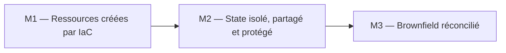
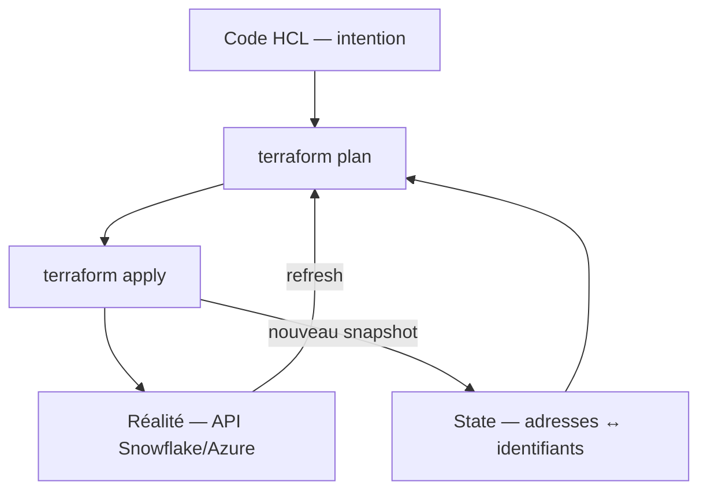
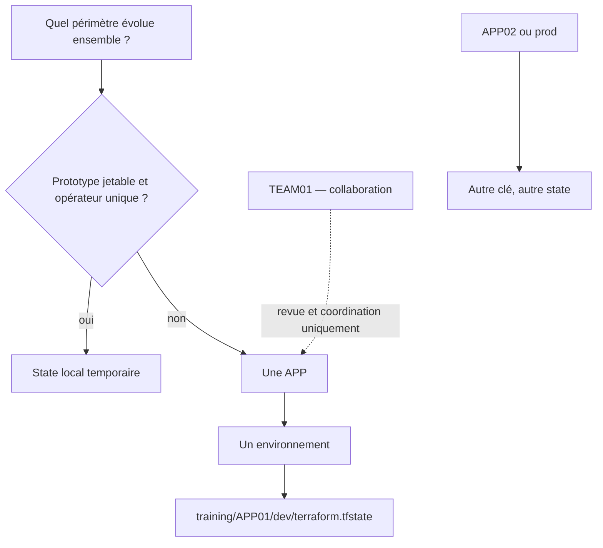
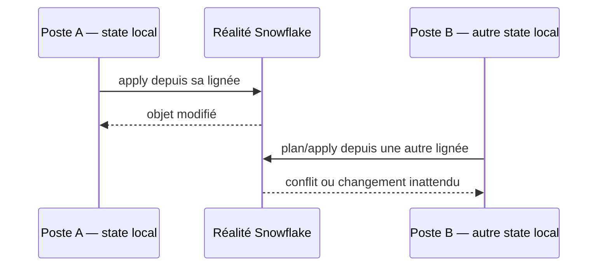
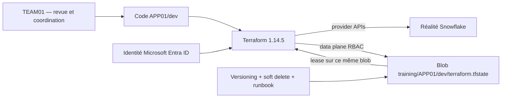
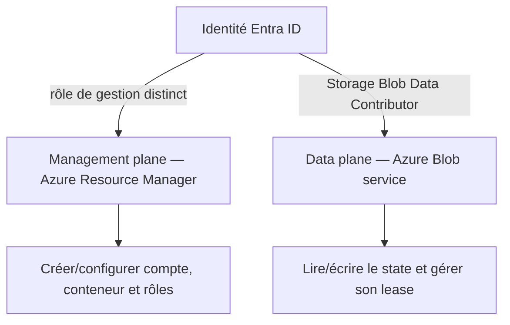
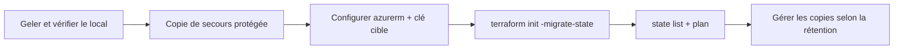
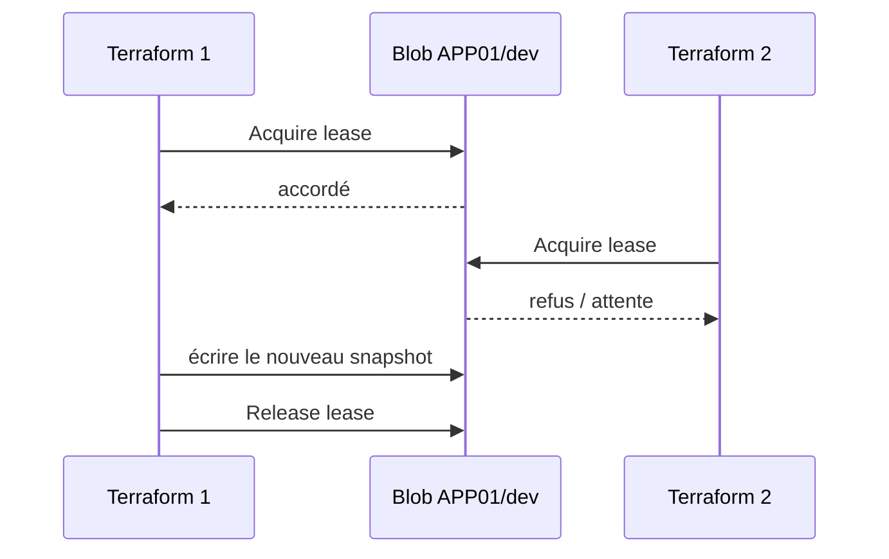
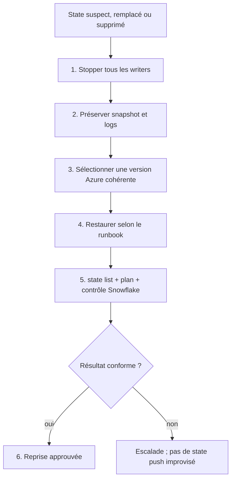
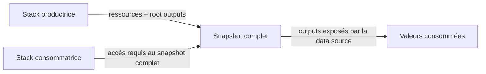

# Slides M2 — Sécuriser et partager le state Terraform

> Durée cible de présentation : 15 à 20 minutes avant le lab. Module complet : 2 h. Terraform : `1.14.5` exactement.

---

## Mission du module

- 🎯 **Acteur :** `TEAM01`, équipe qui collabore sur le code de `APP01` ;
- ⚠️ **Problème :** un state local peut être perdu, diverger ou exposer des données sensibles ;
- ✅ **Résultat :** un state distant isolé à la clé `training/APP01/dev/terraform.tfstate`, authentifié avec Microsoft Entra ID et protégé contre les écritures concurrentes.

> `TEAM01` est uniquement un périmètre de collaboration. Ce n’est pas une frontière ni un nom de state.

---

## Où sommes-nous ?



**Lecture :** M2 sécurise la mémoire produite en M1 avant l’import et la réconciliation du brownfield en M3. L’ordre repose sur les flèches, pas sur une couleur.

---

## 🧠 Modèle mental : code, state, réalité



**Lecture :** `plan` compare trois vues. `apply` modifie la réalité puis écrit un nouveau snapshot. Le state est une mémoire opérationnelle sensible, pas le code source ni une sauvegarde complète de Snowflake.

---

## 🔎 Que mémorise le state ?

- les adresses telles que `snowflake_database.raw` ;
- les identifiants réels tels que `DB_RAW_DEV` ;
- les attributs retournés par les providers et les root outputs ;
- `serial`, `lineage`, dépendances et version d’écriture ;
- parfois des valeurs sensibles, même lorsqu’elles sont marquées `sensitive`.

**Règle :** ne jamais éditer le JSON à la main ni committer `.tfstate`, `.tfstate.backup` ou une copie exportée.

---

## 🧭 Décider la frontière du state



**Lecture :** CORE isole d’abord par application, puis par environnement. `TEAM01` organise les personnes ; il ne doit pas produire `training/TEAM01/dev/terraform.tfstate`.

---

## ⚠️ Pourquoi le local ne suffit pas



**Lecture :** les postes partagent une réalité mais pas leur `serial`, leur `lineage` ni un verrou distant. Copier un fichier à la main ne garantit ni cohérence ni recovery.

Risques : perte du poste, state périmé, deux sources de vérité, fuite d’attributs et blast radius excessif.

---

## 🏗️ Architecture CORE cible



**Lecture :** Terraform accède au blob APP01/dev avec l’identité Entra ID. Le snapshot et le lease concernent le même blob ; versioning et soft delete préparent le recovery.

---

## 🔐 Entra ID : management plane ≠ data plane



**Lecture :** `Storage Blob Data Contributor` donne les opérations Blob nécessaires au backend, au scope minimal. Il ne crée pas le Storage Account et n’accorde pas des rôles. Un rôle de management plane ne donne pas automatiquement accès aux données Blob.

```hcl
terraform {
  required_version = "= 1.14.5"

  backend "azurerm" {
    resource_group_name  = "rg-training-tfstate"
    storage_account_name = "sttrainingtfstate"
    container_name       = "tfstate"
    key                  = "training/APP01/dev/terraform.tfstate"
    use_azuread_auth     = true
  }
}
```

---

## 🔄 Migration contrôlée



**Lecture :** Terraform migre le snapshot entre backends ; on ne déplace pas le JSON à la main. La vérification précède le nettoyage.

```powershell
terraform init -migrate-state
terraform state list
terraform plan
```

⚠️ Certaines opérations peuvent créer un backup local, mais **la suppression automatique générale des anciens backups n’est pas garantie**. Copies, fichiers `.backup` et versions Azure ont des rétentions distinctes.

---

## 🔒 Locking : un lease, pas un conteneur séparé



**Lecture :** Azure place le lease sur le blob de state lui-même. Aucun conteneur de lock séparé n’est requis. Chaque clé isolée possède son propre blob et son propre lease.

`terraform force-unlock LOCK_ID` : uniquement après avoir prouvé que le writer initial est arrêté. Cette commande retire un lock ; elle ne répare pas le state.

---

## 🛟 Recovery : préparer avant l’incident



**Lecture :** versioning et soft delete fournissent des candidats à la restauration seulement s’ils étaient activés et encore dans leur rétention. La reprise exige une comparaison avec la réalité.

À définir en production : RPO/RTO, rétention, propriétaires, accès d’urgence, double approbation et test périodique du runbook.

---

## 🔗 `terraform_remote_state` : attention à la portée



**Lecture :** la data source expose uniquement les root outputs, mais son identité doit pouvoir lire le snapshot complet. Un output `sensitive` n’est pas une barrière d’accès au fichier.

**Production :** préférer une publication explicite dans une interface dédiée — Key Vault pour les secrets, App Configuration, DNS ou catalogue — lorsque les niveaux de confiance diffèrent.

---

## 🏭 Training versus Production

| Dimension | Training | Production |
|---|---|---|
| Identité | Session Entra ID du lab | Workload identity/OIDC ou managed identity par pipeline |
| State | `training/APP01/dev/terraform.tfstate` | Clés APP/env gouvernées et blast radius documenté |
| RBAC | `Storage Blob Data Contributor` au scope pédagogique minimal | Scope minimal, groupes dédiés, revues et accès d’urgence audité |
| Réseau | Endpoint accessible au lab | Firewall/private endpoint et DNS validés pour les runners |
| Recovery | Observer et comprendre les protections | Versioning, soft delete, alertes, rétention et restores testés |
| Exécution | Checkpoints interactifs | Pipeline sérialisée, approvals et logs |
| Données partagées | `terraform_remote_state` à but pédagogique | Interface dédiée privilégiée |

---

## 🛡️ Sécurité, coût et bonnes pratiques

- 🔐 **Identité :** `use_azuread_auth = true`, aucune Storage access key dans Git.
- 👤 **Least privilege :** `Storage Blob Data Contributor` pour le data plane ; management plane séparé.
- 🧩 **Isolation :** une clé par APP et environnement ; `TEAM01` reste la collaboration.
- 🗄️ **Protection :** chiffrement Azure, versioning, soft delete et rétention explicite.
- 🌐 **Réseau :** l’endpoint Blob doit être joignable par le runner autorisé.
- 💰 **Coût :** versions, rétention, logs, réplication et private endpoints peuvent s’accumuler.
- 🧹 **Cleanup :** ne supprimer le backend ou les backups qu’après validation et selon la politique.

---

## ✅ Checkpoint final

L’apprenant doit pouvoir affirmer et prouver :

- Terraform utilisé : `1.14.5` ;
- clé CORE : `training/APP01/dev/terraform.tfstate` ;
- `TEAM01` : collaboration uniquement ;
- authentification : Microsoft Entra ID avec `use_azuread_auth = true` ;
- rôle data plane : `Storage Blob Data Contributor` ;
- locking : lease sur le blob de state, sans conteneur de lock séparé ;
- recovery : versioning/soft delete plus runbook, jamais une garantie de backup éternel ;
- remote state : lecture des outputs, mais accès nécessaire au snapshot complet.

---

## 🚀 Votre prochaine action

Ouvrez le [lab M2](./lab.md), vérifiez le preflight et identifiez **avant toute migration** :

1. le state local source ;
2. l’identité Entra ID active ;
3. la clé cible exacte `training/APP01/dev/terraform.tfstate`.

Références : [backend `azurerm`](https://developer.hashicorp.com/terraform/language/backend/azurerm), [state locking](https://developer.hashicorp.com/terraform/language/state/locking), [Azure Blob RBAC](https://learn.microsoft.com/azure/storage/blobs/assign-azure-role-data-access), [blob versioning](https://learn.microsoft.com/azure/storage/blobs/versioning-overview).
