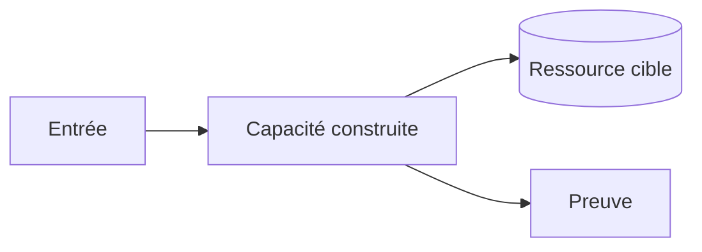
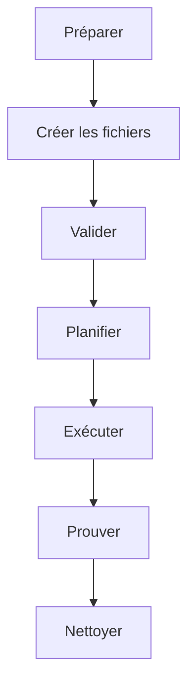

# 🧪 Lab Mx — <Tâche professionnelle>

| Élément | Valeur |
|---|---|
| **Durée** | <durée réaliste, troubleshooting inclus> |
| **Piste** | `[CORE]` / `[AZURE]` / `[AWS]` / `[GCP]` |
| **Workspace** | `<chemin exact>` |
| **Point de départ** | <fichiers réellement présents> |
| **Coût** | <gratuit, crédit sandbox ou estimation> |
| **Cleanup** | <obligatoire / conservation jusqu’au module X> |

## 🎯 Mission

<Acteur, contexte, résultat professionnel et raison de le construire.>

## 🎁 Résultat final

À la fin du lab, vous aurez créé :

```text
<arborescence finale, avec annotation des nouveaux fichiers>
```

## 🏗️ Architecture



## 🎯 Objectifs pédagogiques

- ✅ <verbe observable>;
- ✅ <verbe observable>;
- ✅ <preuve mesurable>.

## 📋 Prérequis vérifiables

- [ ] <checkpoint du module précédent>;
- [ ] `<commande de version>` retourne <contrainte>;
- [ ] <connexion/rôle testé sans afficher de secret>.

## 🚀 Préflight

<details>
<summary>🪟 <b>Windows (PowerShell)</b></summary>

```powershell
Get-Location
# autres contrôles non destructifs
```
</details>

<details>
<summary>🐧 <b>Linux/macOS (Bash)</b></summary>

```bash
pwd
# contrôles équivalents
```
</details>

✅ **Checkpoint** : <répertoire, versions et connexion>.

## 🗺️ Vue d’ensemble



## 📝 Partie 1 — <capacité incrémentale>

### 📝 Étape 1.1 — Créer le dossier

**Objectif :** <pourquoi ce dossier existe>.

<details>
<summary>🪟 <b>Windows (PowerShell)</b></summary>

```powershell
New-Item -ItemType Directory -Path <path> -Force
Set-Location <path>
```
</details>

<details>
<summary>🐧 <b>Linux/macOS (Bash)</b></summary>

```bash
mkdir -p <path>
cd <path>
```
</details>

✅ **Checkpoint** :

```text
<structure attendue>
```

### 📝 Étape 1.2 — Créer `<file>`

**Objectif :** <responsabilité unique du fichier>.

Créez le fichier vide :

<details>
<summary>🪟 <b>Windows (PowerShell)</b></summary>

```powershell
New-Item -ItemType File -Path <file>
code <file>
```
</details>

<details>
<summary>🐧 <b>Linux/macOS (Bash)</b></summary>

```bash
touch <file>
code <file>
```
</details>

Ajoutez ce contenu complet :

```hcl
<bloc minimal valide, sans ellipse ambiguë>
```

**Explication :**

1. `<élément>` — <rôle>;
2. `<élément>` — <rôle>;
3. `<élément>` — <conséquence>.

### 📝 Checkpoint 1 — Structure et syntaxe

<details>
<summary>🪟 <b>Windows (PowerShell)</b></summary>

```powershell
.\validate.ps1 -Checkpoint 1
```
</details>

<details>
<summary>🐧 <b>Linux/macOS (Bash)</b></summary>

```bash
./validate.sh --checkpoint 1
```
</details>

✅ **Checkpoint** :

```text
[PASS] <contrôle 1>
[PASS] <contrôle 2>
Checkpoint 1: PASS
```

> 🔍 **Si votre résultat diffère :** vérifiez d’abord le répertoire courant, le nom exact du fichier et les placeholders. Consultez ensuite `troubleshooting.md#checkpoint-1`.

## 📝 Partie 2 — Formater, initialiser et valider

Présenter chaque commande séparément, expliquer son rôle, montrer une sortie courte et stable, puis exécuter un checkpoint.

## 📝 Partie 3 — Planifier et lire le changement

- enregistrer le plan lorsque pertinent;
- expliquer `+`, `~`, `-`, `-/+`;
- comparer types, adresses et quantité aux critères;
- arrêter si une destruction inattendue apparaît.

## 📝 Partie 4 — Exécuter et prouver

Avant `apply`, rappeler la portée exacte. Après exécution, produire une preuve Terraform et une preuve fonctionnelle Snowflake/CLI/dbt.

## 🐛 Erreur contrôlée

### Symptôme attendu

<Erreur sûre et réversible introduite intentionnellement.>

### Diagnostic

```text
<commande non destructive et observation>
```

### Correction minimale

<Modification ciblée, sans remplacer le workspace par la solution.>

### Prévention

<Contrôle automatisé ou pratique réutilisable.>

## ✅ Validation finale

- [ ] structure conforme;
- [ ] formatage et syntaxe valides;
- [ ] plan conforme aux ressources annoncées;
- [ ] preuve fonctionnelle obtenue;
- [ ] second plan sans modification inattendue;
- [ ] aucun secret ou artefact interdit dans Git.

## 🏆 Challenge

### Scénario

<Nouvelle demande liée au même contexte métier.>

### Contraintes

- <contrainte 1>;
- <contrainte 2>;
- ne pas consulter `solution/` avant le score.

### Critères de score

| Critère | Points |
|---|---:|
| <preuve> | <points> |
| <qualité> | <points> |
| <sécurité/idempotence> | <points> |

## 🧹 Cleanup contrôlé

> ⚠️ Confirmez le workspace, le préfixe apprenant et la liste des ressources avant toute destruction.

<details>
<summary>🪟 <b>Windows (PowerShell)</b></summary>

```powershell
<commande de preview>
<commande de cleanup avec confirmation>
```
</details>

<details>
<summary>🐧 <b>Linux/macOS (Bash)</b></summary>

```bash
<commande de preview>
<commande de cleanup avec confirmation>
```
</details>

✅ **Checkpoint** : <requête/commande confirmant le nettoyage>.

## 🎯 Point de reprise

Si vous devez interrompre le lab, conservez <fichiers autorisés> et reprenez avec :

```text
<commande de vérification/reprise>
```

## 🤔 Réflexion

1. Quel risque le pattern réduit-il ?
2. Quel compromis de formation ne faut-il pas reproduire en production ?
3. Quelle preuve présenteriez-vous en revue de changement ?
