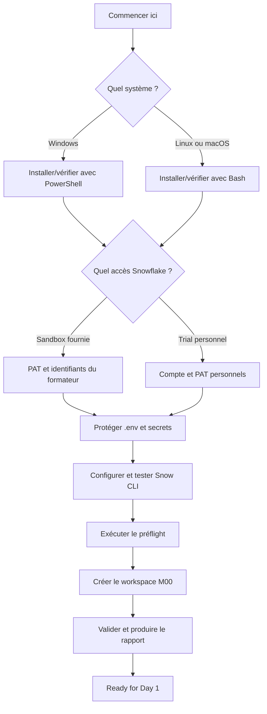

# Jour 0 — Préparer votre environnement

**Durée totale : 1 h 45**

**Résultat final : `Ready for Day 1`**

Bienvenue dans le point de départ unique de la formation. Suivez les étapes dans l’ordre. Ne consultez pas les anciens dossiers directement : tous les liens utiles sont rassemblés ici.

## Votre mission

À la fin du Jour 0, vous devez disposer de :

- Git, Terraform et Snowflake CLI disponibles dans le terminal;
- un dépôt de formation ouvert au bon emplacement;
- un scénario d’accès choisi : Sandbox ou Trial;
- une configuration locale protégée par `.gitignore`;
- une connexion Snowflake `terraform_svc` testée;
- un workspace apprenant isolé dans `$HOME/Data2AI-Labs`;
- un rapport de validation sans erreur.

Aucune ressource Terraform, Azure, AWS ou GCP n’est créée pendant le Jour 0.

## Parcours en un coup d’œil



## Progression obligatoire

| Étape | Temps | Action | Preuve pour continuer |
|---:|---:|---|---|
| 1 | 5 min | Lire objectifs et règles de sécurité | Vous savez ce qui sera créé — et ce qui ne le sera pas |
| 2 | 30 min | [Installer ou vérifier les outils](module-00-tools-setup/lab.md) | Git, Terraform et `snow` répondent |
| 3 | 10 min | [Comprendre configuration, PAT et profil](module-00-day0-setup/course.md) | Vous distinguez identifiant et secret |
| 4 | 30 min | [Configurer Sandbox ou Trial pas à pas](module-00-day0-setup/lab.md) | `snow connection test` retourne OK |
| 5 | 10 min | Exécuter le préflight | `Ready for Day 1` |
| 6 | 10 min | Créer et valider le workspace M00 | Rapport PASS sans secret |
| 7 | 10 min | Corriger ou faire le challenge final | Checklist complète |
| **Total** | **1 h 45** | | |

## Avant de commencer

Choisissez vos options et conservez-les pendant tout le module.

### 1. Votre système

- [ ] **Windows 10/11** avec PowerShell 5.1 ou 7;
- [ ] **Linux** avec Bash;
- [ ] **macOS** avec Bash ou Zsh pour lancer les commandes Bash.

### 2. Votre scénario Snowflake

- [ ] **Sandbox** : le formateur fournit account, user, PAT temporaire et préfixe;
- [ ] **Trial** : vous utilisez votre propre compte Snowflake Trial et créez votre PAT.

Si vous n’avez pas encore reçu les accès, réalisez l’installation et le préflight avec l’option `SkipSnowflake`, puis reprenez à l’étape connexion.

## Règles de sécurité

1. Ne collez jamais un PAT dans une commande : l’historique du shell pourrait le conserver.
2. Ne placez jamais un PAT, mot de passe ou clé privée dans `.env`.
3. Ne partagez ni `.env`, ni `config.toml`, ni le contenu de `secrets/`.
4. N’ajoutez pas `ACCOUNTADMIN` pour résoudre une erreur de privilège.
5. Ne créez pas de network policy, utilisateur global ou ressource Cloud pendant ce module.
6. Arrêtez-vous si `git check-ignore .env` ne retourne pas `.env`.

## Besoin d’aide ?

Utilisez cette séquence, sans recommencer tout le module :

1. relisez le dernier résultat attendu;
2. confirmez votre répertoire courant;
3. ouvrez le [guide de troubleshooting](module-00-day0-setup/troubleshooting.md);
4. exécutez uniquement le diagnostic non destructif indiqué;
5. corrigez puis rejouez le dernier checkpoint.

## Critère de fin

Le Jour 0 est terminé uniquement lorsque :

```text
Ready for Day 1
```

et que le validateur du workspace M00 ne contient aucun `FAIL`.

## Suite

Passez à [M1 — Premier déploiement Terraform Snowflake](../day-01/module-01-iac-workflow/lab.md). M1 vous fera créer chaque fichier Terraform depuis un workspace presque vide.

## Archives

`module-00-environment-pre-setup/` contient l’ancienne version du parcours. Elle n’est plus maintenue et ne doit pas être suivie par les apprenants. Chaque page de ce dossier redirige vers ce README ou le lab principal.
