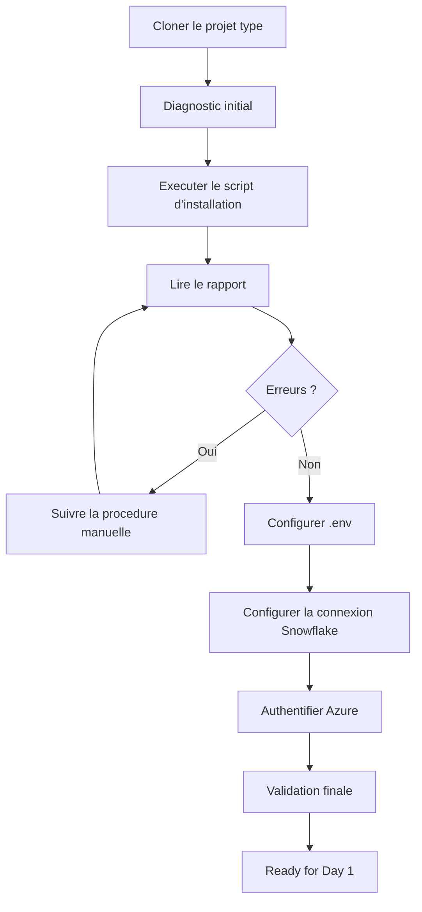

# Jour 0 — Preparer votre environnement

**Duree totale : 1 h 30**

**Resultat final : `Ready for Day 1`**

Bienvenue dans le point de depart de la formation. Le Jour 0 est **automatise** : vous clonez le projet type, executez les scripts qu'il contient, puis comprenez ce qu'ils ont fait. Aucune ressource Cloud n'est creee.

## Votre mission

A la fin du Jour 0, vous devez disposer de :

- le **projet type** clone sous `$HOME/Data2AI-Labs/data-platform` — c'est votre racine de travail pour toute la formation;
- Git, Terraform, Snowflake CLI, Azure CLI et dbt disponibles dans le terminal;
- une connexion Snowflake `training` testee via PAT saisi de facon securisee;
- un rapport de validation sans erreur ni secret.

## Le projet type est votre racine

Le projet type `data-platform-starter` contient :

- les **scripts** d'installation, de connexion et de validation;
- la **structure** de dossiers (`environments/`, `modules/`, `docs/`);
- la **gouvernance** (`.gitignore`, `.tflint.hcl`, `azure-pipelines.yml`, `CODEOWNERS`).

Il **ne contient pas** de fichiers `.tf` de ressource. Vous les creerez au fil des modules.



## Progression obligatoire

Le lab est un seul module avec 7 etapes :

| Etape | Temps | Action | Preuve pour continuer |
|---:|---:|---|---|
| 1 | 5 min | Cloner le projet type | Clone present, scripts visibles |
| 2 | 20 min | Installer et verifier les outils | `Toolchain status: READY` |
| 3 | 10 min | Configurer `.env` | `git check-ignore .env` retourne `.env` |
| 4 | 10 min | Authentifier Azure avec le SP partage | `az account show` affiche la souscription |
| 5 | 20 min | Configurer la connexion Snowflake | `snow sql -q 'SELECT 1' -c training` retourne un resultat |
| 6 | 10 min | Inspecter la structure du projet type | Dossiers `environments/`, `modules/`, `docs/` presents |
| 7 | 10 min | Validation finale | `Toolchain status: READY` + Snowflake + Azure |
| **Total** | **1 h 30** | | |

> Le lab detaille est dans [module-00-setup/lab.md](module-00-setup/lab.md).

## Avant de commencer

### 1. Votre systeme

- [ ] **Windows 10/11** avec PowerShell 5.1 ou 7;
- [ ] **Linux** avec Bash;
- [ ] **macOS** avec Bash ou Zsh.

### 2. Votre URL de projet type

Le depot du projet type est : `https://github.com/msellamiTN/data-platform-starter.git`

> `[IMPORTANT] Windows` : utilisez `$HOME` entre guillemets, pas `~` :
> ```powershell
> git clone https://github.com/msellamiTN/data-platform-starter.git "$HOME\Data2AI-Labs\data-platform"
> ```

### 3. Vos identifiants Snowflake

Le formateur a pre-rempli le fichier `.env.example` du projet type avec :

- l'identifiant d'organisation Snowflake;
- l'identifiant de compte Snowflake;
- le nom d'utilisateur Snowflake;
- le role (generalement `SYSADMIN`);
- les parametres Azure et Azure DevOps.

Vous copiez `.env.example` en `.env`, puis vous ajoutez uniquement :

- votre **prefixe apprenant** unique (3 a 5 lettres);
- votre **PAT** temporaire.

Le formateur vous fournit egalement un **username + password Snowflake** individuel
pour acceder a l'interface web (https://app.snowflake.com).

> `[NOTE]` Le PAT est utilise par la CLI et Terraform. Le password est utilise pour
> l'interface web uniquement. Les deux sont individuels.

### 4. Vos identifiants Azure (service principal partage)

Le formateur vous fournit un fichier `secrets/shared-sp.txt` contenant les identifiants
d'un **service principal partage** (app ID, secret, tenant, subscription).

> `[SECURITY]` Ce fichier est gitignored. Ne le commitez jamais.
> Ne le partagez pas en dehors de la formation.

Ce service principal **contourne l'authentification MFA** d'Azure.
Vous l'utilisez via le script `Learner-Login` (voir Etape 4 du lab).

L'isolation entre apprenants se fait via votre `LEARNER_PREFIX` :
vos ressources Snowflake et votre state Terraform sont uniques.

## Regles de securite

1. Le PAT est saisi via une invite masquee — jamais affiche, jamais colle dans une commande.
2. Aucun PAT, mot de passe ou cle privee n'est place dans un fichier du depot.
3. Le script de connexion efface le token de l'environnement des que possible.
4. N'ajoutez pas `ACCOUNTADMIN` pour resoudre une erreur de privilege.
5. Ne créez pas de network policy, utilisateur global ou ressource Cloud pendant ce module.
6. Arretez-vous si `git check-ignore .env` ne retourne pas `.env`.

## Formateur — Preparation

> Si vous etes formateur, consultez le [guide de preparation](instructor-setup.md)
> avant la formation. Il decrit la creation du SP partage, des utilisateurs Snowflake,
> des PAT, et la configuration d'Azure DevOps.

## Besoin d'aide ?

Utilisez cette sequence, sans recommencer tout le module :

1. relisez le dernier resultat attendu;
2. confirmez votre repertoire courant (`pwd`);
3. ouvrez le [guide de troubleshooting](module-00-setup/troubleshooting.md);
4. executez uniquement le diagnostic non destructif indique;
5. corrigez puis rejouez le dernier checkpoint.

## Critere de fin

Le Jour 0 est termine uniquement lorsque :

```text
Toolchain status: READY
```

et que la connexion Snowflake repond a `snow sql -q 'SELECT 1' -c training`.

## Suite

Passez a [M1 — Premier deploiement Terraform Snowflake](../day-01/module-01-iac-workflow/lab.md). M1 vous fera creer chaque fichier Terraform depuis le projet type clone, en mode manuel pas a pas. **Tous les fichiers `.tf` que vous creerez iront dans le clone** sous `environments/dev/`.
