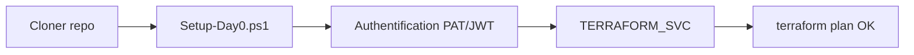

# Jour 0 — Préparation de l'environnement

**Durée :** 90 min  
**Objectif :** Disposer d'un poste de travail opérationnel et d'une authentification Snowflake fonctionnelle avant d'aborder le déploiement Terraform.

| Module | Durée | Contenu |
|--------|-------|---------|
| [M0 — Day 0](module-00-day0-setup/lab.md) | 90 min | Outils, authentification Snowflake PAT/JWT (admin + TERRAFORM_SVC), provider Terraform, terraform plan |

> Les anciens modules `module-00-tools-setup` et `module-00-environment-pre-setup` sont conservés à titre de référence mais ne sont plus maintenus.

---

## Livrables attendus

- Terraform 1.14.5 fonctionnel (`terraform version`).
- Snowflake CLI (`snow`) configuré avec les connexions `admin` et `terraform_svc`.
- Dossier `secrets/` contenant `snowflake_admin_pat.txt` et `snowflake_terraform_pat.txt` (PAT) ou `snowflake_key.p8` et `snowflake_key.pub` (JWT).
- Utilisateur `TERRAFORM_SVC` créé dans Snowflake.
- `terraform plan` réussi dans `project/01-day1-basics/`.
- `.gitignore` validé : aucun secret en attente de commit.

---

## Authentification

- **PAT** (Programmatic Access Token) est la méthode par défaut : plus simple, contourne MFA, aucune clé RSA.
- **JWT key-pair** est l'option avancée/production : génère une paire de clés RSA avec OpenSSL.
- Aucun mot de passe dans le code Terraform.
- Le [course.md du M0](module-00-day0-setup/course.md) résume les deux méthodes.

