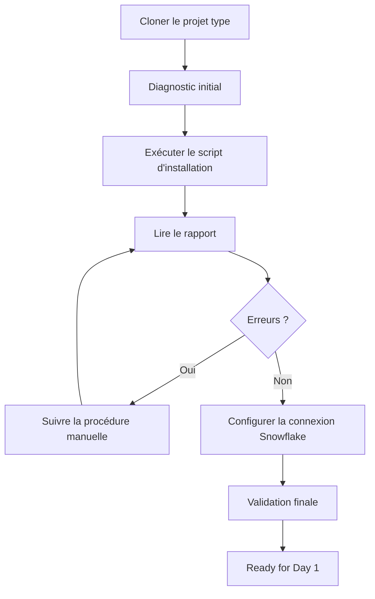

# Jour 0 — Préparer votre environnement

**Durée totale : 1 h 30**

**Résultat final : `Ready for Day 1`**

Bienvenue dans le point de départ de la formation. Le Jour 0 est **automatisé** : vous clonez le projet type, exécutez les scripts qu'il contient, puis comprenez ce qu'ils ont fait. Aucune ressource Cloud n'est créée.

## Votre mission

À la fin du Jour 0, vous devez disposer de :

- le **projet type** cloné sous `$HOME/Data2AI-Labs/data-platform` — c'est votre racine de travail pour toute la formation;
- Git, Terraform, Snowflake CLI, Azure CLI et dbt disponibles dans le terminal;
- une connexion Snowflake `training` testée via PAT saisi de façon sécurisée;
- un rapport de validation sans erreur ni secret.

## Le projet type est votre racine

Le projet type `data-platform-starter` contient :

- les **scripts** d'installation, de connexion et de validation;
- la **structure** de dossiers (`environments/`, `modules/`, `docs/`);
- la **gouvernance** (`.gitignore`, `.tflint.hcl`, `azure-pipelines.yml`, `CODEOWNERS`).

Il **ne contient pas** de fichiers `.tf` de ressource. Vous les créerez au fil des modules.



## Progression obligatoire

| Étape | Temps | Action | Preuve pour continuer |
|---:|---:|---|---|
| 1 | 5 min | Lire objectifs et règles de sécurité | Vous savez ce qui sera installé |
| 2 | 5 min | [Cloner le projet type et diagnostic initial](module-00-tools-setup/lab.md) | Clone présent, rapport généré |
| 3 | 20 min | [Exécuter le script d'installation](module-00-tools-setup/lab.md) | Outils installés ou procédure manuelle affichée |
| 4 | 10 min | Lire le rapport et corriger les échecs | Tous les outils Core en PASS |
| 5 | 20 min | [Configurer la connexion Snowflake](module-00-day0-setup/lab.md) | `snow sql -q 'SELECT 1' -c training` retourne un résultat |
| 6 | 10 min | [Inspecter la structure du projet type](module-00-day0-setup/lab.md) | Dossiers `environments/`, `modules/`, `docs/` présents |
| 7 | 10 min | Validation finale | `Toolchain status: READY` |
| 8 | 10 min | Explication : ce que le script a fait | Vous savez où sont installés les outils et pourquoi |
| **Total** | **1 h 30** | | |

## Avant de commencer

### 1. Votre système

- [ ] **Windows 10/11** avec PowerShell 5.1 ou 7;
- [ ] **Linux** avec Bash;
- [ ] **macOS** avec Bash ou Zsh.

### 2. Votre URL de projet type

Le formateur vous fournit l'URL du dépôt template `data-platform-starter`. Si elle n'est pas indiquée, demandez-la avant de commencer l'étape 2.

### 3. Vos identifiants Snowflake

Le formateur vous fournit :

- l'identifiant d'organisation Snowflake;
- l'identifiant de compte Snowflake;
- votre nom d'utilisateur Snowflake;
- votre rôle (généralement `SYSADMIN` pour la formation);
- un PAT temporaire;
- votre préfixe apprenant unique (3 à 5 lettres).

## Règles de sécurité

1. Le PAT est saisi via une invite masquée — jamais affiché, jamais collé dans une commande.
2. Aucun PAT, mot de passe ou clé privée n'est placé dans un fichier du dépôt.
3. Le script de connexion efface le token de l'environnement dès que possible.
4. N'ajoutez pas `ACCOUNTADMIN` pour résoudre une erreur de privilège.
5. Ne créez pas de network policy, utilisateur global ou ressource Cloud pendant ce module.
6. Arrêtez-vous si `git check-ignore .env` ne retourne pas `.env`.

## Besoin d'aide ?

Utilisez cette séquence, sans recommencer tout le module :

1. relisez le dernier résultat attendu;
2. confirmez votre répertoire courant (`pwd`);
3. ouvrez le [guide de troubleshooting](module-00-day0-setup/troubleshooting.md);
4. exécutez uniquement le diagnostic non destructif indiqué;
5. corrigez puis rejouez le dernier checkpoint.

## Critère de fin

Le Jour 0 est terminé uniquement lorsque :

```text
Toolchain status: READY
```

et que la connexion Snowflake répond à `snow sql -q 'SELECT 1' -c training`.

## Suite

Passez à [M1 — Premier déploiement Terraform Snowflake](../day-01/module-01-iac-workflow/lab.md). M1 vous fera créer chaque fichier Terraform depuis le projet type cloné, en mode manuel pas à pas. **Tous les fichiers `.tf` que vous créerez iront dans le clone** sous `environments/dev/`.
