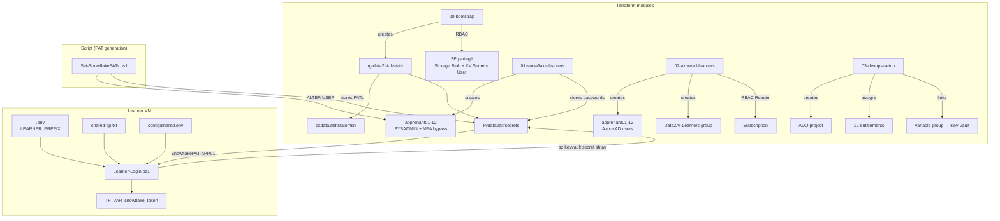
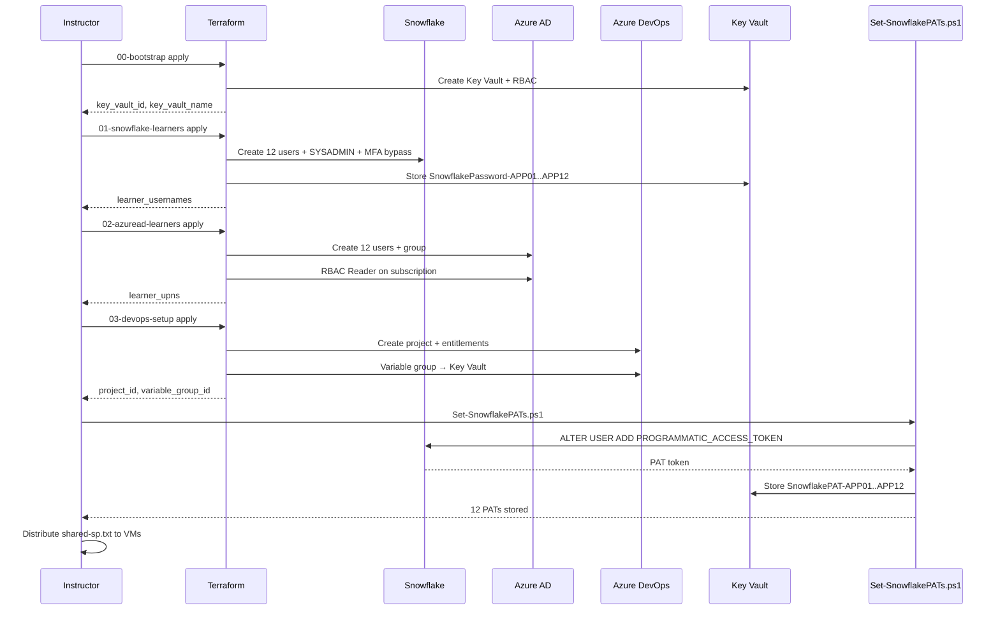

# Guide formateur — Préparation de l'environnement

> Ce document est destiné **uniquement au formateur**. Il décrit toutes les opérations
> administratives à effectuer **avant** le Jour 0 pour que les apprenants puissent
> démarrer sans friction.

**Retour au parcours :** [Jour 0 — Commencer ici](README.md)

## Vue d'ensemble

Le formateur prépare trois environnements à l'aide de **4 modules Terraform** et **1 script PowerShell** :

| Étape | Module / Script | Ressources créées |
|---|---|---|
| **Step 1** | `project/00-bootstrap` | Azure : Resource Group, Storage Account, Key Vault, RBAC |
| **Step 2** | `project/01-snowflake-learners` | Snowflake : 12 utilisateurs, rôles SYSADMIN, MFA bypass, mots de passe → KV |
| **Step 3** | `project/02-azuread-learners` | Azure AD : 12 utilisateurs, groupe de sécurité, RBAC Reader |
| **Step 4** | `project/03-devops-setup` | Azure DevOps : projet, entitlements, variable group → Key Vault |
| **Step 5** | `scripts/Set-SnowflakePATs.ps1` | Snowflake : 12 PATs générés → Key Vault |
| **Step 6** | Distribution manuelle | Copier `secrets/shared-sp.txt` sur les VMs apprenants |

> `[IaC]` **Tout est Infrastructure as Code.** Les 4 modules Terraform sont versionnés,
> idempotents, et offrent un audit trail complet via Git + Terraform state.
> Le seul script restant (`Set-SnowflakePATs.ps1`) est nécessaire car le provider
> Snowflake v2.14.0 n'a pas de ressource PAT (disponible en v2.17.0+).

## 1. Préparer le service principal partagé (une seule fois)

### 1.1 — Créer le SP partagé

```powershell
$subscriptionId = "8c42d5b2-ab70-4051-ab0e-a96877557f6a"
$spName = "sp-data2ai-learners"

az ad sp create-for-rbac --name $spName --role Contributor --scopes /subscriptions/$subscriptionId
```

Sauvegarder la sortie dans `secrets/shared-sp.txt` :

```text
ARM_CLIENT_ID=<appId>
ARM_CLIENT_SECRET=<password>
ARM_TENANT_ID=<tenant>
ARM_SUBSCRIPTION_ID=8c42d5b2-ab70-4051-ab0e-a96877557f6a
```

Récupérer l'**object ID** du SP :

```powershell
# --id expects the appId (UUID from the create output), NOT the display name
$appId = "ab35eee0-5d09-4c4d-b41c-f536ce7dbdf0"
$spObjectId = az ad sp show --id $appId --query id -o tsv
Write-Host "SP object ID (for 00-bootstrap): $spObjectId"

# Alternative: query by display name
$spObjectId = az ad sp list --filter "displayName eq 'sp-data2ai-learners'" --query '[0].id' -o tsv
```

> `[IMPORTANT]` `az ad sp show --id` expects the **appId** (UUID), not the display name.
> Using the display name returns "Service principal doesn't exist".

> `[IMPORTANT]` Le SP a **deux identifiants distincts** :
> - **appId** (`ARM_CLIENT_ID`) : utilisé pour `az login --service-principal`.
> - **object ID** : utilisé pour les **attributions de rôles RBAC** dans `00-bootstrap`.

### 1.2 — Accorder les permissions API au SP

Le SP doit avoir les permissions Microsoft Graph suivantes pour `02-azuread-learners` :

- `User.ReadWrite.All` (ou `Directory.ReadWrite.All`)

```powershell
# Via le portail Azure : App registrations > sp-data2ai-learners > API permissions
# Ajouter Microsoft Graph > Application permissions > User.ReadWrite.All
# Puis : Grant admin consent
```

## 2. Step 1 — Exécuter `00-bootstrap`

```powershell
cd project/00-bootstrap
Copy-Item terraform.tfvars.example terraform.tfvars
# Éditer terraform.tfvars avec les valeurs du SP
code terraform.tfvars
```

`terraform.tfvars` minimal :

```hcl
arm_subscription_id = "8c42d5b2-ab70-4051-ab0e-a96877557f6a"
arm_tenant_id       = "55fca982-2372-4352-8b7e-c28ac00ae8e3"
arm_client_id       = "<appId du SP partagé>"
arm_client_secret   = "<password du SP partagé>"

snowflake_organization = "ZVFXOZW"
snowflake_account      = "PM71247"
snowflake_user         = "DATA2AI"
snowflake_role         = "SYSADMIN"
snowflake_pat          = ""

state_blob_contributor_object_ids = ["<object ID du SP partagé>"]
wif_service_principal_object_id   = ""
snowflake_learner_prefixes        = ["APP01", "APP02", "APP03", "APP04", "APP05", "APP06", "APP07", "APP08", "APP09", "APP10", "APP11", "APP12"]
```

Exécuter :

```powershell
terraform init
terraform plan -out bootstrap.tfplan
terraform apply bootstrap.tfplan
```

Récupérer les outputs pour les modules suivants :

```powershell
terraform output -raw key_vault_id          # → pour 01-snowflake-learners
terraform output -raw key_vault_name        # → pour 03-devops-setup
terraform output -raw shared_env_snippet    # → pour config/shared.env
```

Générer `config/shared.env` :

```powershell
terraform output -raw shared_env_snippet > ../../templates/data-platform-starter/config/shared.env
```

> `[IMPORTANT]` La propagation RBAC peut prendre **jusqu'à 10 minutes**.

## 3. Step 2 — Exécuter `01-snowflake-learners`

Ce module crée les 12 utilisateurs Snowflake, accorde le rôle SYSADMIN,
définit le MFA bypass (240 min), et stocke les mots de passe web dans Key Vault.

```powershell
cd ../01-snowflake-learners
Copy-Item terraform.tfvars.example terraform.tfvars
code terraform.tfvars
```

`terraform.tfvars` :

```hcl
learner_count = 12
default_role  = "SYSADMIN"
mins_to_bypass_mfa = 240
must_change_password = false

snowflake_organization = "ZVFXOZW"
snowflake_account      = "PM71247"
snowflake_user         = "DATA2AI"
snowflake_role         = "ACCOUNTADMIN"
snowflake_token        = "<votre PAT ACCOUNTADMIN>"

key_vault_id       = "<output de 00-bootstrap>"
store_passwords_in_kv = true
```

Exécuter :

```powershell
terraform init
terraform plan -out snowflake-learners.tfplan
terraform apply snowflake-learners.tfplan
```

Vérifier :

```powershell
terraform output learner_usernames
terraform output role_grants
```

> `[MFA]` Le `mins_to_bypass_mfa = 240` expire après 4 heures.
> Pour rafraîchir, relancez `terraform apply` — il mettra à jour la valeur
> pour tous les utilisateurs de façon idempotente.

## 4. Step 3 — Exécuter `02-azuread-learners`

Ce module crée les 12 utilisateurs Azure AD, un groupe de sécurité,
et assigne le rôle RBAC Reader au groupe.

```powershell
cd ../02-azuread-learners
Copy-Item terraform.tfvars.example terraform.tfvars
code terraform.tfvars
```

`terraform.tfvars` :

```hcl
learner_count = 12
domain        = "data2ai.onmicrosoft.com"
force_password_change = true
group_name    = "Data2AI-Learners"

subscription_id = "8c42d5b2-ab70-4051-ab0e-a96877557f6a"
rbac_role       = "Reader"
assign_rbac     = true
```

Exécuter :

```powershell
terraform init
terraform plan -out azuread-learners.tfplan
terraform apply azuread-learners.tfplan
```

Récupérer les UPNs pour `03-devops-setup` :

```powershell
terraform output -json learner_upns
```

## 5. Step 4 — Exécuter `03-devops-setup`

Ce module crée le projet Azure DevOps, assigne les apprenants (entitlements),
les ajoute au groupe Contributors, crée un service connection Azure (WIF),
et lie un variable group au Key Vault.

```powershell
cd ../03-devops-setup
Copy-Item terraform.tfvars.example terraform.tfvars
code terraform.tfvars
```

`terraform.tfvars` :

```hcl
project_name   = "terraform-snowflake"
learner_upns   = ["apprenant01@data2ai.onmicrosoft.com", ...]  # depuis 02 output
license_type   = "express"

key_vault_name    = "kvdata2aitfsecrets"
subscription_id   = "8c42d5b2-ab70-4051-ab0e-a96877557f6a"
subscription_name = "Data2AI-Training"
tenant_id         = "55fca982-2372-4352-8b7e-c28ac00ae8e3"
auth_scheme       = "WorkloadIdentityFederation"

variable_group_name  = "data-platform-secrets"
kv_secret_variables  = ["SnowflakePAT", "ArmClientSecret"]
```

Exécuter :

```powershell
terraform init
terraform plan -out devops-setup.tfplan
terraform apply devops-setup.tfplan
```

Vérifier :

```powershell
terraform output project_id
terraform output variable_group_id
```

## 6. Step 5 — Générer les PATs avec `Set-SnowflakePATs.ps1`

> `[NOTE]` Cette étape utilise un script car le provider Snowflake v2.14.0
> n'a pas de ressource `snowflake_user_programmatic_access_token`.
> Quand la politique passera à v2.17.0+, cette étape sera remplacée
> par une ressource Terraform (voir `docs/version-policy.md`).

Prérequis : `New-SnowflakeConnection.ps1` doit avoir été exécuté avec
le PAT ACCOUNTADMIN du formateur.

```powershell
cd ../../templates/data-platform-starter
.\scripts\Set-SnowflakePATs.ps1 -LearnerCount 12
```

Le script :
1. Se connecte à Snowflake avec ACCOUNTADMIN
2. Pour chaque apprenant (APP01-APP12), génère un PAT via `ALTER USER ... ADD PROGRAMMATIC_ACCESS_TOKEN`
3. Stocke chaque PAT dans Key Vault sous le nom `SnowflakePAT-APP01`, etc.

Vérifier :

```powershell
az keyvault secret list --vault-name kvdata2aitfsecrets --query "[?starts_with(name,'SnowflakePAT')].name" -o tsv
```

**Expected :** `SnowflakePAT-APP01` à `SnowflakePAT-APP12`.

## 7. Step 6 — Distribuer le bootstrap SP

Copier `secrets/shared-sp.txt` sur chaque VM apprenant.

> `[SECURITY]` Ce fichier est gitignored. Il contient les identifiants du SP partagé.
> C'est le seul secret distribué manuellement — il est nécessaire pour que
> `Learner-Login.ps1` puisse s'authentifier à Azure et récupérer le PAT depuis Key Vault.

## 8. Checklist formateur

### Azure (via `00-bootstrap`)

- [ ] SP `sp-data2ai-learners` créé avec rôle `Contributor`
- [ ] SP a les permissions API `User.ReadWrite.All` (Microsoft Graph)
- [ ] `secrets/shared-sp.txt` généré
- [ ] `project/00-bootstrap/terraform.tfvars` configuré
- [ ] `terraform apply` exécuté avec succès
- [ ] Resource Group, Storage Account, Key Vault créés
- [ ] RBAC `Storage Blob Data Contributor` + `Key Vault Secrets User` attribués au SP
- [ ] `config/shared.env` généré et commité dans le starter

### Snowflake (via `01-snowflake-learners`)

- [ ] `project/01-snowflake-learners/terraform.tfvars` configuré
- [ ] `terraform apply` exécuté avec succès
- [ ] 12 utilisateurs Snowflake créés (`apprenant01` à `apprenant12`)
- [ ] Rôle `SYSADMIN` accordé à chaque utilisateur
- [ ] MFA bypass configuré (240 min)
- [ ] Mots de passe web stockés dans Key Vault (`SnowflakePassword-APP01` etc.)

### Azure AD (via `02-azuread-learners`)

- [ ] `project/02-azuread-learners/terraform.tfvars` configuré
- [ ] `terraform apply` exécuté avec succès
- [ ] 12 utilisateurs Azure AD créés
- [ ] Groupe `Data2AI-Learners` créé avec les 12 membres
- [ ] Rôle `Reader` attribué au groupe sur la subscription

### Azure DevOps (via `03-devops-setup`)

- [ ] `project/03-devops-setup/terraform.tfvars` configuré
- [ ] `terraform apply` exécuté avec succès
- [ ] Projet `terraform-snowflake` créé
- [ ] 12 entitlements assignés (license `express`)
- [ ] Apprenants ajoutés au groupe `Contributors`
- [ ] Service connection Azure créé (WIF)
- [ ] Variable group `data-platform-secrets` lié au Key Vault

### PATs (via `Set-SnowflakePATs.ps1`)

- [ ] `Set-SnowflakePATs.ps1` exécuté avec succès
- [ ] 12 PATs générés et stockés dans Key Vault (`SnowflakePAT-APP01` à `SnowflakePAT-APP12`)

### Distribution

- [ ] `secrets/shared-sp.txt` copié sur chaque VM apprenant
- [ ] Dépôt `data-platform-starter` poussé sur GitHub
- [ ] `config/shared.env` commité

## 9. Architecture d'authentification



## 10. Flux d'exécution complet



## 11. Rotation et cleanup

### Rotation des PATs

```powershell
# Re-exécuter le script génère de nouveaux PATs (les anciens restent valides jusqu'à expiration)
.\scripts\Set-SnowflakePATs.ps1 -LearnerCount 12
```

### Refresh MFA bypass (toutes les 4 heures)

```powershell
cd project/01-snowflake-learners
terraform apply
```

### Cleanup fin de formation

```powershell
# 1. Détruire les modules dans l'ordre inverse
cd project/03-devops-setup && terraform destroy
cd ../02-azuread-learners && terraform destroy
cd ../01-snowflake-learners && terraform destroy
cd ../00-bootstrap && terraform destroy

# 2. Supprimer les PATs du Key Vault (si non détruit avec 00-bootstrap)
foreach ($i in 1..12) {
    $prefix = "APP{0:D2}" -f $i
    az keyvault secret delete --vault-name kvdata2aitfsecrets --name "SnowflakePAT-$prefix"
}

# 3. Supprimer les VMs apprenants
```

## Suite

Une fois cette préparation terminée, les apprenants peuvent suivre le
[Jour 0](README.md) de façon autonome.
