# Guide formateur — Préparation de l'environnement

> Ce document est destiné **uniquement au formateur**. Il décrit toutes les opérations
> administratives à effectuer **avant** le Jour 0 pour que les apprenants puissent
> démarrer sans friction.

**Retour au parcours :** [Jour 0 — Commencer ici](README.md)

## Vue d'ensemble

Le formateur doit préparer trois environnements avant la formation :

| Environnement | Ressources | Script |
|---|---|---|
| **Azure** | Service principal partagé, Resource Group, Storage Account | `Add-LearnerServicePrincipals.ps1` |
| **Snowflake** | Utilisateurs apprenants, PAT, rôles | `Add-SnowflakeLearners.ps1` |
| **Azure DevOps** | Organisation, projet, membres | `az devops` |

## 1. Préparer Azure

### 1.1 — Créer le service principal partagé

```powershell
# Variables
$subscriptionId = "8c42d5b2-ab70-4051-ab0e-a96877557f6a"
$spName = "sp-data2ai-learners"

# Créer le SP avec rôle Contributor
az ad sp create-for-rbac --name $spName --role Contributor --scopes /subscriptions/$subscriptionId
```

Sauvegarder la sortie dans `secrets/shared-sp.txt` :

```text
ARM_CLIENT_ID=<appId>
ARM_CLIENT_SECRET=<password>
ARM_TENANT_ID=<tenant>
ARM_SUBSCRIPTION_ID=8c42d5b2-ab70-4051-ab0e-a96877557f6a
```

### 1.2 — Créer le backend Terraform (state)

Choisissez une région Azure disponible pour votre abonnement. `westeurope` peut refuser de nouveaux clients ; `northeurope` est une alternative courante.

```powershell
$location = "northeurope"
$resourceGroup = "rg-data2ai-tf-state"
$storageAccount = "sadata2aitfstatemsn"
$container = "tfstate"

az group create --name $resourceGroup --location $location
az storage account create `
  --name $storageAccount `
  --resource-group $resourceGroup `
  --location $location `
  --sku Standard_LRS `
  --min-tls-version TLS1_2 `
  --allow-blob-public-access false

# Protection du state : versioning et soft-delete des blobs pendant 7 jours.
az storage account blob-service-properties update `
  --account-name $storageAccount `
  --resource-group $resourceGroup `
  --enable-versioning true `
  --enable-delete-retention true `
  --delete-retention-days 7

# Les opérations data-plane utilisent l'identité Microsoft Entra connectée.
az storage container create `
  --name $container `
  --account-name $storageAccount `
  --auth-mode login

# Autoriser le SP à lire et écrire le state sans clé de compte ni SAS.
$spObjectId = az ad sp show --id $spName --query id -o tsv
$storageAccountId = az storage account show `
  --name $storageAccount `
  --resource-group $resourceGroup `
  --query id -o tsv
az role assignment create `
  --assignee-object-id $spObjectId `
  --assignee-principal-type ServicePrincipal `
  --role "Storage Blob Data Contributor" `
  --scope $storageAccountId
```

Le scope **Storage Account** couvre le conteneur `tfstate`. Pour appliquer le moindre privilège à un conteneur déjà créé, remplacez le scope de la dernière commande par `"$storageAccountId/blobServices/default/containers/$container"`. La propagation RBAC peut prendre quelques minutes.

### 1.3 — Créer les utilisateurs Azure AD (pour Azure DevOps)

```powershell
.\scripts\Add-LearnerUsers.ps1
```

Ce script crée `apprenant01` à `apprenant10` dans Azure AD et les ajoute à l'organisation Azure DevOps.

> `[NOTE]` Les utilisateurs Azure AD ne peuvent pas se connecter au portail Azure (MFA bloque).
> Ils servent uniquement pour Azure DevOps. L'accès Azure se fait via le SP partagé.

## 2. Préparer Snowflake

### 2.1 — Créer les utilisateurs apprenants

```powershell
# Windows
.\scripts\Add-SnowflakeLearners.ps1

# Linux/macOS
./scripts/add-snowflake-learners.sh
```

Ce script :

- crée `apprenant01` à `apprenant10` dans Snowflake;
- attribue le rôle `SYSADMIN` à chaque utilisateur;
- génère des mots de passe conformes à la politique (14+ caractères);
- sauvegarde les mots de passe dans `secrets/learner-snowflake-passwords.txt`.

Pour réinitialiser les mots de passe (si la politique change) :

```powershell
.\scripts\Add-SnowflakeLearners.ps1 -ResetPasswords
```

### 2.2 — Désactiver MFA pour les apprenants

Le compte PM71247 enforce MFA. Les apprenants ne peuvent pas s'inscrire à MFA
sans accès initial. Le formateur doit désactiver MFA pour chaque utilisateur :

```powershell
$pat = Get-Content secrets\snowflake_pat.txt
$snowArgs = @('--account', 'ZVFXOZW-PM71247', '--user', 'DATA2AI', '--authenticator', 'PROGRAMMATIC_ACCESS_TOKEN', '--token', $pat, '--role', 'ACCOUNTADMIN')
for ($i = 1; $i -le 10; $i++) {
    $padded = '{0:D2}' -f $i
    snow sql -q "ALTER USER apprenant$padded SET MINS_TO_BYPASS_MFA = 240" @snowArgs
}
```

> `[NOTE]` Le bypass MFA dure 240 minutes (4 heures). Si une session dure plus longtemps,
> relancez cette commande. Le bypass maximum est de 240 minutes par commande.
> En production, utilisez plutôt l'authentification SSO ou key-pair.

### 2.2 — Générer les PAT individuels

Pour chaque apprenant, générer un PAT :

```sql
-- Connecté en tant que ACCOUNTADMIN
ALTER USER apprenant01 ADD PASSWORD_AUTH_POLICY = 'PROGRAMMATIC_ACCESS_TOKEN';
-- Ou via l'interface web : Admin > Users > apprenant01 > PAT
```

Sauvegarder chaque PAT dans `secrets/snowflake_pat.txt` (un par apprenant) ou
distribuer individuellement.

### 2.3 — Vérifier

```sql
SHOW USERS LIKE 'apprenant%';
-- 10 utilisateurs avec has_password = true, default_role = SYSADMIN
```

## 3. Préparer Azure DevOps

### 3.1 — Créer l'organisation et le projet

```powershell
az devops org create --name data2ai-tn
az devops project create --name terraform-snowflake --organization https://dev.azure.com/data2ai-tn
```

### 3.2 — Ajouter les apprenants

```powershell
.\scripts\Add-LearnerUsers.ps1
```

Ce script ajoute les utilisateurs Azure AD à l'organisation Azure DevOps.

### 3.3 — Vérifier

```powershell
az devops user list --organization https://dev.azure.com/data2ai-tn
-- 11 utilisateurs : formateur + 10 apprenants
```

## 4. Préparer le dépôt du projet type

### 4.1 — Pré-remplir `.env.example`

Vérifier que `.env.example` contient :

- `SNOWFLAKE_ORGANIZATION`, `SNOWFLAKE_ACCOUNT`, `SNOWFLAKE_HOST`
- `SNOWFLAKE_USER`, `SNOWFLAKE_ROLE`, `SNOWFLAKE_CONNECTION`
- `ARM_SUBSCRIPTION_ID`, `ARM_TENANT_ID`, `ARM_RESOURCE_GROUP`, `ARM_STORAGE_ACCOUNT`, `ARM_CONTAINER`
- `ARM_CLIENT_ID` (du SP partagé)
- `ADO_ORGANIZATION`, `ADO_PROJECT`
- `LEARNER_PREFIX=APP01` (à personnaliser par l'apprenant)
- `SNOWFLAKE_PAT=` (à remplir par l'apprenant)

### 4.2 — Distribuer les secrets

Pour chaque apprenant, préparer :

| Fichier | Contenu | Distribution |
|---|---|---|
| `secrets/shared-sp.txt` | SP partagé (même pour tous) | Copier sur la VM |
| `secrets/snowflake_pat.txt` | PAT individuel | Copier sur la VM |
| `secrets/learner-snowflake-passwords.txt` | Password web individuel | Communiquer verbalement ou via canal sécurisé |

> `[SECURITY]` Tous ces fichiers sont gitignored. Ne jamais les commiter.

## 5. Checklist formateur

- [ ] SP `sp-data2ai-learners` créé avec rôle `Contributor`
- [ ] `secrets/shared-sp.txt` généré
- [ ] Resource Group `rg-data2ai-tf-state` créé
- [ ] Storage Account `sadata2aitfstatemsn` créé avec TLS 1.2 minimum et accès public aux blobs désactivé
- [ ] Versioning activé et soft-delete des blobs configuré à 7 jours
- [ ] Conteneur `tfstate` créé avec `--auth-mode login`
- [ ] Rôle `Storage Blob Data Contributor` attribué au SP au scope du Storage Account ou du conteneur
- [ ] 10 utilisateurs Azure AD créés (`apprenant01` à `apprenant10`)
- [ ] 10 utilisateurs ajoutés à Azure DevOps
- [ ] 10 utilisateurs Snowflake créés (`Add-SnowflakeLearners.ps1`)
- [ ] 10 PAT générés et distribués
- [ ] 10 passwords web distribués (`learner-snowflake-passwords.txt`)
- [ ] `.env.example` pré-rempli
- [ ] Dépôt `data-platform-starter` poussé sur GitHub
- [ ] VMs apprenants préparées avec les secrets

## 6. Architecture d'authentification

```mermaid
flowchart TD
    subgraph "Azure"
        SP[SP partagé<br/>sp-data2ai-learners] -->|Contributor| SUB[Subscription]
        SUB --> RG[rg-data2ai-tf-state]
        RG --> SA[sadata2aitfstatemsn<br/>TLS 1.2, public blob access off<br/>versioning + soft-delete 7 j]
        SP -->|Storage Blob Data Contributor<br/>scope compte ou conteneur| CONT[tfstate container]
        SA --> CONT
    end

    subgraph "Snowflake"
        SF_ADMIN[ACCOUNTADMIN] -->|creates| L1[apprenant01<br/>SYSADMIN]
        SF_ADMIN -->|creates| L2[apprenant02<br/>SYSADMIN]
        SF_ADMIN -->|creates| L10[apprenant10<br/>SYSADMIN]
        L1 -->|PAT| PAT1[PAT individuel]
        L1 -->|Password| PWD1[Password web]
    end

    subgraph "Azure DevOps"
        ADO[Organisation<br/>data2ai-tn] --> PROJ[terraform-snowflake]
        PROJ -->|members| ADU[apprenant01-10<br/>Azure AD users]
    end

    subgraph "Learner VM"
        ENV[.env] -->|reads| PREFIX[LEARNER_PREFIX=APP01]
        SHARED[shared-sp.txt] -->|reads| LOGIN[Learner-Login.ps1]
        LOGIN -->|sets| ARM[ARM_* vars]
        LOGIN -->|sets| PREFIX
        PATFILE[snowflake_pat.txt] -->|reads| SNOWC[New-SnowflakeConnection.ps1]
        SNOWC -->|creates| CONN[training connection]
    end
```



## Suite

Une fois cette préparation terminée, les apprenants peuvent suivre le
[Jour 0](README.md) de façon autonome.
