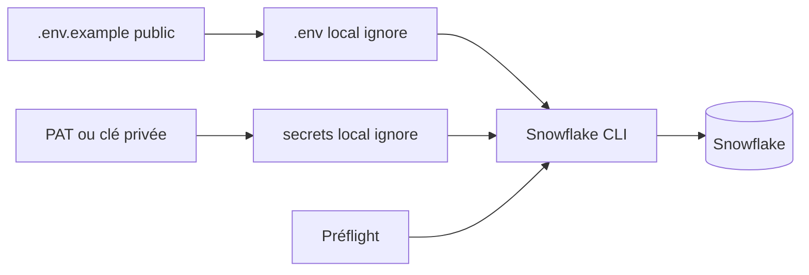

# Cours M0 — Préparation de l’environnement

**Durée : 10 minutes**

## Pourquoi cette capacité existe

Un lab échoue souvent avant le premier exercice à cause d’un PATH différent, d’un mauvais compte, d’un rôle trop faible, d’un secret exposé ou d’une action administrative non prévue. Le Day 0 établit un poste vérifiable et une frontière claire entre configuration publique, credential local et ressource distante.

## Objectifs

- distinguer identifiant, configuration et secret;
- choisir le scénario sandbox ou Trial;
- comparer PAT de démarrage et JWT key-pair de production;
- expliquer pourquoi un préflight doit être non destructif;
- produire une preuve de readiness sans exposer de credential.

## Modèle mental

- `.env.example` décrit les noms attendus et reste versionné;
- `.env` contient les identifiants propres au participant et reste local;
- `secrets/` contient les credentials et reste local;
- Snowflake CLI référence ces informations sans les afficher;
- le préflight vérifie l’état mais ne crée ni utilisateur ni policy.

## Sandbox versus Trial

| Dimension | Sandbox | Trial personnel |
|---|---|---|
| Administration | formateur/équipe plateforme | apprenant propriétaire |
| Identité initiale | fournie et limitée | utilisateur du compte Trial |
| Credential | PAT temporaire fourni | PAT créé par l’apprenant |
| Préfixe | imposé par participant | choisi et conservé |
| Cleanup | politique de session | responsabilité de l’apprenant |

Les deux scénarios convergent vers une connexion `terraform_svc` utilisable par les labs. Le nom est une convention locale; il ne garantit pas que l’utilisateur distant porte le même nom.

## PAT versus JWT

| Méthode | Usage dans le parcours | Limites |
|---|---|---|
| PAT | démarrage rapide en sandbox/Trial | expiration, stockage et politiques de compte |
| JWT key-pair | cible production et CI/CD, étudiée au Jour 4 | génération, attribution et rotation des clés |

Un PAT ne « contourne » pas la sécurité : il constitue un credential programmatique soumis aux politiques du compte. Une network policy globale ne doit pas être créée automatiquement. Si le compte l’exige, l’administrateur fournit une policy restreinte ou un mécanisme temporaire approuvé.

## Training versus Production

| Dimension | Training | Production |
|---|---|---|
| Credential | PAT temporaire ou Trial | key-pair/OAuth selon standard entreprise |
| Stockage | fichier local ignoré et permissions limitées | secret manager et rotation |
| Rôle | droits bornés au lab | moindre privilège et séparation des responsabilités |
| Validation | préflight local + test de connexion | contrôle continu, audit et alerting |

## Règles à retenir

1. ne jamais afficher ou committer un credential;
2. vérifier le répertoire avant une commande;
3. séparer validation locale et changement distant;
4. ne pas utiliser `ACCOUNTADMIN` comme correction générique;
5. diagnostiquer un contrôle à la fois et reprendre au dernier checkpoint.
