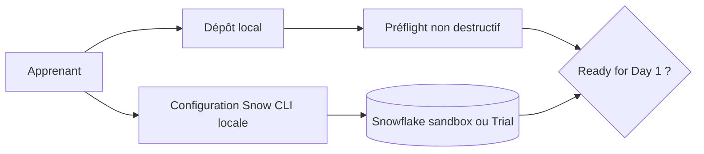

# Lab M0 — Préparer un environnement sans panique

| Élément | Valeur |
|---|---|
| **Durée** | 1 h 00, après installation des outils |
| **Piste** | `[CORE]` |
| **OS** | Windows/PowerShell ou Linux/macOS/Bash |
| **Scénarios** | Sandbox préprovisionnée ou Snowflake Trial personnel |
| **Résultat** | `Ready for Day 1` |
| **Action distante** | Test de connexion uniquement |

## Navigation

**Point de départ :** [Jour 0 — Commencer ici](../README.md)

**Étape précédente :** [Installer et vérifier les outils](../module-00-tools-setup/lab.md)

**Aide :** [Troubleshooting](troubleshooting.md) · [Résultats attendus](expected-output.md)

### Votre progression

- [ ] Partie 1 — choisir Sandbox ou Trial;
- [ ] Partie 2 — confirmer le dépôt;
- [ ] Partie 3 — confirmer les outils;
- [ ] Partie 4 — créer `.env` sans secret;
- [ ] Partie 5 — configurer et tester Snowflake CLI;
- [ ] Partie 6 — obtenir `Ready for Day 1`;
- [ ] Partie 7 — créer et valider le workspace M00.

> Ne sautez pas un checkpoint. En cas d’erreur, corrigez uniquement l’étape courante puis reprenez ici.

## Mission

Vous devez préparer un poste reproductible sans placer de secret dans Git. Le Day 0 sépare volontairement :

1. la vérification locale, non destructive;
2. la configuration d’une connexion Snowflake par l’apprenant;
3. les opérations administratives éventuelles, réalisées selon le scénario choisi;
4. la validation finale commune.

Le script `Setup-Day0` n’installe rien et ne modifie aucune ressource. Il ne fait ni `git pull`, ni création d’utilisateur, ni modification de network policy.

## Architecture



## Objectifs

- vérifier Git, Terraform et Snowflake CLI;
- créer une configuration locale à partir d’un template public;
- protéger `.env`, PAT, clés et artefacts Terraform;
- tester une connexion sans afficher le credential;
- créer un workspace M00 presque vide;
- produire un rapport de readiness.

## Partie 1 — Identifier votre scénario

### Scénario A — Sandbox

Le formateur fournit hors Git :

- organization et account;
- utilisateur/connexion à utiliser;
- PAT temporaire ou procédure d’activation;
- préfixe individuel;
- date d’expiration et procédure de reset.

Vous ne créez pas de network policy, d’utilisateur global ou de rôle élevé sans consigne explicite du formateur.

### Scénario B — Trial personnel

Vous êtes propriétaire du compte Trial. Vous configurez d’abord une connexion PAT personnelle. La création d’une identité de service et JWT sera pratiquée au Jour 4, après l’apprentissage du RBAC.

> `[SECURITY]` N’utilisez pas un mot de passe dans un fichier du dépôt. Ne partagez jamais un PAT, une clé privée ou le contenu complet de `config.toml`.

## Partie 2 — Obtenir le dépôt

Si le dépôt est déjà ouvert, restez à sa racine et n’exécutez pas de `git pull` automatique.

**[WINDOWS]**

```powershell
Get-Location
git status --short
```

**[UNIX]**

```bash
pwd
git status --short
```

**[CHECK]** Le chemin se termine par `Snowflake-terraform`. Les modifications éventuellement affichées ne doivent pas être supprimées.

Pour une première installation seulement, clonez l’URL communiquée par le formateur dans un dossier de votre choix, puis ouvrez ce dossier. Le lab ne suppose aucune URL de dépôt codée en dur.

## Partie 3 — Vérifier les outils

### Windows

```powershell
git --version
terraform version
snow --version
$PSVersionTable.PSVersion
```

### Linux/macOS

```bash
git --version
terraform version
snow --version
bash --version
```

Attendu : chaque commande se termine sans erreur. VS Code est recommandé mais un autre éditeur est accepté.

Si un outil manque, utilisez la procédure officielle adaptée à votre OS, ouvrez un nouveau terminal, puis rejouez uniquement ces quatre commandes. N’installez pas Snowflake CLI dans le Python global d’une machine d’entreprise si votre politique exige un environnement isolé.

## Partie 4 — Créer la configuration publique locale

Le dépôt fournit `.env.example`, qui ne contient aucun secret.

**[WINDOWS]**

```powershell
Copy-Item .env.example .env
code .env
```

**[UNIX]**

```bash
cp .env.example .env
${EDITOR:-code} .env
```

Renseignez les identifiants non secrets correspondant à votre scénario :

```text
TRAINING_ACCESS_SCENARIO=SANDBOX
SNOWFLAKE_ORGANIZATION=<organization>
SNOWFLAKE_ACCOUNT=<account>
SNOWFLAKE_ADMIN_USER=<user-provided-for-your-scenario>
SNOWFLAKE_TERRAFORM_USER=TERRAFORM_SVC
SNOWFLAKE_ROLE=SYSADMIN
SNOWFLAKE_ADMIN_CONNECTION=admin
SNOWFLAKE_TERRAFORM_CONNECTION=terraform_svc
SNOWFLAKE_AUTH_MODE=PAT
TRAINING_NETWORK_ALLOWED_IPS=<your-public-ip>/32
ENVIRONMENT=DEV
TEAM=DATA_ENG
```

Remplacez tous les `<...>`. Ne placez pas le PAT dans `.env`.

### Checkpoint — Git ignore

**[WINDOWS et UNIX]**

```text
git check-ignore .env
git check-ignore secrets/probe.token
```

Attendu : `.env` puis `secrets/probe.token`. Si une commande ne renvoie rien, arrêtez-vous et corrigez `.gitignore`.

## Partie 5 — Configurer Snowflake CLI

Créez d’abord le dossier local protégé.

**[WINDOWS]**

```powershell
New-Item -ItemType Directory -Path secrets -Force | Out-Null
```

**[UNIX]**

```bash
mkdir -p secrets
chmod 700 secrets
```

### Piste sandbox

Suivez le mécanisme fourni par le formateur. En général, vous enregistrez le PAT temporaire dans `secrets/snowflake_terraform_pat.txt`, puis créez une connexion nommée `terraform_svc`.

### Piste Trial

Dans Snowsight, créez un PAT pour votre utilisateur selon la procédure disponible dans votre compte. Copiez-le une seule fois dans `secrets/snowflake_terraform_pat.txt`.

> N’écrivez pas une commande contenant directement le token : elle pourrait rester dans l’historique du shell.

Ajoutez ensuite la connexion. Remplacez les valeurs `<...>` par celles de `.env`; ne remplacez jamais le chemin `-t` par le token lui-même.

**[WINDOWS]**

```powershell
snow connection add -n terraform_svc `
  -a "<account>" `
  -h "<organization>-<account>.snowflakecomputing.com" `
  -u "<user>" `
  -r "<role>" `
  -A "PROGRAMMATIC_ACCESS_TOKEN" `
  -t "$PWD\secrets\snowflake_terraform_pat.txt" `
  --no-interactive
```

**[UNIX]**

```bash
snow connection add -n terraform_svc \
  -a "<account>" \
  -h "<organization>-<account>.snowflakecomputing.com" \
  -u "<user>" \
  -r "<role>" \
  -A "PROGRAMMATIC_ACCESS_TOKEN" \
  -t "$PWD/secrets/snowflake_terraform_pat.txt" \
  --no-interactive
```

Si votre version de Snowflake CLI refuse une option, exécutez `snow connection add --help` et comparez les noms `--authenticator` et `--token-file-path`. Ne basculez pas vers un mot de passe.

### Checkpoint — Connexion

```text
snow connection test -c terraform_svc
snow sql -c terraform_svc -q "SELECT CURRENT_USER(), CURRENT_ROLE(), CURRENT_ACCOUNT()"
```

Attendu : `Connection status: OK` et les identifiants correspondant à votre scénario. La sortie ne doit pas afficher le PAT.

## Partie 6 — Exécuter le préflight non destructif

### Windows

```powershell
.\scripts\Setup-Day0.ps1 -AccessScenario SANDBOX -Connection terraform_svc
```

Pour un Trial, remplacez `SANDBOX` par `TRIAL`.

### Linux/macOS

```bash
bash ./scripts/setup-day0.sh --scenario SANDBOX --connection terraform_svc
```

Pour vérifier uniquement le poste avant de recevoir les accès :

```text
# Windows
.\scripts\Setup-Day0.ps1 -AccessScenario SANDBOX -SkipSnowflake

# Linux/macOS
bash ./scripts/setup-day0.sh --scenario SANDBOX --skip-snowflake
```

Attendu final :

```text
Ready for Day 1
```

## Partie 7 — Créer le workspace M00

Le workspace est créé hors du dépôt, dans `$HOME/Data2AI-Labs`, afin qu’un `git init` pédagogique ne modifie pas les branches du dépôt de formation.

### Windows

```powershell
.\scripts\New-StudentWorkspace.ps1 -Module 0 -Initials ABC
.\scripts\SelfPacedLab.ps1 -Module 0 -All -Report
```

### Linux/macOS

```bash
bash ./scripts/new-student-workspace.sh --module 0 --initials ABC
bash ./scripts/self-paced-lab.sh --module 0 --all --report
```

Remplacez `ABC` par vos initiales, en deux à quatre lettres majuscules.

Structure attendue :

```text
$HOME/Data2AI-Labs/
└── module-00-environment/
    ├── .git/
    ├── .gitignore
    ├── .student-workspace.json
    └── README.md
```

Le rapport contient uniquement PASS/FAIL. Il ne contient aucun secret.

## Validation finale

- [ ] Git, Terraform et Snowflake CLI sont disponibles;
- [ ] `.env` ne contient plus de placeholder;
- [ ] `.env` et `secrets/` sont ignorés;
- [ ] `snow connection test -c terraform_svc` réussit;
- [ ] le préflight affiche `Ready for Day 1`;
- [ ] le workspace M00 se trouve hors du dépôt;
- [ ] le validateur M00 réussit;
- [ ] aucun secret n’apparaît dans `git status`.

## Challenge

Expliquez, sans montrer votre configuration :

1. où se trouve votre workspace;
2. quel scénario vous utilisez;
3. comment le PAT reste hors Git;
4. quelle commande prouve la connexion;
5. pourquoi le Day 0 ne crée pas encore `TERRAFORM_SVC` ou une network policy globale.

## Cleanup

Aucune ressource Snowflake ou Cloud n’est créée par le préflight. À la fin d’une sandbox, suivez la date d’expiration du formateur. Pour un Trial personnel, conservez la connexion jusqu’au Jour 5 puis révoquez le PAT lors du cleanup final.

Ne supprimez pas un workspace existant. Pour recommencer, choisissez un autre `-WorkspaceRoot` ou `--workspace-root`.
