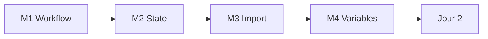

# Jour 1 — Fondations, State, Import

**Objectif :** Maitriser le cycle de vie Terraform et securiser le socle technique.

> [<- Catalogue](../README.md) · [Jour 0](../day-00/README.md) · **Jour 1** · [Jour 2 ->](../day-02/README.md)

## Progression



## Modules

| Module | Duree | Lab | Course | Troubleshooting | Resultat attendu |
|---|---:|---|---|---|---|
| [M1 — IaC Workflow](module-01-iac-workflow/lab.md) | 1h30 | [lab](module-01-iac-workflow/lab.md) | [cours](module-01-iac-workflow/course.md) | [guide](module-01-iac-workflow/troubleshooting.md) | [output](module-01-iac-workflow/expected-output.md) |
| [M2 — State Management](module-02-state-management/lab.md) | 2h | [lab](module-02-state-management/lab.md) | [cours](module-02-state-management/course.md) | [guide](module-02-state-management/troubleshooting.md) | [output](module-02-state-management/expected-output.md) |
| [M3 — Import Brownfield](module-03-import-brownfield/lab.md) | 2h | [lab](module-03-import-brownfield/lab.md) | [cours](module-03-import-brownfield/course.md) | [guide](module-03-import-brownfield/troubleshooting.md) | [output](module-03-import-brownfield/expected-output.md) |
| [M4 — Variables & Outputs](module-04-variables-outputs/lab.md) | 1h30 | [lab](module-04-variables-outputs/lab.md) | [cours](module-04-variables-outputs/course.md) | [guide](module-04-variables-outputs/troubleshooting.md) | [output](module-04-variables-outputs/expected-output.md) |

## Workflow du jour

1. **Lisez** le `course.md` du module (concepts, 15-20 min)
2. **Realisez** le `lab.md` pas a pas ( Création de fichiers, execution, checkpoints )
3. **Comparez** avec `expected-output.md`
4. **Consultez** `troubleshooting.md` en cas d'erreur
5. **Passez** au module suivant

> Tous les fichiers `.tf` que vous crerez iront dans `$HOME/Data2AI-Labs/data-platform/environments/dev/`.

> `[WINDOWS]` Si l'execution de scripts `.ps1` est bloquee, autorisez les scripts locaux :
> ```powershell
> Set-ExecutionPolicy -Scope CurrentUser -ExecutionPolicy RemoteSigned
> ```

## Livrable du jour

Database, schema et warehouse Snowflake cres par un projet ecrit par l'apprenant.
State distant sur Azure Blob Storage avec locking natif.
Ressource brownfield importee sans recreation.

## Navigation

[<- Catalogue](../README.md) · [Jour 0](../day-00/README.md) · **Jour 1** · [Jour 2 ->](../day-02/README.md)
