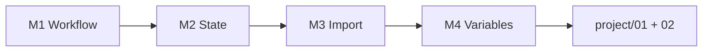

# Jour 1 — Fondations, State, Import

**Objectif :** Maîtriser le cycle de vie Terraform et sécuriser le socle technique.

| Module | Durée | Pistes | Code |
|--------|-------|--------|------|
| [M1 IaC Workflow](module-01-iac-workflow/) | 1h30 | `[CORE]` | `project/01-day1-basics` |
| [M2 State](module-02-state-management/) | 2h | `[CORE]` + `[COLLAB]` | `project/02-day1-state` |
| [M3 Import](module-03-import-brownfield/) | 2h | `[CORE]` | `project/01-day1-basics` |
| [M4 Variables](module-04-variables-outputs/) | 1h30 | `[CORE]` | `project/01-day1-basics` |

