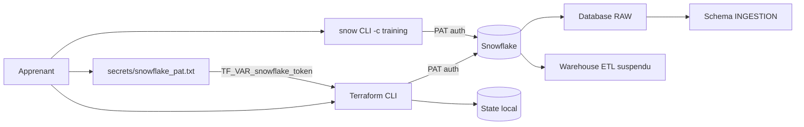
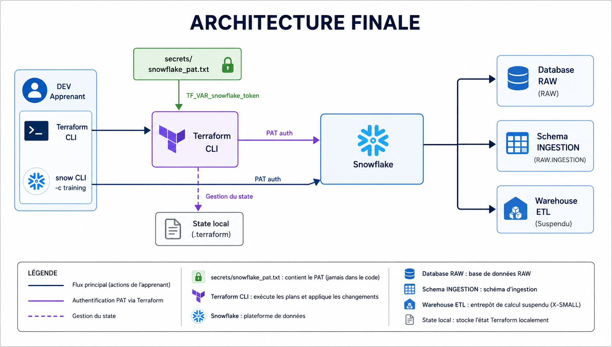
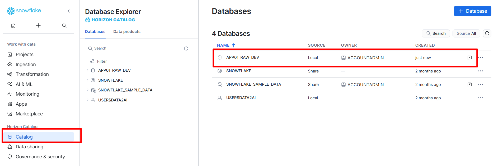
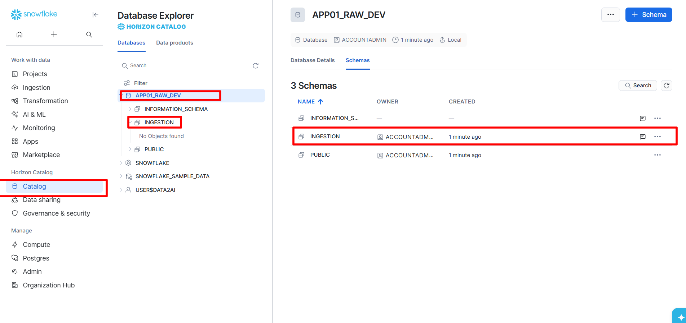
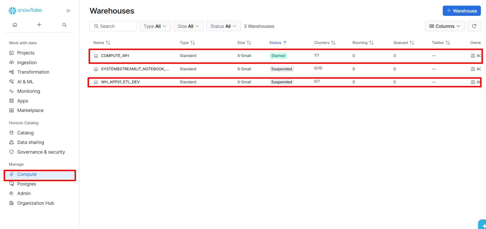

# 🧪 Lab M1 — Créer votre premier projet Terraform Snowflake

| Élément | Valeur |
|---|---|
| **Durée** | 3 heures |
| **Piste** | `[CORE]` |
| **Workspace** | `$HOME/Data2AI-Labs/data-platform` (le clone du Jour 0) |
| **Dossier de travail** | `environments/dev/` dans le clone |
| **Coût** | Warehouse X-SMALL, initialement suspendu |
| **Cleanup** | Conserver jusqu'au début du Jour 2 |

## 🎯 Mission

Vous êtes Data Platform Engineer. Votre équipe vous demande une zone RAW minimale composée d'une database, d'un schema d'ingestion et d'un warehouse économique. Le changement doit être relisible avant exécution et reproductible sans exposer de credential.

## 🏗️ Architecture finale





## 🎯 Objectifs

- ✅ créer une configuration Terraform depuis le clone du projet type;
- ✅ authentifier le provider Snowflake avec un PAT sans placer de secret dans le code;
- ✅ expliquer les blocs `terraform`, `required_providers`, `provider` et `resource`;
- ✅ lire un plan avant application;
- ✅ prouver la création des trois ressources;
- ✅ vérifier l'idempotence avec un second plan.

## 📋 Prérequis

- [ ] Jour 0 terminé : `Toolchain status: READY`;
- [ ] `snow sql -q 'SELECT 1' -c training` réussit;
- [ ] le clone `data-platform-starter` existe sous `$HOME/Data2AI-Labs/data-platform`;
- [ ] vous connaissez votre préfixe unique (variable `LEARNER_PREFIX` dans `.env`).

## 📝 Partie 1 — Se placer dans le bon dossier

Tous les fichiers de M1 vont dans `environments/dev/` du clone.

<details>
<summary>🪟 <b>Windows (PowerShell)</b></summary>

```powershell
cd "$HOME\Data2AI-Labs\data-platform"
cd environments\dev
```
</details>

<details>
<summary>🐧 <b>Linux/macOS (Bash)</b></summary>

```bash
cd $HOME/Data2AI-Labs/data-platform
cd environments/dev
```
</details>

Vérifiez que le dossier contient uniquement les fichiers d'exemple :

<details>
<summary>🪟 <b>Windows (PowerShell)</b></summary>

```powershell
Get-ChildItem -Force
```
</details>

<details>
<summary>🐧 <b>Linux/macOS (Bash)</b></summary>

```bash
ls -la
```
</details>

✅ **Checkpoint 1** : `README.md`, `backend.hcl.example`, `terraform.tfvars.example`. Aucun fichier `.tf`.

## 📝 Partie 2 — Déclarer Terraform et le provider

### 📝 Étape 2.1 — Créer `versions.tf`

<details>
<summary>🪟 <b>Windows (PowerShell)</b></summary>

```powershell
New-Item -ItemType File -Path versions.tf
code versions.tf
```
</details>

<details>
<summary>🐧 <b>Linux/macOS (Bash)</b></summary>

```bash
touch versions.tf
code versions.tf
```
</details>

Ajoutez :

```hcl
terraform {
  required_version = "= 1.14.5"

  required_providers {
    snowflake = {
      source  = "snowflakedb/snowflake"
      version = "= 2.14.0"
    }
  }
}
```

- `required_version` épingle exactement la version Terraform de la politique;
- `source` identifie le provider officiel;
- `= 2.14.0` épingle exactement la version du provider, sans accepter de correctif non testé.

> 💡 **Note** : Pourquoi pas `~> 2.14.0` ? Voir [docs/version-policy.md](../../docs/version-policy.md). Une contrainte souple autorise des versions différentes entre apprenants.

### 📝 Étape 2.2 — Créer `provider.tf`

```hcl
provider "snowflake" {
  organization_name = var.snowflake_organization
  account_name      = var.snowflake_account
  user              = var.snowflake_user
  authenticator     = "PROGRAMMATIC_ACCESS_TOKEN"
  token             = var.snowflake_token
}
```

- `organization_name` et `account_name` identifient le compte Snowflake (lus depuis `.env`) ;
- `authenticator = "PROGRAMMATIC_ACCESS_TOKEN"` indique au provider d'utiliser le PAT ;
- `token` reçoit la valeur du PAT, passée via la variable `snowflake_token` (jamais en clair dans le code).

> 🔒 **Security** : Le PAT est lu depuis le fichier `secrets/snowflake_pat.txt` créé au Jour 0 et passé via `TF_VAR_snowflake_token`. Aucun secret n'est écrit dans un fichier `.tf`.

### 📝 Étape 2.3 — Formater et valider

```powershell
terraform fmt
terraform init
terraform validate
```

✅ **Checkpoint 2** : `The configuration is valid.`

## 📝 Partie 3 — Créer les variables et les noms

### 📝 Étape 3.1 — Créer `variables.tf`

```hcl
variable "snowflake_organization" {
  type        = string
  description = "Snowflake organization name (from .env)"
}

variable "snowflake_account" {
  type        = string
  description = "Snowflake account name (from .env)"
}

variable "snowflake_user" {
  type        = string
  description = "Snowflake user name (from .env)"
}

variable "snowflake_token" {
  type        = string
  description = "Snowflake PAT (read from secrets/snowflake_pat.txt)"
  sensitive   = true
}

variable "learner_prefix" {
  type        = string
  description = "Unique uppercase prefix assigned to the learner"

  validation {
    condition     = can(regex("^[A-Z][A-Z0-9]{2,4}$", var.learner_prefix))
    error_message = "learner_prefix must contain 3-5 uppercase letters or digits."
  }
}

variable "environment" {
  type        = string
  description = "Deployment environment"
  default     = "DEV"

  validation {
    condition     = contains(["DEV", "UAT", "PROD"], var.environment)
    error_message = "environment must be DEV, UAT or PROD."
  }
}

variable "warehouse_size" {
  type        = string
  description = "Training warehouse size"
  default     = "X-SMALL"

  validation {
    condition     = contains(["X-SMALL", "SMALL"], var.warehouse_size)
    error_message = "Training warehouses must be X-SMALL or SMALL."
  }
}
```

Les validations empêchent les noms non conformes et les warehouses trop grands pour ce lab.

### 📝 Étape 3.2 — Créer `locals.tf`

```hcl
locals {
  database_name  = "${var.learner_prefix}_RAW_${var.environment}"
  schema_name    = "INGESTION"
  warehouse_name = "WH_${var.learner_prefix}_ETL_${var.environment}"
  common_comment = "Managed by Terraform | Training | ${var.learner_prefix}"
}
```

### 📝 Étape 3.3 — Créer `terraform.tfvars`

```hcl
snowflake_organization = "ZVFXOZW"
snowflake_account      = "PM71247"
snowflake_user         = "DATA2AI"
learner_prefix         = "ABC"
environment            = "DEV"
warehouse_size         = "X-SMALL"
```

Remplacez `ABC` par votre préfixe (celui de votre `.env`). Adaptez les valeurs Snowflake à votre `.env` si nécessaire. Le fichier est ignoré par Git.

> ⚠️ **IMPORTANT** : Terraform lit les variables depuis `terraform.tfvars`, **pas** depuis `.env`.
> Si vous changez votre `LEARNER_PREFIX` dans `.env`, vous devez **aussi** le changer dans
> `terraform.tfvars`. Sinon le plan utilisera l'ancien préfixe.

> 💡 **Note** : La variable `snowflake_token` (le PAT) n'est **pas** dans `terraform.tfvars`. Elle est passée via une variable d'environnement pour éviter de la stocker en clair (voir Étape 5.1).

### 📝 Étape 3.4 — Formater et valider

```powershell
terraform fmt
terraform validate
```

✅ **Checkpoint 3** : `The configuration is valid.`

## 📝 Partie 4 — Créer les ressources

### 📝 Étape 4.1 — Créer `main.tf`

```hcl
resource "snowflake_database" "raw" {
  name                        = local.database_name
  comment                     = local.common_comment
  data_retention_time_in_days = 1
}

resource "snowflake_schema" "ingestion" {
  database = snowflake_database.raw.name
  name     = local.schema_name
  comment  = local.common_comment
}

resource "snowflake_warehouse" "etl" {
  name                = local.warehouse_name
  comment             = local.common_comment
  warehouse_size      = var.warehouse_size
  auto_suspend        = 60
  auto_resume         = true
  initially_suspended = true
}
```

La référence `snowflake_database.raw.name` crée une dépendance implicite : Terraform doit créer la database avant son schema. Le warehouse est indépendant et peut être créé en parallèle.

### 📝 Étape 4.2 — Créer `outputs.tf`

```hcl
output "database_name" {
  value       = snowflake_database.raw.name
  description = "Database created by the learner"
}

output "schema_name" {
  value       = snowflake_schema.ingestion.name
  description = "Schema created inside the database"
}

output "warehouse_name" {
  value       = snowflake_warehouse.etl.name
  description = "Cost-controlled training warehouse"
}
```

### 📝 Étape 4.3 — Formater et valider

```powershell
terraform fmt
terraform validate
```

✅ **Checkpoint 4** : `The configuration is valid.`

## 📝 Partie 5 — Planifier sans modifier

### 📝 Étape 5.1 — Charger le PAT dans l'environnement

Le PAT ne doit pas être dans `terraform.tfvars`. On le charge depuis le fichier créé au Jour 0 :

<details>
<summary>🪟 <b>Windows (PowerShell)</b></summary>

```powershell
$env:TF_VAR_snowflake_token = (Get-Content ..\..\secrets\snowflake_pat.txt -Raw).Trim()
```
</details>

<details>
<summary>🐧 <b>Linux/macOS (Bash)</b></summary>

```bash
export TF_VAR_snowflake_token=$(cat ../../secrets/snowflake_pat.txt | tr -d '[:space:]')
```
</details>

> 🔒 **Security** : La variable d'environnement `TF_VAR_snowflake_token` est automatiquement lue par Terraform. Elle n'apparaît ni dans le code, ni dans les logs, ni dans le state.

### 📝 Étape 5.2 — Planifier

<details>
<summary>🪟 <b>Windows (PowerShell)</b></summary>

```powershell
terraform plan -out "m01.tfplan"
```
</details>

<details>
<summary>🐧 <b>Linux/macOS (Bash)</b></summary>

```bash
terraform plan -out=m01.tfplan
```
</details>

> 💡 **Note** : Sur PowerShell, utilisez `-out "m01.tfplan"` (espace + guillemets) au lieu de `-out=m01.tfplan` pour éviter une erreur de parsing.

Le plan attendu contient exactement :

- `snowflake_database.raw`;
- `snowflake_schema.ingestion`;
- `snowflake_warehouse.etl`.

Il doit afficher `3 to add`, aucune modification et aucune destruction.

> 🔒 **Security** : Le plan contient des données de configuration. Il est ignoré par `*.tfplan`. Ne le commitez pas.

✅ **Checkpoint 5** : `Plan: 3 to add, 0 to change, 0 to destroy.`

## 📝 Partie 6 — Appliquer après revue

Avant de continuer, relisez le plan et confirmez votre préfixe. L'application crée trois objets dans le compte Snowflake.

```powershell
terraform apply m01.tfplan
```

✅ **Checkpoint 6** :

```text
Apply complete! Resources: 3 added, 0 changed, 0 destroyed.
```

## 📝 Partie 7 — Prouver le résultat

### 🔍 Preuve Terraform

```powershell
terraform output
terraform state list
```

✅ **Checkpoint** : 3 ressources listées.

### 🔍 Preuve Snowflake (CLI)

La connexion `training` lit le PAT depuis le fichier automatiquement (configuré au Jour 0). Remplacez `ABC` par votre préfixe :

```powershell
snow sql -c training -q "SHOW DATABASES LIKE 'ABC_RAW_DEV'"
snow sql -c training -q "SHOW SCHEMAS LIKE 'INGESTION' IN DATABASE ABC_RAW_DEV"
snow sql -c training -q "SHOW WAREHOUSES LIKE 'WH_ABC_ETL_DEV'"
```

### 🔍 Preuve Snowflake (interface web)

Connectez-vous à l'interface Snowflake (https://app.snowflake.com) avec votre
**username + password individuel** (fourni par le formateur, différent du PAT).

Vérifiez que vos ressources apparaissent dans chaque section :

**1. Database** — Allez dans **Data > Databases** et cherchez votre database :



> La database `APP01_RAW_DEV` doit apparaître avec le schema `INGESTION`.

**2. Schema** — Cliquez sur votre database, puis vérifiez le schema :



> Le schema `INGESTION` doit exister sous votre database.

**3. Warehouse** — Allez dans **Admin > Warehouses** :



> Le warehouse `WH_APP01_ETL_DEV` doit apparaître avec le statut `Suspended` (initialement suspendu).

> 💡 **Note** : Remplacez `APP01` par votre `LEARNER_PREFIX`. Si les ressources n'apparaissent pas, vérifiez que vous êtes sur le bon compte Snowflake (organisation + account).

### 🔍 Preuve d'idempotence

```powershell
terraform plan
```

✅ **Checkpoint 7** : `No changes. Your infrastructure matches the configuration.`

## 🐛 Erreur contrôlée — Préfixe invalide

Dans `terraform.tfvars`, remplacez temporairement le préfixe par `abc-invalid`, puis exécutez :

```powershell
terraform validate
terraform plan
```

Le plan doit refuser la valeur avec le message de validation. Restaurez ensuite votre préfixe majuscule et rejouez `terraform plan`.

Cette erreur ne modifie aucune ressource distante.

## ✅ Validation finale

- [ ] structure conforme;
- [ ] formatage et syntaxe valides;
- [ ] plan conforme aux ressources annoncées;
- [ ] preuve fonctionnelle obtenue;
- [ ] second plan sans modification inattendue;
- [ ] aucun secret ou artefact interdit dans Git.

## 🏆 Challenge

Ajoutez un output `resource_summary` contenant les trois noms dans un objet :

```hcl
output "resource_summary" {
  value = {
    database  = snowflake_database.raw.name
    schema    = snowflake_schema.ingestion.name
    warehouse = snowflake_warehouse.etl.name
  }
}
```

Critères :

- [ ] `terraform fmt -check` réussit;
- [ ] `terraform validate` réussit;
- [ ] `terraform output resource_summary` affiche vos trois noms;
- [ ] `terraform plan` reste sans changement;
- [ ] aucun credential n'est présent dans les fichiers `.tf` ou `.tfvars`.

## 🎯 Point de reprise

Conservez le workspace et les ressources jusqu'au module State du Jour 2. Pour reprendre :

<details>
<summary>🪟 <b>Windows (PowerShell)</b></summary>

```powershell
cd "$HOME\Data2AI-Labs\data-platform\environments\dev"
$env:TF_VAR_snowflake_token = (Get-Content ..\..\secrets\snowflake_pat.txt -Raw).Trim()
terraform init
terraform plan
```
</details>

<details>
<summary>🐧 <b>Linux/macOS (Bash)</b></summary>

```bash
cd $HOME/Data2AI-Labs/data-platform/environments/dev
export TF_VAR_snowflake_token=$(cat ../../secrets/snowflake_pat.txt | tr -d '[:space:]')
terraform init
terraform plan
```
</details>

> ⚠️ **WARNING** : N'exécutez pas encore `terraform destroy` : le module suivant réutilise ces ressources pour expliquer le state, le drift et l'import.

## 🔧 Troubleshooting

| Symptôme | Cause | Solution |
|---|---|---|
| `Unsupported argument: connection_name` | Le provider 2.14.0 n'a pas d'argument `connection_name` | Utilisez `organization_name`, `account_name`, `user`, `authenticator`, `token` (voir Étape 2.2) |
| `Password is empty` | Le PAT n'est pas chargé dans l'environnement | Exécutez `TF_VAR_snowflake_token=...` (voir Étape 5.1) |
| `Invalid account identifier` | L'identifiant de compte est mal formé | Vérifiez `snowflake_organization` et `snowflake_account` dans `terraform.tfvars` |
| `Insufficient privileges` | Le rôle n'a pas les droits de création | Vérifiez que `SNOWFLAKE_ROLE=SYSADMIN` dans `.env` |
| `snow sql` échoue hors du script | La connexion `training` n'existe pas | Relancez `New-SnowflakeConnection.ps1` |
