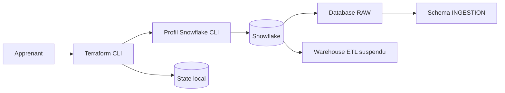

# Lab M1 — Créer votre premier projet Terraform Snowflake

| Élément | Valeur |
|---|---|
| **Durée** | 3 heures |
| **Piste** | `[CORE]` |
| **Workspace** | `$HOME/Data2AI-Labs/module-01-first-deployment` |
| **Point de départ** | README et `.gitignore` uniquement |
| **Coût** | Warehouse X-SMALL, initialement suspendu |
| **Cleanup** | Conserver jusqu’au début du Jour 2 |

## Mission

Vous êtes Data Platform Engineer. Votre équipe vous demande une zone RAW minimale composée d’une database, d’un schema d’ingestion et d’un warehouse économique. Le changement doit être relisible avant exécution et reproductible sans exposer de credential.

## Architecture finale



## Objectifs

- créer une configuration Terraform depuis un dossier presque vide;
- utiliser un profil Snowflake local sans placer de secret dans le code;
- expliquer les blocs `terraform`, `required_providers`, `provider` et `resource`;
- lire un plan avant application;
- prouver la création des trois ressources;
- vérifier l’idempotence avec un second plan.

## Prérequis

- [ ] M0 affiche `Ready for Day 1`;
- [ ] `snow connection test -c terraform_svc` réussit;
- [ ] vous connaissez votre préfixe unique de 2 à 12 caractères;
- [ ] le rôle associé au profil peut créer une database, un schema et un warehouse dans la sandbox/Trial.

## Partie 1 — Créer le workspace

Depuis la racine du dépôt de formation :

### Windows

```powershell
.\scripts\New-StudentWorkspace.ps1 -Module 1 -Initials ABC
Set-Location "$HOME\Data2AI-Labs\module-01-first-deployment"
Get-ChildItem -Force
```

### Linux/macOS

```bash
bash ./scripts/new-student-workspace.sh --module 1 --initials ABC
cd "$HOME/Data2AI-Labs/module-01-first-deployment"
ls -la
```

Remplacez `ABC` par vos initiales. Le workspace doit être hors du dépôt de formation.

```text
module-01-first-deployment/
├── .git/
├── .gitignore
├── .student-workspace.json
└── README.md
```

## Partie 2 — Déclarer Terraform et le provider

### Étape 2.1 — Créer `versions.tf`

Créez puis ouvrez le fichier.

**[WINDOWS]**

```powershell
New-Item -ItemType File -Path versions.tf
code versions.tf
```

**[UNIX]**

```bash
touch versions.tf
code versions.tf
```

Ajoutez :

```hcl
terraform {
  required_version = ">= 1.14.0, < 2.0.0"

  required_providers {
    snowflake = {
      source  = "snowflakedb/snowflake"
      version = "~> 2.14.0"
    }
  }
}
```

- `required_version` borne les versions Terraform compatibles;
- `source` identifie le provider officiel;
- `~> 2.14.0` accepte les correctifs 2.14.x, pas une version mineure suivante non testée.

### Étape 2.2 — Créer `provider.tf`

```hcl
provider "snowflake" {
  profile = var.snowflake_profile
}
```

Le profil est lu depuis la configuration locale Snowflake CLI. Aucun password, token ou private key n’est écrit dans ce projet.

### Checkpoint 1

Depuis la racine du dépôt de formation :

```text
# Windows
.\scripts\SelfPacedLab.ps1 -Module 1 -Task 1

# Linux/macOS
bash ./scripts/self-paced-lab.sh --module 1 --task 1
```

Attendu : quatre contrôles `PASS`.

## Partie 3 — Créer les variables et les noms

### Étape 3.1 — Créer `variables.tf`

```hcl
variable "snowflake_profile" {
  type        = string
  description = "Snowflake CLI profile configured during Module 00"
  default     = "terraform_svc"
}

variable "learner_prefix" {
  type        = string
  description = "Unique uppercase prefix assigned to the learner"

  validation {
    condition     = can(regex("^[A-Z][A-Z0-9_]{1,11}$", var.learner_prefix))
    error_message = "learner_prefix must contain 2-12 uppercase letters, digits, or underscores."
  }
}

variable "environment" {
  type        = string
  description = "Deployment environment"
  default     = "DEV"

  validation {
    condition     = contains(["DEV", "TEST"], var.environment)
    error_message = "environment must be DEV or TEST."
  }
}

variable "warehouse_size" {
  type        = string
  description = "Training warehouse size"
  default     = "X-SMALL"

  validation {
    condition     = contains(["X-SMALL", "SMALL"], var.warehouse_size)
    error_message = "Training warehouses must be X-SMALL or SMALL."
  }
}
```

Les validations empêchent les noms non conformes et les warehouses trop grands pour ce lab.

### Étape 3.2 — Créer `locals.tf`

```hcl
locals {
  database_name  = "${var.learner_prefix}_RAW_${var.environment}"
  schema_name    = "INGESTION"
  warehouse_name = "${var.learner_prefix}_ETL_${var.environment}"
  common_comment = "Managed by Terraform | Training | ${var.learner_prefix}"
}
```

### Étape 3.3 — Créer les valeurs locales

Créez `terraform.tfvars` :

```hcl
snowflake_profile = "terraform_svc"
learner_prefix    = "ABC"
environment       = "DEV"
warehouse_size    = "X-SMALL"
```

Remplacez `ABC` par votre préfixe. Le fichier est ignoré pour permettre une valeur propre à chaque apprenant. Il ne contient néanmoins aucun credential.

Créez aussi `terraform.tfvars.example` avec des valeurs génériques identiques. Ce fichier documente l’interface et peut être versionné.

### Checkpoint 2

```text
# Windows
.\scripts\SelfPacedLab.ps1 -Module 1 -Task 2

# Linux/macOS
bash ./scripts/self-paced-lab.sh --module 1 --task 2
```

## Partie 4 — Créer les ressources

### Étape 4.1 — Créer `main.tf`

```hcl
resource "snowflake_database" "raw" {
  name                        = local.database_name
  comment                     = local.common_comment
  data_retention_time_in_days = 1
}

resource "snowflake_schema" "ingestion" {
  database = snowflake_database.raw.name
  name     = local.schema_name
  comment  = local.common_comment
}

resource "snowflake_warehouse" "etl" {
  name                = local.warehouse_name
  comment             = local.common_comment
  warehouse_size      = var.warehouse_size
  auto_suspend        = 60
  auto_resume         = true
  initially_suspended = true
}
```

La référence `snowflake_database.raw.name` crée une dépendance implicite : Terraform doit créer la database avant son schema. Le warehouse est indépendant et peut être créé en parallèle.

### Étape 4.2 — Créer `outputs.tf`

```hcl
output "database_name" {
  value       = snowflake_database.raw.name
  description = "Database created by the learner"
}

output "schema_name" {
  value       = snowflake_schema.ingestion.name
  description = "Schema created inside the database"
}

output "warehouse_name" {
  value       = snowflake_warehouse.etl.name
  description = "Cost-controlled training warehouse"
}
```

### Checkpoint 3

```text
# Windows
.\scripts\SelfPacedLab.ps1 -Module 1 -Task 3

# Linux/macOS
bash ./scripts/self-paced-lab.sh --module 1 --task 3
```

Attendu : database, schema, dépendance implicite, warehouse économique et outputs détectés.

## Partie 5 — Formater, initialiser et valider

Depuis le workspace :

```text
terraform fmt
terraform init
terraform validate
```

`terraform init` crée `.terraform/` et `.terraform.lock.hcl`. Le dossier téléchargé reste ignoré; le lock file pourra être versionné dans un projet réel après revue.

### Checkpoint 4

```text
# Windows
.\scripts\SelfPacedLab.ps1 -Module 1 -Task 4

# Linux/macOS
bash ./scripts/self-paced-lab.sh --module 1 --task 4
```

Si `validate` échoue, ne passez pas directement à `plan`. Lisez le premier diagnostic, corrigez-le, puis rejouez uniquement ce checkpoint.

## Partie 6 — Planifier sans modifier

```text
terraform plan -out=m01.tfplan
terraform show -json m01.tfplan > m01.tfplan.json
```

Le plan attendu contient exactement :

- `snowflake_database.raw`;
- `snowflake_schema.ingestion`;
- `snowflake_warehouse.etl`.

Il doit afficher `3 to add`, aucune modification et aucune destruction.

### Checkpoint 5

```text
# Windows
.\scripts\SelfPacedLab.ps1 -Module 1 -Task 5

# Linux/macOS
bash ./scripts/self-paced-lab.sh --module 1 --task 5
```

> `[SECURITY]` Le plan JSON peut contenir des données de configuration. Il est ignoré par `*.tfplan`, mais `m01.tfplan.json` doit aussi rester local; ne le commitez pas.

## Partie 7 — Appliquer après revue

Avant de continuer, relisez le plan et confirmez votre préfixe. L’application crée trois objets dans le compte associé au profil.

```text
terraform apply m01.tfplan
```

Attendu :

```text
Apply complete! Resources: 3 added, 0 changed, 0 destroyed.
```

## Partie 8 — Prouver le résultat

### Preuve Terraform

```text
terraform output
terraform state list
```

### Preuve Snowflake

Remplacez `ABC` par votre préfixe :

```text
snow sql -c terraform_svc -q "SHOW DATABASES LIKE 'ABC_RAW_DEV'"
snow sql -c terraform_svc -q "SHOW SCHEMAS LIKE 'INGESTION' IN DATABASE ABC_RAW_DEV"
snow sql -c terraform_svc -q "SHOW WAREHOUSES LIKE 'ABC_ETL_DEV'"
```

### Preuve d’idempotence

```text
terraform plan
```

Attendu : `No changes`.

## Erreur contrôlée — Préfixe invalide

Dans `terraform.tfvars`, remplacez temporairement le préfixe par `abc-invalid`, puis exécutez :

```text
terraform validate
terraform plan
```

Le plan doit refuser la valeur avec le message de validation. Restaurez ensuite votre préfixe majuscule et rejouez `terraform plan`.

Cette erreur ne modifie aucune ressource distante.

## Challenge

Ajoutez un output `resource_summary` contenant les trois noms dans un objet :

```text
{
  database  = ...
  schema    = ...
  warehouse = ...
}
```

Critères :

- [ ] `terraform fmt -check` réussit;
- [ ] `terraform validate` réussit;
- [ ] `terraform output resource_summary` affiche vos trois noms;
- [ ] `terraform plan` reste sans changement;
- [ ] aucun credential n’est présent dans les fichiers `.tf` ou `.tfvars`.

## Point de reprise

Conservez le workspace et les ressources jusqu’au module State du Jour 2. Pour reprendre :

```text
cd $HOME/Data2AI-Labs/module-01-first-deployment
snow connection test -c terraform_svc
terraform init
terraform plan
```

N’exécutez pas encore `terraform destroy` : le module suivant réutilise ces ressources pour expliquer le state, le drift et l’import.
