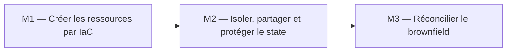
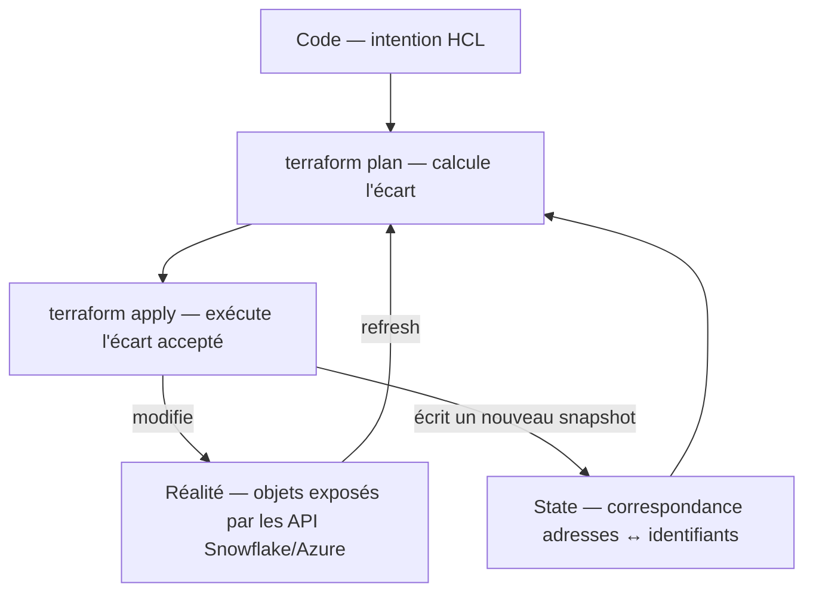
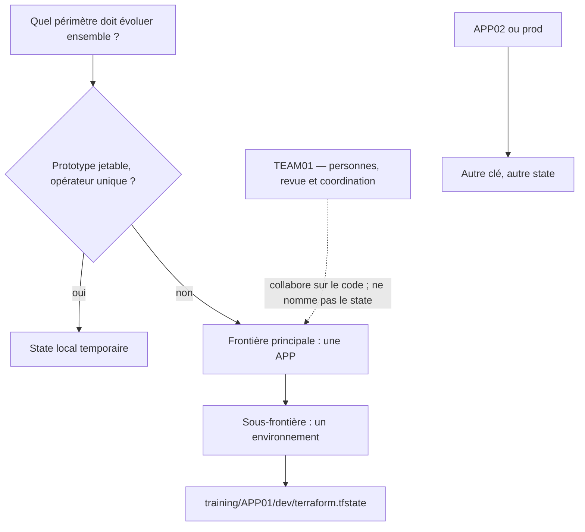
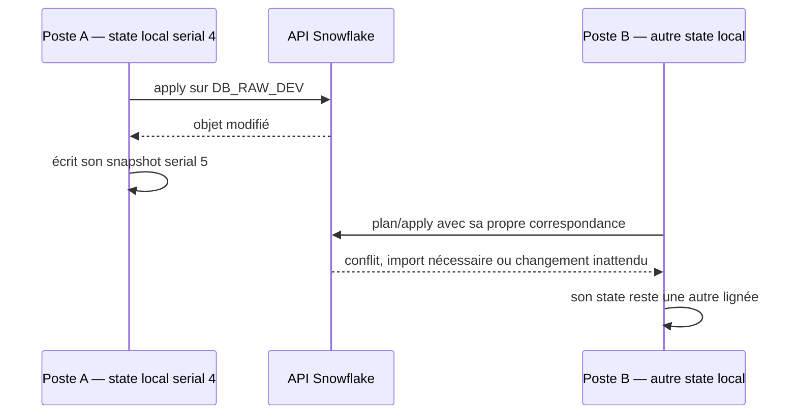
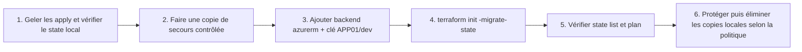
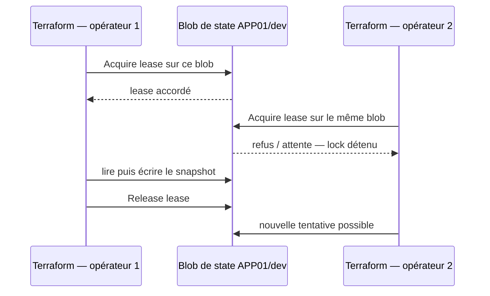
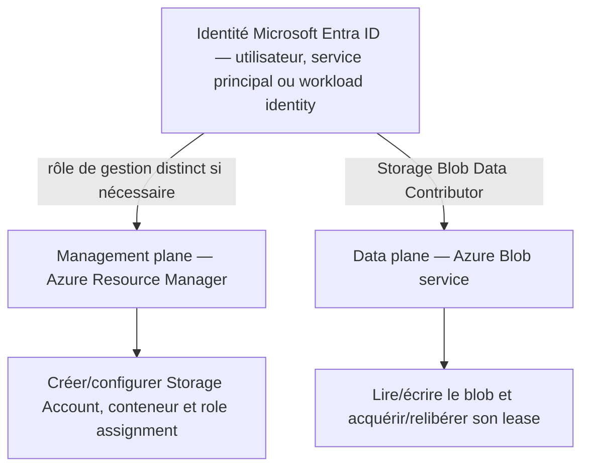
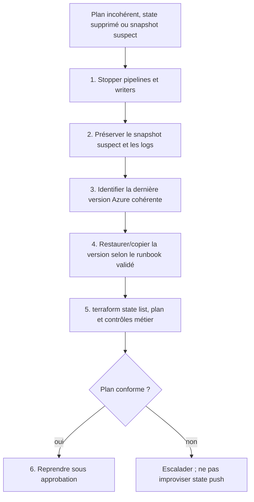
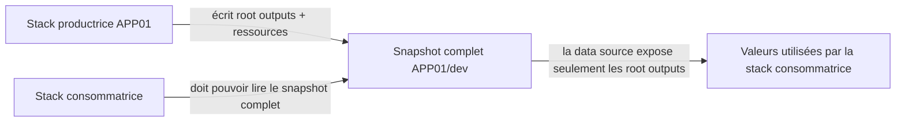
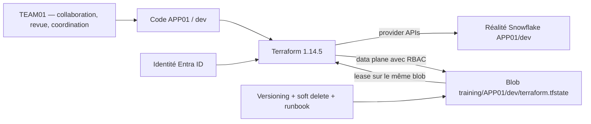

# Cours M2 — Sécuriser et partager le state Terraform

**Durée du module :** 2 h — 20 min de slides, 25 min d’explication/démonstration, 70 min de lab et 5 min de synthèse  
**Durée de lecture :** 25 min  
**Version Terraform :** `1.14.5` exactement  
**Piste :** `[CORE]`  
**Prérequis :** M1 terminé et `terraform state list` affiche les ressources Snowflake de `environments/dev/`

## Scénario professionnel

L’équipe `TEAM01` collabore sur le code de plusieurs applications. L’application `APP01` possède déjà des ressources Snowflake, mais son state est encore sur le poste d’un apprenant. Une perte du fichier, deux states concurrents ou un accès trop large peuvent provoquer une recréation, un écrasement ou une fuite d’informations.

La mission consiste à faire d’Azure Blob Storage la source de state distante de `APP01`, avec authentification Microsoft Entra ID, contrôle d’accès RBAC, verrouillage natif et capacité de restauration. Dans le modèle CORE, **`TEAM01` désigne uniquement le périmètre de collaboration** : ce n’est ni une application ni une clé de state.

## Objectifs mesurables

À l’issue de ce module, vous serez capable de :

- expliquer comment Terraform `1.14.5` rapproche configuration, state et réalité distante ;
- choisir une frontière de state par application et environnement ;
- justifier la clé CORE `training/APP01/dev/terraform.tfstate` sans la remplacer par une clé `TEAM01` ;
- distinguer Azure management plane et data plane, puis associer `Storage Blob Data Contributor` au besoin d’accès au blob ;
- migrer conceptuellement un state local avec `terraform init -migrate-state` et expliquer le locking par Azure Blob lease ;
- définir une stratégie de protection et de recovery vérifiable.

## Position dans le fil rouge



**Lecture du diagramme :** M1 produit des ressources et un premier state ; M2 sécurise cette mémoire avant que M3 ne traite des objets préexistants. L’ordre des flèches, et non une couleur, porte l’information.

## Modèle mental

Terraform ne se contente pas de relire le code. Il rapproche trois vues :



**Lecture du diagramme :** `plan` utilise l’intention, le snapshot courant et les lectures des API. `apply` agit sur la réalité puis écrit le state. Le state n’est donc ni le code source ni une sauvegarde complète des services distants : c’est la mémoire opérationnelle de Terraform.

Une adresse telle que `snowflake_database.raw` est associée à l’identifiant réel `DB_RAW_DEV`. Sans cette correspondance, une configuration identique ne suffit pas à prouver que Terraform gère déjà cet objet.

### Vocabulaire FR/EN

| Terme officiel | Explication dans ce cours |
|---|---|
| `state` | Mémoire de travail sérialisée par Terraform sous forme de snapshots. |
| `backend` | Composant qui stocke le state et, selon le backend, coordonne son locking. |
| `snapshot` | Version complète du state écrite à un instant donné. |
| `refresh` | Lecture des API pour actualiser la vision des objets gérés avant le calcul du plan. |
| `drift` | Écart entre la configuration attendue et la réalité distante. |
| `state locking` | Exclusion mutuelle empêchant deux opérations d’écrire simultanément le même state. |
| `Azure Blob lease` | Verrou temporaire porté par **le blob de state lui-même**. |
| `management plane` | API Azure Resource Manager qui crée/configure compte, conteneur et rôles. |
| `data plane` | API Blob qui lit, écrit, liste ou prend un lease sur les données. |
| `RBAC` | Autorisation Azure fondée sur des rôles et un scope. |
| `soft delete` | Conservation temporaire d’un blob supprimé ou remplacé selon la configuration Azure. |
| `terraform_remote_state` | Data source qui extrait des root outputs depuis un autre snapshot de state. |

## Concepts indispensables

### 1. Ce que contient un state — et pourquoi il est sensible

Un snapshot contient notamment :

- les adresses Terraform et les identifiants des objets réels ;
- des attributs retournés par les providers ;
- les dépendances matérialisées et les root outputs ;
- un `serial` qui progresse à l’écriture et un `lineage` qui identifie la lignée du state ;
- la version de Terraform qui l’a écrit.

Extrait pédagogique simplifié :

```json
{
  "version": 4,
  "terraform_version": "1.14.5",
  "serial": 3,
  "lineage": "abc-123-def",
  "outputs": {
    "database_name": {
      "value": "DB_RAW_DEV",
      "type": "string"
    }
  },
  "resources": []
}
```

Ne modifiez jamais ce JSON à la main. Utilisez les commandes Terraform adaptées :

| Commande | Usage prudent |
|---|---|
| `terraform state list` | Lister les adresses gérées. |
| `terraform state show ADDRESS` | Inspecter une adresse. |
| `terraform state mv SOURCE DESTINATION` | Déplacer/renommer une adresse sans recréer l’objet. |
| `terraform state rm ADDRESS` | Cesser de gérer un objet sans le détruire ; impact à valider. |
| `terraform state pull` | Lire le snapshot distant et l’envoyer vers la sortie standard ; attention aux données sensibles. |

> **Risque :** `sensitive = true` masque surtout l’affichage dans certaines sorties. La valeur peut toujours être présente dans le state. Le state doit être traité comme une donnée sensible.

### 2. Choisir la bonne frontière : local, APP, TEAM et environnement



**Lecture du diagramme :** le state local est réservé au cas temporaire et solitaire. Dans CORE, la frontière stable est l’application, puis l’environnement. `TEAM01` relie des personnes au workflow mais ne fusionne pas leurs applications. `APP02` ou `prod` doivent obtenir une autre clé.

Décision CORE pour ce module :

```text
training/APP01/dev/terraform.tfstate
```

À ne pas utiliser :

```text
training/TEAM01/dev/terraform.tfstate
```

Pourquoi isoler ?

- **Blast radius réduit :** une erreur sur `APP01/dev` ne verrouille ni ne modifie `APP02` ou `prod`.
- **Droits ciblables :** les accès peuvent être accordés au scope approprié.
- **Cycle de vie indépendant :** chaque application/environnement planifie et déploie séparément.
- **Plans lisibles :** moins de ressources sans relation transactionnelle dans un même state.

Une fragmentation extrême crée toutefois plus de backends, d’outputs à publier et de pipelines. La frontière doit suivre ce qui doit être planifié, verrouillé et appliqué ensemble — pas l’organigramme.

### 3. Pourquoi plusieurs states locaux divergent



**Lecture du diagramme :** les deux postes ne partagent ni `serial` ni `lineage`. La réalité Snowflake est unique, mais chaque opérateur prend des décisions depuis une mémoire différente. Copier périodiquement un fichier ne fournit ni exclusion mutuelle ni chaîne de recovery fiable.

### 4. Backend `azurerm` et migration contrôlée

La configuration doit annoncer Terraform `1.14.5` exactement et utiliser Microsoft Entra ID pour le data plane :

```hcl
terraform {
  required_version = "= 1.14.5"

  backend "azurerm" {
    resource_group_name  = "rg-training-tfstate"
    storage_account_name = "sttrainingtfstate"
    container_name       = "tfstate"
    key                  = "training/APP01/dev/terraform.tfstate"
    use_azuread_auth     = true
  }
}
```

Les blocs `backend` ne peuvent pas utiliser des variables Terraform ordinaires. Les noms peuvent être fournis par configuration partielle au moment de `init`, mais aucun secret ni access key ne doit être committé. Le bootstrap du compte de stockage et du conteneur précède nécessairement l’utilisation du backend ; en production, il appartient généralement à une stack ou une pipeline plateforme séparée.



**Lecture du diagramme :** la migration n’est pas un simple upload manuel. `terraform init -migrate-state` confie à Terraform la copie entre backends. La vérification précède tout nettoyage.

Commande centrale :

```powershell
terraform init -migrate-state
terraform state list
terraform plan
```

Précautions :

1. arrêter les écritures concurrentes ;
2. confirmer le workspace et la clé cible ;
3. conserver une copie de secours dans un emplacement protégé pendant la validation ;
4. répondre à l’invite de migration seulement après contrôle de la source et de la destination ;
5. vérifier les adresses et obtenir un plan conforme à l’intention.

Terraform peut créer un fichier de backup local dans certaines opérations, mais **aucune suppression automatique générale des anciens backups n’est garantie**. Les copies explicites, fichiers `.backup`, téléchargements et anciennes versions Azure ont chacun leur propre cycle de rétention. Ils doivent être inventoriés, protégés puis supprimés selon une politique définie.

### 5. Locking Azure : un lease sur le blob de state



**Lecture du diagramme :** Azure place le lease sur `training/APP01/dev/terraform.tfstate`. Il n’existe **ni conteneur de lock séparé ni blob de lock obligatoire**. Une clé différente possède son propre blob et son propre lease.

Le locking empêche deux écritures coordonnées par le même backend, mais ne remplace pas :

- les revues et contrôles de pipeline ;
- l’isolation des clés ;
- les sauvegardes et protections Azure ;
- la protection contre un acteur qui contourne Terraform ou dispose de droits excessifs.

`terraform force-unlock LOCK_ID` est une action d’urgence. Elle ne répare pas un state et peut autoriser deux writers si l’opération initiale fonctionne encore. Avant de l’utiliser, identifier le détenteur, confirmer l’arrêt du process/pipeline et conserver les preuves d’incident.

### 6. Microsoft Entra ID, RBAC et les deux planes Azure



**Lecture du diagramme :** une même identité peut appeler deux API, mais les autorisations ne sont pas interchangeables. `use_azuread_auth = true` demande au backend d’utiliser un token Microsoft Entra ID pour les opérations Blob. Le rôle `Storage Blob Data Contributor`, attribué au scope minimal approprié, autorise le travail sur les blobs et leurs leases ; il ne donne pas automatiquement le droit de créer le Storage Account, de modifier le réseau ou d’attribuer des rôles.

Conséquences pratiques :

- une identité avec `Contributor` sur le management plane ne reçoit pas nécessairement les droits data plane sur les blobs ;
- `Storage Blob Data Contributor` ne suffit pas à administrer l’infrastructure du compte ;
- la création d’un role assignment exige une permission de management plane dédiée, par exemple via une équipe plateforme ;
- la propagation RBAC n’est pas instantanée : un `403` juste après l’attribution peut nécessiter une attente et une nouvelle authentification ;
- une workload identity/OIDC ou une managed identity est préférable à un client secret durable dans une pipeline de production.

### 7. Versioning, soft delete et recovery

Le locking traite la concurrence ; le recovery traite la perte ou une écriture incorrecte. Il faut activer et tester les mécanismes Azure **avant** l’incident :

- **blob versioning** : conserve des versions précédentes lors des écritures ultérieures ;
- **soft delete for blobs** : conserve temporairement les objets supprimés/remplacés pendant la durée configurée ;
- éventuellement **container soft delete** selon le risque de suppression du conteneur ;
- journaux, alertes et rétention alignés avec les exigences de l’organisation.

Ces fonctions ne sont pas une garantie illimitée : elles dépendent de leur date d’activation, de leur configuration, de la durée de rétention et des actions d’administration. Elles ont aussi un coût de capacité et d’opérations.



**Lecture du diagramme :** la priorité est d’arrêter les écritures, préserver les preuves et sélectionner explicitement un snapshot connu. La reprise n’a lieu qu’après comparaison avec la réalité. `terraform state push` est un outil de dernier recours : une erreur de lignée ou de contenu peut aggraver l’incident.

Un runbook de production doit préciser : propriétaires, scopes RBAC d’urgence, RPO/RTO, durée de rétention, procédure Azure exacte, validation Snowflake, approbation à deux personnes et test périodique de restauration.

### 8. `terraform_remote_state` : pratique, mais accès large



**Lecture du diagramme :** l’interface HCL de `terraform_remote_state` expose uniquement les root outputs déclarés, mais le lecteur doit accéder au **snapshot complet** pour les extraire. Il peut donc potentiellement lire d’autres données sensibles présentes dans ce snapshot. Marquer un output `sensitive` ne transforme pas le snapshot en API à privilège minimal.

Décision recommandée :

- acceptable pour un exercice contrôlé ou entre stacks ayant exactement le même niveau de confiance ;
- en production, préférer publier explicitement les données nécessaires dans une interface dédiée : Azure App Configuration, Key Vault pour les secrets, DNS, catalogue ou autre service adapté ;
- si `terraform_remote_state` reste utilisé, limiter les root outputs, le scope RBAC et le nombre de lecteurs, puis auditer les accès.

## Architecture et flux



**Lecture du diagramme :** `TEAM01` collabore sur le code sans devenir une frontière de state. Terraform utilise l’identité Entra ID, pilote Snowflake via les provider APIs et accède au blob APP01/dev via le data plane. Le même blob porte le snapshot et son lease ; les politiques Azure ajoutent une capacité de recovery.

## Décisions d’architecture

| Décision | Choix du lab CORE | Alternative | Compromis |
|---|---|---|---|
| Frontière | Une APP et un environnement par state | State global d’équipe | Isolation et blast radius réduits, mais davantage de states. |
| Clé | `training/APP01/dev/terraform.tfstate` | Préfixe basé sur `TEAM01` | La clé reste stable si l’équipe change ; `TEAM01` reste un concept de collaboration. |
| Backend | Azure Blob avec `azurerm` | State local | Partage, durabilité et locking distant contre bootstrap et dépendance Azure. |
| Lock | Azure Blob lease sur le blob de state | Coordination humaine | Exclusion native, mais pas de protection contre tous les contournements. |
| Authentification | Microsoft Entra ID, `use_azuread_auth = true` | Storage access key/SAS | Identité et audit RBAC sans secret statique, avec dépendance à Entra ID et à la propagation RBAC. |
| Autorisation Blob | `Storage Blob Data Contributor` au scope minimal | Rôle large de subscription | Moindre privilège data plane ; droits management plane à traiter séparément. |
| Recovery | Versioning + soft delete + runbook testé | Copies manuelles seules | Restauration plus structurée, avec coût et politique de rétention à gouverner. |
| Partage de données | Interface dédiée en production | `terraform_remote_state` | Moindre exposition, au prix d’un composant de publication supplémentaire. |

## Training versus Production

| Dimension | Training | Production |
|---|---|---|
| Identité | Session Entra ID fournie au lab ; aucune key dans Git. | Workload identity/OIDC ou managed identity dédiée par pipeline et environnement. |
| Collaboration | `TEAM01` coordonne les apprenants. | Owners, pull requests, approvals et séparation des responsabilités. |
| State | Blob `training/APP01/dev/terraform.tfstate`. | Compte/conteneur gouverné, clés séparées par APP/env et blast radius documenté. |
| RBAC | `Storage Blob Data Contributor` au scope pédagogique minimal. | Scope minimal, groupes dédiés, accès d’urgence contrôlé, revues périodiques et logs. |
| Réseau | Accès compatible avec l’environnement de lab. | Public access désactivé selon architecture, firewall/private endpoint et DNS validés pour les runners. |
| Protection | Vérification des options disponibles dans le lab. | Versioning, soft delete, rétention, alertes et restauration régulièrement testée. |
| Déploiement | Commandes interactives et checkpoints manuels. | Pipeline sérialisée, policy checks, approvals et journalisation. |
| Partage d’outputs | `terraform_remote_state` peut illustrer le mécanisme. | Interface dédiée privilégiée ; accès au snapshot exceptionnel et audité. |
| Coût | Petit state sur stockage standard, conservé selon les consignes du lab. | Capacité des versions, rétention, réplication, réseau privé et logs budgétés. |

## Sécurité et coûts

- **Secret manipulé :** le state peut contenir des valeurs sensibles ; ne jamais le committer, l’afficher dans des logs ou le conserver dans un dossier partagé non protégé.
- **Privilège minimal :** `Storage Blob Data Contributor` pour le data plane du backend, au scope minimal ; les opérations du management plane requièrent des rôles séparés.
- **Authentification :** `use_azuread_auth = true` ; ne pas utiliser de Storage access key dans le code ou dans `backend.hcl`.
- **Réseau :** le runner doit joindre l’endpoint Blob autorisé ; une restriction réseau mal préparée peut bloquer `init`, `plan` et le recovery.
- **Ressource facturable :** capacité Blob, versions, snapshots, logs, opérations, réplication et private endpoints éventuels. Un state est petit, mais une rétention sans borne s’accumule.
- **Cleanup :** conserver le backend selon le fil rouge ; supprimer ensuite states, versions et copies de secours uniquement après validation et selon la politique. Ne jamais supposer qu’un ancien backup disparaît automatiquement.

## Préparation au lab

Avant de continuer, l’apprenant doit pouvoir expliquer :

1. pourquoi `TEAM01` collabore sur `APP01` sans devenir la clé du state ;
2. pourquoi la cible est exactement `training/APP01/dev/terraform.tfstate` ;
3. pourquoi le lease porte sur le blob de state et non sur un conteneur de lock séparé ;
4. pourquoi `Storage Blob Data Contributor` concerne le data plane et ne crée pas le Storage Account ;
5. pourquoi `terraform_remote_state` exige un accès au snapshot complet ;
6. quelles étapes précèdent une restauration ou un `force-unlock` d’urgence.

## Synthèse

- Le state relie les adresses du code aux identifiants de la réalité ; il est critique et potentiellement sensible.
- Dans CORE, isoler par APP puis environnement : `training/APP01/dev/terraform.tfstate`. `TEAM01` sert uniquement à la collaboration.
- Terraform `1.14.5` migre le state avec `terraform init -migrate-state` vers le backend `azurerm` authentifié par Microsoft Entra ID.
- Azure coordonne les writers par un lease sur le blob de state lui-même ; aucun conteneur de lock séparé n’est requis.
- `Storage Blob Data Contributor` autorise les opérations data plane ; management plane et data plane doivent être gouvernés séparément.
- Versioning, soft delete, rétention et runbook testé forment la stratégie de recovery ; les anciens backups ne sont pas supprimés automatiquement de manière garantie.
- `terraform_remote_state` expose des outputs, mais impose au lecteur l’accès au snapshot complet.
- Le lab produira un state distant isolé, un plan vérifié et des preuves de locking et d’accès.

## Références officielles

- HashiCorp — State: Purpose : https://developer.hashicorp.com/terraform/language/state/purpose
- HashiCorp — State locking : https://developer.hashicorp.com/terraform/language/state/locking
- HashiCorp — Backend `azurerm` et authentification Microsoft Entra ID : https://developer.hashicorp.com/terraform/language/backend/azurerm
- HashiCorp — Backend initialization et `-migrate-state` : https://developer.hashicorp.com/terraform/cli/commands/init
- HashiCorp — `terraform_remote_state` data source : https://developer.hashicorp.com/terraform/language/state/remote-state-data
- HashiCorp — Terraform CLI `1.14.x` documentation : https://developer.hashicorp.com/terraform/docs
- Microsoft — Authorize access to blobs using Microsoft Entra ID : https://learn.microsoft.com/azure/storage/blobs/authorize-access-azure-active-directory
- Microsoft — Azure built-in roles for blobs (`Storage Blob Data Contributor`) : https://learn.microsoft.com/azure/storage/blobs/assign-azure-role-data-access
- Microsoft — Blob versioning : https://learn.microsoft.com/azure/storage/blobs/versioning-overview
- Microsoft — Soft delete for blobs : https://learn.microsoft.com/azure/storage/blobs/soft-delete-blob-overview
- Microsoft — Lease Blob : https://learn.microsoft.com/rest/api/storageservices/lease-blob
