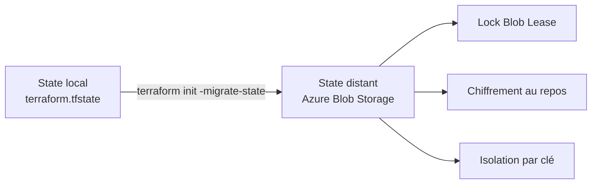

# Lab M2 — State distant Azure Blob Storage

> [<- Jour 1](../README.md) · [<- Module precedent](../module-01-iac-workflow/lab.md) · **Module 2** · [Module suivant ->](../module-03-import-brownfield/lab.md)

| Élément | Valeur |
|---|---|
| **Durée** | 70 min |
| **Piste** | `[CORE]` |
| **Workspace** | `$HOME/Data2AI-Labs/data-platform` (le clone) |
| **Dossier de travail** | `environments/dev/` dans le clone |
| **Coût** | Aucun — Storage Account minimal |
| **Cleanup** | Conserver jusqu'au Jour 3 |

## 🎯 Mission

Votre state est actuellement local. En équipe, cela pose trois problèmes : pas de verrou, pas d'historique, pas de partage. Vous allez migrer le state vers Azure Blob Storage avec verrouillage natif.

## 🏗️ Architecture



## 🎯 Objectifs

- ✅ créer un backend Azure Blob Storage pour le state Terraform;
- ✅ comprendre le paradoxe du bootstrapping;
- ✅ migrer un state local vers un backend distant;
- ✅ tester le verrouillage concurrent;
- ✅ analyser la structure du fichier `terraform.tfstate`;
- ✅ utiliser `terraform_remote_state` pour lire les outputs d'un autre projet.

## 📋 Prérequis

- [ ] M1 terminé : database, schema et warehouse existent dans Snowflake;
- [ ] `terraform state list` affiche 3 ressources dans `environments/dev/`;
- [ ] Azure CLI installé;
- [ ] vous avez exécuté `Learner-Login` (le SP partagé a le rôle `Storage Blob Data Contributor` sur le Storage Account);
- [ ] `az account show --query 'name' -o tsv` affiche la souscription Azure;
- [ ] les variables Azure sont dans votre `.env` (`ARM_SUBSCRIPTION_ID`, `ARM_TENANT_ID`, `ARM_RESOURCE_GROUP`, `ARM_STORAGE_ACCOUNT`, `ARM_CONTAINER`, `ARM_LOCATION`).

## 🚀 Préflight

Avant de commencer, vérifiez que votre environnement M1 est intact :

<details>
<summary>🪟 <b>Windows (PowerShell)</b></summary>

```powershell
cd "$HOME\Data2AI-Labs\data-platform\environments\dev"
terraform version
terraform state list
terraform plan
```
</details>

<details>
<summary>🐧 <b>Linux/macOS (Bash)</b></summary>

```bash
cd "$HOME/Data2AI-Labs/data-platform/environments/dev"
terraform version
terraform state list
terraform plan
```
</details>

✅ **Checkpoint préflight** : Terraform `v1.14.5`, les ressources M1 sont listées, et `terraform plan` affiche `No changes`.

> 🔒 **Security** : n'affichez jamais `ARM_CLIENT_SECRET`, `SNOWFLAKE_PASSWORD` ou `TF_VAR_snowflake_token`.

> ⚠️ **IMPORTANT** : Si vous avez ouvert un nouveau terminal, relancez `Learner-Login` avant de continuer.
>
> <details>
> <summary>🪟 <b>Windows (PowerShell)</b></summary>
>
> ```powershell
> .\scripts\Learner-Login.ps1 -LearnerPrefix APP01
> ```
> </details>
>
> <details>
> <summary>🐧 <b>Linux/macOS (Bash)</b></summary>
>
> ```bash
> ./scripts/learner-login.sh APP01
> ```
> </details>

## 📝 Partie 1 — Créer le backend Azure (bootstrap)

Le backend Azure est créé manuellement avec Azure CLI, pas avec Terraform. C'est le paradoxe du bootstrapping : Terraform a besoin d'un backend pour stocker son state, mais ce backend ne peut pas être créé par Terraform lui-même.

### 📝 Étape 1.1 — Définir les variables

Les variables Azure ont été définies par `Learner-Login.ps1` (Windows) ou `learner-login.sh` (Linux/macOS).

<details>
<summary>🪟 <b>Windows (PowerShell)</b></summary>

```powershell
cd "$HOME\Data2AI-Labs\data-platform"
Write-Host "Subscription: $env:ARM_SUBSCRIPTION_ID"
Write-Host "Resource Group: $env:ARM_RESOURCE_GROUP"
Write-Host "Storage Account: $env:ARM_STORAGE_ACCOUNT"
Write-Host "Container: $env:ARM_CONTAINER"
Write-Host "Location: $env:ARM_LOCATION"
```

> 💡 **Note** : Sous PowerShell, les variables d'environnement utilisent le préfixe `$env:`.
> Ne pas utiliser `source .env` ou `$ARM_SUBSCRIPTION_ID` sans `$env:`.
> Si une variable est vide, vérifiez que `.env` la contient et relancez `Learner-Login.ps1`.
</details>

<details>
<summary>🐧 <b>Linux/macOS (Bash)</b></summary>

```bash
cd $HOME/Data2AI-Labs/data-platform
source .env 2>/dev/null || export $(grep -v '^#' .env | xargs)
echo "Subscription: $ARM_SUBSCRIPTION_ID"
echo "Resource Group: $ARM_RESOURCE_GROUP"
echo "Storage Account: $ARM_STORAGE_ACCOUNT"
echo "Container: $ARM_CONTAINER"
echo "Location: $ARM_LOCATION"
```
</details>

### 📝 Étape 1.2 — Créer le Resource Group

<details>
<summary>🪟 <b>Windows (PowerShell)</b></summary>

```powershell
az group create `
    --name $env:ARM_RESOURCE_GROUP `
    --location $env:ARM_LOCATION `
    --output table
```
</details>

<details>
<summary>🐧 <b>Linux/macOS (Bash)</b></summary>

```bash
az group create \
    --name "$ARM_RESOURCE_GROUP" \
    --location "$ARM_LOCATION" \
    --output table
```
</details>

> 💡 **Note** : Si `ARM_LOCATION` n'est pas définie, utilisez une région disponible pour votre abonnement, par exemple `northeurope` ou `francecentral`.
> Certaines régions comme `westeurope` peuvent refuser de nouveaux clients.
> Pour lister les régions disponibles :
>
> ```powershell
> az account list-locations --query "[].name" -o table
> ```

✅ **Checkpoint** : une table avec `provisioningState : Succeeded`.

### 📝 Étape 1.3 — Créer le Storage Account

<details>
<summary>🪟 <b>Windows (PowerShell)</b></summary>

```powershell
az storage account create `
    --name $env:ARM_STORAGE_ACCOUNT `
    --resource-group $env:ARM_RESOURCE_GROUP `
    --location $env:ARM_LOCATION `
    --sku "Standard_LRS" `
    --encryption-services blob `
    --output table
```
</details>

<details>
<summary>🐧 <b>Linux/macOS (Bash)</b></summary>

```bash
az storage account create \
    --name "$ARM_STORAGE_ACCOUNT" \
    --resource-group "$ARM_RESOURCE_GROUP" \
    --location "$ARM_LOCATION" \
    --sku "Standard_LRS" \
    --encryption-services blob \
    --output table
```
</details>

✅ **Checkpoint** : `provisioningState : Succeeded`.

> 💡 **Note** : Si le Storage Account existe déjà, Azure affiche `A storage account with the provided name is found. Will continue to update the existing account.` C'est normal : la commande est idempotente et conserve le compte existant.

> 💰 **COST** : `Standard_LRS` est le SKU le moins coûteux. Le state est petit; ce n'est pas une charge significative.

### 📝 Étape 1.4 — Créer le conteneur

<details>
<summary>🪟 <b>Windows (PowerShell)</b></summary>

```powershell
az storage container create `
    --name $env:ARM_CONTAINER `
    --account-name $env:ARM_STORAGE_ACCOUNT `
    --auth-mode login `
    --output table
```
</details>

<details>
<summary>🐧 <b>Linux/macOS (Bash)</b></summary>

```bash
az storage container create \
    --name "$ARM_CONTAINER" \
    --account-name "$ARM_STORAGE_ACCOUNT" \
    --auth-mode login \
    --output table
```
</details>

✅ **Checkpoint** :

- `Created: True` : le conteneur vient d'être créé;
- `Created: False` : le conteneur existait déjà. C'est également un résultat valide.

> 💡 **Note** : La commande est idempotente. La relancer ne supprime ni le conteneur ni le state existant.

### 📝 Étape 1.5 — Vérifier

<details>
<summary>🪟 <b>Windows (PowerShell)</b></summary>

```powershell
az storage account show `
    --name $env:ARM_STORAGE_ACCOUNT `
    --resource-group $env:ARM_RESOURCE_GROUP `
    --query "name" -o tsv
```
</details>

<details>
<summary>🐧 <b>Linux/macOS (Bash)</b></summary>

```bash
az storage account show \
    --name "$ARM_STORAGE_ACCOUNT" \
    --resource-group "$ARM_RESOURCE_GROUP" \
    --query "name" -o tsv
```
</details>

✅ **Checkpoint** : le nom du storage account.

## 📝 Partie 2 — Configurer le backend Terraform

> ⚠️ **IMPORTANT** : Choisissez **une seule méthode** :
>
> - **Méthode A — recommandée pour ce lab** : toutes les valeurs sont dans `backend.tf`; lancez ensuite `terraform init -migrate-state` **sans** `-backend-config`.
> - **Méthode B — optionnelle** : `backend.tf` contient un bloc vide et les valeurs sont dans `backend.hcl`; lancez alors `terraform init -migrate-state -backend-config="backend.hcl"`.
>
> Ne mélangez pas les deux méthodes.

### 📝 Étape 2.1 — Se placer dans `environments/dev`

<details>
<summary>🪟 <b>Windows (PowerShell)</b></summary>

```powershell
cd "$HOME\Data2AI-Labs\data-platform\environments\dev"
Get-Location
Get-ChildItem backend.tf, terraform.tfstate -ErrorAction SilentlyContinue
```
</details>

<details>
<summary>🐧 <b>Linux/macOS (Bash)</b></summary>

```bash
cd "$HOME/Data2AI-Labs/data-platform/environments/dev"
pwd
ls -l backend.tf terraform.tfstate 2>/dev/null
```
</details>

✅ **Checkpoint** : le répertoire courant se termine par `environments/dev` et le state local `terraform.tfstate` est présent avant la migration.

### 📝 Étape 2.2 — Méthode A recommandée : configurer `backend.tf`

Si `backend.tf` existe déjà, **ne le recréez pas**. Ouvrez-le et remplacez son contenu. Sinon, créez-le.

<details>
<summary>🪟 <b>Windows (PowerShell)</b></summary>

```powershell
if (-not (Test-Path backend.tf)) {
    New-Item -ItemType File -Path backend.tf | Out-Null
}
code backend.tf
```
</details>

<details>
<summary>🐧 <b>Linux/macOS (Bash)</b></summary>

```bash
touch backend.tf
code backend.tf
```
</details>

Ajoutez exactement ce bloc, en adaptant les valeurs à votre `.env` si nécessaire :

```hcl
terraform {
  backend "azurerm" {
    resource_group_name  = "rg-data2ai-tf-state"
    storage_account_name = "sadata2aitfstatemsn"
    container_name       = "tfstate"
    key                  = "training/APP01/dev/terraform.tfstate"
    use_azuread_auth     = true
  }
}
```

Remplacez `APP01` par votre préfixe apprenant. Vérifiez le fichier avant de continuer :

<details>
<summary>🪟 <b>Windows (PowerShell)</b></summary>

```powershell
Get-Content backend.tf
Test-Path backend.hcl
```
</details>

<details>
<summary>🐧 <b>Linux/macOS (Bash)</b></summary>

```bash
cat backend.tf
test -f backend.hcl && echo "backend.hcl exists" || echo "backend.hcl absent"
```
</details>

✅ **Checkpoint** : `backend.tf` contient les quatre paramètres. Avec cette méthode, `backend.hcl` n'est pas nécessaire et peut être absent.

<details>
<summary>🧭 <b>Méthode B optionnelle : utiliser backend.hcl</b></summary>

Utilisez cette méthode uniquement si votre formateur la demande. Dans `backend.tf`, mettez seulement :

```hcl
terraform {
  backend "azurerm" {}
}
```

Créez ensuite `backend.hcl` dans le **même dossier** :

```hcl
resource_group_name  = "rg-data2ai-tf-state"
storage_account_name = "sadata2aitfstatemsn"
container_name       = "tfstate"
key                  = "training/APP01/dev/terraform.tfstate"
use_azuread_auth     = true
```

Vérifiez que le fichier existe avant l'initialisation :

```powershell
Test-Path backend.hcl
```

Le résultat doit être `True`. Pour cette méthode uniquement, la commande d'initialisation sera :

```powershell
terraform init -migrate-state -backend-config="backend.hcl"
```

> 🔒 **SECURITY** : `backend.hcl` est gitignored. Ne le commitez jamais.
</details>

### 📝 Étape 2.3 — Formater avant l'initialisation

<details>
<summary>🪟 <b>Windows (PowerShell)</b></summary>

```powershell
terraform fmt
terraform fmt -check
```
</details>

<details>
<summary>🐧 <b>Linux/macOS (Bash)</b></summary>

```bash
terraform fmt
terraform fmt -check
```
</details>

✅ **Checkpoint** : les commandes se terminent sans erreur.

> 💡 **Note** : N'exécutez pas encore `terraform validate`. Après l'ajout ou la modification d'un backend, Terraform doit d'abord exécuter `terraform init`.

## 📝 Partie 3 — Migrer le state local vers Azure

### 📝 Étape 3.1 — Initialiser avec la méthode choisie

Pour la **méthode A recommandée**, exécutez uniquement :

<details>
<summary>🪟 <b>Windows (PowerShell)</b></summary>

```powershell
terraform init -migrate-state
```
</details>

<details>
<summary>🐧 <b>Linux/macOS (Bash)</b></summary>

```bash
terraform init -migrate-state
```
</details>

N'ajoutez pas `-backend-config=backend.hcl` lorsque les paramètres sont déjà écrits dans `backend.tf`.

Terraform détecte le changement de backend, demande confirmation, puis copie le state local vers Azure Blob Storage. Répondez `yes` si les noms du Resource Group, du Storage Account, du conteneur et de la clé sont corrects.

✅ **Checkpoint** :

```text
Successfully configured the backend "azurerm"!
Terraform has automatically migrated your state from "local" to "azurerm".
```

> 🔍 **En cas de `Too many command line arguments`** : vérifiez que vous êtes dans `environments/dev`. Si vous utilisez la méthode A, retirez complètement l'option `-backend-config` et relancez `terraform init -migrate-state`.

Validez ensuite la configuration initialisée :

<details>
<summary>🪟 <b>Windows (PowerShell)</b></summary>

```powershell
terraform validate
```
</details>

<details>
<summary>🐧 <b>Linux/macOS (Bash)</b></summary>

```bash
terraform validate
```
</details>

✅ **Checkpoint** : `Success! The configuration is valid.`

### 📝 Étape 3.2 — Inspecter les anciens fichiers de state local

<details>
<summary>🪟 <b>Windows (PowerShell)</b></summary>

```powershell
Get-Item terraform.tfstate* -ErrorAction SilentlyContinue
```
</details>

<details>
<summary>🐧 <b>Linux/macOS (Bash)</b></summary>

```bash
ls terraform.tfstate* 2>/dev/null
```
</details>

> 💡 **Note** : Terraform peut conserver `terraform.tfstate` ou `terraform.tfstate.backup` comme copie locale après la migration. Leur présence ne signifie pas que Terraform les utilise encore. Ne les supprimez pas avant d'avoir validé le state distant aux étapes 3.3 et 3.4.

✅ **Checkpoint** : la migration s'est terminée sans erreur. La preuve définitive est obtenue avec `terraform state list` puis avec la présence du blob Azure.

### 📝 Étape 3.3 — Vérifier le state distant

<details>
<summary>🪟 <b>Windows (PowerShell)</b></summary>

```powershell
terraform state list
```
</details>

<details>
<summary>🐧 <b>Linux/macOS (Bash)</b></summary>

```bash
terraform state list
```
</details>

✅ **Checkpoint** : les ressources de M1 :

```text
snowflake_database.raw
snowflake_schema.raw["FINANCE"]
snowflake_schema.raw["SALES"]
snowflake_warehouse.etl
```

### 📝 Étape 3.4 — Vérifier dans Azure

<details>
<summary>🪟 <b>Windows (PowerShell)</b></summary>

```powershell
az storage blob list `
    --account-name $env:ARM_STORAGE_ACCOUNT `
    --container-name $env:ARM_CONTAINER `
    --auth-mode login `
    --query "[].name" -o tsv
```
</details>

<details>
<summary>🐧 <b>Linux/macOS (Bash)</b></summary>

```bash
az storage blob list \
    --account-name "$ARM_STORAGE_ACCOUNT" \
    --container-name "$ARM_CONTAINER" \
    --auth-mode login \
    --query "[].name" -o tsv
```
</details>

✅ **Checkpoint** : `training/APP01/dev/terraform.tfstate` (avec votre préfixe).

> 💡 **Note** : `--auth-mode login` force Azure CLI à utiliser la session ouverte par `Learner-Login.ps1`. Sans cette option, Azure CLI affiche un avertissement puis tente de récupérer une account key. Si la commande retourne `AuthorizationPermissionMismatch`, demandez au formateur d'attribuer au service principal le rôle `Storage Blob Data Reader` ou `Storage Blob Data Contributor`.

## 📝 Partie 4 — Tester le verrouillage

### 📝 Étape 4.1 — Ouvrir et préparer deux terminaux

Chaque terminal possède ses propres variables d'environnement. Dans **les deux terminaux**, chargez donc l'authentification Azure, le PAT Snowflake et le bon dossier.

<details>
<summary>🪟 <b>Windows (PowerShell)</b></summary>

```powershell
cd "$HOME\Data2AI-Labs\data-platform"
.\scripts\Learner-Login.ps1 -LearnerPrefix APP01
$env:TF_VAR_snowflake_token = (Get-Content .\secrets\snowflake_pat.txt -Raw).Trim()
cd .\environments\dev
```
</details>

<details>
<summary>🐧 <b>Linux/macOS (Bash)</b></summary>

```bash
cd "$HOME/Data2AI-Labs/data-platform"
source ./scripts/learner-login.sh APP01
export TF_VAR_snowflake_token=$(tr -d '[:space:]' < ./secrets/snowflake_pat.txt)
cd ./environments/dev
```
</details>

Remplacez `APP01` par votre préfixe.

### 📝 Étape 4.2 — Maintenir le verrou dans le terminal 1

Dans le terminal 1, lancez `terraform plan` **sans répondre à la confirmation** :

<details>
<summary>🪟 <b>Windows (PowerShell)</b></summary>

```powershell
terraform plan
```
</details>

<details>
<summary>🐧 <b>Linux/macOS (Bash)</b></summary>

```bash
terraform plan
```
</details>

Quand Terraform affiche `Enter a value:` ou commence à rafraîchir le state, laissez le terminal en attente. L'opération conserve alors le verrou du state.

> ⚠️ **IMPORTANT** : Ne saisissez pas `yes` et ne fermez pas le terminal. Ce test ne doit appliquer aucun changement.

### 📝 Étape 4.3 — Vérifier le verrou dans le terminal 2

Pendant que le terminal 1 attend toujours, exécutez dans le terminal 2 :

<details>
<summary>🪟 <b>Windows (PowerShell)</b></summary>

```powershell
terraform plan -lock-timeout=0s
```
</details>

<details>
<summary>🐧 <b>Linux/macOS (Bash)</b></summary>

```bash
terraform plan -lock-timeout=0s
```
</details>

✅ **Checkpoint** : Terraform refuse l'accès au state avec une erreur similaire à :

```text
Error: Error acquiring the state lock
```

C'est le comportement normal : le Blob Lease empêche les opérations concurrentes.

### 📝 Étape 4.4 — Libérer le verrou normalement

Retournez dans le terminal 1 et utilisez `Ctrl+C` pour annuler le plan. Attendez le retour du prompt, puis vérifiez dans le terminal 2 :

<details>
<summary>🪟 <b>Windows (PowerShell)</b></summary>

```powershell
terraform plan
```
</details>

<details>
<summary>🐧 <b>Linux/macOS (Bash)</b></summary>

```bash
terraform plan
```
</details>

✅ **Checkpoint** : le plan fonctionne de nouveau et affiche `No changes.`

> ⚠️ **SECURITY** : N'utilisez `terraform force-unlock <LOCK_ID>` que si le processus du terminal 1 est réellement arrêté et que le verrou reste présent. Forcer l'unlock pendant une opération active peut corrompre le state.

## 📝 Partie 5 — Analyser le state

### 📝 Étape 5.1 — Lister les ressources

<details>
<summary>🪟 <b>Windows (PowerShell)</b></summary>

```powershell
terraform state list
```
</details>

<details>
<summary>🐧 <b>Linux/macOS (Bash)</b></summary>

```bash
terraform state list
```
</details>

### 📝 Étape 5.2 — Afficher le détail d'une ressource

<details>
<summary>🪟 <b>Windows (PowerShell)</b></summary>

```powershell
terraform state show snowflake_database.raw
```
</details>

<details>
<summary>🐧 <b>Linux/macOS (Bash)</b></summary>

```bash
terraform state show snowflake_database.raw
```
</details>

### 📝 Étape 5.3 — Voir la structure JSON du state

<details>
<summary>🪟 <b>Windows (PowerShell)</b></summary>

```powershell
terraform show -json | Set-Content state.json
```
</details>

<details>
<summary>🐧 <b>Linux/macOS (Bash)</b></summary>

```bash
terraform show -json > state.json
```
</details>

Le state contient :

| Champ | Rôle |
|---|---|
| `version` | Version du format de state |
| `terraform_version` | Version de Terraform qui a écrit le state |
| `serial` | Compteur incrémenté à chaque modification |
| `lineage` | Identifiant unique du state |
| `resources` | Liste des ressources gérées |

> 🔒 **SECURITY** : Le state peut contenir des données sensibles. Ne le commitez jamais. `state.json` est ignoré par Git.

## 📝 Partie 6 — terraform_remote_state

### 📝 Étape 6.1 — Créer un second dossier

<details>
<summary>🪟 <b>Windows (PowerShell)</b></summary>

```powershell
cd "$HOME\Data2AI-Labs\data-platform"
New-Item -ItemType Directory -Path environments\dev-reader -Force | Out-Null
cd environments\dev-reader
```
</details>

<details>
<summary>🐧 <b>Linux/macOS (Bash)</b></summary>

```bash
cd $HOME/Data2AI-Labs/data-platform
mkdir -p environments/dev-reader
cd environments/dev-reader
```
</details>

### 📝 Étape 6.2 — Créer `main.tf`

```hcl
terraform {
  required_version = "= 1.14.5"

  required_providers {
    snowflake = {
      source  = "snowflakedb/snowflake"
      version = "= 2.14.0"
    }
  }

  backend "azurerm" {
    resource_group_name  = "rg-data2ai-tf-state"
    storage_account_name = "sadata2aitfstatemsn"
    container_name       = "tfstate"
    key                  = "training/APP01/dev-reader/terraform.tfstate"
    use_azuread_auth     = true
  }
}

data "terraform_remote_state" "dev" {
  backend = "azurerm"
  config = {
    resource_group_name  = "rg-data2ai-tf-state"
    storage_account_name = "sadata2aitfstatemsn"
    container_name       = "tfstate"
    key                  = "training/APP01/dev/terraform.tfstate"
    use_azuread_auth     = true
  }
}

output "raw_database_name" {
  value = data.terraform_remote_state.dev.outputs.raw_database_name
}
```

### 📝 Étape 6.3 — Initialiser et appliquer

<details>
<summary>🪟 <b>Windows (PowerShell)</b></summary>

```powershell
terraform init
terraform apply -auto-approve
```
</details>

<details>
<summary>🐧 <b>Linux/macOS (Bash)</b></summary>

```bash
terraform init
terraform apply -auto-approve
```
</details>

✅ **Checkpoint** : `raw_database_name` affiche le nom de la database créée en M1.

### 📝 Étape 6.4 — Nettoyer le dossier reader

<details>
<summary>🪟 <b>Windows (PowerShell)</b></summary>

```powershell
cd "$HOME\Data2AI-Labs\data-platform"
Remove-Item -Recurse -Force environments\dev-reader
```
</details>

<details>
<summary>🐧 <b>Linux/macOS (Bash)</b></summary>

```bash
cd $HOME/Data2AI-Labs/data-platform
rm -rf environments/dev-reader
```
</details>

## 🏆 Challenge

Ajoutez un output `state_metadata` dans `environments/dev/outputs.tf` qui expose :

```hcl
output "state_metadata" {
  value = {
    backend   = "azurerm"
    container = "tfstate"
    key       = "training/APP01/dev/terraform.tfstate"
  }
}
```

Critères :

- [ ] `terraform fmt -check` réussit;
- [ ] `terraform validate` réussit;
- [ ] `terraform output state_metadata` affiche les informations du backend;
- [ ] `terraform plan` reste sans changement;
- [ ] le blob `training/APP01/dev/terraform.tfstate` existe dans Azure (avec votre préfixe);
- [ ] Terraform utilise le backend distant après réouverture du terminal.

## 🧹 Cleanup

Ne détruisez pas les ressources Snowflake. Elles sont réutilisées au Jour 3.

Si vous voulez nettoyer le backend Azure :

<details>
<summary>🪟 <b>Windows (PowerShell)</b></summary>

```powershell
az storage account delete --name $env:ARM_STORAGE_ACCOUNT --resource-group $env:ARM_RESOURCE_GROUP --yes
az group delete --name $env:ARM_RESOURCE_GROUP --yes
```
</details>

<details>
<summary>🐧 <b>Linux/macOS (Bash)</b></summary>

```bash
az storage account delete --name "$ARM_STORAGE_ACCOUNT" --resource-group "$ARM_RESOURCE_GROUP" --yes
az group delete --name "$ARM_RESOURCE_GROUP" --yes
```
</details>

> ⚠️ **WARNING** : Ne faites ceci qu'à la fin de la formation, pas entre les modules.
