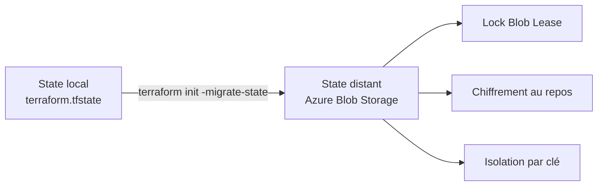

# Lab M2 — State distant Azure Blob Storage

| Élément | Valeur |
|---|---|
| **Durée** | 70 min |
| **Piste** | `[CORE]` |
| **Workspace** | `$HOME/Data2AI-Labs/data-platform` (le clone) |
| **Dossier de travail** | `environments/dev/` dans le clone |
| **Coût** | Aucun — Storage Account minimal |
| **Cleanup** | Conserver jusqu'au Jour 3 |

## 🎯 Mission

Votre state est actuellement local. En équipe, cela pose trois problèmes : pas de verrou, pas d'historique, pas de partage. Vous allez migrer le state vers Azure Blob Storage avec verrouillage natif.

## 🏗️ Architecture



## 🎯 Objectifs

- ✅ créer un backend Azure Blob Storage pour le state Terraform;
- ✅ comprendre le paradoxe du bootstrapping;
- ✅ migrer un state local vers un backend distant;
- ✅ tester le verrouillage concurrent;
- ✅ analyser la structure du fichier `terraform.tfstate`;
- ✅ utiliser `terraform_remote_state` pour lire les outputs d'un autre projet.

## 📋 Prérequis

- [ ] M1 terminé : database, schema et warehouse existent dans Snowflake;
- [ ] `terraform state list` affiche 3 ressources dans `environments/dev/`;
- [ ] Azure CLI installé;
- [ ] vous avez exécuté `Learner-Login` (le SP partagé a le rôle `Contributor` sur la souscription);
- [ ] `az account show --query 'name' -o tsv` affiche la souscription Azure;
- [ ] les variables Azure sont dans votre `.env` (`ARM_SUBSCRIPTION_ID`, `ARM_TENANT_ID`, `ARM_RESOURCE_GROUP`, `ARM_STORAGE_ACCOUNT`, `ARM_CONTAINER`, `ARM_LOCATION`).

> ⚠️ **IMPORTANT** : Si vous avez ouvert un nouveau terminal, relancez `Learner-Login` avant de continuer.
>
> <details>
> <summary>🪟 <b>Windows (PowerShell)</b></summary>
>
> ```powershell
> .\scripts\Learner-Login.ps1 -LearnerPrefix APP01
> ```
> </details>
>
> <details>
> <summary>🐧 <b>Linux/macOS (Bash)</b></summary>
>
> ```bash
> ./scripts/learner-login.sh APP01
> ```
> </details>

## 📝 Partie 1 — Créer le backend Azure (bootstrap)

Le backend Azure est créé manuellement avec Azure CLI, pas avec Terraform. C'est le paradoxe du bootstrapping : Terraform a besoin d'un backend pour stocker son state, mais ce backend ne peut pas être créé par Terraform lui-même.

### 📝 Étape 1.1 — Définir les variables

Les variables Azure ont été définies par `Learner-Login.ps1` (Windows) ou `learner-login.sh` (Linux/macOS).

<details>
<summary>🪟 <b>Windows (PowerShell)</b></summary>

```powershell
cd "$HOME\Data2AI-Labs\data-platform"
Write-Host "Subscription: $env:ARM_SUBSCRIPTION_ID"
Write-Host "Resource Group: $env:ARM_RESOURCE_GROUP"
Write-Host "Storage Account: $env:ARM_STORAGE_ACCOUNT"
Write-Host "Container: $env:ARM_CONTAINER"
Write-Host "Location: $env:ARM_LOCATION"
```

> 💡 **Note** : Sous PowerShell, les variables d'environnement utilisent le préfixe `$env:`.
> Ne pas utiliser `source .env` ou `$ARM_SUBSCRIPTION_ID` sans `$env:`.
> Si une variable est vide, vérifiez que `.env` la contient et relancez `Learner-Login.ps1`.
</details>

<details>
<summary>🐧 <b>Linux/macOS (Bash)</b></summary>

```bash
cd $HOME/Data2AI-Labs/data-platform
source .env 2>/dev/null || export $(grep -v '^#' .env | xargs)
echo "Subscription: $ARM_SUBSCRIPTION_ID"
echo "Resource Group: $ARM_RESOURCE_GROUP"
echo "Storage Account: $ARM_STORAGE_ACCOUNT"
echo "Container: $ARM_CONTAINER"
echo "Location: $ARM_LOCATION"
```
</details>

### 📝 Étape 1.2 — Créer le Resource Group

<details>
<summary>🪟 <b>Windows (PowerShell)</b></summary>

```powershell
az group create `
    --name $env:ARM_RESOURCE_GROUP `
    --location $env:ARM_LOCATION `
    --output table
```
</details>

<details>
<summary>🐧 <b>Linux/macOS (Bash)</b></summary>

```bash
az group create \
    --name "$ARM_RESOURCE_GROUP" \
    --location "$ARM_LOCATION" \
    --output table
```
</details>

> 💡 **Note** : Si `ARM_LOCATION` n'est pas définie, utilisez une région disponible pour votre abonnement, par exemple `northeurope` ou `francecentral`.
> Certaines régions comme `westeurope` peuvent refuser de nouveaux clients.
> Pour lister les régions disponibles :
>
> ```powershell
> az account list-locations --query "[].name" -o table
> ```

✅ **Checkpoint** : une table avec `provisioningState : Succeeded`.

### 📝 Étape 1.3 — Créer le Storage Account

<details>
<summary>🪟 <b>Windows (PowerShell)</b></summary>

```powershell
az storage account create `
    --name $env:ARM_STORAGE_ACCOUNT `
    --resource-group $env:ARM_RESOURCE_GROUP `
    --location $env:ARM_LOCATION `
    --sku "Standard_LRS" `
    --encryption-services blob `
    --output table
```
</details>

<details>
<summary>🐧 <b>Linux/macOS (Bash)</b></summary>

```bash
az storage account create \
    --name "$ARM_STORAGE_ACCOUNT" \
    --resource-group "$ARM_RESOURCE_GROUP" \
    --location "$ARM_LOCATION" \
    --sku "Standard_LRS" \
    --encryption-services blob \
    --output table
```
</details>

✅ **Checkpoint** : `provisioningState : Succeeded`.

> 💰 **COST** : `Standard_LRS` est le SKU le moins coûteux. Le state est petit; ce n'est pas une charge significative.

### 📝 Étape 1.4 — Créer le conteneur

<details>
<summary>🪟 <b>Windows (PowerShell)</b></summary>

```powershell
az storage container create `
    --name $env:ARM_CONTAINER `
    --account-name $env:ARM_STORAGE_ACCOUNT `
    --auth-mode login `
    --output table
```
</details>

<details>
<summary>🐧 <b>Linux/macOS (Bash)</b></summary>

```bash
az storage container create \
    --name "$ARM_CONTAINER" \
    --account-name "$ARM_STORAGE_ACCOUNT" \
    --auth-mode login \
    --output table
```
</details>

✅ **Checkpoint** : `created : true`.

### 📝 Étape 1.5 — Vérifier

<details>
<summary>🪟 <b>Windows (PowerShell)</b></summary>

```powershell
az storage account show `
    --name $env:ARM_STORAGE_ACCOUNT `
    --resource-group $env:ARM_RESOURCE_GROUP `
    --query "name" -o tsv
```
</details>

<details>
<summary>🐧 <b>Linux/macOS (Bash)</b></summary>

```bash
az storage account show \
    --name "$ARM_STORAGE_ACCOUNT" \
    --resource-group "$ARM_RESOURCE_GROUP" \
    --query "name" -o tsv
```
</details>

✅ **Checkpoint** : le nom du storage account.

## 📝 Partie 2 — Configurer le backend Terraform

### 📝 Étape 2.1 — Créer `backend.tf`

Dans `environments/dev/`, créez `backend.tf` :

<details>
<summary>🪟 <b>Windows (PowerShell)</b></summary>

```powershell
cd environments/dev
New-Item -ItemType File -Path backend.tf
# ou si VS Code est installé
# code backend.tf
```
</details>

<details>
<summary>🐧 <b>Linux/macOS (Bash)</b></summary>

```bash
cd environments/dev
touch backend.tf
# ou si VS Code est installé
# code backend.tf
```
</details>

Ajoutez :

```hcl
terraform {
  backend "azurerm" {
    resource_group_name  = "rg-data2ai-tf-state"
    storage_account_name = "sadata2aitfstatemsn"
    container_name       = "tfstate"
    key                  = "data-platform/dev/terraform.tfstate"
  }
}
```

> 💡 **Note** : Ces valeurs correspondent aux valeurs par défaut de `.env.example`.
> Remplacez-les si votre `.env` utilise d'autres noms.

### 📝 Étape 2.2 — Alternative : `backend.hcl` séparé

Au lieu de mettre les valeurs dans `backend.tf`, vous pouvez utiliser un fichier `backend.hcl` (gitignored) :

<details>
<summary>🪟 <b>Windows (PowerShell)</b></summary>

```powershell
Copy-Item backend.hcl.example backend.hcl
```
</details>

<details>
<summary>🐧 <b>Linux/macOS (Bash)</b></summary>

```bash
cp backend.hcl.example backend.hcl
```
</details>

Éditez `backend.hcl` avec vos valeurs réelles, puis dans `backend.tf` :

```hcl
terraform {
  backend "azurerm" {}
}
```

et initialisez avec :

```powershell
terraform init -backend-config=backend.hcl
```

> 🔒 **SECURITY** : `backend.hcl` est gitignored. Ne le commitez jamais.

### 📝 Étape 2.3 — Formater

```powershell
terraform fmt
```

✅ **Checkpoint** : aucune erreur de formatage.

## 📝 Partie 3 — Migrer le state local vers Azure

### 📝 Étape 3.1 — Initialiser avec migration

```powershell
terraform init -migrate-state
```

Terraform détecte le backend, vous demande confirmation, puis copie le state local vers Azure Blob Storage.

✅ **Checkpoint** :

```text
Successfully configured the backend "azurerm"!
Terraform has automatically migrated your state from "local" to "azurerm".
```

### 📝 Étape 3.2 — Vérifier que le state local est supprimé

<details>
<summary>🪟 <b>Windows (PowerShell)</b></summary>

```powershell
Get-Item terraform.tfstate* -ErrorAction SilentlyContinue
```
</details>

<details>
<summary>🐧 <b>Linux/macOS (Bash)</b></summary>

```bash
ls terraform.tfstate* 2>/dev/null
```
</details>

✅ **Checkpoint** : aucun fichier `terraform.tfstate` local. Le state est maintenant dans Azure.

### 📝 Étape 3.3 — Vérifier le state distant

```powershell
terraform state list
```

✅ **Checkpoint** : les 3 ressources de M1 :

```text
snowflake_database.raw
snowflake_schema.ingestion
snowflake_warehouse.etl
```

### 📝 Étape 3.4 — Vérifier dans Azure

<details>
<summary>🪟 <b>Windows (PowerShell)</b></summary>

```powershell
az storage blob list `
    --account-name $env:ARM_STORAGE_ACCOUNT `
    --container-name $env:ARM_CONTAINER `
    --query "[].name" -o tsv
```
</details>

<details>
<summary>🐧 <b>Linux/macOS (Bash)</b></summary>

```bash
az storage blob list \
    --account-name "$ARM_STORAGE_ACCOUNT" \
    --container-name "$ARM_CONTAINER" \
    --query "[].name" -o tsv
```
</details>

✅ **Checkpoint** : `data-platform/dev/terraform.tfstate`.

## 📝 Partie 4 — Tester le verrouillage

### 📝 Étape 4.1 — Ouvrir deux terminaux

Dans les deux terminaux, placez-vous dans `environments/dev/`.

### 📝 Étape 4.2 — Lancer un plan dans le terminal 1

```powershell
# Terminal 1
terraform plan
```

Pendant que le plan s'exécute, le state est verrouillé dans Azure.

### 📝 Étape 4.3 — Tenter un plan dans le terminal 2

```powershell
# Terminal 2
terraform plan
```

✅ **Checkpoint** : une erreur indiquant que le state est verrouillé :

```text
Error: Error acquiring the state lock
```

C'est le comportement normal : le Blob Lease empêche les écritures concurrentes.

### 📝 Étape 4.4 — Libérer le verrou

Attendez que le terminal 1 termine, ou forcez le déverrouillage :

```powershell
# Terminal 2 (seulement si le terminal 1 est terminé)
terraform force-unlock <LOCK_ID>
```

> ⚠️ **SECURITY** : Ne forcez jamais un unlock si un autre processus utilise réellement le state. Cela peut corrompre le state.

## 📝 Partie 5 — Analyser le state

### 📝 Étape 5.1 — Lister les ressources

```powershell
terraform state list
```

### 📝 Étape 5.2 — Afficher le détail d'une ressource

```powershell
terraform state show snowflake_database.raw
```

### 📝 Étape 5.3 — Voir la structure JSON du state

<details>
<summary>🪟 <b>Windows (PowerShell)</b></summary>

```powershell
terraform show -json | Set-Content state.json
```
</details>

<details>
<summary>🐧 <b>Linux/macOS (Bash)</b></summary>

```bash
terraform show -json > state.json
```
</details>

Le state contient :

| Champ | Rôle |
|---|---|
| `version` | Version du format de state |
| `terraform_version` | Version de Terraform qui a écrit le state |
| `serial` | Compteur incrémenté à chaque modification |
| `lineage` | Identifiant unique du state |
| `resources` | Liste des ressources gérées |

> 🔒 **SECURITY** : Le state peut contenir des données sensibles. Ne le commitez jamais. `state.json` est ignoré par Git.

## 📝 Partie 6 — terraform_remote_state

### 📝 Étape 6.1 — Créer un second dossier

<details>
<summary>🪟 <b>Windows (PowerShell)</b></summary>

```powershell
cd "$HOME\Data2AI-Labs\data-platform"
New-Item -ItemType Directory -Path environments\dev-reader -Force | Out-Null
cd environments\dev-reader
```
</details>

<details>
<summary>🐧 <b>Linux/macOS (Bash)</b></summary>

```bash
cd $HOME/Data2AI-Labs/data-platform
mkdir -p environments/dev-reader
cd environments/dev-reader
```
</details>

### 📝 Étape 6.2 — Créer `main.tf`

```hcl
terraform {
  required_version = "= 1.14.5"

  required_providers {
    snowflake = {
      source  = "snowflakedb/snowflake"
      version = "= 2.14.0"
    }
  }

  backend "azurerm" {
    resource_group_name  = "rg-data2ai-tf-state"
    storage_account_name = "sadata2aitfstatemsn"
    container_name       = "tfstate"
    key                  = "data-platform/dev-reader/terraform.tfstate"
  }
}

data "terraform_remote_state" "dev" {
  backend = "azurerm"
  config = {
    resource_group_name  = "rg-data2ai-tf-state"
    storage_account_name = "sadata2aitfstatemsn"
    container_name       = "tfstate"
    key                  = "data-platform/dev/terraform.tfstate"
  }
}

output "raw_database_name" {
  value = data.terraform_remote_state.dev.outputs.database_name
}
```

### 📝 Étape 6.3 — Initialiser et appliquer

```powershell
terraform init
terraform apply -auto-approve
```

✅ **Checkpoint** : `raw_database_name` affiche le nom de la database créée en M1.

### 📝 Étape 6.4 — Nettoyer le dossier reader

<details>
<summary>🪟 <b>Windows (PowerShell)</b></summary>

```powershell
cd "$HOME\Data2AI-Labs\data-platform"
Remove-Item -Recurse -Force environments\dev-reader
```
</details>

<details>
<summary>🐧 <b>Linux/macOS (Bash)</b></summary>

```bash
cd $HOME/Data2AI-Labs/data-platform
rm -rf environments/dev-reader
```
</details>

## 🏆 Challenge

Ajoutez un output `state_metadata` dans `environments/dev/outputs.tf` qui expose :

```hcl
output "state_metadata" {
  value = {
    backend   = "azurerm"
    container = "tfstate"
    key       = "data-platform/dev/terraform.tfstate"
  }
}
```

Critères :

- [ ] `terraform fmt -check` réussit;
- [ ] `terraform validate` réussit;
- [ ] `terraform output state_metadata` affiche les informations du backend;
- [ ] `terraform plan` reste sans changement;
- [ ] le state local n'existe plus.

## 🧹 Cleanup

Ne détruisez pas les ressources Snowflake. Elles sont réutilisées au Jour 3.

Si vous voulez nettoyer le backend Azure :

<details>
<summary>🪟 <b>Windows (PowerShell)</b></summary>

```powershell
az storage account delete --name $env:ARM_STORAGE_ACCOUNT --resource-group $env:ARM_RESOURCE_GROUP --yes
az group delete --name $env:ARM_RESOURCE_GROUP --yes
```
</details>

<details>
<summary>🐧 <b>Linux/macOS (Bash)</b></summary>

```bash
az storage account delete --name "$ARM_STORAGE_ACCOUNT" --resource-group "$ARM_RESOURCE_GROUP" --yes
az group delete --name "$ARM_RESOURCE_GROUP" --yes
```
</details>

> ⚠️ **WARNING** : Ne faites ceci qu'à la fin de la formation, pas entre les modules.
