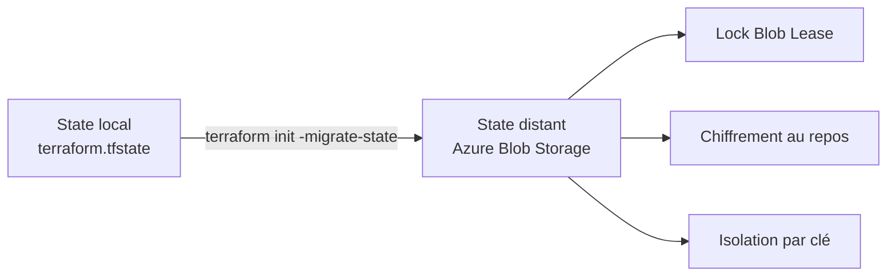

# Lab M2 — State distant Azure Blob Storage

| Élément | Valeur |
|---|---|
| **Durée** | 70 min |
| **Piste** | `[CORE]` |
| **Workspace** | `$HOME/Data2AI-Labs/data-platform` (le clone) |
| **Dossier de travail** | `environments/dev/` dans le clone |
| **Coût** | Aucun — Storage Account minimal |
| **Cleanup** | Conserver jusqu'au Jour 3 |

## Mission

Votre state est actuellement local. En équipe, cela pose trois problèmes : pas de verrou, pas d'historique, pas de partage. Vous allez migrer le state vers Azure Blob Storage avec verrouillage natif.

## Architecture



## Objectifs

- créer un backend Azure Blob Storage pour le state Terraform;
- comprendre le paradoxe du bootstrapping;
- migrer un state local vers un backend distant;
- tester le verrouillage concurrent;
- analyser la structure du fichier `terraform.tfstate`;
- utiliser `terraform_remote_state` pour lire les outputs d'un autre projet.

## Prérequis

- [ ] M1 terminé : database, schema et warehouse existent dans Snowflake;
- [ ] `terraform state list` affiche 3 ressources dans `environments/dev/`;
- [ ] Azure CLI installé;
- [ ] vous avez exécuté `Learner-Login` (le SP partagé a le rôle `Contributor` sur la souscription);
- [ ] `az account show --query 'name' -o tsv` affiche la souscription Azure;
- [ ] les variables Azure sont dans votre `.env` (`ARM_SUBSCRIPTION_ID`, `ARM_TENANT_ID`, `ARM_RESOURCE_GROUP`, `ARM_STORAGE_ACCOUNT`, `ARM_CONTAINER`).

> `[IMPORTANT]` Si vous avez ouvert un nouveau terminal, relancez `Learner-Login` avant de continuer :
> ```powershell
> .\scripts\Learner-Login.ps1 -LearnerPrefix APP01
> ```
> ```bash
> ./scripts/learner-login.sh APP01
> ```

## Partie 1 — Créer le backend Azure (bootstrap)

Le backend Azure est créé manuellement avec Azure CLI, pas avec Terraform. C'est le paradoxe du bootstrapping : Terraform a besoin d'un backend pour stocker son state, mais ce backend ne peut pas être créé par Terraform lui-même.

### Étape 1.1 — Définir les variables

Les variables Azure ont été définies par `Learner-Login.ps1` (Windows) ou `learner-login.sh` (Linux/macOS).

**Windows (PowerShell) :**

```powershell
cd "$HOME\Data2AI-Labs\data-platform"
Write-Host "Subscription: $env:ARM_SUBSCRIPTION_ID"
Write-Host "Resource Group: $env:ARM_RESOURCE_GROUP"
Write-Host "Storage Account: $env:ARM_STORAGE_ACCOUNT"
```

> `[IMPORTANT]` Sous PowerShell, les variables d'environnement utilisent le préfixe `$env:`.
> Ne pas utiliser `source .env` ou `$ARM_SUBSCRIPTION_ID` sans `$env:`.

**Linux/macOS (Bash) :**

```bash
cd $HOME/Data2AI-Labs/data-platform
source .env 2>/dev/null || export $(grep -v '^#' .env | xargs)
echo "Subscription: $ARM_SUBSCRIPTION_ID"
echo "Resource Group: $ARM_RESOURCE_GROUP"
echo "Storage Account: $ARM_STORAGE_ACCOUNT"
```

### Étape 1.2 — Créer le Resource Group

**Windows (PowerShell) :**

```powershell
az group create `
    --name $env:ARM_RESOURCE_GROUP `
    --location "westeurope" `
    --output table
```

**Linux/macOS (Bash) :**

```bash
az group create \
    --name "$ARM_RESOURCE_GROUP" \
    --location "westeurope" \
    --output table
```

**Attendu :** une table avec `provisioningState : Succeeded`.

### Étape 1.3 — Créer le Storage Account

**Windows (PowerShell) :**

```powershell
az storage account create `
    --name $env:ARM_STORAGE_ACCOUNT `
    --resource-group $env:ARM_RESOURCE_GROUP `
    --location "westeurope" `
    --sku "Standard_LRS" `
    --encryption-services blob `
    --output table
```

**Linux/macOS (Bash) :**

```bash
az storage account create \
    --name "$ARM_STORAGE_ACCOUNT" \
    --resource-group "$ARM_RESOURCE_GROUP" \
    --location "westeurope" \
    --sku "Standard_LRS" \
    --encryption-services blob \
    --output table
```

**Attendu :** `provisioningState : Succeeded`.

> `[COST]` `Standard_LRS` est le SKU le moins coûteux. Le state est petit; ce n'est pas une charge significative.

### Étape 1.4 — Créer le conteneur

**Windows (PowerShell) :**

```powershell
az storage container create `
    --name $env:ARM_CONTAINER `
    --account-name $env:ARM_STORAGE_ACCOUNT `
    --output table
```

**Linux/macOS (Bash) :**

```bash
az storage container create \
    --name "$ARM_CONTAINER" \
    --account-name "$ARM_STORAGE_ACCOUNT" \
    --output table
```

**Attendu :** `created : true`.

### Étape 1.5 — Vérifier

**Windows (PowerShell) :**

```powershell
az storage account show `
    --name $env:ARM_STORAGE_ACCOUNT `
    --resource-group $env:ARM_RESOURCE_GROUP `
    --query "name" -o tsv
```

**Linux/macOS (Bash) :**

```bash
az storage account show \
    --name "$ARM_STORAGE_ACCOUNT" \
    --resource-group "$ARM_RESOURCE_GROUP" \
    --query "name" -o tsv
```

**Attendu :** le nom du storage account.

## Partie 2 — Configurer le backend Terraform

### Étape 2.1 — Créer `backend.tf`

Dans `environments/dev/`, créez `backend.tf` :

**[WINDOWS]**

```powershell
cd environments/dev
New-Item -ItemType File -Path backend.tf
code backend.tf
```

**[UNIX]**

```bash
cd environments/dev
touch backend.tf
code backend.tf
```

Ajoutez :

```hcl
terraform {
  backend "azurerm" {
    resource_group_name  = "rg-data-platform-tfstate"
    storage_account_name = "stdataplatformtfstate"
    container_name       = "tfstate"
    key                  = "data-platform/dev/terraform.tfstate"
  }
}
```

> Remplacez les valeurs par celles de votre `.env` si elles diffèrent.

### Étape 2.2 — Copier `backend.hcl.example`

Au lieu de mettre les valeurs dans `backend.tf`, vous pouvez utiliser un fichier `backend.hcl` séparé (gitignored) :

```bash
cp backend.hcl.example backend.hcl
```

Éditez `backend.hcl` avec vos valeurs réelles, puis utilisez :

```hcl
terraform {
  backend "azurerm" {}
}
```

et initialisez avec :

```bash
terraform init -backend-config=backend.hcl
```

> `[SECURITY]` `backend.hcl` est gitignored. Ne le commitez jamais.

### Étape 2.3 — Formater

**Windows (PowerShell) / Linux/macOS (Bash) :**

```powershell
terraform fmt
```

## Partie 3 — Migrer le state local vers Azure

### Étape 3.1 — Initialiser avec migration

**Windows (PowerShell) / Linux/macOS (Bash) :**

```powershell
terraform init -migrate-state
```

Terraform détecte le backend, vous demande confirmation, puis copie le state local vers Azure Blob Storage.

**Attendu :**

```text
Successfully configured the backend "azurerm"!
Terraform has automatically migrated your state from "local" to "azurerm".
```

### Étape 3.2 — Vérifier que le state local est supprimé

**Windows (PowerShell) :**

```powershell
Get-Item terraform.tfstate*
```

**Linux/macOS (Bash) :**

```bash
ls terraform.tfstate*
```

**Attendu :** aucun fichier `terraform.tfstate` local. Le state est maintenant dans Azure.

### Étape 3.3 — Vérifier le state distant

**Windows (PowerShell) / Linux/macOS (Bash) :**

```powershell
terraform state list
```

**Attendu :** les 3 ressources de M1 :

```text
snowflake_database.raw
snowflake_schema.ingestion
snowflake_warehouse.etl
```

### Étape 3.4 — Vérifier dans Azure

**Windows (PowerShell) :**

```powershell
az storage blob list `
    --account-name $env:ARM_STORAGE_ACCOUNT `
    --container-name $env:ARM_CONTAINER `
    --query "[].name" -o tsv
```

**Linux/macOS (Bash) :**

```bash
az storage blob list \
    --account-name "$ARM_STORAGE_ACCOUNT" \
    --container-name "$ARM_CONTAINER" \
    --query "[].name" -o tsv
```

**Attendu :** `data-platform/dev/terraform.tfstate`.

## Partie 4 — Tester le verrouillage

### Étape 4.1 — Ouvrir deux terminaux

Dans les deux terminaux, placez-vous dans `environments/dev/`.

### Étape 4.2 — Lancer un plan dans le terminal 1

**Windows (PowerShell) / Linux/macOS (Bash) :**

```powershell
# Terminal 1
terraform plan
```

Pendant que le plan s'exécute, le state est verrouillé dans Azure.

### Étape 4.3 — Tenter un plan dans le terminal 2

**Windows (PowerShell) / Linux/macOS (Bash) :**

```powershell
# Terminal 2
terraform plan
```

**Attendu :** une erreur indiquant que le state est verrouillé :

```text
Error: Error acquiring the state lock
```

C'est le comportement normal : le Blob Lease empêche les écritures concurrentes.

### Étape 4.4 — Libérer le verrou

Attendez que le terminal 1 termine, ou forcez le déverrouillage :

**Windows (PowerShell) / Linux/macOS (Bash) :**

```powershell
# Terminal 2 (seulement si le terminal 1 est terminé)
terraform force-unlock <LOCK_ID>
```

> `[SECURITY]` Ne forcez jamais un unlock si un autre processus utilise réellement le state. Cela peut corrompre le state.

## Partie 5 — Analyser le state

### Étape 5.1 — Lister les ressources

**Windows (PowerShell) / Linux/macOS (Bash) :**

```powershell
terraform state list
```

### Étape 5.2 — Afficher le détail d'une ressource

**Windows (PowerShell) / Linux/macOS (Bash) :**

```powershell
terraform state show snowflake_database.raw
```

### Étape 5.3 — Voir la structure JSON du state

**Windows (PowerShell) :**

```powershell
terraform show -json | Set-Content state.json
```

**Linux/macOS (Bash) :**

```bash
terraform show -json > state.json
```

Le state contient :

| Champ | Rôle |
|---|---|
| `version` | Version du format de state |
| `terraform_version` | Version de Terraform qui a écrit le state |
| `serial` | Compteur incrémenté à chaque modification |
| `lineage` | Identifiant unique du state |
| `resources` | Liste des ressources gérées |

> `[SECURITY]` Le state peut contenir des données sensibles. Ne le commitez jamais. `state.json` est ignoré par Git.

## Partie 6 — terraform_remote_state

### Étape 6.1 — Créer un second dossier

**Windows (PowerShell) :**

```powershell
cd "$HOME\Data2AI-Labs\data-platform"
New-Item -ItemType Directory -Path environments\dev-reader -Force | Out-Null
cd environments\dev-reader
```

**Linux/macOS (Bash) :**

```bash
cd $HOME/Data2AI-Labs/data-platform
mkdir -p environments/dev-reader
cd environments/dev-reader
```

### Étape 6.2 — Créer `main.tf`

```hcl
terraform {
  required_version = "= 1.14.5"

  required_providers {
    snowflake = {
      source  = "snowflakedb/snowflake"
      version = "= 2.14.0"
    }
  }

  backend "azurerm" {
    resource_group_name  = "rg-data-platform-tfstate"
    storage_account_name = "stdataplatformtfstate"
    container_name       = "tfstate"
    key                  = "data-platform/dev-reader/terraform.tfstate"
  }
}

data "terraform_remote_state" "dev" {
  backend = "azurerm"
  config = {
    resource_group_name  = "rg-data-platform-tfstate"
    storage_account_name = "stdataplatformtfstate"
    container_name       = "tfstate"
    key                  = "data-platform/dev/terraform.tfstate"
  }
}

output "raw_database_name" {
  value = data.terraform_remote_state.dev.outputs.database_name
}
```

### Étape 6.3 — Initialiser et appliquer

**Windows (PowerShell) / Linux/macOS (Bash) :**

```powershell
terraform init
terraform apply -auto-approve
```

**Attendu :** `raw_database_name` affiche le nom de la database créée en M1.

### Étape 6.4 — Nettoyer le dossier reader

**Windows (PowerShell) :**

```powershell
cd "$HOME\Data2AI-Labs\data-platform"
Remove-Item -Recurse -Force environments\dev-reader
```

**Linux/macOS (Bash) :**

```bash
cd $HOME/Data2AI-Labs/data-platform
rm -rf environments/dev-reader
```

## Challenge

Ajoutez un output `state_metadata` dans `environments/dev/outputs.tf` qui expose :

```hcl
output "state_metadata" {
  value = {
    backend   = "azurerm"
    container = "tfstate"
    key       = "data-platform/dev/terraform.tfstate"
  }
}
```

Critères :

- [ ] `terraform fmt -check` réussit;
- [ ] `terraform validate` réussit;
- [ ] `terraform output state_metadata` affiche les informations du backend;
- [ ] `terraform plan` reste sans changement;
- [ ] le state local n'existe plus.

## Cleanup

Ne détruisez pas les ressources Snowflare. Elles sont réutilisées au Jour 3.

Si vous voulez nettoyer le backend Azure :

**Windows (PowerShell) :**

```powershell
az storage account delete --name $env:ARM_STORAGE_ACCOUNT --resource-group $env:ARM_RESOURCE_GROUP --yes
az group delete --name $env:ARM_RESOURCE_GROUP --yes
```

**Linux/macOS (Bash) :**

```bash
az storage account delete --name "$ARM_STORAGE_ACCOUNT" --resource-group "$ARM_RESOURCE_GROUP" --yes
az group delete --name "$ARM_RESOURCE_GROUP" --yes
```

> Ne faites ceci qu'à la fin de la formation, pas entre les modules.
