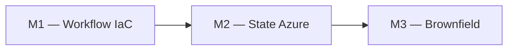
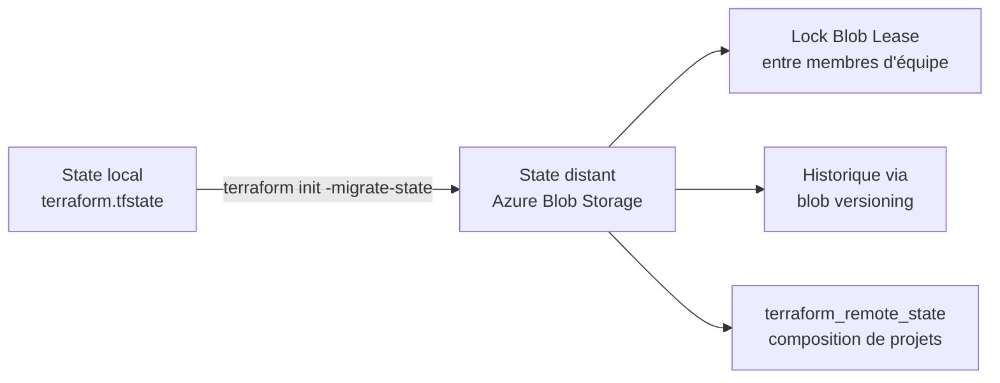
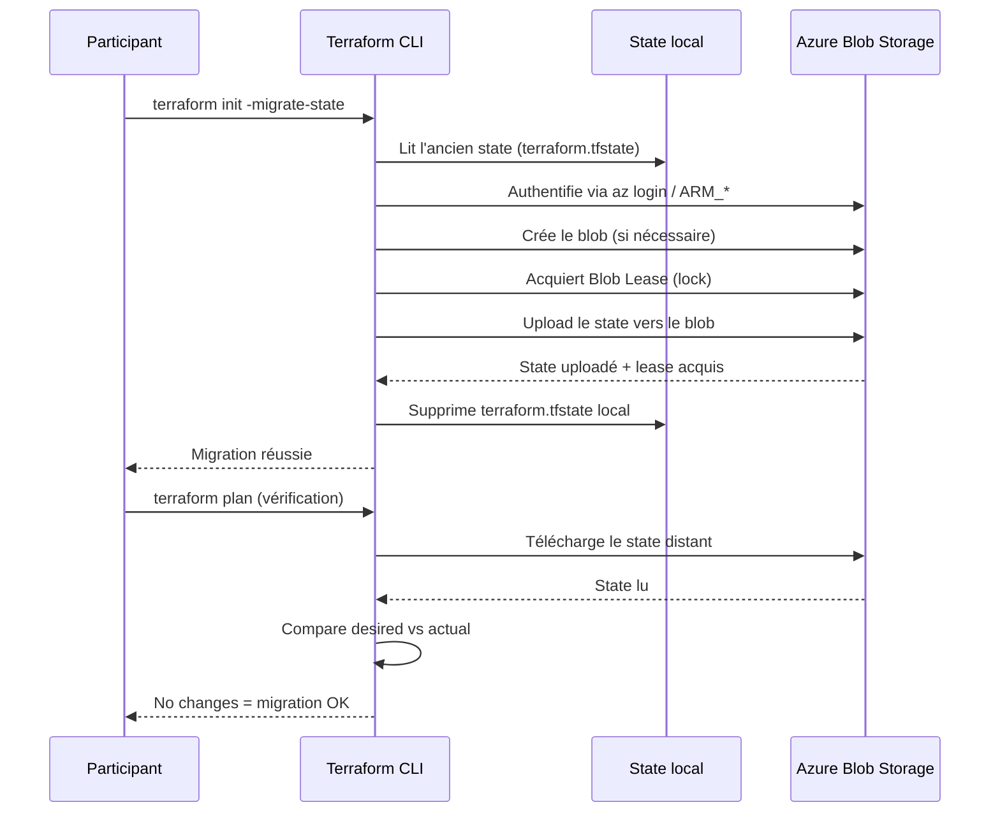
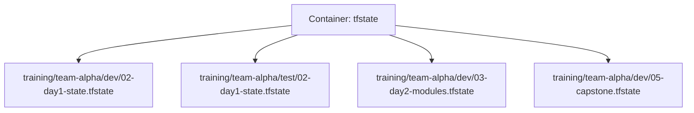
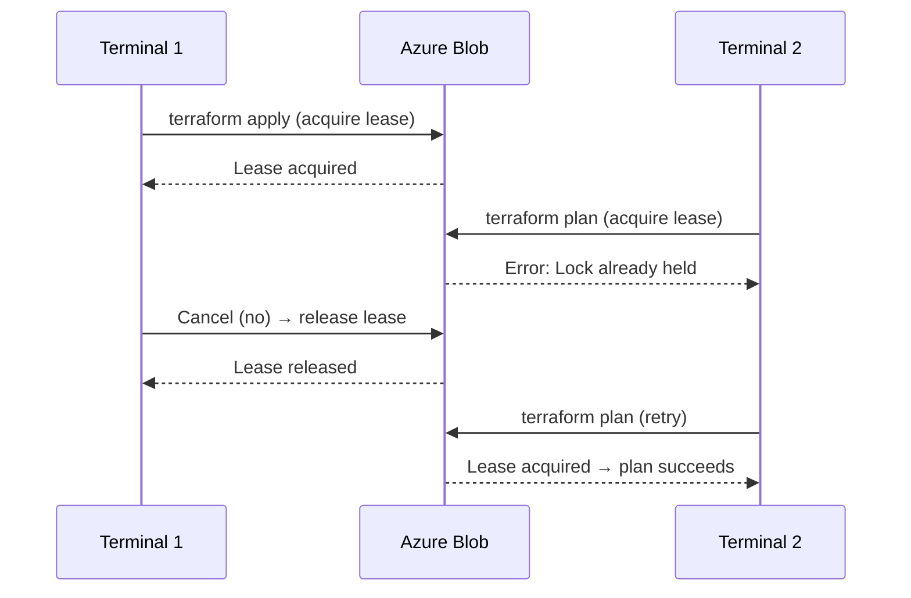

# Lab M2 -- State distant Azure Blob Storage (azurerm)

**Durée :** 70 min
**Code :** `project/02-day1-state/` , `project/00-bootstrap/`
**Patterns :** Remote state, locking, migration, state isolation, state composition

---

## Contexte métier

Un state local crée un point de défaillance et autorise des applications concurrentes. Azure Blob Storage fournit une source de vérité partagée, chiffrée et verrouillée pour l'équipe plateforme.

## Contexte architecture



| Référentiel | Alignement |
|---|---|
| Pattern | Remote State |
| Azure Well-Architected | Fiabilité, Sécurité |
| Azure CAF | Ready |
| Platform Engineering | État partagé et verrouillage natif |

## Pattern d'entreprise

Le pattern **Remote State** centralise la correspondance code-réalité, utilise un Blob Lease contre les écritures concurrentes et isole chaque environnement par clé de state.

## Objectifs

À l'issue de ce lab, vous serez capable de :

- ✅ Déployer un backend Azure Blob Storage pour stocker le state Terraform à distance.
- ✅ Comprendre le paradoxe du bootstrapping (Terraform gère son propre backend).
- ✅ Migrer un state local vers un backend distant avec `terraform init -migrate-state`.
- ✅ Tester le locking concurrent (Blob Lease) entre deux terminaux.
- ✅ Analyser la structure du fichier `terraform.tfstate` (serial, lineage, resources).
- ✅ Utiliser `terraform_remote_state` pour lire les outputs d'un autre projet.
- ✅ Savoir quand utiliser `terraform force-unlock` (et quand ne pas le faire).

---

## Prérequis

> **Prérequis communs :** le Lab M0 est terminé et `terraform plan` fonctionne dans `project/01-day1-basics`. En mode formation, utilisez uniquement le secret `SNOWFLAKE_PASSWORD` distribué par le formateur ; ne stockez jamais sa valeur dans Git.

- Lab M1 terminé (ressources déployées dans `project/01-day1-basics/`)
- Azure CLI installé et connecté (`az login`)
- Terraform >= 1.14.5
- Compte Azure avec permission de créer Resource Group et Storage Account

---

## Concept — Pourquoi avant comment

Le state local `terraform.tfstate` est un risque en équipe : pas de verrou, pas d'historique, pas de partage. La migration vers un **backend Azure Blob Storage** avec **Blob Lease** résout ces problèmes. Le **bootstrapping** est le paradoxe initial : Terraform gère son propre backend.



### Séquence de migration du state vers Azure Blob



**Patterns IaC :**
- **Remote State :** Le state est stocké hors de la machine locale, accessible par l'équipe
- **State Isolation :** Chaque environnement a son propre state path (clé de blob)
- **Bootstrapping :** Terraform gère son propre backend (paradoxe du premier apply)
- **Sensitive State :** Le state contient des données sensibles — accès restreint via RBAC Azure
- **State Composition :** `terraform_remote_state` permet à un projet de lire les outputs d'un autre

---

## Implémentation guidée

### Étape 1 -- Bootstrap du backend Azure Blob Storage (15 min)

**Objectif :** Déployer l'infrastructure Azure qui hébergera le state distant.

```powershell
cd project/00-bootstrap
```

> **Note :** Le bootstrapping est un **paradoxe** : Terraform gère son propre backend. Solution : premier `apply` en local (state local), puis plus jamais. Le state du bootstrap reste local volontairement.

Créer `terraform.tfvars` :

```hcl
azure_location       = "westeurope"
project_name         = "data2ai-tf-training"
resource_group_name  = "rg-data2ai-tf-state"
storage_account_name = "sadata2aitfstate<suffixe>"   # Doit être globalement unique
container_name       = "tfstate"
```

> **⚠ Piège :** Le nom du Storage Account doit être **globalement unique** (3-24 caractères, minuscules uniquement). Ajoutez un suffixe unique (ex: vos initiales).

Déployer :

```powershell
terraform init
terraform plan -out=bootstrap.tfplan
terraform apply bootstrap.tfplan
```

**Résultat attendu :**
```
azurerm_resource_group.state: Creating...
azurerm_resource_group.state: Creation complete after 3s
azurerm_storage_account.state: Creating...
azurerm_storage_account.state: Creation complete after 8s
azurerm_storage_container.state: Creating...
azurerm_storage_container.state: Creation complete after 1s

Apply complete! Resources: 3 added, 0 changed, 0 destroyed.
```

Noter les outputs :

```powershell
terraform output resource_group_name
terraform output storage_account_name
terraform output container_name
terraform output backend_config_snippet
```

> **Tip :** Conservez le `backend_config_snippet` — il contient le bloc HCL à copier dans `backend.tf` à l'étape 3.

---

### Étape 2 -- Analyser le state local (10 min)

**Objectif :** Comprendre la structure interne du fichier `terraform.tfstate`.

```powershell
cd ../01-day1-basics
terraform state list
```

**Résultat attendu :**
```
snowflake_database.raw
snowflake_schema.raw["FINANCE"]
snowflake_schema.raw["SALES"]
snowflake_warehouse.etl
```

```powershell
terraform state show snowflake_database.raw
```

Ouvrir `terraform.tfstate` (fichier JSON) :

```powershell
Get-Content terraform.tfstate | ConvertFrom-Json | ConvertTo-Json -Depth 10
```

> **Tip :** Le state file est un JSON plat. Les champs clés sont : `version` (format du state), `terraform_version`, `serial` (incrémenté à chaque apply), `lineage` (identifiant unique du state), `resources` (liste des ressources).

**Questions de compréhension :**
1. Quelle est la valeur de `serial` ? Pourquoi est-ce important pour le locking ?
2. Que contient `lineage` et pourquoi est-il immuable ?
3. Quelles dépendances sont listées dans `depends_on` pour `snowflake_schema.raw` ?
4. Quel est le format du state (version, modules, resources) ?

> **Note :** Le `serial` est incrémenté à chaque `terraform apply`. Si deux utilisateurs font un `apply` simultanément, le locking (Blob Lease) empêche la corruption. Le `lineage` est un UUID généré à la création du state — il ne change jamais et identifie de manière unique ce state.

---

### Étape 3 -- Configurer le backend Azure Blob (10 min)

**Objectif :** Déclarer où Terraform doit stocker son state.

> **Note alternative :** Si vous n'avez pas d'abonnement Azure disponible, vous pouvez conserver le state local (`backend local`) et sauter les étapes 3 à 6. L'analyse du fichier `terraform.tfstate` local reste pertinente.

Copier `project/02-day1-state/backend.tf.example` vers `backend.tf` et l'éditer :

```hcl
terraform {
  backend "azurerm" {
    resource_group_name  = "rg-data2ai-tf-state"
    storage_account_name = "sadata2aitfstate<suffixe>"
    container_name       = "tfstate"
    key                  = "training/<team>/dev/02-day1-state.tfstate"
  }
}
```

> **Note :** Remplacez `<team>` par votre nom d'équipe (ex: `team-alpha`). La clé de blob inclut le module et l'environnement pour l'isolation.

> **Pattern :** La clé de blob (`key`) inclut l'environnement et le module : `training/<team>/dev/02-day1-state.tfstate`. C'est l'**isolation par prefixe** — chaque environnement et chaque module a son propre state file dans le même container.



> **⚠ Piège :** Ne mettez **jamais** les credentials Azure dans `backend.tf`. Terraform utilise automatiquement `az login` ou les variables `ARM_*` pour s'authentifier.

---

### Étape 4 -- Migrer le state (10 min)

**Objectif :** Transférer le state local vers Azure Blob sans perte de données.

```powershell
cd ../02-day1-state
terraform init -migrate-state
```

Répondre `yes` à la copie du state local vers Azure Blob.

**Résultat attendu :**
```
Initializing the backend...
Do you want to copy existing state to the new backend?
  Pre-existing state was found in the "local" backend and no "local" backend
  configuration was found. If you want to copy the existing state to the
  new backend, type "yes".
  Enter a value: yes

Successfully configured the backend "azurerm"! Terraform will automatically
use this backend unless the backend configuration changes.
```

Vérifier que la migration s'est bien passée :

```powershell
terraform plan
# Attendu : No changes. Your infrastructure matches the configuration.
```

> **Pattern :** `terraform init -migrate-state` est la **seule** opération de migration. Il n'y a pas besoin de `terraform state push` manuel. Terraform copie le state local vers le backend distant et supprime le fichier local.

---

### Étape 5 -- Vérifier le state dans Azure Blob (5 min)

**Objectif :** Confirmer que le state file est bien stocké dans Azure.

```powershell
az storage blob list --account-name sadata2aitfstate<suffixe> --container-name tfstate --prefix training/
```

**Résultat attendu :**
```json
[
  {
    "name": "training/<team>/dev/02-day1-state.tfstate",
    "blobType": "BlockBlob",
    "contentLength": 4096,
    ...
  }
]
```

> **Tip :** Le versioning des blobs Azure garde un **historique de chaque version** du state. Vous pouvez restaurer une version précédente via le portail Azure ou `az storage blob set-tier`.

---

### Étape 6 -- Tester le locking concurrent (10 min)

**Objectif :** Vérifier que le Blob Lease empêche les opérations simultanées.

**Terminal 1 :**
```powershell
terraform apply   # Laisser en attente "Enter a value:"
```

**Terminal 2 (pendant que le terminal 1 bloque) :**
```powershell
terraform plan
```

**Résultat attendu (terminal 2) :**
```
Error: Error acquiring the state lock
Lock Info:
  ID:        abc123...
  Path:      training/<team>/dev/02-day1-state.tfstate
  Operation: OperationTypeApply
  Who:       <hostname>
  Version:   1.14.5
  Created:   2026-07-01 ...
```

> **Pattern :** Le locking empêche deux `apply` simultanés qui **corrompraient le state**. C'est le mécanisme de sécurité fondamental du travail en équipe.

Dans le terminal 1, taper `no` pour annuler l'apply, ce qui libère le lock.



---

### Étape 7 -- Forcer le délock (bonus, seulement si nécessaire) (5 min)

**Objectif :** Libérer un lock orphelin (cas de plantage).

```powershell
terraform force-unlock <LOCK_ID>
```

> **⚠ Danger :** À n'utiliser qu'en cas de plantage ou de lock orphelin. Ne **jamais** délocker pendant un `apply` en cours — cela corromprait le state.

Vérifier que le lock est libéré :

```powershell
terraform plan
# Attendu : plan normal sans erreur de lock
```

---

### Étape 8 -- Lire le state distant depuis un autre projet (10 min)

**Objectif :** Utiliser `terraform_remote_state` pour la composition de projets.

Pattern : un projet de **reporting** qui lit les noms des bases de données créées par le projet principal.

Créer un fichier `remote-state.tf` dans un dossier test :

```hcl
data "terraform_remote_state" "main" {
  backend = "azurerm"
  config = {
    resource_group_name  = "rg-data2ai-tf-state"
    storage_account_name = "sadata2aitfstate<suffixe>"
    container_name       = "tfstate"
    key                  = "training/<team>/dev/02-day1-state.tfstate"
  }
}

output "remote_database_names" {
  value = data.terraform_remote_state.main.outputs
}
```

```powershell
terraform init
terraform output
```

> **Pattern :** `terraform_remote_state` permet la **composition de projets** sans duplication de code. Évitez d'en abuser — préférez les **modules** pour le partage de logique. Le remote state est en **lecture seule**.

---

## Exercice challenge

**Objectif :** Configurer une politique de cycle de vie (lifecycle policy) sur le Storage Account pour archiver automatiquement les anciennes versions du state.

**Consignes :**
1. Ajouter une ressource `azurerm_storage_management_policy` dans `project/00-bootstrap/main.tf`
2. Configurer la règle : déplacer vers Cool après 30 jours, Archive après 90 jours, supprimer après 365 jours
3. Filtrer sur le prefixe `training/`
4. Appliquer et vérifier dans le portail Azure

**Critères de validation :**
- [ ] `terraform plan` montre 1 ressource à ajouter
- [ ] `terraform apply` réussit sans erreur
- [ ] La policy est visible dans le portail Azure (Storage Account → Lifecycle management)
- [ ] Le filtre `prefix_match` contient `training/`

> **Hint :** Regardez la section Bonus ci-dessous pour la structure HCL de la ressource `azurerm_storage_management_policy`.

---

## Validation et auto-évaluation

### Checklist de compétences

- [ ] Je sais déployer un backend Azure Blob Storage pour Terraform
- [ ] Je comprends le paradoxe du bootstrapping
- [ ] Je peux migrer un state local vers un backend distant
- [ ] Je sais tester le locking concurrent
- [ ] Je comprends la structure du fichier `terraform.tfstate` (serial, lineage)
- [ ] Je peux utiliser `terraform_remote_state` pour lire les outputs d'un autre projet
- [ ] Je sais quand utiliser `terraform force-unlock` (et quand ne pas le faire)

### Quiz rapide

1. **Pourquoi le state local est-il un risque en équipe ?**
   - [ ] Il est trop volumineux
   - [ ] Pas de verrou, pas d'historique, pas de partage entre membres
   - [ ] Il ne supporte pas JSON
   - [ ] Il est lent
   > Réponse : Pas de verrou, pas d'historique, pas de partage

2. **Que fait `terraform init -migrate-state` ?**
   - [ ] Supprime le state local
   - [ ] Copie le state local vers le nouveau backend distant
   - [ ] Crée un nouveau state vide
   - [ ] Télécharge les providers
   > Réponse : Copie le state local vers le nouveau backend distant

3. **Qu'est-ce que le `serial` dans le state file ?**
   - [ ] Un identifiant unique immuable
   - [ ] Un compteur incrémenté à chaque apply
   - [ ] La version de Terraform
   - [ ] Le nombre de ressources
   > Réponse : Un compteur incrémenté à chaque apply

4. **Quand utiliser `terraform force-unlock` ?**
   - [ ] Régulièrement après chaque apply
   - [ ] Uniquement en cas de lock orphelin (plantage)
   - [ ] Avant chaque plan
   - [ ] Jamais, c'est interdit
   > Réponse : Uniquement en cas de lock orphelin

5. **Comment isoler les states par environnement avec un seul container Azure Blob ?**
   - [ ] Créer un container par environnement
   - [ ] Utiliser des clés de blob différentes (`key = ".../dev/tfstate"` vs `.../test/tfstate`)
   - [ ] Utiliser des comptes de stockage différents
   - [ ] Ce n'est pas possible
   > Réponse : Utiliser des clés de blob différentes

---

### Diagnostic guidé

| Symptôme | Cause probable | Action |
|----------|----------------|--------|
| `AccessDenied` sur Azure Blob | Credentials Azure manquants | Vérifier `az login` ou `ARM_*` env vars |
| `StorageAccountAlreadyExists` | Le nom du compte est global | Ajoutez un suffixe unique |
| `Lock not held` après force-unlock | Un autre processus tient encore le lock | Attendre ou tuer le processus |
| State non trouvé dans Azure Blob | Clé (`key`) incorrecte | Vérifier `backend.tf` et `az storage blob list` |
| `InvalidAuthenticationToken` | Token Azure expiré | Relancer `az login` |
| `Error: Failed to download state` | Réseau ou permissions | Vérifier RBAC sur le Storage Account |

---

## Bonus : Aller plus loin

- Activer le **versionnement** sur le conteneur de blobs pour l'historique des states
- Configurer une **politique de cycle de vie** Azure Blob pour archiver les anciennes versions :

```hcl
resource "azurerm_storage_management_policy" "state" {
  storage_account_id = azurerm_storage_account.state.id

  rule {
    name    = "state-version-retention"
    enabled = true

    filters {
      blob_types   = ["blockBlob"]
      prefix_match = ["training/"]
    }

    actions {
      version {
        change_tier_to_cool_after_days_since_creation    = 30
        change_tier_to_archive_after_days_since_creation = 90
        delete_after_days_since_creation                 = 365
      }
    }
  }
}
```

- Utiliser des **clés de blob différentes** par environnement :
  ```
  training/<team>/dev/02-day1-state.tfstate
  training/<team>/test/02-day1-state.tfstate
  training/<team>/prod/02-day1-state.tfstate
  ```
- Ajouter une **règle RBAC** qui restreint l'accès au Storage Account par équipe
- Tester le **chiffrement côté serveur** (Microsoft-managed ou CMK) sur le Storage Account

---

## Troubleshooting

### `Error: Failed to download state` depuis Azure Blob

1. Vérifiez `az login` (token expiré).
2. Vérifiez les variables `ARM_*` si vous utilisez un Service Principal.
3. Vérifiez le RBAC sur le Storage Account (rôle **Storage Blob Data Contributor**).

### `Error: state lock already held`

1. Vérifiez qu'aucun autre terminal n'a un `terraform apply` en cours.
2. Si le lock est orphelin (plantage) : `terraform force-unlock <LOCK_ID>`.
3. **Ne jamais** force-unlock pendant un apply en cours.

### `terraform plan` affiche des changements inattendus après migration

1. Vérifiez que vous êtes dans le bon répertoire (`project/02-day1-state`).
2. Vérifiez votre `terraform.tfvars` (même `deployment_mode` qu'au Lab M1).
3. Lancez `terraform refresh` puis `terraform plan`.

### `AccessDenied` sur Azure Blob

Credentials Azure manquants. Vérifiez `az login` ou les variables d'environnement `ARM_*` (ARM_SUBSCRIPTION_ID, ARM_TENANT_ID, ARM_CLIENT_ID, ARM_CLIENT_SECRET).

### `StorageAccountAlreadyExists`

Le nom du Storage Account doit être **globalement unique** (3-24 caractères, minuscules uniquement). Ajoutez un suffixe unique (ex: vos initiales) dans `terraform.tfvars` du bootstrap.
---

## Notes d'architecte

- **Décision :** la capacité du module est traitée comme un produit de plateforme, pas comme un exemple isolé.
- **Compromis :** le lab réduit volontairement l'échelle afin de rester exécutable en sandbox ; les contrôles de production restent obligatoires.
- **Garde-fou :** toute modification doit produire un plan relu, une validation technique et une preuve d'absence de dérive.

## Bonnes pratiques Enterprise

- Versionner les contrats et les modules, jamais les secrets ni les fichiers de state.
- Appliquer le moindre privilège aux identités humaines et techniques.
- Utiliser un state distant isolé, un artefact de plan immuable et une approbation avant production.
- Rendre sécurité, fiabilité, coût et observabilité vérifiables par le pipeline.

## Notes de production

| Dimension | Training | Production |
|---|---|---|
| Identité | Secret transmis hors Git | JWT, identité technique dédiée et rotation contrôlée |
| State | Backend simplifié ou sandbox | Azure Blob privé, chiffré, verrouillé et isolé |
| Déploiement | Exécution locale guidée | Azure DevOps, approbation et artefact de plan |
| Exploitation | Validation ponctuelle | SLO, alertes, runbooks, FinOps et contrôle continu de dérive |

## Réflexion

1. Quel risque métier réapparaît si cette capacité est gérée manuellement ?
2. Quel contrôle doit devenir obligatoire avant une promotion en production ?
3. Quelle preuve transmettre à l'équipe qui exploite la capacité suivante ?


