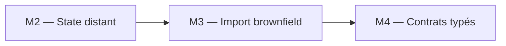

# 🧪 Lab M3 — Import brownfield et alignement Terraform

| Élément | Valeur |
|---|---|
| **Durée** | 60 min |
| **Piste** | `[CORE]` |
| **Workspace** | `$HOME/Data2AI-Labs/data-platform` (le clone) |
| **Dossier de travail** | `environments/dev/` dans le clone |
| **Coût** | Aucune nouvelle ressource |
| **Cleanup** | Conserver jusqu'au Jour 3 |

## 🎯 Mission

Une entreprise ne remplace pas une plateforme Snowflake existante pour adopter Terraform. Elle l'intègre sans interruption. Vous allez importer une ressource Snowflake existante dans le state Terraform, puis corriger la dérive.

## 🏗️ Architecture



## 🎯 Objectifs

- ✅ importer une ressource Snowflake existante dans Terraform;
- ✅ générer la configuration à partir de l'import;
- ✅ détecter et corriger une dérive intentionnelle;
- ✅ utiliser un bloc `moved` pour refactorer sans destruction.

## 📋 Prérequis

- [ ] M2 terminé : le state est dans Azure Blob Storage avec `use_azuread_auth = true`;
- [ ] `terraform state list` affiche les ressources M1 (database, schemas, warehouse);
- [ ] `snow sql -c training -q 'SHOW DATABASES'` fonctionne.

## 🚀 Préflight

<details>
<summary>🪟 <b>Windows (PowerShell)</b></summary>

```powershell
cd "$HOME\Data2AI-Labs\data-platform"
.\scripts\Learner-Login.ps1 -LearnerPrefix APP01
$env:TF_VAR_snowflake_password = (Get-Content .\secrets\snowflake_password.txt -Raw).Trim()
cd .\environments\dev
terraform version
terraform state list
terraform plan
```
</details>

<details>
<summary>🐧 <b>Linux/macOS (Bash)</b></summary>

```bash
cd "$HOME/Data2AI-Labs/data-platform"
source ./scripts/learner-login.sh APP01
export TF_VAR_snowflake_password=$(tr -d '[:space:]' < ./secrets/snowflake_password.txt)
cd ./environments/dev
terraform version
terraform state list
terraform plan
```
</details>

✅ **Checkpoint préflight** : Terraform `v1.14.5`, ressources M1 listées, et `terraform plan` affiche `No changes`.

> 🔒 **Security** : n'affichez jamais `ARM_CLIENT_SECRET`, `SNOWFLAKE_PASSWORD` ou `TF_VAR_snowflake_password`.

> ⚠️ **IMPORTANT** : Si vous obtenez `Error acquiring the state lock`, un processus Terraform précédent a laissé un verrou. Voir [troubleshooting.md](troubleshooting.md) — utilisez `terraform force-unlock <LOCK_ID>` uniquement si aucun processus Terraform n'est actif.

## 📝 Partie 1 — Créer une ressource hors Terraform

### 📝 Étape 1.1 — Créer une database manuellement dans Snowflake

Chaque apprenant utilise son préfixe pour éviter les conflits de noms dans le compte Snowflake partagé. Remplacez `APP01` par votre préfixe.

<details>
<summary>🪟 <b>Windows (PowerShell)</b></summary>

```powershell
$brownfieldDb = "DB_${env:LEARNER_PREFIX}_BROWNFIELD_DEV"
snow sql -c training -q "CREATE DATABASE $brownfieldDb COMMENT = 'Created manually outside Terraform'"
```
</details>

<details>
<summary>🐧 <b>Linux/macOS (Bash)</b></summary>

```bash
brownfield_db="DB_${LEARNER_PREFIX}_BROWNFIELD_DEV"
snow sql -c training -q "CREATE DATABASE ${brownfield_db} COMMENT = 'Created manually outside Terraform'"
```
</details>

> 💡 **Note** : Avec le préfixe `APP01`, la database s'appelle `DB_APP01_BROWNFIELD_DEV`. Utilisez le même nom dans toutes les étapes suivantes.

### 📝 Étape 1.2 — Vérifier

<details>
<summary>🪟 <b>Windows (PowerShell)</b></summary>

```powershell
snow sql -c training -q "SHOW DATABASES LIKE 'DB_${env:LEARNER_PREFIX}_BROWNFIELD_DEV'"
```
</details>

<details>
<summary>🐧 <b>Linux/macOS (Bash)</b></summary>

```bash
snow sql -c training -q "SHOW DATABASES LIKE 'DB_${LEARNER_PREFIX}_BROWNFIELD_DEV'"
```
</details>

✅ **Checkpoint 1** : une ligne avec votre database (par exemple `DB_APP01_BROWNFIELD_DEV`).

> 💡 **Note** : Cette ressource existe dans Snowflake mais **pas** dans le state Terraform. C'est une ressource brownfield.

## 📝 Partie 2 — Importer dans Terraform

### 📝 Étape 2.1 — Ajouter un bloc resource vide

Dans `environments/dev/main.tf`, ajoutez à la fin du fichier. Remplacez `APP01` par votre préfixe :

```hcl
resource "snowflake_database" "brownfield" {
  name = "DB_APP01_BROWNFIELD_DEV"
}
```

> 💡 **Note** : Utilisez le nom exact de la database créée à l'étape 1.1. Si vous l'avez personnalisée, adaptez la valeur.

### 📝 Étape 2.2 — Formater et valider

<details>
<summary>🪟 <b>Windows (PowerShell)</b></summary>

```powershell
terraform fmt
terraform validate
```
</details>

<details>
<summary>🐧 <b>Linux/macOS (Bash)</b></summary>

```bash
terraform fmt
terraform validate
```
</details>

✅ **Checkpoint** : `Success! The configuration is valid.`

### 📝 Étape 2.3 — Importer la ressource

<details>
<summary>🪟 <b>Windows (PowerShell)</b></summary>

```powershell
terraform import snowflake_database.brownfield "DB_${env:LEARNER_PREFIX}_BROWNFIELD_DEV"
```
</details>

<details>
<summary>🐧 <b>Linux/macOS (Bash)</b></summary>

```bash
terraform import snowflake_database.brownfield "DB_${LEARNER_PREFIX}_BROWNFIELD_DEV"
```
</details>

✅ **Checkpoint 2** :

```text
Import successful!
```

> 🔍 **En cas de `Error acquiring the state lock`** : un précédent processus Terraform a laissé un verrou. Vérifiez qu'aucun `plan` ou `apply` n'est actif, puis exécutez `terraform force-unlock <LOCK_ID>` avec l'ID affiché dans le message d'erreur.

### 📝 Étape 2.4 — Vérifier le state

<details>
<summary>🪟 <b>Windows (PowerShell)</b></summary>

```powershell
terraform state list
```
</details>

<details>
<summary>🐧 <b>Linux/macOS (Bash)</b></summary>

```bash
terraform state list
```
</details>

✅ **Checkpoint** : la liste contient `snowflake_database.brownfield` en plus des ressources M1.

### 📝 Étape 2.5 — Générer la configuration

<details>
<summary>🪟 <b>Windows (PowerShell)</b></summary>

```powershell
terraform plan -generate-config-out=generated.tf
```
</details>

<details>
<summary>🐧 <b>Linux/macOS (Bash)</b></summary>

```bash
terraform plan -generate-config-out=generated.tf
```
</details>

Terraform compare le state et la configuration, puis génère un fichier avec les attributs réels de la ressource.

✅ **Checkpoint** : un fichier `generated.tf` est créé avec la configuration complète de la database.

### 📝 Étape 2.6 — Intégrer la configuration générée

Ouvrez `generated.tf`, copiez les attributs pertinents dans `main.tf` (dans le bloc `snowflake_database.brownfield`), puis supprimez `generated.tf` :

<details>
<summary>🪟 <b>Windows (PowerShell)</b></summary>

```powershell
Remove-Item generated.tf
```
</details>

<details>
<summary>🐧 <b>Linux/macOS (Bash)</b></summary>

```bash
rm generated.tf
```
</details>

Votre `main.tf` devrait maintenant contenir (avec votre préfixe) :

```hcl
resource "snowflake_database" "brownfield" {
  name                        = "DB_APP01_BROWNFIELD_DEV"
  comment                     = "Created manually outside Terraform"
  data_retention_time_in_days = 1
}
```

### 📝 Étape 2.7 — Formater, valider, planifier

<details>
<summary>🪟 <b>Windows (PowerShell)</b></summary>

```powershell
terraform fmt
terraform validate
terraform plan
```
</details>

<details>
<summary>🐧 <b>Linux/macOS (Bash)</b></summary>

```bash
terraform fmt
terraform validate
terraform plan
```
</details>

✅ **Checkpoint 3** : `No changes. Your infrastructure matches the configuration.`

## 📝 Partie 3 — Détecter et corriger une dérive

### 📝 Étape 3.1 — Modifier la ressource hors Terraform

<details>
<summary>🪟 <b>Windows (PowerShell)</b></summary>

```powershell
snow sql -c training -q "ALTER DATABASE DB_${env:LEARNER_PREFIX}_BROWNFIELD_DEV SET COMMENT = 'Modified outside Terraform'"
```
</details>

<details>
<summary>🐧 <b>Linux/macOS (Bash)</b></summary>

```bash
snow sql -c training -q "ALTER DATABASE DB_${LEARNER_PREFIX}_BROWNFIELD_DEV SET COMMENT = 'Modified outside Terraform'"
```
</details>

### 📝 Étape 3.2 — Détecter la dérive

<details>
<summary>🪟 <b>Windows (PowerShell)</b></summary>

```powershell
terraform plan
```
</details>

<details>
<summary>🐧 <b>Linux/macOS (Bash)</b></summary>

```bash
terraform plan
```
</details>

✅ **Checkpoint** : Terraform détecte que le `comment` a changé et propose de le remettre à la valeur de la configuration.

### 📝 Étape 3.3 — Corriger la dérive

<details>
<summary>🪟 <b>Windows (PowerShell)</b></summary>

```powershell
terraform apply
```
</details>

<details>
<summary>🐧 <b>Linux/macOS (Bash)</b></summary>

```bash
terraform apply
```
</details>

✅ **Checkpoint** : Terraform remet le `comment` à la valeur définie dans `main.tf`.

### 📝 Étape 3.4 — Vérifier l'idempotence

<details>
<summary>🪟 <b>Windows (PowerShell)</b></summary>

```powershell
terraform plan
```
</details>

<details>
<summary>🐧 <b>Linux/macOS (Bash)</b></summary>

```bash
terraform plan
```
</details>

✅ **Checkpoint 4** : `No changes.`

## 📝 Partie 4 — Refactorer avec un bloc moved

### 📝 Étape 4.1 — Renommer la ressource dans main.tf

Renommez `snowflake_database.brownfield` en `snowflake_database.imported` :

```hcl
resource "snowflake_database" "imported" {
  name                        = "DB_APP01_BROWNFIELD_DEV"
  comment                     = "Created manually outside Terraform"
  data_retention_time_in_days = 1
}
```

### 📝 Étape 4.2 — Ajouter un bloc moved

Ajoutez en haut de `main.tf` :

```hcl
moved {
  from = snowflake_database.brownfield
  to   = snowflake_database.imported
}
```

### 📝 Étape 4.3 — Planifier

<details>
<summary>🪟 <b>Windows (PowerShell)</b></summary>

```powershell
terraform plan
```
</details>

<details>
<summary>🐧 <b>Linux/macOS (Bash)</b></summary>

```bash
terraform plan
```
</details>

✅ **Checkpoint** : `1 resource has been moved.` et `No changes.` — Terraform a déplacé la ressource dans le state sans la recréer.

### 📝 Étape 4.4 — Appliquer

<details>
<summary>🪟 <b>Windows (PowerShell)</b></summary>

```powershell
terraform apply
```
</details>

<details>
<summary>🐧 <b>Linux/macOS (Bash)</b></summary>

```bash
terraform apply
```
</details>

### 📝 Étape 4.5 — Supprimer le bloc moved

Une fois le move appliqué, supprimez le bloc `moved` de `main.tf`. Il n'est plus nécessaire.

<details>
<summary>🪟 <b>Windows (PowerShell)</b></summary>

```powershell
terraform fmt
terraform validate
terraform plan
```
</details>

<details>
<summary>🐧 <b>Linux/macOS (Bash)</b></summary>

```bash
terraform fmt
terraform validate
terraform plan
```
</details>

✅ **Checkpoint 5** : `No changes.`

## ✅ Validation finale

- [ ] import réussi sans erreur;
- [ ] configuration générée et intégrée;
- [ ] dérive détectée et corrigée;
- [ ] bloc `moved` utilisé sans destruction;
- [ ] `terraform plan` sans changement.

## 🏆 Challenge

Importez le warehouse créé en M1 dans une nouvelle ressource `snowflake_warehouse.imported_etl` avec un bloc `moved`.

Critères :

- [ ] `terraform import` réussit;
- [ ] `terraform plan` affiche `No changes` après alignement;
- [ ] le bloc `moved` déplace la ressource sans destruction;
- [ ] `terraform state list` affiche le nouveau nom.

## 🧹 Cleanup

> ⚠️ **WARNING** : Ne détruisez pas les ressources. Elles sont réutilisées au Jour 3.

Si vous voulez supprimer la database brownfield :

<details>
<summary>🪟 <b>Windows (PowerShell)</b></summary>

```powershell
snow sql -c training -q "DROP DATABASE DB_${env:LEARNER_PREFIX}_BROWNFIELD_DEV"
terraform state rm snowflake_database.imported
```
</details>

<details>
<summary>🐧 <b>Linux/macOS (Bash)</b></summary>

```bash
snow sql -c training -q "DROP DATABASE DB_${LEARNER_PREFIX}_BROWNFIELD_DEV"
terraform state rm snowflake_database.imported
```
</details>
