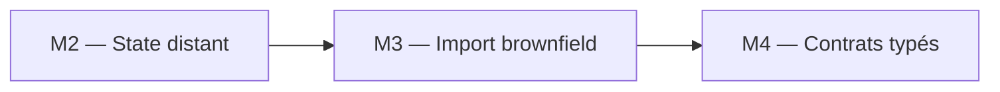

# Lab M3 — Import brownfield et alignement Terraform

| Élément | Valeur |
|---|---|
| **Durée** | 60 min |
| **Piste** | `[CORE]` |
| **Workspace** | `$HOME/Data2AI-Labs/data-platform` (le clone) |
| **Dossier de travail** | `environments/dev/` dans le clone |
| **Coût** | Aucune nouvelle ressource |
| **Cleanup** | Conserver jusqu'au Jour 3 |

## Mission

Une entreprise ne remplace pas une plateforme Snowflake existante pour adopter Terraform. Elle l'intègre sans interruption. Vous allez importer une ressource Snowflake existante dans le state Terraform, puis corriger la dérive.

## Architecture



## Objectifs

- importer une ressource Snowflake existante dans Terraform;
- générer la configuration à partir de l'import;
- détecter et corriger une dérive intentionnelle;
- utiliser un bloc `moved` pour refactorer sans destruction.

## Prérequis

- [ ] M2 terminé : le state est dans Azure Blob Storage;
- [ ] `terraform state list` affiche 3 ressources;
- [ ] `snow sql -c training -q 'SHOW DATABASES'` fonctionne.

## Partie 1 — Créer une ressource hors Terraform

### Étape 1.1 — Créer une database manuellement dans Snowflake

```bash
snow sql -c training -q "CREATE DATABASE ABC_BROWNFIELD_DEV COMMENT = 'Created manually outside Terraform'"
```

Remplacez `ABC` par votre préfixe.

### Étape 1.2 — Vérifier

```bash
snow sql -c training -q "SHOW DATABASES LIKE 'ABC_BROWNFIELD_DEV'"
```

**Attendu :** une ligne avec votre database.

> Cette ressource existe dans Snowflake mais **pas** dans le state Terraform. C'est une ressource brownfield.

## Partie 2 — Importer dans Terraform

### Étape 2.1 — Ajouter un bloc resource vide

Dans `environments/dev/main.tf`, ajoutez :

```hcl
resource "snowflake_database" "brownfield" {
  name = "${var.learner_prefix}_BROWNFIELD_${var.environment}"
}
```

### Étape 2.2 — Formater et valider

```bash
terraform fmt
terraform validate
```

### Étape 2.3 — Importer la ressource

```bash
terraform import snowflake_database.brownfield ABC_BROWNFIELD_DEV
```

Remplacez `ABC` par votre préfixe.

**Attendu :**

```text
Import successful!
```

### Étape 2.4 — Vérifier le state

```bash
terraform state list
```

**Attendu :** 4 ressources, dont `snowflake_database.brownfield`.

### Étape 2.5 — Générer la configuration

```bash
terraform plan -generate-config-out=generated.tf
```

Terraform compare le state et la configuration, puis génère un fichier avec les attributs réels de la ressource.

**Attendu :** un fichier `generated.tf` est créé avec la configuration complète de la database.

### Étape 2.6 — Intégrer la configuration générée

Ouvrez `generated.tf`, copiez les attributs pertinents dans `main.tf` (dans le bloc `snowflake_database.brownfield`), puis supprimez `generated.tf` :

```bash
rm generated.tf
```

Votre `main.tf` devrait maintenant contenir :

```hcl
resource "snowflake_database" "brownfield" {
  name                        = "${var.learner_prefix}_BROWNFIELD_${var.environment}"
  comment                     = "Created manually outside Terraform"
  data_retention_time_in_days = 1
}
```

### Étape 2.7 — Formater, valider, planifier

```bash
terraform fmt
terraform validate
terraform plan
```

**Attendu :** `No changes. Your infrastructure matches the configuration.`

## Partie 3 — Détecter et corriger une dérive

### Étape 3.1 — Modifier la ressource hors Terraform

```bash
snow sql -c training -q "ALTER DATABASE ABC_BROWNFIELD_DEV SET COMMENT = 'Modified outside Terraform'"
```

### Étape 3.2 — Détecter la dérive

```bash
terraform plan
```

**Attendu :** Terraform détecte que le comment a changé et propose de le remettre à la valeur de la configuration.

### Étape 3.3 — Corriger la dérive

```bash
terraform apply
```

**Attendu :** Terraform remet le comment à la valeur définie dans `main.tf`.

### Étape 3.4 — Vérifier l'idempotence

```bash
terraform plan
```

**Attendu :** `No changes.`

## Partie 4 — Refactorer avec un bloc moved

### Étape 4.1 — Renommer la ressource dans main.tf

Renommez `snowflake_database.brownfield` en `snowflake_database.imported` :

```hcl
resource "snowflake_database" "imported" {
  name                        = "${var.learner_prefix}_BROWNFIELD_${var.environment}"
  comment                     = "Created manually outside Terraform"
  data_retention_time_in_days = 1
}
```

### Étape 4.2 — Ajouter un bloc moved

Ajoutez en haut de `main.tf` :

```hcl
moved {
  from = snowflake_database.brownfield
  to   = snowflake_database.imported
}
```

### Étape 4.3 — Planifier

```bash
terraform plan
```

**Attendu :** `1 resource has been moved.` et `No changes.` — Terraform a déplacé la ressource dans le state sans la recréer.

### Étape 4.4 — Appliquer

```bash
terraform apply
```

### Étape 4.5 — Supprimer le bloc moved

Une fois le move appliqué, supprimez le bloc `moved` de `main.tf`. Il n'est plus nécessaire.

```bash
terraform fmt
terraform validate
terraform plan
```

**Attendu :** `No changes.`

## Challenge

Importez le warehouse créé en M1 dans une nouvelle ressource `snowflake_warehouse.imported_etl` avec un bloc `moved`.

Critères :

- [ ] `terraform import` réussit;
- [ ] `terraform plan` affiche `No changes` après alignement;
- [ ] le bloc `moved` déplace la ressource sans destruction;
- [ ] `terraform state list` affiche le nouveau nom.

## Cleanup

Ne détruisez pas les ressources. Elles sont réutilisées au Jour 3.

Si vous voulez supprimer la database brownfield :

```bash
snow sql -c training -q "DROP DATABASE ABC_BROWNFIELD_DEV"
terraform state rm snowflake_database.imported
```
