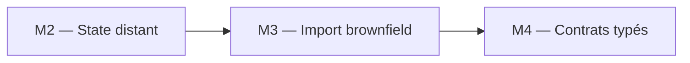
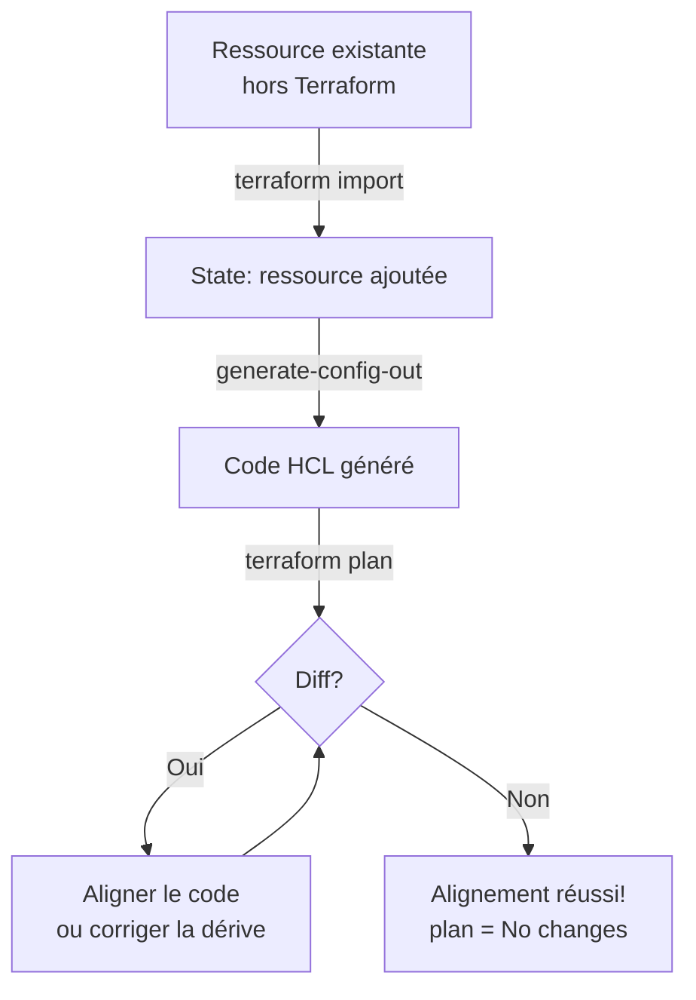
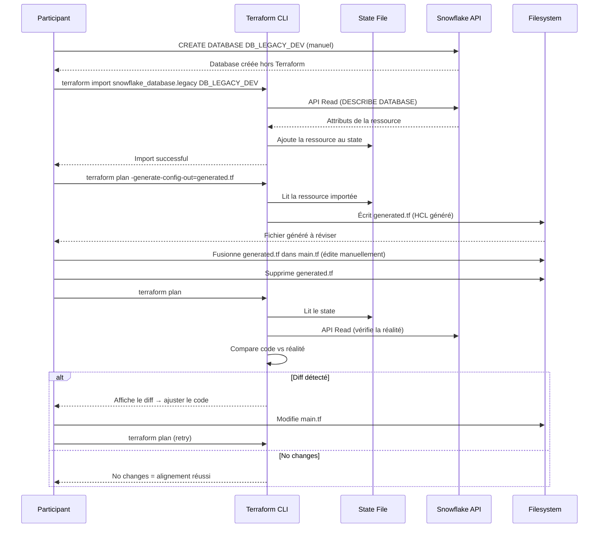
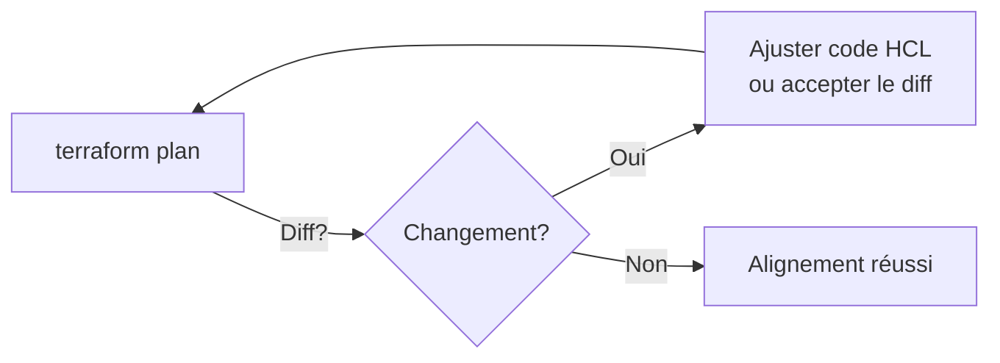
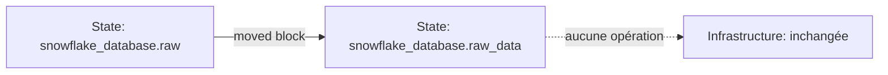

# Lab M3 -- Import brownfield et alignement Terraform

**Durée :** 60 min
**Code :** `project/01-day1-basics/`
**Patterns :** Brownfield import, `generate-config-out`, alignment loop, `state rm`, zero-downtime, `moved` blocks

---

## Contexte métier

Une entreprise ne remplace pas une plateforme Snowflake existante pour adopter Terraform. Elle l'intègre sans interruption, sans recréation et avec une trajectoire de retour arrière explicite.

## Contexte architecture



| Référentiel | Alignement |
|---|---|
| Pattern | Brownfield Import and Safe Refactoring |
| Azure Well-Architected | Fiabilité, Excellence opérationnelle |
| Azure CAF | Adopt |
| Platform Engineering | Adoption incrémentale sans interruption |

## Pattern d'entreprise

Le pattern **Brownfield Import** adopte les ressources existantes dans le state avant tout changement et utilise `moved` ou `state mv` pour refactorer sans destruction.

## Objectifs

À l'issue de ce lab, vous serez capable de :

- ✅ Importer une ressource Snowflake existante avec `terraform import`.
- ✅ Générer la configuration HCL avec `terraform plan -generate-config-out`.
- ✅ Itérer la boucle d'alignement (plan → ajuster → plan) jusqu'à `No changes`.
- ✅ Retirer une ressource du state sans la détruire (`terraform state rm`).
- ✅ Renommer une ressource sans downtime avec les `moved` blocks.
- ✅ Comprendre la différence entre `state rm` et `terraform destroy`.

---

## Prérequis

> **Prérequis communs :** le Lab M0 est terminé et `terraform plan` fonctionne dans `project/01-day1-basics`. En mode formation, utilisez uniquement le secret `SNOWFLAKE_PASSWORD` distribué par le formateur ; ne stockez jamais sa valeur dans Git.

- Labs M1 et M2 terminés
- Terraform >= 1.14.5 (requis pour `generate-config-out`)
- Ressources "legacy" créées manuellement dans Snowflake (voir Étape 1)
- Compréhension du workflow `plan → apply` (Lab M1)

---

## Concept — Pourquoi avant comment

L'**import brownfield** consiste à adopter avec Terraform des ressources créées **en dehors** de Terraform (manuellement, par scripts, ou par un autre outil). Le processus est : `import` → `generate-config-out` → `plan` (alignement) → `apply`. C'est l'opération la plus délicate en Terraform car elle nécessite de réconcilier le code avec la réalité.



### Séquence d'import brownfield



**Patterns IaC :**
- **Brownfield Import :** Adopter une ressource existante dans le state Terraform
- **Config Generation :** `terraform plan -generate-config-out` génère le HCL depuis l'API
- **Alignment Loop :** Itérer `plan` → ajuster le code jusqu'à `No changes`
- **State Surgery :** `terraform state rm` pour retirer une ressource du state sans la détruire
- **Zero-Downtime :** `moved` blocks pour déplacer des ressources sans recréation

---

## Implémentation guidée

### Étape 1 -- Créer des ressources legacy dans Snowflake (5 min)

**Objectif :** Simuler des ressources créées hors Terraform (scénario brownfield).

```sql
-- Créer une database "legacy" manuellement
CREATE DATABASE DB_LEGACY_DEV COMMENT = 'Legacy database created before Terraform';

-- Créer un warehouse "legacy"
CREATE WAREHOUSE WH_LEGACY_DEV
  WAREHOUSE_SIZE = 'X-SMALL'
  AUTO_SUSPEND = 60
  AUTO_RESUME = true
  COMMENT = 'Legacy warehouse';

-- Créer un schema "legacy"
CREATE SCHEMA DB_LEGACY_DEV.LEGACY_DATA COMMENT = 'Legacy schema';
```

> **Note :** Ces ressources existent dans Snowflake mais Terraform ne les connaît pas. C'est le scénario classique du **brownfield** : une organisation qui adopte Terraform sur une infrastructure existante.

---

### Étape 2 -- Importer la database legacy (10 min)

**Objectif :** Ajouter la database existante dans le state Terraform.

```powershell
cd project/01-day1-basics
terraform import snowflake_database.legacy DB_LEGACY_DEV
```

**Résultat attendu :**
```
snowflake_database.legacy: Importing from ID "DB_LEGACY_DEV"...
snowflake_database.legacy: Import prepared!
  Prepared snowflake_database for import
snowflake_database.legacy: Refreshing state... [id=DB_LEGACY_DEV]
snowflake_database.legacy: Import successful!

Import successful!

The resources that were imported are shown above. These resources are now in
your Terraform state. Terraform will now track and manage these resources.
```

> **Tip :** L'ID d'import dépend du type de ressource. Pour une database Snowflake, c'est simplement le nom. Consultez la documentation du provider pour chaque type de ressource.

Vérifier que la ressource est dans le state :

```powershell
terraform state list
```

**Résultat attendu :**
```
snowflake_database.raw
snowflake_database.legacy    # <-- nouvellement importée
snowflake_schema.raw["FINANCE"]
snowflake_schema.raw["SALES"]
snowflake_warehouse.etl
```

> **⚠ Piège :** À ce stade, la ressource est dans le state mais **aucun bloc HCL** n'existe dans `main.tf`. Si vous lancez `terraform plan`, Terraform voudra **détruire** la ressource (car elle n'est pas dans le code).

---

### Étape 3 -- Générer la configuration HCL (10 min)

**Objectif :** Laisser Terraform générer le code HCL correspondant à la ressource importée.

```powershell
terraform plan -generate-config-out=generated.tf
```

**Résultat attendu :**
```
# __generated__ by Terraform
# from __resources__ snowflake_database.legacy
resource "snowflake_database" "legacy" {
  comment = "Legacy database created before Terraform"
  id      = "DB_LEGACY_DEV"
  name    = "DB_LEGACY_DEV"
}
```

> **Pattern :** `generate-config-out` interroge l'API Snowflake et génère le HCL qui correspond exactement à l'état actuel de la ressource. C'est le point de départ de l'alignement.

Inspecter le fichier généré :

```powershell
Get-Content generated.tf
```

> **Tip :** Le fichier généré contient des attributs read-only (comme `id`). Supprimez-les avant de fusionner avec `main.tf`. Gardez uniquement les attributs que vous voulez gérer.

Déplacer le contenu pertinent dans `main.tf` et supprimer `generated.tf` :

```hcl
# Dans main.tf
resource "snowflake_database" "legacy" {
  name    = "DB_LEGACY_DEV"
  comment = "Legacy database created before Terraform"
}
```

```powershell
Remove-Item generated.tf
```

---

### Étape 4 -- Boucle d'alignement (10 min)

**Objectif :** Itérer jusqu'à ce que `terraform plan` affiche `No changes`.

```powershell
terraform plan
```

**Cas 1 : `No changes`**
L'alignement est réussi ! La ressource est gérée par Terraform.

**Cas 2 : Diff affiché**
```
# snowflake_database.legacy will be updated in-place
~ resource "snowflake_database" "legacy" {
    ~ comment = "Legacy database created before Terraform" -> "Managed by Terraform"
  }
```

> **Pattern :** C'est la **boucle d'alignement**. Ajustez le code HCL pour qu'il corresponde à la réalité, ou ajustez la réalité (via `terraform apply`) pour qu'elle corresponde au code. Le choix dépend du contexte métier.



Si le diff est acceptable (ex: vous voulez que Terraform gère le comment) :

```powershell
terraform apply -auto-approve
```

---

### Étape 5 -- Importer le warehouse et le schema (10 min)

**Objectif :** Répéter le processus pour le warehouse et le schema legacy.

```powershell
terraform import snowflake_warehouse.legacy WH_LEGACY_DEV
terraform plan -generate-config-out=generated.tf
```

Déplacer dans `main.tf` :

```hcl
resource "snowflake_warehouse" "legacy" {
  name           = "WH_LEGACY_DEV"
  warehouse_size = "X-SMALL"
  auto_suspend   = 60
  auto_resume    = true
  comment        = "Legacy warehouse"
}
```

Pour le schema :

```powershell
terraform import snowflake_schema.legacy 'DB_LEGACY_DEV.LEGACY_DATA'
terraform plan -generate-config-out=generated.tf
```

> **⚠ Piège :** L'ID d'import du schema est au format `DATABASE.SCHEMA` (avec le point). Pensez à entourer l'ID de guillemets simples dans PowerShell.

Déplacer dans `main.tf` :

```hcl
resource "snowflake_schema" "legacy" {
  database = "DB_LEGACY_DEV"
  name     = "LEGACY_DATA"
  comment  = "Legacy schema"
}
```

```powershell
Remove-Item generated.tf
terraform plan
# Attendu : No changes (si alignement réussi)
```

---

### Étape 6 -- Retirer une ressource du state sans détruire (5 min)

**Objectif :** Désadopter une ressource de Terraform sans la supprimer dans Snowflake.

```powershell
terraform state rm snowflake_database.legacy
```

**Résultat attendu :**
```
Removed snowflake_database.legacy from your Terraform state.
```

Vérifier :

```powershell
terraform state list
# snowflake_database.legacy n'apparaît plus
```

```sql
SHOW DATABASES LIKE 'DB_LEGACY_DEV';
-- La database existe toujours dans Snowflake !
```

> **Pattern :** `terraform state rm` retire une ressource du state **sans la détruire**. Utile quand vous voulez que Terraform cesse de gérer une ressource sans impact sur l'infrastructure. Comparez avec `terraform destroy` qui détruit la ressource **et** la retire du state.

> **⚠ Piège :** Après `state rm`, supprimez aussi le bloc HCL correspondant de `main.tf`. Sinon, Terraform voudra **recréer** la ressource au prochain `plan`.

---

### Étape 7 -- Zero-downtime avec `moved` blocks (10 min)

**Objectif :** Renommer une ressource Terraform sans la recréer.

Imaginons que vous voulez renommer `snowflake_database.raw` en `snowflake_database.raw_data` dans le code. Sans `moved`, Terraform détruirait `raw` et recréerait `raw_data` (downtime !).

```hcl
# Ajouter dans main.tf (ou un fichier moved.tf)
moved {
  from = snowflake_database.raw
  to   = snowflake_database.raw_data
}

# Renommer la ressource
resource "snowflake_database" "raw_data" {
  name    = "DB_RAW_${var.environment}"
  comment = "Managed by Terraform | ${var.project} | ${var.environment}"
}
```

```powershell
terraform plan
```

**Résultat attendu :**
```
# snowflake_database.raw has moved to snowflake_database.raw_data
  resource "snowflake_database" "raw_data" {
      name    = "DB_RAW_DEV"
      comment = "Managed by Terraform | DATAPLATFORM | DEV"
  }

Plan: 0 to add, 0 to change, 0 to destroy.
```

> **Pattern :** Les `moved` blocks indiquent à Terraform qu'une ressource a été renommée dans le code. Terraform met à jour le state **sans toucher l'infrastructure**. C'est le **zero-downtime refactoring**.



> **Note :** Les `moved` blocks peuvent être supprimés après que tous les membres de l'équipe ont fait un `terraform init` (le state est mis à jour). Gardez-les pendant au moins un cycle de développement.

---

## Exercice challenge

**Objectif :** Importer une database existante `DB_REPORTING_DEV` (créée manuellement) et la refactorer avec des variables.

**Consignes :**
1. Créer manuellement dans Snowflake : `CREATE DATABASE DB_REPORTING_DEV COMMENT = 'Reporting DB';`
2. Importer la database dans Terraform
3. Générer la configuration avec `generate-config-out`
4. Refactorer le code pour utiliser une variable `reporting_database_name` au lieu du nom en dur
5. Atteindre `plan = No changes` après alignement

**Critères de validation :**
- [ ] `terraform import` réussit
- [ ] Le code généré est fusionné dans `main.tf` (sans attributs read-only)
- [ ] Le nom utilise une variable au lieu d'une valeur en dur
- [ ] `terraform plan` = `No changes`
- [ ] `terraform state list` affiche la nouvelle ressource

> **Hint :** Suivez le même processus que les étapes 2-4. Pour la refactorisation, utilisez `locals` ou `variables` comme dans le Lab M4.

---

## Validation et auto-évaluation

### Checklist de compétences

- [ ] Je sais importer une ressource existante avec `terraform import`
- [ ] Je peux générer la configuration HCL avec `generate-config-out`
- [ ] Je comprends la boucle d'alignement (plan → ajuster → plan)
- [ ] Je sais retirer une ressource du state sans la détruire (`state rm`)
- [ ] Je peux renommer une ressource sans downtime avec les `moved` blocks
- [ ] Je comprends la différence entre `state rm` et `terraform destroy`
- [ ] Je peux expliquer le scénario brownfield à un collègue

### Quiz rapide

1. **Quelle commande génère le code HCL depuis une ressource importée ?**
   - [ ] `terraform generate`
   - [ ] `terraform plan -generate-config-out=generated.tf`
   - [ ] `terraform show -generate`
   - [ ] `terraform import -generate`
   > Réponse : `terraform plan -generate-config-out`

2. **Quelle est la différence entre `state rm` et `destroy` ?**
   - [ ] Aucune, c'est la même chose
   - [ ] `state rm` retire du state sans détruire ; `destroy` détruit et retire du state
   - [ ] `state rm` détruit sans retirer du state
   - [ ] `destroy` ne retire pas du state
   > Réponse : `state rm` retire sans détruire ; `destroy` fait les deux

3. **À quoi sert un `moved` block ?**
   - [ ] Déplacer physiquement une ressource
   - [ ] Renommer une ressource dans le code sans recréation
   - [ ] Supprimer une ressource
   - [ ] Importer une ressource
   > Réponse : Renommer sans recréation

4. **Que se passe-t-il si vous importez une ressource sans ajouter le bloc HCL ?**
   - [ ] Terraform la gère normalement
   - [ ] Terraform veut la détruire au prochain `plan` (absente du code)
   - [ ] Terraform la recrée
   - [ ] Rien, l'import suffit
   > Réponse : Terraform veut la détruire

5. **Quel est l'ID d'import d'un schema Snowflake ?**
   - [ ] Juste le nom du schema
   - [ ] `DATABASE|SCHEMA` (format avec pipe)
   - [x] `DATABASE.SCHEMA`
   - [ ] `DATABASE/SCHEMA`
   > Réponse : `DATABASE.SCHEMA`

---

### Diagnostic guidé

| Symptôme | Cause probable | Action |
|----------|----------------|--------|
| `Resource already managed by Terraform` | Ressource déjà dans le state | `terraform state rm` d'abord |
| `Invalid import ID format` | Format d'ID incorrect | Consulter la doc du provider pour le format |
| `generate-config-out` vide | Ressource déjà alignée | Vérifier `terraform plan` — peut-être déjà `No changes` |
| `Plan shows destroy` après import | Bloc HCL manquant | Ajouter le bloc généré dans `main.tf` |
| `moved block error` | Ressource source inexistante | Vérifier que l'ancien nom existe dans le state |
| `Error: Resource not found` | Ressource déjà supprimée | Vérifier avec `SHOW DATABASES` dans Snowflake |

---

## Bonus : Aller plus loin

- Importer un **warehouse existant** avec des paramètres avancés (scaling policy, multi-cluster)
- Utiliser `terraform import` avec un **script PowerShell** pour importer en masse
- Combiner `moved` blocks avec `terraform state mv` pour des refactoring complexes
- Documenter le processus d'import dans un **runbook** pour l'équipe Ops
- Tester l'import d'une ressource avec **dépendances** (ex: une table dans un schema importé)

---

## Troubleshooting

### `Error: Resource already managed by Terraform`

La ressource est déjà dans le state. Utilisez `terraform state rm` d'abord si vous voulez la réimporter, ou vérifiez `terraform state list`.

### `Error: Resource not found` lors de l'import

La ressource n'existe plus dans Snowflake. Vérifiez avec `SHOW DATABASES` ou `SHOW WAREHOUSES` avant d'importer.

### `generate-config-out` génère un fichier vide

La ressource est peut-être déjà alignée. Vérifiez `terraform plan` — si c'est déjà `No changes`, l'alignement est réussi.

### `moved block error: Resource already exists`

La ressource destination existe déjà dans le state. Supprimez d'abord l'ancienne ressource du state avec `terraform state rm`, puis ajoutez le `moved` block.

### `Invalid import ID format` pour un schema

L'ID d'import d'un schema Snowflake est au format `DATABASE.SCHEMA` (avec le point). Entourez l'ID de guillemets simples dans PowerShell : `terraform import snowflake_schema.legacy 'DB_LEGACY_DEV.LEGACY_DATA'`
---

## Notes d'architecte

- **Décision :** la capacité du module est traitée comme un produit de plateforme, pas comme un exemple isolé.
- **Compromis :** le lab réduit volontairement l'échelle afin de rester exécutable en sandbox ; les contrôles de production restent obligatoires.
- **Garde-fou :** toute modification doit produire un plan relu, une validation technique et une preuve d'absence de dérive.

## Bonnes pratiques Enterprise

- Versionner les contrats et les modules, jamais les secrets ni les fichiers de state.
- Appliquer le moindre privilège aux identités humaines et techniques.
- Utiliser un state distant isolé, un artefact de plan immuable et une approbation avant production.
- Rendre sécurité, fiabilité, coût et observabilité vérifiables par le pipeline.

## Notes de production

| Dimension | Training | Production |
|---|---|---|
| Identité | Secret transmis hors Git | JWT, identité technique dédiée et rotation contrôlée |
| State | Backend simplifié ou sandbox | Azure Blob privé, chiffré, verrouillé et isolé |
| Déploiement | Exécution locale guidée | Azure DevOps, approbation et artefact de plan |
| Exploitation | Validation ponctuelle | SLO, alertes, runbooks, FinOps et contrôle continu de dérive |

## Réflexion

1. Quel risque métier réapparaît si cette capacité est gérée manuellement ?
2. Quel contrôle doit devenir obligatoire avant une promotion en production ?
3. Quelle preuve transmettre à l'équipe qui exploite la capacité suivante ?


