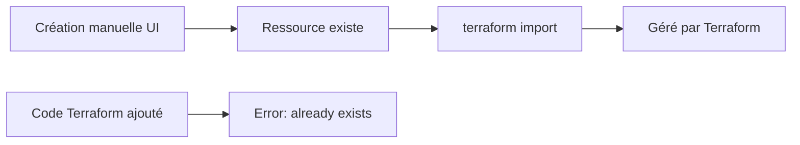
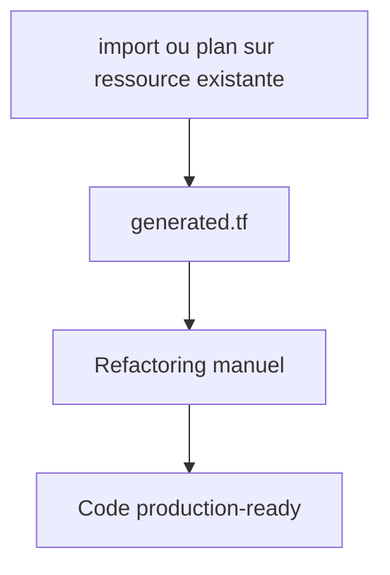

# Module 3 ? Slides : Import Brownfield

---

## Slide 1 ? Titre

**Module 3 : Importation de l'existant**  
*Durée : 2h*

---

## Slide 2 ? Problème Brownfield



---

## Slide 3 ? Stratégie d'import

1. Inventorier ressources existantes
2. écrire configuration HCL minimale
3. `terraform import` ? lie state
4. `plan` ? ajuster HCL jusqu'? **no changes**
5. Commit code aligné

---

## Slide 4 ? terraform import (classique)

```bash
terraform import snowflake_database.raw DB_RAW_DEV
```

Format : `terraform import <address> <id_snowflake>`

---

## Slide 5 ? Import avec génération config (TF ? 1.5)

```bash
terraform plan -generate-config-out=generated.tf
terraform apply -generate-config-out=generated.tf
```



---

## Slide 6 ? Risques

| Risque | Mitigation |
|--------|------------|
| Destroy involontaire | Toujours plan avant apply |
| Config incomplète | Itérer plan ? enrichir HCL |
| ID incorrect | Vérifier SHOW DATABASES |

---

## Slide 7 ? Atelier

Importer un warehouse créé manuellement  
? [lab.md](lab.md)

---

## Patterns Import

| Pattern | Application |
|---------|-------------|
| Brownfield | Ressource existante → `import` → `-generate-config-out` |
| Zero-Downtime | `import` ne modifie rien |
| Alignment Loop | `plan` → ajuster HCL → `plan` jusqu'? `0 changes` |
| State rm | Retirer du state sans détruire (cession) |

