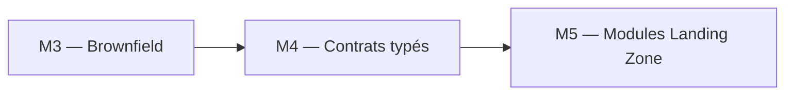

# 🧪 Lab M4 — Variables, locals, outputs et multi-environnement

> [<- Jour 1](../README.md) · [<- Module precedent](../module-03-import-brownfield/lab.md) · **Module 4** · [Jour 2 ->](../../day-02/README.md)

| Élément | Valeur |
|---|---|
| **Durée** | 50 min |
| **Piste** | `[CORE]` |
| **Workspace** | `$HOME/Data2AI-Labs/data-platform` (le clone) |
| **Dossier de travail** | `environments/dev/` dans le clone |
| **Coût** | Aucune nouvelle ressource |
| **Cleanup** | Conserver jusqu'au Jour 3 |

> `[IMPORTANT]` Avant de commencer, vous devez etre dans la racine du clone
> et avoir execute `Learner-Login.ps1` dans **cette session** :
>
> ```powershell
> cd "$HOME\Data2AI-Labs\data-platform"
> .\scripts\Learner-Login.ps1 -LearnerPrefix APP01
> ```
>
> Cela set `TF_VAR_snowflake_token` (depuis `secrets/snowflake_pat.txt`)
> et les variables `ARM_*` pour Terraform.
>
> Avant `terraform plan`, verifiez que tout est pret :
>
> ```powershell
> cd environments\dev
> ..\..\scripts\Test-TerraformReady.ps1
> ```
>
> Si le pre-flight affiche `READY`, lancez `terraform plan -out "m04.tfplan"`.
> Sinon, suivez les corrections indiquees.

## 🎯 Mission

Des valeurs dispersées et non validées rendent les environnements incohérents. Vous allez structurer les variables, ajouter des validations, créer des outputs exploitables et préparer la configuration pour DEV, UAT et PROD.

## 🏗️ Architecture



## 🎯 Objectifs

- ✅ nettoyer le state des ressources brownfield de M3;
- ✅ ajouter des validations de variables pour rejeter les configurations invalides;
- ✅ utiliser des `locals` pour centraliser les conventions de nommage;
- ✅ exposer des outputs exploitables par d'autres modules;
- ✅ créer des fichiers `.tfvars` par environnement;
- ✅ comprendre la précédence des variables.

## 📋 Prérequis

- [ ] M3 terminé;
- [ ] `terraform state list` affiche les ressources M1 + `snowflake_database.imported` (brownfield).

## 📝 Partie 0 — Nettoyer le brownfield de M3

> `[IMPORTANT]` À la fin de M3, votre state contient `snowflake_database.imported`
> (la database brownfield). M4 se concentre sur les ressources M1 (raw, ingestion, etl).
> Vous allez retirer proprement le brownfield du state et de la configuration.

### 📝 Étape 0.1 — Supprimer la database brownfield de Snowflake

<details>
<summary>🪟 <b>Windows (PowerShell)</b></summary>

```powershell
snow sql -c training -q "DROP DATABASE IF EXISTS DB_${env:LEARNER_PREFIX}_BROWNFIELD_DEV"
```
</details>

<details>
<summary>🐧 <b>Linux/macOS (Bash)</b></summary>

```bash
snow sql -c training -q "DROP DATABASE IF EXISTS DB_${LEARNER_PREFIX}_BROWNFIELD_DEV"
```
</details>

✅ **Checkpoint** : `Database DB_APP01_BROWNFIELD_DEV successfully dropped.`

### 📝 Étape 0.2 — Retirer la ressource du state Terraform

```powershell
terraform state rm snowflake_database.imported
```

✅ **Checkpoint** : `Removed snowflake_database.imported.`

### 📝 Étape 0.3 — Retirer le bloc resource de main.tf

Ouvrez `environments/dev/main.tf` et supprimez le bloc `resource "snowflake_database" "imported"` ainsi que le bloc `moved` (s'il est toujours présent).

Votre `main.tf` doit maintenant contenir uniquement les 3 ressources M1 :

```hcl
resource "snowflake_database" "raw" {
  name                        = local.database_name
  comment                     = local.common_comment
  data_retention_time_in_days = 1
}

resource "snowflake_schema" "ingestion" {
  database = snowflake_database.raw.name
  name     = local.schema_name
  comment  = local.common_comment
}

resource "snowflake_warehouse" "etl" {
  name                = local.warehouse_name
  comment             = local.common_comment
  warehouse_size      = var.warehouse_size
  auto_suspend        = 60
  auto_resume         = true
  initially_suspended = true
}
```

### 📝 Étape 0.4 — Vérifier l'état propre

```powershell
terraform fmt
terraform validate
terraform plan
```

✅ **Checkpoint 0** : `No changes. Your infrastructure matches the configuration.`

> Si le plan montre encore des changements, vérifiez que le bloc `moved` a bien été supprimé et que `terraform state list` ne contient plus `snowflake_database.imported`.

## 📝 Partie 1 — Enrichir les variables

### 📝 Étape 1.1 — Ajouter des variables dans `variables.tf`

Ouvrez `environments/dev/variables.tf` et **ajoutez à la fin du fichier** ces nouvelles variables (ne modifiez pas les variables existantes) :

```hcl
variable "data_retention_days" {
  type        = number
  description = "Number of days to retain data for time travel"
  default     = 1

  validation {
    condition     = var.data_retention_days >= 0 && var.data_retention_days <= 90
    error_message = "data_retention_days must be between 0 and 90."
  }
}

variable "auto_suspend_seconds" {
  type        = number
  description = "Seconds of inactivity before the warehouse auto-suspends"
  default     = 60

  validation {
    condition     = var.auto_suspend_seconds >= 60 && var.auto_suspend_seconds <= 3600
    error_message = "auto_suspend_seconds must be between 60 and 3600."
  }
}

variable "tags" {
  type        = map(string)
  description = "Resource tags for cost allocation"
  default = {
    project     = "data-platform"
    managed_by  = "terraform"
    environment = "DEV"
  }
}
```

### 📝 Étape 1.2 — Remplacer le contenu de `locals.tf`

**Remplacez tout le contenu** de `environments/dev/locals.tf` par :

```hcl
locals {
  database_name  = "${var.learner_prefix}_RAW_${var.environment}"
  schema_name    = "INGESTION"
  warehouse_name = "WH_${var.learner_prefix}_ETL_${var.environment}"
  common_comment = "Managed by Terraform | Training | ${var.learner_prefix}"

  retention = var.data_retention_days
  suspend   = var.auto_suspend_seconds
}
```

> Les deux nouveaux locals (`retention` et `suspend`) référencent les nouvelles variables validées.

### 📝 Étape 1.3 — Remplacer le contenu de `main.tf`

**Remplacez tout le contenu** de `environments/dev/main.tf` par :

```hcl
resource "snowflake_database" "raw" {
  name                        = local.database_name
  comment                     = local.common_comment
  data_retention_time_in_days = local.retention
}

resource "snowflake_schema" "ingestion" {
  database = snowflake_database.raw.name
  name     = local.schema_name
  comment  = local.common_comment
}

resource "snowflake_warehouse" "etl" {
  name                = local.warehouse_name
  comment             = local.common_comment
  warehouse_size      = var.warehouse_size
  auto_suspend        = local.suspend
  auto_resume         = true
  initially_suspended = true
}
```

> Les valeurs en dur (`data_retention_time_in_days = 1` et `auto_suspend = 60`) sont remplacées par les locals `retention` et `suspend`.

### 📝 Étape 1.4 — Formater, valider, planifier

```powershell
terraform fmt
terraform validate
terraform plan
```

✅ **Checkpoint 1** : `No changes.` — les valeurs par défaut (`data_retention_days = 1`, `auto_suspend_seconds = 60`) correspondent aux valeurs précédentes.

> Si le plan montre des changements, vérifiez que les `default` des nouvelles variables correspondent aux anciennes valeurs en dur (1 et 60).

## 📝 Partie 2 — Enrichir les outputs

### 📝 Étape 2.1 — Créer le contenu de `outputs.tf`

Le fichier `environments/dev/outputs.tf` est vide. **Créez son contenu** avec :

```hcl
output "resource_summary" {
  value = {
    database  = snowflake_database.raw.name
    schema    = snowflake_schema.ingestion.name
    warehouse = snowflake_warehouse.etl.name
  }
  description = "Summary of all created resources"
}

output "connection_info" {
  value = {
    organization = var.snowflake_organization
    account      = var.snowflake_account
    user         = var.snowflake_user
    role         = "SYSADMIN"
  }
  description = "Snowflake connection used for this deployment"
  sensitive   = false
}
```

### 📝 Étape 2.2 — Formater et valider

```powershell
terraform fmt
terraform validate
terraform output
```

✅ **Checkpoint 2** : `resource_summary` et `connection_info` s'affichent avec les valeurs de vos ressources.

## 📝 Partie 3 — Préparer les environnements

> `[IMPORTANT]` Les dossiers `environments/uat/` et `environments/prod/` sont vides
> (aucun fichier `.tf`). Vous allez copier la configuration depuis `dev/`, puis créer
> les fichiers `.tfvars` spécifiques à chaque environnement.
>
> Le déploiement réel en UAT/PROD se fera au **M8** (environments). Ici, vous préparez
> uniquement les fichiers `.tfvars` et testez la précédence des variables dans `dev/`.

### 📝 Étape 3.1 — Copier la configuration Terraform vers UAT et PROD

<details>
<summary>🪟 <b>Windows (PowerShell)</b></summary>

```powershell
cd "$HOME\Data2AI-Labs\data-platform\environments"

# Copier les fichiers .tf de dev/ vers uat/ et prod/
Copy-Item dev\*.tf uat\
Copy-Item dev\*.tf prod\
```
</details>

<details>
<summary>🐧 <b>Linux/macOS (Bash)</b></summary>

```bash
cd "$HOME/Data2AI-Labs/data-platform/environments"

# Copier les fichiers .tf de dev/ vers uat/ et prod/
cp dev/*.tf uat/
cp dev/*.tf prod/
```
</details>

> Ne copiez **pas** `terraform.tfvars` — chaque environnement a son propre fichier.

### 📝 Étape 3.2 — Créer `terraform.tfvars` pour UAT

Dans `environments/uat/`, créez `terraform.tfvars` (remplacez `APP01` par votre préfixe) :

```hcl
snowflake_organization = "ZVFXOZW"
snowflake_account      = "PM71247"
snowflake_user         = "DATA2AI"
learner_prefix         = "APP01"
environment            = "UAT"
warehouse_size         = "X-SMALL"
data_retention_days    = 7
auto_suspend_seconds   = 120
```

### 📝 Étape 3.3 — Créer `terraform.tfvars` pour PROD

Dans `environments/prod/`, créez `terraform.tfvars` (remplacez `APP01` par votre préfixe) :

```hcl
snowflake_organization = "ZVFXOZW"
snowflake_account      = "PM71247"
snowflake_user         = "DATA2AI"
learner_prefix         = "APP01"
environment            = "PROD"
warehouse_size         = "SMALL"
data_retention_days    = 30
auto_suspend_seconds   = 300
```

> 💰 **COST** : PROD utilise un warehouse `SMALL` et une rétention plus longue. En formation, ces valeurs restent économiques.

### 📝 Étape 3.4 — Initialiser Terraform dans UAT (optionnel)

> `[NOTE]` Cette étape est **optionnelle**. Le déploiement UAT réel se fait au M8.
> Ici, vous pouvez vérifier que la configuration est valide.

<details>
<summary>🪟 <b>Windows (PowerShell)</b></summary>

```powershell
cd "$HOME\Data2AI-Labs\data-platform\environments\uat"
terraform init
terraform validate
```
</details>

<details>
<summary>🐧 <b>Linux/macOS (Bash)</b></summary>

```bash
cd "$HOME/Data2AI-Labs/data-platform/environments/uat"
terraform init
terraform validate
```
</details>

✅ **Checkpoint** : `Success! The configuration is valid.`

> Ne lancez **pas** `terraform apply` en UAT maintenant. Vous le ferez au M8.

### 📝 Étape 3.5 — Vérifier la précédence des variables dans DEV

La précédence des variables Terraform est :

1. `-var` en ligne de commande (le plus fort);
2. `-var-file` en ligne de commande;
3. `terraform.tfvars` dans le dossier;
4. `*.auto.tfvars`;
5. Variables d'environnement `TF_VAR_*`;
6. `default` dans la déclaration (le plus faible).

Testez dans `environments/dev/` :

```powershell
cd environments/dev
terraform plan -var "warehouse_size=SMALL"
```

✅ **Checkpoint** : le plan propose de modifier le warehouse en `SMALL` (priorité du `-var`).

```powershell
terraform plan
```

✅ **Checkpoint 3** : le plan revient à `X-SMALL` (valeur du fichier `terraform.tfvars` de DEV).

## 📝 Partie 4 — lifecycle et depends_on

### 📝 Étape 4.1 — Ajouter un lifecycle au warehouse

Dans `environments/dev/main.tf`, **ajoutez un bloc `lifecycle`** au resource `snowflake_warehouse.etl` :

```hcl
resource "snowflake_warehouse" "etl" {
  name                = local.warehouse_name
  comment             = local.common_comment
  warehouse_size      = var.warehouse_size
  auto_suspend        = local.suspend
  auto_resume         = true
  initially_suspended = true

  lifecycle {
    prevent_destroy = true
  }
}
```

### 📝 Étape 4.2 — Tester prevent_destroy

```powershell
terraform plan -destroy
```

✅ **Checkpoint** : Terraform affiche une erreur `prevent_destroy` et refuse de planifier la destruction du warehouse.

> 💡 **Note** : En production, `prevent_destroy` protège les ressources critiques contre une destruction accidentelle.

### 📝 Étape 4.3 — Retirer prevent_destroy pour la formation

Retirez le bloc `lifecycle` du warehouse pour permettre le cleanup en fin de formation :

```hcl
resource "snowflake_warehouse" "etl" {
  name                = local.warehouse_name
  comment             = local.common_comment
  warehouse_size      = var.warehouse_size
  auto_suspend        = local.suspend
  auto_resume         = true
  initially_suspended = true
}
```

```powershell
terraform fmt
terraform validate
terraform plan
```

✅ **Checkpoint 4** : `No changes.` — le lifecycle est retiré, le plan est propre.

## ✅ Validation finale

- [ ] brownfield nettoyé (state + Snowflake + main.tf);
- [ ] variables validées avec `validation` blocks;
- [ ] `locals.tf` enrichi avec `retention` et `suspend`;
- [ ] `main.tf` utilise les locals au lieu de valeurs en dur;
- [ ] outputs structurés affichés;
- [ ] fichiers `.tfvars` pour DEV, UAT, PROD;
- [ ] précédence testée avec `-var`;
- [ ] `prevent_destroy` testé puis retiré;
- [ ] `terraform plan` affiche `No changes.` dans `environments/dev/`.

## 🏆 Challenge

Ajoutez une variable `enable_monitoring` (booléen, défaut `false`) et un output `monitoring_enabled` qui reflète sa valeur. Ajoutez une validation qui refuse `true` en PROD si le warehouse est `X-SMALL`.

Critères :

- [ ] `terraform validate` réussit;
- [ ] `terraform output monitoring_enabled` affiche `false` en DEV;
- [ ] `terraform plan -var enable_monitoring=true` fonctionne en DEV;
- [ ] la validation refuse `enable_monitoring=true` avec `warehouse_size=X-SMALL` en PROD.

## 🧹 Cleanup

> ⚠️ **WARNING** : Conservez les ressources pour le Jour 3.

---

## Navigation

[<- Lab M3](../module-03-import-brownfield/lab.md) · [<- Jour 1](../README.md) · **Lab M4** · [Lab M5 ->](../../day-02/module-05-modules/lab.md)
