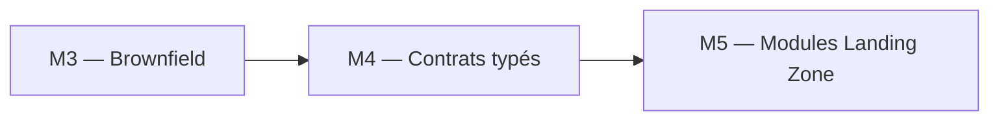
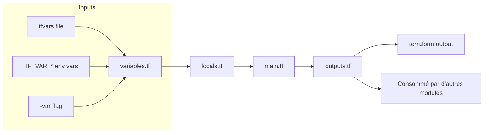
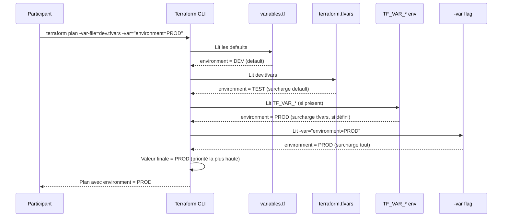
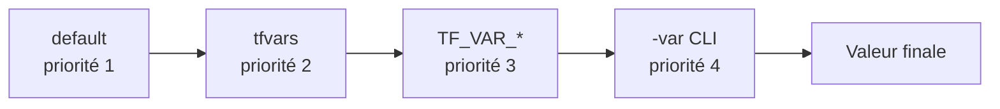

# Lab M4 -- Variables, locals, outputs et multi-environnement

**Durée :** 50 min
**Code :** `project/01-day1-basics/`
**Patterns :** Variable validation, locals pour naming, outputs pour chainage, tfvars par environnement, precedence, lifecycle, depends_on

---

## Contexte métier

Des valeurs dispersées et non validées rendent les environnements incohérents. Variables, validations, locals et outputs constituent le contrat stable consommé par les équipes et les modules.

## Contexte architecture



| Référentiel | Alignement |
|---|---|
| Pattern | Typed Configuration Contract |
| Azure Well-Architected | Fiabilité, Excellence opérationnelle |
| Azure CAF | Ready |
| Platform Engineering | Interface stable et validée |

## Pattern d'entreprise

Le pattern **Typed Configuration Contract** rejette les configurations invalides avant le plan et découple les consommateurs de l'implémentation interne.

## Objectifs

À l'issue de ce lab, vous serez capable de :

- ✅ Déclarer des variables typées avec contraintes de validation (`environment`, `warehouse_size`, `data_retention_days`).
- ✅ Centraliser les conventions de nommage avec `locals` (`DB_RAW_${env}`, `WH_ETL_${env}`).
- ✅ Définir des outputs exploitables comme contrat de sortie (`raw_database_name`, `environment_summary`).
- ✅ Créer des fichiers tfvars par environnement (`dev.tfvars`, `test.tfvars`).
- ✅ Maîtriser l'ordre de precedence des valeurs (`default < tfvars < TF_VAR_* < -var`).
- ✅ Protéger les ressources critiques avec `lifecycle` (`prevent_destroy`, `ignore_changes`).
- ✅ Tester les validations et interpréter les erreurs (fail fast).

---

## Prérequis

> **Prérequis communs :** le Lab M0 est terminé et `terraform plan` fonctionne dans `project/01-day1-basics`. En mode formation, utilisez uniquement le secret `SNOWFLAKE_PASSWORD` distribué par le formateur ; ne stockez jamais sa valeur dans Git.

- Labs M1 à M3 terminés
- Terraform >= 1.14.5
- Projet `01-day1-basics` initialisé et fonctionnel
- Compréhension des ressources Snowflake de base (database, warehouse, schema)

---

## Concept — Pourquoi avant comment

Les variables, locals et outputs forment le **contrat d'interface** d'un module Terraform. Un code bien paramétré se déploie dans N environnements sans modification. La **precedence** des valeurs (`default < tfvars < TF_VAR_* < -var`) détermine quelle source gagne en cas de conflit.



### Séquence de résolution des variables (precedence)



**Patterns IaC :**
- **Variable Validation :** Les contraintes sont dans le code, pas dans la documentation
- **Locals Naming :** Centraliser les conventions de nommage en un seul endroit
- **Outputs Contract :** Les outputs sont le contrat de sortie du module
- **Precedence :** `default < tfvars < TF_VAR_* < -var`
- **tfvars per env :** Chaque environnement a son fichier de paramètres
- **Lifecycle :** `prevent_destroy` et `ignore_changes` pour protéger les ressources critiques
- **Explicit Dependencies :** `depends_on` pour les dépendances non détectées automatiquement

---

## Implémentation guidée

### Étape 1 -- Variables avec validation (10 min)

**Objectif :** Déclarer des variables typées avec contraintes de validation.

Dans `variables.tf` :

```hcl
variable "environment" {
  type        = string
  description = "Suffixe d'environnement (DEV, TEST, PROD)"
  default     = "DEV"

  validation {
    condition     = contains(["DEV", "TEST", "PROD"], var.environment)
    error_message = "environment must be DEV, TEST, or PROD."
  }
}

variable "warehouse_size" {
  type        = string
  description = "Taille du warehouse Snowflake"
  default     = "X-SMALL"

  validation {
    condition     = contains(["X-SMALL", "SMALL", "MEDIUM", "LARGE", "X-LARGE"], var.warehouse_size)
    error_message = "warehouse_size must be a valid Snowflake size."
  }
}

variable "schemas" {
  type        = list(string)
  description = "Liste des schemas a creer dans DB_RAW"
  default     = ["SALES", "FINANCE"]
}

variable "data_retention_days" {
  type        = number
  description = "Jours de retention pour la database"
  default     = 1

  validation {
    condition     = var.data_retention_days >= 0 && var.data_retention_days <= 90
    error_message = "data_retention_days must be between 0 and 90 days."
  }
}
```

> **Pattern :** Chaque variable a `type`, `description` et si possible `validation`. C'est la **documentation exécutable** du contrat — l'erreur est détectée au `plan`, pas en production.

> **Tip :** La `description` est affichée dans `terraform plan` quand une variable est manquante. Soyez explicite : "Suffixe d'environnement (DEV, TEST, PROD)" est meilleur que "env".

---

### Étape 2 -- Locals pour le naming standardisé (5 min)

**Objectif :** Centraliser les conventions de nommage.

Dans `locals.tf` :

```hcl
locals {
  db_raw_name    = "DB_RAW_${var.environment}"
  wh_etl_name    = "WH_ETL_${var.environment}"

  common_comment = "Managed by Terraform | ${var.project} | ${var.environment}"
}
```

> **Note :** Le fichier `locals.tf` du projet ne contient pas de bloc `tags`. Les tags Snowflake sont gérés via `snowflake_tag_association` dans les modules avancés (Lab M9).

Mettre à jour `main.tf` pour utiliser ces locals :

```hcl
resource "snowflake_database" "raw" {
  name                        = local.db_raw_name
  comment                     = local.common_comment
  data_retention_time_in_days = var.data_retention_days
}

resource "snowflake_warehouse" "etl" {
  name                      = local.wh_etl_name
  comment                   = local.common_comment
  warehouse_size            = var.warehouse_size
  auto_suspend              = 60
  auto_resume               = true
  initially_suspended       = true
  enable_query_acceleration = false
}

resource "snowflake_schema" "raw" {
  for_each = toset(var.schemas)

  database = snowflake_database.raw.name
  name     = each.key
  comment  = "Schema ${each.key} - ${var.environment}"
}
```

> **Pattern :** Les `locals` centralisent le **naming convention**. Un changement de convention se fait à un seul endroit. Si demain vous passez de `DB_RAW_DEV` à `RAW_DB_DEV`, vous modifiez uniquement `locals.tf`.

---

### Étape 3 -- Outputs exploitables (5 min)

**Objectif :** Définir des outputs qui servent de contrat pour le chainage de modules.

Dans `outputs.tf` :

```hcl
output "raw_database_name" {
  value       = snowflake_database.raw.name
  description = "Raw layer database name"
}

output "etl_warehouse_name" {
  value       = snowflake_warehouse.etl.name
  description = "ETL warehouse name"
}

output "schema_names" {
  value       = [for s in snowflake_schema.raw : s.name]
  description = "List of created schema names"
}

output "connection_hint" {
  value       = "USE DATABASE ${snowflake_database.raw.name}; USE WAREHOUSE ${snowflake_warehouse.etl.name};"
  description = "Quick start SQL for Snowflake worksheet"
}

output "environment_summary" {
  value = {
    database    = snowflake_database.raw.name
    warehouse   = snowflake_warehouse.etl.name
    schemas     = [for s in snowflake_schema.raw : s.name]
    environment = var.environment
  }
  description = "Resume structure du deploiement"
}
```

> **Pattern :** Les outputs sont le **contrat de sortie**. Un output structuré (`map`) est plus utile que 10 outputs plats. `environment_summary` regroupe toutes les infos dans un seul objet.

---

### Étape 4 -- Fichiers tfvars par environnement (5 min)

**Objectif :** Créer des configurations distinctes pour DEV et TEST.

Créer le dossier `environments/` :

```
project/01-day1-basics/environments/
  dev.tfvars
  test.tfvars
```

**`environments/dev.tfvars` :**

```hcl
environment          = "DEV"
warehouse_size       = "X-SMALL"
data_retention_days  = 1
schemas              = ["SALES", "FINANCE"]
```

**`environments/test.tfvars` :**

```hcl
environment          = "TEST"
warehouse_size       = "SMALL"
data_retention_days  = 3
schemas              = ["SALES", "FINANCE", "MARKETING"]
```

> **Note :** Les fichiers `*.tfvars` sont gitignored. Utilisez `*.tfvars.example` comme template commitable.

---

### Étape 5 -- Plan multi-environnement (5 min)

**Objectif :** Comparer les plans pour DEV et TEST sans modifier le code.

```powershell
terraform plan -var-file=environments/dev.tfvars -out=dev.tfplan
terraform plan -var-file=environments/test.tfvars -out=test.tfplan
```

**Comparer les sorties :** les noms de ressources changent (`DB_RAW_DEV` vs `DB_RAW_TEST`), les tailles de warehouse diffèrent, le nombre de schemas varie.

> **Tip :** Vous pouvez comparer visuellement les deux plans. En CI/CD, on compare automatiquement avec `terraform show -json dev.tfplan`.

---

### Étape 6 -- Appliquer un environnement (5 min)

**Objectif :** Déployer avec un fichier tfvars spécifique.

```powershell
terraform apply "dev.tfplan"
```

Vérifier :

```powershell
terraform output
terraform output -json | ConvertFrom-Json | ConvertTo-Json
```

```sql
SHOW DATABASES LIKE 'DB_RAW_%';
SHOW WAREHOUSES LIKE 'WH_ETL_%';
```

---

### Étape 7 -- Tester la validation (5 min)

**Objectif :** Vérifier que les contraintes de validation bloquent les valeurs invalides.

```powershell
terraform plan -var="environment=STAGING"
# Attendu : Error! | environment must be DEV, TEST, or PROD.
```

```powershell
terraform plan -var="data_retention_days=-1"
# Attendu : Error! | data_retention_days must be between 0 and 90 days.
```

```powershell
terraform plan -var="warehouse_size=2XL"
# Attendu : Error! | warehouse_size must be a valid Snowflake size.
```

> **Pattern :** La validation **échoue vite** (fail fast). L'erreur est claire et indique exactement quelle variable est invalide. C'est mieux que de découvrir le problème au `apply`.

---

### Étape 8 -- Comprendre la precedence des valeurs (5 min)

**Objectif :** Tester l'ordre de résolution des valeurs.

| Source | Commande | Priorité |
|--------|----------|----------|
| Default (variables.tf) | `terraform plan` | 1 (plus basse) |
| tfvars file | `terraform plan -var-file=dev.tfvars` | 2 |
| Env var | `$env:TF_VAR_environment = "PROD"` ; `terraform plan` | 3 |
| CLI flag | `terraform plan -var="environment=PROD"` | 4 (plus haute) |

Tester :

```powershell
# 1. Default
terraform plan
# environment = DEV

# 2. tfvars
terraform plan -var-file=environments/test.tfvars
# environment = TEST

# 3. Env var (surcharge le tfvars)
$env:TF_VAR_environment = "PROD"
terraform plan -var-file=environments/test.tfvars
# environment = PROD (env var gagne sur tfvars)

# 4. CLI flag (surcharge tout)
terraform plan -var-file=environments/test.tfvars -var="environment=DEV"
# environment = DEV (CLI flag gagne)

# Nettoyer
Remove-Item Env:\TF_VAR_environment
```



> **⚠ Piège :** Les variables `TF_VAR_*` sont persistantes dans la session PowerShell. Pensez à les nettoyer avec `Remove-Item Env:\TF_VAR_*` après vos tests.

---

### Étape 9 -- Lifecycle et depends_on (5 min)

**Objectif :** Protéger les ressources critiques et forcer les dépendances explicites.

Ajouter `lifecycle` sur la database pour empêcher sa destruction accidentelle :

```hcl
resource "snowflake_database" "raw" {
  name                        = local.db_raw_name
  comment                     = local.common_comment
  data_retention_time_in_days = var.data_retention_days

  lifecycle {
    prevent_destroy = true
  }
}
```

Tester :

```powershell
terraform plan -destroy
# Attendu : Error: Instance cannot be destroyed because lifecycle.prevent_destroy is set
```

> **Pattern :** `prevent_destroy` protège les ressources critiques. En production, appliquez-le sur les databases qui contiennent des données irremplaçables.

Ajouter `ignore_changes` pour les attributs gérés hors Terraform :

```hcl
resource "snowflake_warehouse" "etl" {
  name           = local.wh_etl_name
  warehouse_size = var.warehouse_size

  lifecycle {
    ignore_changes = [warehouse_size]
  }
}
```

> **Note :** `ignore_changes` indique à Terraform d'ignorer les modifications sur certains attributs. Utile quand un autre processus (ex: auto-scaling) modifie l'attribut.

---

### Étape 10 -- Drift detection sur outputs (5 min)

**Objectif :** Détecter une dérive via les outputs.

1. Après apply, modifier manuellement la rétention dans Snowflake :

```sql
ALTER DATABASE DB_RAW_DEV SET DATA_RETENTION_TIME_IN_DAYS = 5;
```

2. Lancer `terraform plan` et observer la dérive détectée sur `data_retention_time_in_days` :

```powershell
terraform plan
# ~ resource "snowflake_database" "raw" {
#     ~ data_retention_time_in_days = 5 -> 1
#   }
```

3. Corriger avec `terraform apply`.

---

## Exercice challenge

**Objectif :** Ajouter une variable complexe `map(object)` pour configurer plusieurs warehouses en une seule déclaration.

**Consignes :**
1. Déclarer une variable `warehouses` de type `map(object({ size = string, auto_suspend = number, max_clusters = optional(number, 1) }))`
2. Créer les warehouses avec `for_each = var.warehouses`
3. Ajouter un output `warehouse_names` qui liste tous les warehouses créés
4. Configurer le tfvars avec 2 warehouses : `etl` (X-SMALL) et `analytics` (SMALL, 2 clusters)
5. Déployer et vérifier

**Critères de validation :**
- [ ] `terraform validate` réussit
- [ ] `terraform plan` montre 2 warehouses à créer
- [ ] `terraform apply` réussit sans erreur
- [ ] `terraform output warehouse_names` affiche les 2 noms
- [ ] `SHOW WAREHOUSES` confirme les 2 warehouses dans Snowflake

> **Hint :** Regardez le Lab M6 (for_each) pour la syntaxe. Utilisez `each.key` pour le nom et `each.value.size` pour la taille.

---

## Validation et auto-évaluation

### Checklist de compétences

- [ ] Je sais déclarer des variables avec type, description et validation
- [ ] Je peux utiliser `locals` pour centraliser le naming
- [ ] Je comprends les outputs comme contrat de sortie
- [ ] Je sais créer des fichiers tfvars par environnement
- [ ] Je maîtrise l'ordre de precedence des valeurs
- [ ] Je peux utiliser `lifecycle` (prevent_destroy, ignore_changes)
- [ ] Je sais tester les validations et interpréter les erreurs

### Quiz rapide

1. **Quel est l'ordre de precedence (du plus bas au plus haut) ?**
   - [ ] `-var` < `TF_VAR_*` < tfvars < default
   - [ ] default < tfvars < `TF_VAR_*` < `-var`
   - [ ] tfvars < default < `-var` < `TF_VAR_*`
   - [ ] default < `-var` < tfvars < `TF_VAR_*`
   > Réponse : default < tfvars < TF_VAR_* < -var

2. **Que fait `prevent_destroy` ?**
   - [ ] Empêche la modification d'une ressource
   - [ ] Empêche Terraform de détruire la ressource
   - [ ] Empêche la dérive
   - [ ] Empêche l'import
   > Réponse : Empêche la destruction

3. **Pourquoi utiliser `locals` plutôt que des variables ?**
   - [ ] Les locals sont plus performantes
   - [ ] Les locals centralisent les conventions de nommage dérivées des variables
   - [ ] Les locals sont obligatoires
   - [ ] Les locals remplacent les variables
   > Réponse : Centralisent les conventions dérivées

4. **Que fait `ignore_changes` ?**
   - [ ] Ignore les erreurs de validation
   - [ ] Indique à Terraform d'ignorer les modifications sur certains attributs
   - [ ] Ignore le plan
   - [ ] Ignore les dépendances
   > Réponse : Ignore les modifications sur certains attributs

5. **Comment passer une variable via l'environnement ?**
   - [ ] `SET environment=DEV`
   - [ ] `$env:TF_VAR_environment = "DEV"`
   - [ ] `$env:environment = "DEV"`
   - [ ] `$env:TERRAFORM_environment = "DEV"`
   > Réponse : `$env:TF_VAR_<name>`

---

### Diagnostic guidé

| Symptôme | Cause probable | Action |
|----------|----------------|--------|
| `Invalid value for variable` | Validation rejetée | Vérifier les contraintes dans `variables.tf` |
| Outputs vides | Aucun `apply` réalisé | Exécuter `terraform apply` d'abord |
| `Unsupported attribute` | Locals ou variables mal référencés | Vérifier les noms dans `locals.tf` |
| `var.environment` non trouvé | Variable non déclarée | Ajouter la variable dans `variables.tf` |
| `Error: Missing required argument` | Variable sans default et non fournie | Ajouter `-var` ou `-var-file` |
| `prevent_destroy` bloque destroy | Protection active | Retirer temporairement le lifecycle block |

---

## Bonus : Aller plus loin

- Ajouter un output **sensitive** pour les mots de passe :
  ```hcl
  output "admin_password" {
    value     = var.admin_password
    sensitive = true
  }
  ```
- Utiliser `type = map(object({...}))` pour des configurations plus complexes
- Chaîner les outputs : utiliser `terraform output -raw raw_database_name` dans un script :
  ```powershell
  $db = terraform output -raw raw_database_name
  Write-Host "Connecting to $db"
  ```
- Ajouter une variable `type = object` avec des champs optionnels (`optional()`)
- Combiner `prevent_destroy` avec un `count` conditionnel pour l'activer uniquement en PROD

---

## Troubleshooting

### `Error: Invalid value for variable` (validation)

La contrainte `validation` dans `variables.tf` rejette la valeur. Lisez l'`error_message` — elle indique exactement quelle variable est invalide et pourquoi.

### `Error: Missing required argument`

Une variable sans `default` n'a pas été fournie. Ajoutez-la dans `terraform.tfvars` ou passez-la via `-var` ou `-var-file`.

### `terraform output` affiche des valeurs vides

Aucun `terraform apply` n'a encore été réalisé. Les outputs ne sont disponibles qu'après un apply réussi.

### `prevent_destroy` bloque `terraform destroy`

C'est le comportement attendu. Retirez temporairement le bloc `lifecycle { prevent_destroy = true }` si vous voulez détruire la ressource, ou utilisez `terraform destroy -target=...` sur une ressource non protégée.

### `Unsupported attribute` dans locals ou outputs

Vérifiez les noms dans `locals.tf` et `variables.tf`. Une typo dans `local.db_raw_name` ou `var.environment` provoque cette erreur au `plan`.
---

## Notes d'architecte

- **Décision :** la capacité du module est traitée comme un produit de plateforme, pas comme un exemple isolé.
- **Compromis :** le lab réduit volontairement l'échelle afin de rester exécutable en sandbox ; les contrôles de production restent obligatoires.
- **Garde-fou :** toute modification doit produire un plan relu, une validation technique et une preuve d'absence de dérive.

## Bonnes pratiques Enterprise

- Versionner les contrats et les modules, jamais les secrets ni les fichiers de state.
- Appliquer le moindre privilège aux identités humaines et techniques.
- Utiliser un state distant isolé, un artefact de plan immuable et une approbation avant production.
- Rendre sécurité, fiabilité, coût et observabilité vérifiables par le pipeline.

## Notes de production

| Dimension | Training | Production |
|---|---|---|
| Identité | Secret transmis hors Git | JWT, identité technique dédiée et rotation contrôlée |
| State | Backend simplifié ou sandbox | Azure Blob privé, chiffré, verrouillé et isolé |
| Déploiement | Exécution locale guidée | Azure DevOps, approbation et artefact de plan |
| Exploitation | Validation ponctuelle | SLO, alertes, runbooks, FinOps et contrôle continu de dérive |

## Réflexion

1. Quel risque métier réapparaît si cette capacité est gérée manuellement ?
2. Quel contrôle doit devenir obligatoire avant une promotion en production ?
3. Quelle preuve transmettre à l'équipe qui exploite la capacité suivante ?


