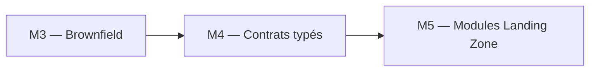

# 🧪 Lab M4 — Variables, locals, outputs et multi-environnement

> [<- Jour 1](../README.md) · [<- Module precedent](../module-03-import-brownfield/lab.md) · **Module 4** · [Jour 2 ->](../../day-02/README.md)

| Élément | Valeur |
|---|---|
| **Durée** | 50 min |
| **Piste** | `[CORE]` |
| **Workspace** | `$HOME/Data2AI-Labs/data-platform` (le clone) |
| **Dossier de travail** | `environments/dev/` dans le clone |
| **Coût** | Aucune nouvelle ressource |
| **Cleanup** | Conserver jusqu'au Jour 3 |

> `[IMPORTANT]` Avant de commencer, vous devez etre dans la racine du clone
> et avoir execute `Learner-Login.ps1` dans **cette session** :
>
> ```powershell
> cd "$HOME\Data2AI-Labs\data-platform"
> .\scripts\Learner-Login.ps1 -LearnerPrefix APP01
> ```
>
> Cela set `TF_VAR_snowflake_token` (depuis `secrets/snowflake_pat.txt`)
> et les variables `ARM_*` pour Terraform. Sans cela, `terraform plan`
> vous demandera `var.snowflake_token` manuellement.

## 🎯 Mission

Des valeurs dispersées et non validées rendent les environnements incohérents. Vous allez structurer les variables, ajouter des validations, créer des outputs exploitables et préparer la configuration pour DEV, UAT et PROD.

## 🏗️ Architecture



## 🎯 Objectifs

- ✅ ajouter des validations de variables pour rejeter les configurations invalides;
- ✅ utiliser des `locals` pour centraliser les conventions de nommage;
- ✅ exposer des outputs exploitables par d'autres modules;
- ✅ créer des fichiers `.tfvars` par environnement;
- ✅ comprendre la précédence des variables.

## 📋 Prérequis

- [ ] M3 terminé;
- [ ] `terraform plan` affiche `No changes` dans `environments/dev/`.

## 📝 Partie 1 — Enrichir les variables

### 📝 Étape 1.1 — Ajouter des variables dans `variables.tf`

Ouvrez `environments/dev/variables.tf` et ajoutez :

```hcl
variable "data_retention_days" {
  type        = number
  description = "Number of days to retain data for time travel"
  default     = 1

  validation {
    condition     = var.data_retention_days >= 0 && var.data_retention_days <= 90
    error_message = "data_retention_days must be between 0 and 90."
  }
}

variable "auto_suspend_seconds" {
  type        = number
  description = "Seconds of inactivity before the warehouse auto-suspends"
  default     = 60

  validation {
    condition     = var.auto_suspend_seconds >= 60 && var.auto_suspend_seconds <= 3600
    error_message = "auto_suspend_seconds must be between 60 and 3600."
  }
}

variable "tags" {
  type        = map(string)
  description = "Resource tags for cost allocation"
  default = {
    project     = "data-platform"
    managed_by  = "terraform"
    environment = "DEV"
  }
}
```

### 📝 Étape 1.2 — Mettre à jour `locals.tf`

```hcl
locals {
  database_name  = "${var.learner_prefix}_RAW_${var.environment}"
  schema_name    = "INGESTION"
  warehouse_name = "WH_${var.learner_prefix}_ETL_${var.environment}"
  common_comment = "Managed by Terraform | Training | ${var.learner_prefix}"

  retention = var.data_retention_days
  suspend   = var.auto_suspend_seconds
}
```

### 📝 Étape 1.3 — Mettre à jour `main.tf`

Remplacez les valeurs en dur par les locals :

```hcl
resource "snowflake_database" "raw" {
  name                        = local.database_name
  comment                     = local.common_comment
  data_retention_time_in_days = local.retention
}

resource "snowflake_schema" "ingestion" {
  database = snowflake_database.raw.name
  name     = local.schema_name
  comment  = local.common_comment
}

resource "snowflake_warehouse" "etl" {
  name                = local.warehouse_name
  comment             = local.common_comment
  warehouse_size      = var.warehouse_size
  auto_suspend        = local.suspend
  auto_resume         = true
  initially_suspended = true
}
```

### 📝 Étape 1.4 — Formater, valider, planifier

```powershell
terraform fmt
terraform validate
terraform plan
```

✅ **Checkpoint 1** : `No changes.` si les valeurs par défaut correspondent à la configuration actuelle.

## 📝 Partie 2 — Enrichir les outputs

### 📝 Étape 2.1 — Ajouter des outputs structurés

Dans `outputs.tf`, ajoutez :

```hcl
output "resource_summary" {
  value = {
    database  = snowflake_database.raw.name
    schema    = snowflake_schema.ingestion.name
    warehouse = snowflake_warehouse.etl.name
  }
  description = "Summary of all created resources"
}

output "connection_info" {
  value = {
    organization = var.snowflake_organization
    account      = var.snowflake_account
    user         = var.snowflake_user
    role         = "SYSADMIN"
  }
  description = "Snowflake connection used for this deployment"
  sensitive   = false
}
```

### 📝 Étape 2.2 — Formater et valider

```powershell
terraform fmt
terraform validate
terraform output
```

✅ **Checkpoint 2** : `resource_summary` et `connection_info` s'affichent.

## 📝 Partie 3 — Préparer les environnements

### 📝 Étape 3.1 — Créer `terraform.tfvars` pour UAT

Dans `environments/uat/`, créez `terraform.tfvars` :

```hcl
snowflake_organization = "ZVFXOZW"
snowflake_account      = "PM71247"
snowflake_user         = "DATA2AI"
learner_prefix          = "ABC"
environment             = "UAT"
warehouse_size          = "X-SMALL"
data_retention_days     = 7
auto_suspend_seconds    = 120
```

Remplacez `ABC` par votre préfixe.

### 📝 Étape 3.2 — Créer `terraform.tfvars` pour PROD

Dans `environments/prod/`, créez `terraform.tfvars` :

```hcl
snowflake_organization = "ZVFXOZW"
snowflake_account      = "PM71247"
snowflake_user         = "DATA2AI"
learner_prefix          = "ABC"
environment             = "PROD"
warehouse_size          = "SMALL"
data_retention_days     = 30
auto_suspend_seconds    = 300
```

> 💰 **COST** : PROD utilise un warehouse `SMALL` et une rétention plus longue. En formation, ces valeurs restent économiques.

### 📝 Étape 3.3 — Vérifier la précédence

La précédence des variables Terraform est :

1. `-var` en ligne de commande (le plus fort);
2. `-var-file` en ligne de commande;
3. `terraform.tfvars` dans le dossier;
4. `*.auto.tfvars`;
5. Variables d'environnement `TF_VAR_*`;
6. `default` dans la déclaration (le plus faible).

Testez :

```powershell
cd environments/dev
terraform plan -var "warehouse_size=SMALL"
```

✅ **Checkpoint** : le plan propose de modifier le warehouse en `SMALL`.

```powershell
terraform plan
```

✅ **Checkpoint 3** : le plan revient à `X-SMALL` (valeur du fichier `.tfvars`).

## 📝 Partie 4 — lifecycle et depends_on

### 📝 Étape 4.1 — Ajouter un lifecycle au warehouse

Dans `main.tf`, ajoutez un bloc `lifecycle` au warehouse :

```hcl
resource "snowflake_warehouse" "etl" {
  name                = local.warehouse_name
  comment             = local.common_comment
  warehouse_size      = var.warehouse_size
  auto_suspend        = local.suspend
  auto_resume         = true
  initially_suspended = true

  lifecycle {
    prevent_destroy = true
  }
}
```

### 📝 Étape 4.2 — Tester prevent_destroy

```powershell
terraform plan -destroy
```

✅ **Checkpoint** : Terraform refuse de détruire le warehouse à cause de `prevent_destroy`.

> 💡 **Note** : En production, `prevent_destroy` protège les ressources critiques contre une destruction accidentelle.

### 📝 Étape 4.3 — Retirer prevent_destroy pour la formation

Retirez le bloc `lifecycle` pour permettre le cleanup en fin de formation :

```hcl
resource "snowflake_warehouse" "etl" {
  name                = local.warehouse_name
  comment             = local.common_comment
  warehouse_size      = var.warehouse_size
  auto_suspend        = local.suspend
  auto_resume         = true
  initially_suspended = true
}
```

## ✅ Validation finale

- [ ] variables validées avec `validation` blocks;
- [ ] outputs structurés affichés;
- [ ] fichiers `.tfvars` pour DEV, UAT, PROD;
- [ ] précédence testée;
- [ ] `prevent_destroy` testé puis retiré.

## 🏆 Challenge

Ajoutez une variable `enable_monitoring` (booléen, défaut `false`) et un output `monitoring_enabled` qui reflète sa valeur. Ajoutez une validation qui refuse `true` en PROD si le warehouse est `X-SMALL`.

Critères :

- [ ] `terraform validate` réussit;
- [ ] `terraform output monitoring_enabled` affiche `false` en DEV;
- [ ] `terraform plan -var enable_monitoring=true` fonctionne en DEV;
- [ ] la validation refuse `enable_monitoring=true` avec `warehouse_size=X-SMALL` en PROD.

## 🧹 Cleanup

> ⚠️ **WARNING** : Conservez les ressources pour le Jour 3.

---

## Navigation

[<- Lab M3](../module-03-import-brownfield/lab.md) · [<- Jour 1](../README.md) · **Lab M4** · [Lab M5 ->](../../day-02/module-05-modules/lab.md)
