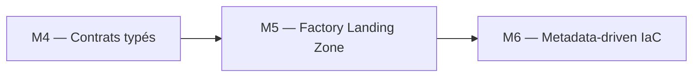
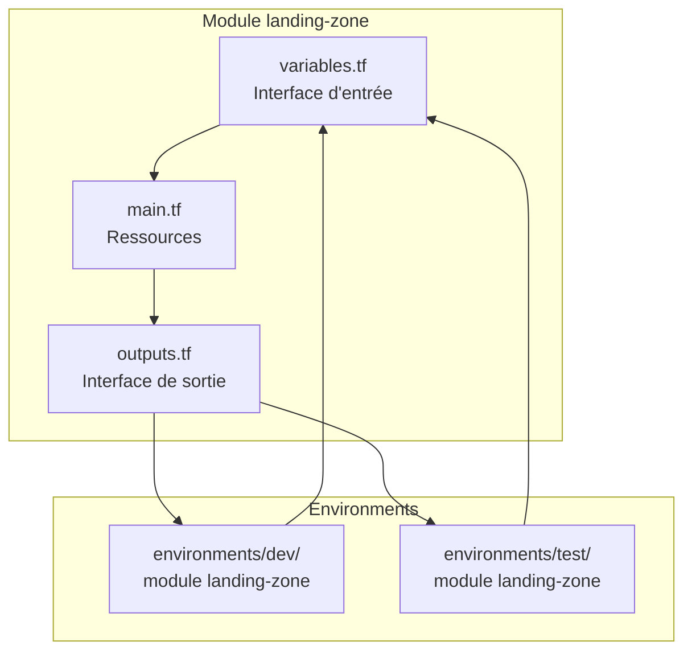
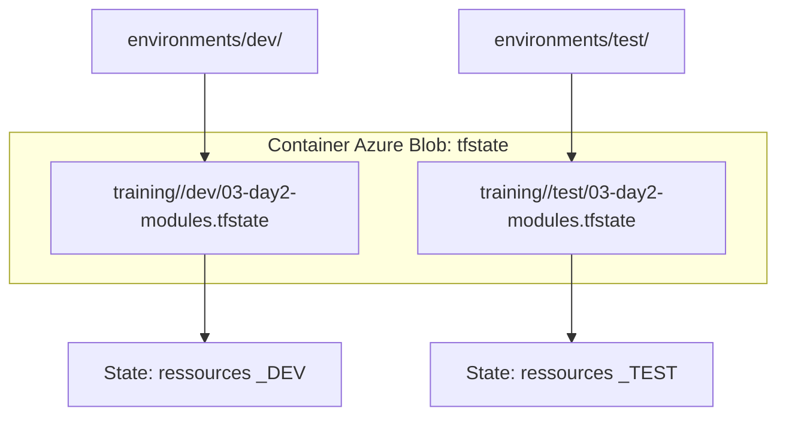

# Lab M5 -- Module Landing Zone réutilisable

**Durée :** 60 min
**Code :** `project/03-day2-modules/modules/landing-zone/` , `project/03-day2-modules/environments/dev/`
**Patterns :** Module structure, interface contract, composition, versioning, DRY, environment isolation

---

## Contexte métier

Les domaines Data ont besoin d'une plateforme cohérente sans copier des centaines de ressources. Un module Landing Zone transforme les standards d'architecture en produit réutilisable et versionné.

## Contexte architecture



| Référentiel | Alignement |
|---|---|
| Pattern | Reusable Landing Zone Module |
| Azure Well-Architected | Excellence opérationnelle, Optimisation des coûts |
| Azure CAF | Adopt |
| Platform Engineering | Produit plateforme composable |

## Pattern d'entreprise

Le pattern **Reusable Landing Zone Module** encode les garde-fous de nommage, rétention, monitoring et tagging dans une interface réutilisable.

## Objectifs

À l'issue de ce lab, vous serez capable de :

- ✅ Analyser la structure interne d'un module Terraform (`variables.tf`, `main.tf`, `outputs.tf`).
- ✅ Consommer le module `landing-zone` depuis un root module d'environnement (`environments/dev/`).
- ✅ Déployer le même module en DEV et TEST avec des paramètres différents.
- ✅ Comprendre l'isolation par state (clés de blob distinctes par environnement).
- ✅ Modifier le module central et propager le changement aux environnements (DRY).
- ✅ Vérifier les outputs préfixés (`landing_zone_raw_database_name`, etc.).
- ✅ Documenter un module avec un README et `terraform-docs`.

---

## Prérequis

> **Prérequis communs :** le Lab M0 est terminé et `terraform plan` fonctionne dans `project/01-day1-basics`. En mode formation, utilisez uniquement le secret `SNOWFLAKE_PASSWORD` distribué par le formateur ; ne stockez jamais sa valeur dans Git.

- Labs M1 à M4 terminés
- Terraform >= 1.14.5
- Module `landing-zone` présent dans `project/03-day2-modules/modules/`
- Compréhension des variables, locals et outputs (Lab M4)

---

## Concept — Pourquoi avant comment

Un **module** Terraform est un ensemble de ressources encapsulées derrière une **interface** (variables en entrée, outputs en sortie). Les modules permettent la **réutilisation** (DRY) et la **composition**. Chaque environnement consomme le même module avec des paramètres différents.



**Patterns IaC :**
- **Module Interface :** Variables = entrées, Outputs = sorties. Le contrat est explicite.
- **Composition :** Un module peut en appeler d'autres (ex: capstone compose landing-zone + rbac)
- **DRY :** Une seule implémentation, N consommations
- **Versioning :** Les modules sont versionnés via Git tags ou registry
- **Environment Isolation :** Chaque environnement a son propre root module qui consomme le module partagé

---

## Implémentation guidée

### Étape 1 -- Analyser la structure du module (10 min)

**Objectif :** Comprendre l'organisation interne d'un module Terraform.

```powershell
cd project/03-day2-modules/modules/landing-zone
ls
```

**Structure attendue :**
```
modules/landing-zone/
  main.tf          # Ressources: database, warehouse, schemas, resource monitor
  variables.tf     # Interface d'entrée
  outputs.tf       # Interface de sortie
  versions.tf      # Version du provider
  README.md        # Documentation du module
```

Lire `variables.tf` :

```hcl
variable "environment" {
  type        = string
  description = "Environment suffix"
  validation {
    condition     = contains(["DEV", "TEST", "PROD"], var.environment)
    error_message = "environment must be DEV, TEST, or PROD."
  }
}

variable "project" {
  type    = string
  default = "DATAPLATFORM"
}

variable "schemas" {
  type        = set(string)
  description = "Business schemas in RAW database"
  default     = ["RAW", "SILVER", "GOLD"]
}

variable "warehouses" {
  type = map(object({
    size         = string
    auto_suspend = optional(number, 60)
    max_clusters = optional(number, 1)
  }))
  description = "Map of warehouse suffix => config"
  default = {
    etl = {
      size = "X-SMALL"
    }
    analytics = {
      size = "SMALL"
    }
  }
}

variable "data_retention_days" {
  type    = number
  default = 1
}

variable "credit_quota" {
  type        = number
  description = "Monthly credit quota for the resource monitor"
  default     = 100
}
```

> **Note :** Le type `set(string)` pour `schemas` garantit l'unicité des noms. Les champs `optional()` dans `warehouses` rendent `auto_suspend` et `max_clusters` optionnels avec des valeurs par défaut (60 et 1).

> **Pattern :** Les variables du module sont son **interface d'entrée**. Chaque variable a un `type`, une `description`, et optionnellement un `default` et une `validation`. C'est le contrat que le consommateur doit respecter.

Lire `outputs.tf` :

```hcl
output "raw_database_name" {
  value = snowflake_database.raw.name
}

output "curated_database_name" {
  value = snowflake_database.curated.name
}

output "database_names" {
  value = {
    raw     = snowflake_database.raw.name
    curated = snowflake_database.curated.name
  }
}

output "warehouse_names" {
  value = { for k, wh in snowflake_warehouse.this : k => wh.name }
}

output "schema_names" {
  value = [for s in snowflake_schema.raw : s.name]
}

output "resource_monitor_name" {
  value = snowflake_resource_monitor.this.name
}

output "tag_names" {
  value = {
    cost_center = snowflake_tag.cost_center.name
    environment = snowflake_tag.environment.name
    team        = snowflake_tag.team.name
  }
}
```

> **Tip :** Les outputs sont l'**interface de sortie**. Le consommateur du module utilise ces outputs pour chaîner avec d'autres ressources. Notez l'usage de `for` expressions pour transformer les maps de ressources en maps de noms.

---

### Étape 2 -- Déployer le module en environnement DEV (10 min)

**Objectif :** Consommer le module depuis un root module d'environnement.

```powershell
cd project/03-day2-modules/environments/dev
```

Lire `main.tf` :

```hcl
module "landing_zone" {
  source = "../../modules/landing-zone"

  environment         = var.environment
  schemas             = var.schemas
  data_retention_days = 1

  warehouses = {
    etl = {
      size = "X-SMALL"
    }
    analytics = {
      size = "SMALL"
    }
  }
}
```

> **Note :** Le `source` est un **chemin relatif** depuis le root module. `../../modules/landing-zone` remonte de `environments/dev/` vers `modules/landing-zone/`. Le `project` n'est pas passé explicitement — le module a un `default = "DATAPLATFORM"`.

Créer `terraform.tfvars` :

```powershell
Copy-Item terraform.tfvars.example terraform.tfvars
```

Éditer avec vos valeurs Snowflake (voir `access.txt`) :

```hcl
deployment_mode        = "training"
snowflake_organization = "<snowflake-organization>"
snowflake_account      = "<snowflake-account>"
snowflake_user         = "DATA2AI"
snowflake_password     = "<SNOWFLAKE_PASSWORD>"
snowflake_role         = "ACCOUNTADMIN"
environment            = "DEV"
schemas                = ["SALES", "FINANCE", "MARKETING"]
```

> Si vous utilisez la Piste A (JWT), remplacez par `deployment_mode = "production"`, `snowflake_user = "TERRAFORM_SVC"` et ajoutez `private_key_path = "../../../../secrets/snowflake_key.p8"`.

> **⚠ Piège :** Le `private_key_path` dépend de la **profondeur** du root module. Depuis `environments/dev/` (3 niveaux), le chemin est `../../../../secrets/snowflake_key.p8` (4 `../` pour remonter à la racine). Comptez les niveaux : `dev` → `environments` → `03-day2-modules` → `project` → racine. En mode training, cette variable n'est pas nécessaire.

Déployer :

```powershell
terraform init
terraform plan -out=dev.tfplan
terraform apply dev.tfplan
```

---

### Étape 3 -- Vérifier les ressources créées (5 min)

**Objectif :** Confirmer que le module a créé toutes les ressources attendues.

```sql
SHOW DATABASES LIKE 'DB\_%\_DEV';
SHOW WAREHOUSES LIKE 'WH\_%\_DEV';
SHOW SCHEMAS IN DATABASE DB_RAW_DEV;
```

Vérifier les outputs du module :

```powershell
terraform output
```

**Résultat attendu :**
```
landing_zone_raw_database_name = "DB_RAW_DEV"
landing_zone_curated_database_name = "DB_CURATED_DEV"
landing_zone_warehouse_names = {
  "analytics" = "WH_ANALYTICS_DEV"
  "etl" = "WH_ETL_DEV"
}
```

> **Tip :** Les outputs du module sont préfixés par le nom logique du module : `landing_zone_raw_database_name`. C'est Terraform qui ajoute ce préfixe automatiquement.

---

### Étape 4 -- Comprendre l'isolation par environnement (10 min)

**Objectif :** Vérifier que DEV et TEST sont totalement isolés.

Si l'environnement TEST n'existe pas encore, le créer :

```powershell
cd ../test
Copy-Item ../dev/terraform.tfvars terraform.tfvars
```

Éditer `terraform.tfvars` pour TEST :

```hcl
environment = "TEST"
schemas     = ["SALES", "FINANCE", "MARKETING", "HR"]
warehouses = {
  etl = {
    size         = "SMALL"
    auto_suspend = 120
  }
  analytics = {
    size         = "MEDIUM"
    auto_suspend = 300
    max_clusters = 2
  }
}
```

```powershell
terraform init
terraform apply -auto-approve
```

Vérifier l'isolation :

```powershell
cd ../dev
terraform state list
# Ressources suffixees _DEV

cd ../test
terraform state list
# Ressources suffixees _TEST
```

```sql
SHOW DATABASES;
-- DB_RAW_DEV et DB_RAW_TEST coexistent
```



> **Pattern :** Chaque environnement a son propre root module, son propre state, et ses propres paramètres. Le module `landing-zone` est **partagé** mais instancié avec des valeurs différentes. C'est l'**isolation totale**.

---

### Étape 5 -- Analyser le resource_monitor du module (10 min)

**Objectif :** Comprendre comment le module gère le FinOps via un `resource_monitor`.

Le module `landing-zone` inclut déjà un `resource_monitor` dans `main.tf` :

```hcl
resource "snowflake_resource_monitor" "this" {
  name         = "RM_BUDGET_${var.environment}"
  credit_quota = var.credit_quota

  frequency       = "MONTHLY"
  start_timestamp = "IMMEDIATELY"

  notify_triggers           = [75, 90]
  suspend_trigger           = 100
  suspend_immediate_trigger = 110
}
```

Le resource monitor est lié à chaque warehouse via :

```hcl
resource "snowflake_warehouse" "this" {
  for_each = var.warehouses
  # ...
  resource_monitor = snowflake_resource_monitor.this.name
}
```

**Tester la modification du quota :**

Dans `environments/dev/terraform.tfvars`, ajoutez :

```hcl
credit_quota = 50  # au lieu de 100 par défaut
```

```powershell
cd ../dev
terraform plan
# Attendu : ~ credit_quota = 50 (modification du resource monitor)
terraform apply -auto-approve
```

```powershell
cd ../test
terraform plan
# Attendu : credit_quota reste 100 (valeur par défaut du module)
terraform apply -auto-approve
```

> **Pattern :** Une modification de paramètre dans le tfvars d'un environnement se **propage** uniquement à cet environnement. Le module reste partagé (DRY), mais chaque environnement contrôle ses propres valeurs.

---

### Étape 6 -- Documenter le module (5 min)

**Objectif :** Vérifier que le README du module est complet.

Lire `modules/landing-zone/README.md` :

Le README doit contenir :
- **Description** du module
- **Inputs** (tableau des variables avec type, default, description)
- **Outputs** (tableau des outputs avec description)
- **Exemple d'utilisation**

> **Tip :** Utilisez [terraform-docs](https://terraform-docs.io/) pour générer automatiquement le README :
> ```powershell
> terraform-docs markdown . > README.md
> ```

---

### Étape 7 -- Drift detection sur module (5 min)

**Objectif :** Détecter une dérive sur une ressource gérée par le module.

1. Modifier manuellement le warehouse dans Snowflake :

```sql
ALTER WAREHOUSE WH_ETL_DEV SET AUTO_SUSPEND = 999;
```

2. Lancer `terraform plan` :

```powershell
cd environments/dev
terraform plan
# Attendu : ~ auto_suspend = 999 -> 60
```

3. Corriger :

```powershell
terraform apply -auto-approve
```

---

## Exercice challenge

**Objectif :** Créer un module `crypto` qui génère une paire de clés RSA pour l'authentification Snowflake.

**Consignes :**
1. Créer le dossier `modules/crypto/` avec `main.tf`, `variables.tf`, `outputs.tf`, `versions.tf`
2. Utiliser le provider `tls` (>= 4.0) pour générer une clé privée RSA 2048 bits
3. Output : `private_key_pem` (sensitive) et `public_key_pem`
4. Consommer le module depuis `environments/dev/main.tf`
5. Utiliser la clé générée dans le provider Snowflake

**Critères de validation :**
- [ ] `terraform validate` réussit dans le module `crypto`
- [ ] `terraform plan` montre la clé en cours de génération
- [ ] `terraform apply` génère la clé sans erreur
- [ ] `terraform output` affiche la clé publique mais masque la privée (`<sensitive>`)
- [ ] Le provider Snowflake utilise la clé générée

> **Hint :** Regardez `modules/crypto/` qui existe déjà dans le projet. Utilisez `tls_private_key` avec `algorithm = "RSA"` et `rsa_bits = 2048`. Le output `private_key_pem` doit avoir `sensitive = true`.

---

## Validation et auto-évaluation

### Checklist de compétences

- [ ] Je sais analyser la structure d'un module Terraform
- [ ] Je peux consommer un module depuis un root module d'environnement
- [ ] Je comprends le concept d'interface (variables = entrée, outputs = sortie)
- [ ] Je sais déployer le même module dans DEV et TEST avec des paramètres différents
- [ ] Je peux modifier un module et propager le changement aux environnements
- [ ] Je comprends l'isolation par state (clés de blob distinctes)
- [ ] Je sais documenter un module avec un README

### Quiz rapide

1. **Quels fichiers sont obligatoires dans un module Terraform ?**
   - [ ] `main.tf` uniquement
   - [ ] `main.tf`, `variables.tf`, `outputs.tf` (au minimum)
   - [ ] `README.md` et `main.tf`
   - [ ] `versions.tf` et `main.tf`
   > Réponse : `main.tf`, `variables.tf`, `outputs.tf`

2. **Comment le `source` d'un module est-il spécifié ?**
   - [ ] Avec une URL absolue uniquement
   - [ ] Avec un chemin relatif depuis le root module, ou une URL Git/Registry
   - [ ] Avec un nom de variable
   - [ ] Avec un alias
   > Réponse : Chemin relatif, URL Git, ou Registry

3. **Que se passe-t-il si on modifie le code d'un module partagé ?**
   - [ ] Seul l'environnement courant est affecté
   - [ ] Tous les environnements qui consomment le module sont affectés au prochain `init`/`plan`
   - [ ] Rien, les modules sont immuables
   - [ ] Terraform refuse la modification
   > Réponse : Tous les environnements sont affectés

4. **Pourquoi les outputs du module sont-ils préfixés ?**
   - [ ] C'est une obligation de Terraform
   - [ ] Pour éviter les conflits de noms entre modules (préfixe = nom logique du module)
   - [ ] Pour des raisons de sécurité
   - [ ] Pour le versioning
   > Réponse : Pour éviter les conflits (préfixe = nom logique)

5. **Quel est le principe DRY appliqué aux modules ?**
   - [ ] Don't Repeat Yourself : une implémentation, N consommations
   - [ ] Data Redundancy Yields : répliquer les données
   - [ ] Direct Resource Yield : accès direct aux ressources
   - [ ] Don't Reuse Yaml : ne pas réutiliser YAML
   > Réponse : Don't Repeat Yourself

---

### Diagnostic guidé

| Symptôme | Cause probable | Action |
|----------|----------------|--------|
| `Module not found` | Chemin `source` incorrect | Vérifier le chemin relatif depuis le root module |
| `Unsupported argument` | Variable non déclarée dans le module | Ajouter la variable dans `modules/.../variables.tf` |
| `terraform init` après modification du module | Cache du module obsolète | `terraform init -upgrade` pour re-télécharger |
| Outputs vides après `apply` | Module non appliqué | `terraform apply` d'abord |
| `Error: Duplicate resource` | Même module instancié deux fois avec même params | Utiliser des noms logiques différents |
| `private_key_path` incorrect | Profondeur de répertoire différente | Compter les niveaux depuis le root module |

---

## Bonus : Aller plus loin

- Créer un module `rbac` qui gère les rôles et grants (voir Lab M11)
- Versionner le module avec Git tags et référencer avec `?ref=v1.0.0`
- Publier le module sur un **Private Terraform Registry**
- Ajouter des `variable validation` sur toutes les variables du module
- Utiliser `terraform module` avec `count` pour activer/désactiver un module entier
- Créer un module `user-role-assignment` qui assigne des utilisateurs aux rôles

---

## Troubleshooting

### `Module not found` ou `Module source error`

Vérifiez le chemin `source` dans le `module` block. Depuis `environments/dev/`, le chemin est `../../modules/landing-zone`.

### `Unsupported argument` dans le module

Une variable non déclarée dans `modules/.../variables.tf` est passée au module. Vérifiez l'interface du module.

### `terraform init` après modification du module

Le cache du module est obsolète. Lancez `terraform init -upgrade` pour re-télécharger.

### Outputs vides après `apply`

Le module n'a pas encore été appliqué. Lancez `terraform apply` d'abord.

### `private_key_path` incorrect

La profondeur du répertoire change le chemin relatif. Depuis `environments/dev/` : `../../../../secrets/snowflake_key.p8` (4 `../`). En mode training, cette variable n'est pas nécessaire.
---

## Notes d'architecte

- **Décision :** la capacité du module est traitée comme un produit de plateforme, pas comme un exemple isolé.
- **Compromis :** le lab réduit volontairement l'échelle afin de rester exécutable en sandbox ; les contrôles de production restent obligatoires.
- **Garde-fou :** toute modification doit produire un plan relu, une validation technique et une preuve d'absence de dérive.

## Bonnes pratiques Enterprise

- Versionner les contrats et les modules, jamais les secrets ni les fichiers de state.
- Appliquer le moindre privilège aux identités humaines et techniques.
- Utiliser un state distant isolé, un artefact de plan immuable et une approbation avant production.
- Rendre sécurité, fiabilité, coût et observabilité vérifiables par le pipeline.

## Notes de production

| Dimension | Training | Production |
|---|---|---|
| Identité | Secret transmis hors Git | JWT, identité technique dédiée et rotation contrôlée |
| State | Backend simplifié ou sandbox | Azure Blob privé, chiffré, verrouillé et isolé |
| Déploiement | Exécution locale guidée | Azure DevOps, approbation et artefact de plan |
| Exploitation | Validation ponctuelle | SLO, alertes, runbooks, FinOps et contrôle continu de dérive |

## Réflexion

1. Quel risque métier réapparaît si cette capacité est gérée manuellement ?
2. Quel contrôle doit devenir obligatoire avant une promotion en production ?
3. Quelle preuve transmettre à l'équipe qui exploite la capacité suivante ?


