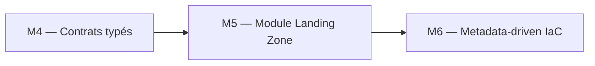
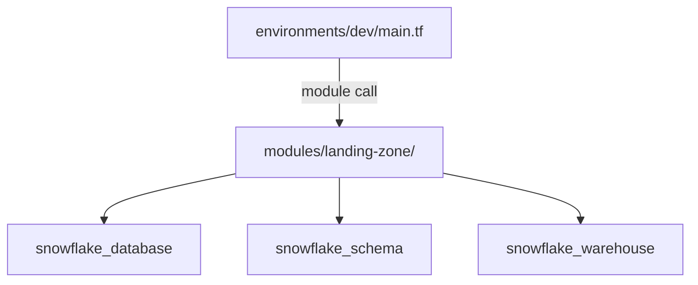

# 🧪 Lab M5 — Module Landing Zone réutilisable

> [<- Jour 2](../README.md) · [<- Jour 1](../../day-01/README.md) · **Module 05** · [Module suivant ->](../module-06-dynamic-logic/lab.md)

| Élément | Valeur |
|---|---|
| **Durée** | 60 min |
| **Piste** | `[CORE]` |
| **Workspace** | `$HOME/Data2AI-Labs/data-platform` (le clone) |
| **Dossier de travail** | `modules/landing-zone/` et `environments/dev/` |
| **Coût** | Aucune nouvelle ressource (réutilisation) |
| **Cleanup** | Conserver jusqu'au Jour 3 |

## 🎯 Mission

Les domaines Data ont besoin d'une plateforme cohérente sans copier des centaines de ressources. Vous allez extraire les ressources de M1 dans un module réutilisable `landing-zone`, puis l'appeler depuis `environments/dev/`.

## 🏗️ Architecture





## 🎯 Objectifs

- créer un module Terraform avec une interface typée;
- déplacer les ressources de `environments/dev/` vers le module;
- appeler le module depuis `environments/dev/`;
- versionner le module avec un `README.md` et des `outputs`.

## 📋 Prérequis

- [ ] M4 terminé;
- [ ] `terraform plan` affiche `No changes` dans `environments/dev/`.

## 📝 Partie 1 — Créer la structure du module

### 📝 Étape 1.1 — Créer les dossiers

```bash
cd $HOME/Data2AI-Labs/data-platform
mkdir -p modules/landing-zone
```

### 📝 Étape 1.2 — Créer `modules/landing-zone/variables.tf`

```hcl
variable "learner_prefix" {
  type        = string
  description = "Unique uppercase prefix assigned to the learner"

  validation {
    condition     = can(regex("^[A-Z][A-Z0-9]{2,4}$", var.learner_prefix))
    error_message = "learner_prefix must contain 3-5 uppercase letters or digits."
  }
}

variable "environment" {
  type        = string
  description = "Deployment environment"
  default     = "DEV"

  validation {
    condition     = contains(["DEV", "UAT", "PROD"], var.environment)
    error_message = "environment must be DEV, UAT or PROD."
  }
}

variable "warehouse_size" {
  type        = string
  description = "Warehouse size"
  default     = "X-SMALL"

  validation {
    condition     = contains(["X-SMALL", "SMALL", "MEDIUM"], var.warehouse_size)
    error_message = "warehouse_size must be X-SMALL, SMALL or MEDIUM."
  }
}

variable "data_retention_days" {
  type        = number
  description = "Time travel retention in days"
  default     = 1

  validation {
    condition     = var.data_retention_days >= 0 && var.data_retention_days <= 90
    error_message = "data_retention_days must be between 0 and 90."
  }
}

variable "auto_suspend_seconds" {
  type        = number
  description = "Warehouse auto-suspend in seconds"
  default     = 60

  validation {
    condition     = var.auto_suspend_seconds >= 60 && var.auto_suspend_seconds <= 3600
    error_message = "auto_suspend_seconds must be between 60 and 3600."
  }
}
```

### 📝 Étape 1.3 — Créer `modules/landing-zone/main.tf`

```hcl
locals {
  database_name  = "${var.learner_prefix}_RAW_${var.environment}"
  schema_name    = "INGESTION"
  warehouse_name = "WH_${var.learner_prefix}_ETL_${var.environment}"
  common_comment = "Managed by Terraform | Landing Zone | ${var.learner_prefix}"
}

resource "snowflake_database" "raw" {
  name                        = local.database_name
  comment                     = local.common_comment
  data_retention_time_in_days = var.data_retention_days
}

resource "snowflake_schema" "ingestion" {
  database = snowflake_database.raw.name
  name     = local.schema_name
  comment  = local.common_comment
}

resource "snowflake_warehouse" "etl" {
  name                = local.warehouse_name
  comment             = local.common_comment
  warehouse_size      = var.warehouse_size
  auto_suspend        = var.auto_suspend_seconds
  auto_resume         = true
  initially_suspended = true
}
```

### 📝 Étape 1.4 — Créer `modules/landing-zone/outputs.tf`

```hcl
output "database_name" {
  value       = snowflake_database.raw.name
  description = "RAW database name"
}

output "schema_name" {
  value       = snowflake_schema.ingestion.name
  description = "Ingestion schema name"
}

output "warehouse_name" {
  value       = snowflake_warehouse.etl.name
  description = "ETL warehouse name"
}
```

### 📝 Étape 1.5 — Créer `modules/landing-zone/versions.tf`

```hcl
terraform {
  required_version = ">= 1.14.0, < 2.0.0"

  required_providers {
    snowflake = {
      source  = "snowflakedb/snowflake"
      version = "= 2.14.0"
    }
  }
}
```

### 📝 Étape 1.6 — Créer `modules/landing-zone/README.md`

```markdown
# landing-zone

Creates a RAW database, an INGESTION schema and an ETL warehouse.

## Usage

\`\`\`hcl
module "landing_zone" {
  source             = "../../modules/landing-zone"
  learner_prefix     = "ABC"
  environment        = "DEV"
  warehouse_size     = "X-SMALL"
}
\`\`\`

## Inputs

| Name | Type | Default | Description |
|---|---|---|---|
| learner_prefix | string | — | 3-5 uppercase letters |
| environment | string | DEV | DEV, UAT or PROD |
| warehouse_size | string | X-SMALL | Warehouse size |
| data_retention_days | number | 1 | Time travel days |
| auto_suspend_seconds | number | 60 | Auto-suspend seconds |

## Outputs

| Name | Description |
|---|---|
| database_name | RAW database name |
| schema_name | Ingestion schema name |
| warehouse_name | ETL warehouse name |
```

### 📝 Étape 1.7 — Formater et valider le module

```bash
cd modules/landing-zone
terraform fmt
terraform validate
```

✅ **Checkpoint** : `The configuration is valid.`

> 💡 **Note** : Un module n'a pas de `provider` block ni de `backend` block. Il déclare seulement les contraintes et les ressources.

## 📝 Partie 2 — Appeler le module depuis environments/dev

### 📝 Étape 2.1 — Réécrire `environments/dev/main.tf`

Remplacez tout le contenu de `environments/dev/main.tf` par :

```hcl
module "landing_zone" {
  source              = "../../modules/landing-zone"
  learner_prefix      = var.learner_prefix
  environment         = var.environment
  warehouse_size      = var.warehouse_size
  data_retention_days = var.data_retention_days
  auto_suspend_seconds = var.auto_suspend_seconds
}
```

### 📝 Étape 2.2 — Mettre à jour `environments/dev/outputs.tf`

```hcl
output "database_name" {
  value       = module.landing_zone.database_name
  description = "RAW database name"
}

output "schema_name" {
  value       = module.landing_zone.schema_name
  description = "Ingestion schema name"
}

output "warehouse_name" {
  value       = module.landing_zone.warehouse_name
  description = "ETL warehouse name"
}

output "resource_summary" {
  value = {
    database  = module.landing_zone.database_name
    schema    = module.landing_zone.schema_name
    warehouse = module.landing_zone.warehouse_name
  }
}
```

### 📝 Étape 2.3 — Formater et initialiser

```bash
cd environments/dev
terraform fmt
terraform init
```

Terraform télécharge le module local.

### 📝 Étape 2.4 — Planifier

```bash
terraform plan
```

✅ **Checkpoint** : `No changes.` — les ressources existent déjà et le module produit la même configuration.

> 💡 **Note** : Si Terraform propose de recréer les ressources, c'est que les noms ou attributs diffèrent. Vérifiez vos variables.

## 📝 Partie 3 — Réutiliser le module pour un second domaine

### 📝 Étape 3.1 — Ajouter un second appel dans `main.tf`

```hcl
module "landing_zone_sales" {
  source              = "../../modules/landing-zone"
  learner_prefix      = "${var.learner_prefix}SAL"
  environment         = var.environment
  warehouse_size      = "X-SMALL"
  data_retention_days = var.data_retention_days
  auto_suspend_seconds = var.auto_suspend_seconds
}
```

### 📝 Étape 3.2 — Ajouter les outputs

```hcl
output "sales_database_name" {
  value       = module.landing_zone_sales.database_name
  description = "Sales RAW database name"
}
```

### 📝 Étape 3.3 — Planifier

```bash
terraform fmt
terraform plan
```

✅ **Checkpoint** : `3 to add` — le second module crée une nouvelle database, un nouveau schema et un nouveau warehouse.

### 📝 Étape 3.4 — Appliquer

```bash
terraform apply
```

✅ **Checkpoint** : `3 added, 0 changed, 0 destroyed.`

## 🏆 Challenge

Ajoutez une variable `schemas` (list of strings) au module qui crée plusieurs schemas dans la même database avec `for_each`.

Critères :

- [ ] `terraform validate` réussit;
- [ ] `terraform plan` crée les schemas supplémentaires;
- [ ] le module reste réutilisable sans modification de l'appelant existant.

## 🧹 Cleanup

Conservez les ressources pour le Jour 3. Supprimez le second domaine si vous voulez :

```bash
terraform destroy -target=module.landing_zone_sales
```
