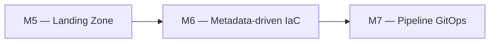
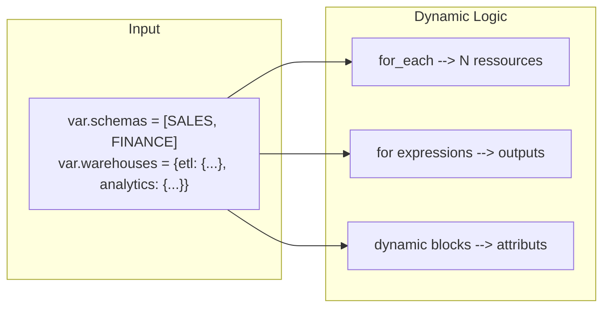
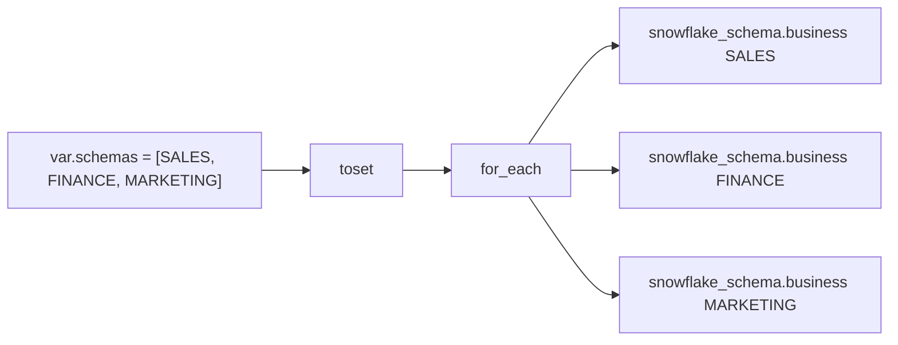
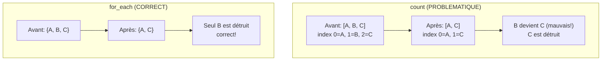

# Lab M6 -- Déploiement dynamique avec `for_each`, `for` et `dynamic`

**Durée :** 60 min
**Code :** `project/03-day2-modules/modules/landing-zone/`
**Patterns :** `for_each` resources, `for` expressions, `dynamic` blocks, `count` vs `for_each`, `try()`/`lookup()`

---

## Contexte métier

La plateforme doit absorber de nouveaux schémas, warehouses et domaines sans dupliquer le code. Les collections typées rendent le déploiement piloté par métadonnées.

## Contexte architecture



| Référentiel | Alignement |
|---|---|
| Pattern | Data-Driven IaC |
| Azure Well-Architected | Efficacité des performances, Excellence opérationnelle |
| Azure CAF | Adopt |
| Platform Engineering | Self-service piloté par données |

## Pattern d'entreprise

Le pattern **Data-Driven IaC** sépare la définition métier des ressources de leur moteur de création et garantit des adresses stables avec `for_each`.

## Objectifs

À l'issue de ce lab, vous serez capable de :

- ✅ Utiliser `for_each` avec `toset()` pour créer N schemas depuis une liste.
- ✅ Créer des warehouses depuis une `map(object)` avec `for_each`.
- ✅ Démontrer pourquoi `for_each` préserve l'identité des ressources vs `count`.
- ✅ Transformer des outputs avec les expressions `for` (liste et map).
- ✅ Générer des blocs de configuration conditionnels avec `dynamic`.
- ✅ Gérer les valeurs optionnelles avec `optional()`, `try()` et `lookup()`.
- ✅ Comprendre le comportement de Terraform face aux ressources hors-state.

---

## Prérequis

> **Prérequis communs :** le Lab M0 est terminé et `terraform plan` fonctionne dans `project/01-day1-basics`. En mode formation, utilisez uniquement le secret `SNOWFLAKE_PASSWORD` distribué par le formateur ; ne stockez jamais sa valeur dans Git.

- Lab M5 terminé (module `landing-zone` déployé)
- Terraform >= 1.14.5
- Compréhension des modules et variables (Labs M4-M5)

---

## Concept — Pourquoi avant comment

Terraform propose trois mécanismes pour éviter la duplication de code : `for_each` (créer N ressources depuis une map/set), `for` (transformer des listes/maps dans les expressions), et `dynamic` (générer des blocs de configuration conditionnels). La règle d'or : **`for_each` préserve l'identité des ressources, `count` non**.



**Patterns IaC :**
- **for_each > count :** `for_each` préserve l'identité des ressources (clé stable)
- **toset() :** Convertit une liste en set pour `for_each` (exige des clés uniques)
- **for expressions :** Transformations fonctionnelles dans les outputs
- **try()/lookup() :** Gérer les valeurs optionnelles sans erreur
- **dynamic blocks :** Générer des blocs de configuration conditionnels

---

## Implémentation guidée

### Étape 1 -- `for_each` sur les schemas (10 min)

**Objectif :** Créer N schemas dynamiquement depuis une liste.

Ouvrir `modules/landing-zone/schemas.tf` (ou `main.tf` où se trouvent les schemas) :

```hcl
# Avant : schema unique statique
resource "snowflake_schema" "ingestion" {
  database = snowflake_database.raw.name
  name     = "INGESTION"
  comment  = "Ingestion layer - ${var.environment}"
}
```

Transformer pour utiliser `for_each` sur la liste `var.schemas` :

```hcl
resource "snowflake_schema" "business" {
  for_each = toset(var.schemas)

  database = snowflake_database.raw.name
  name     = "${each.key}_${var.environment}"
  comment  = "Business schema ${each.key} - ${var.environment}"
}
```

> **Pourquoi `toset()` ?** `for_each` exige une map ou un set avec des clés uniques. `toset()` convertit une `list(string)` en `set(string)`, garantissant l'unicité. Avec une map, `each.key` est la clé et `each.value` est la valeur.



Déployer :

```powershell
cd project/03-day2-modules/environments/dev
terraform plan
# Attendu : +3 schemas (si var.schemas = [SALES, FINANCE, MARKETING])
terraform apply -auto-approve
```

Vérifier dans Snowflake :

```sql
SHOW SCHEMAS IN DATABASE DB_RAW_DEV;
-- Trois schemas visibles : SALES_DEV, FINANCE_DEV, MARKETING_DEV
```

---

### Étape 2 -- Tester l'ajout de schemas (5 min)

**Objectif :** Vérifier qu'un ajout de schema ne crée que le nouveau.

Dans `environments/dev/terraform.tfvars` :

```hcl
schemas = ["SALES", "FINANCE", "MARKETING", "HR"]
```

```powershell
terraform plan
# Attendu : +1 schema (HR uniquement, les 3 autres sont inchangés)
terraform apply -auto-approve
```

> **Pattern :** `for_each` permet des **modifications chirurgicales**. Un ajout de clé ne crée que la nouvelle ressource. Les ressources existantes ne sont pas touchées.

---

### Étape 3 -- Retrait ciblé (5 min)

**Objectif :** Vérifier qu'un retrait ne détruit que la ressource correspondante.

Retirer `MARKETING` du tfvars :

```hcl
schemas = ["SALES", "FINANCE", "HR"]
```

```powershell
terraform plan
# Attendu : destruction de snowflake_schema.business["MARKETING"] UNIQUEMENT
terraform apply -auto-approve
```

> **Pattern :** Avec `for_each`, un retrait de clé ne détruit **que** la ressource correspondante. C'est le comportement attendu et prévisible.

---

### Étape 4 -- `count` vs `for_each` : le test décisif (10 min)

**Objectif :** Démontrer pourquoi `for_each` est supérieur à `count`.

Tester les deux approches avec un changement au milieu de la liste :

```hcl
# Avec count (PROBLEMATIQUE)
resource "snowflake_schema" "bad" {
  count      = length(var.schemas)
  database   = snowflake_database.raw.name
  name       = var.schemas[count.index]
}

# Avec for_each (CORRECT)
resource "snowflake_schema" "good" {
  for_each   = toset(var.schemas)
  database   = snowflake_database.raw.name
  name       = each.key
}
```

**Test :** `var.schemas = ["A", "B", "C"]` → `var.schemas = ["A", "C"]`



- **Avec `count` :** `B` devient `C` (index shift !), `C` est détruit — **corruption**
- **Avec `for_each` :** seul `B` est détruit — **correct**

> **Règle :** Préférez `for_each` dès que les éléments ont une identité stable. Réservez `count` pour les ressources conditionnelles (activation/désactivation avec `count = var.enabled ? 1 : 0`).

---

### Étape 5 -- `for` expressions dans les outputs (5 min)

**Objectif :** Transformer les outputs avec des expressions `for`.

Dans `outputs.tf` :

```hcl
# Liste des noms de schemas
output "schema_names" {
  value = [for s in snowflake_schema.business : s.name]
}

# Map clé -> nom
output "schema_map" {
  value = { for k, s in snowflake_schema.business : k => s.name }
}

# Grouping par database
output "schemas_by_database" {
  value = {
    for s in snowflake_schema.business :
    s.database => s.name...
  }
}
```

```powershell
terraform refresh
terraform output schema_names
terraform output schema_map
terraform output schemas_by_database
```

> **Tip :** `[for ...]` produit une **liste**, `{ for ... }` produit une **map**. Le `...` après `s.name` fait du **grouping** (les valeurs sont agrégées en listes par clé).

**Questions de compréhension :**
1. Quelle est la différence entre `[for ...]` et `{ for ... }` ?
2. Que fait `...` dans `s.name...` (grouping) ?
3. Comment filtrer avec `if` dans une `for` expression ? (ex: `{ for s in ... : k => v if v != "" }`)

---

### Étape 6 -- `for_each` sur les warehouses avec map(object) (10 min)

**Objectif :** Créer des warehouses depuis une map d'objets structurés.

Dans `modules/landing-zone/main.tf`, les warehouses utilisent `for_each` sur `var.warehouses` :

```hcl
resource "snowflake_warehouse" "this" {
  for_each = var.warehouses

  name                = "WH_${upper(each.key)}_${var.environment}"
  comment             = local.comment
  warehouse_size      = each.value.size
  auto_suspend        = each.value.auto_suspend
  auto_resume         = true
  initially_suspended = true
  max_cluster_count   = each.value.max_clusters
  min_cluster_count   = 1
  scaling_policy      = "STANDARD"

  resource_monitor = snowflake_resource_monitor.this.name
}
```

> **Note :** Grâce au type `map(object({ size = string, auto_suspend = optional(number, 60), max_clusters = optional(number, 1) }))`, les champs `auto_suspend` et `max_clusters` sont accessibles directement via `each.value.auto_suspend` — pas besoin de `lookup()`. Les valeurs par défaut sont gérées par `optional()` dans la définition du type.

Tester avec le tfvars :

```hcl
warehouses = {
  etl = {
    size         = "X-SMALL"
    auto_suspend = 60
  }
  analytics = {
    size         = "SMALL"
    auto_suspend = 120
    max_clusters = 2
  }
}
```

```powershell
terraform plan
# Attendu : +2 warehouses (WH_ETL_DEV et WH_ANALYTICS_DEV)
terraform apply -auto-approve
```

```sql
SHOW WAREHOUSES LIKE 'WH\_%\_DEV';
```

> **Pattern :** Avec une `map(object)`, `each.key` est le nom logique (etl, analytics) et `each.value` est l'objet complet. `lookup()` récupère les champs optionnels avec une valeur par défaut.

---

### Étape 7 -- `dynamic` blocks (avancé) (10 min)

**Objectif :** Générer des blocs de configuration conditionnels.

Si une ressource a des attributs répétés ou optionnels, `dynamic` évite la duplication. Le module `landing-zone` n'utilise pas de `dynamic` block, mais il utilise `for_each` sur des `snowflake_tag_association` pour attacher les tags aux warehouses. Voici un exemple réaliste avec `snowflake_file_format` (géré dans le capstone) :

```hcl
resource "snowflake_file_format" "csv" {
  name            = "FF_CSV_${var.environment}"
  database_name   = var.raw_database_name
  schema_name     = "INGESTION"
  format_type     = "CSV"

  dynamic "format_options" {
    for_each = var.csv_options != null ? [var.csv_options] : []
    content {
      field_delimiter = format_options.value.field_delimiter
      skip_header     = format_options.value.skip_header
      null_if         = format_options.value.null_if
    }
  }
}
```

> **Pattern :** `dynamic` génère un bloc pour chaque élément de la collection. Si la collection est vide, **aucun bloc n'est généré**. C'est l'équivalent d'un `for_each` mais pour les blocs imbriqués. Le module `landing-zone` utilise plutôt `for_each` sur des ressources indépendantes (`snowflake_tag_association`).

---

### Étape 8 -- Gérer les valeurs optionnelles avec `try()` (5 min)

**Objectif :** Comparer `try()`, `lookup()` et `optional()`.

```hcl
# try() : tente plusieurs expressions, retourne la première qui réussit
auto_suspend = try(each.value.auto_suspend, 60)

# lookup() : récupère une clé dans une map avec fallback
max_clusters = lookup(each.value, "max_clusters", 1)

# optional() : dans la définition du type, rend un champ optionnel
variable "warehouses" {
  type = map(object({
    size         = string
    auto_suspend = optional(number, 60)
    max_clusters = optional(number, 1)
  }))
}
```

> **Note :** `optional()` est la méthode recommandée (Terraform 1.3+). Elle rend le champ optionnel dans la définition du type, avec un défaut. `try()` et `lookup()` sont utiles pour la rétrocompatibilité.

---

### Étape 9 -- Drift detection sur ressources dynamiques (5 min)

**Objectif :** Comprendre le comportement de Terraform face aux ressources hors-state.

1. Ajouter un schema manuellement dans Snowflake :

```sql
CREATE SCHEMA DB_RAW_DEV.MANUALLY_ADDED;
```

2. Lancer `terraform plan` :
   - Terraform **ne voit pas** ce schema (il n'est pas dans le state)
   - Ce schema **n'est pas** détecté comme dérive (Terraform ne gère que ce qu'il a créé)

3. Ajouter `MANUALLY_ADDED` à la liste `schemas` et re-appliquer :
   - Terraform tente de le créer, mais il existe déjà → erreur
   - Solution : `terraform import snowflake_schema.business["MANUALLY_ADDED"] 'DB_RAW_DEV|MANUALLY_ADDED'`

> **Pattern :** Terraform gère uniquement les ressources dans son state. Les ressources créées manuellement sont **invisibles** pour Terraform jusqu'à import.

---

## Exercice challenge

**Objectif :** Étendre le module `landing-zone` pour attacher des tags de façon dynamique aux warehouses via `for_each` sur `snowflake_tag_association`.

**Consignes :**
1. Ajouter une variable `warehouse_tags` de type `map(map(string))` dans le module : clé = nom logique du warehouse (`etl`, `analytics`), valeur = map de tags (`CostCenter`, `Team`).
2. Créer une ressource `snowflake_tag_association` par tag (par exemple `wh_dynamic_tags`) qui utilise `for_each` pour aplatir la structure `warehouse → tags`.
3. Configurer les tags dans le tfvars : `etl` → `{CostCenter = "IT", Team = "DataEng"}`, `analytics` → `{CostCenter = "BI", Team = "Analytics"}`.
4. Déployer et vérifier les tags dans Snowflake.

**Critères de validation :**
- [ ] `terraform validate` réussit
- [ ] `terraform plan` montre les tag associations à créer
- [ ] `terraform apply` réussit
- [ ] Les tags sont visibles sur les warehouses (`SHOW TAGS ON WAREHOUSE WH_ETL_DEV`)
- [ ] Si `warehouse_tags` est vide, aucune association n'est créée (aucune erreur)

> **Hint :** Aplatissez `var.warehouse_tags` avec `flatten()` et `for` pour créer une clé composite `"warehouse_name/tag_name"`. Le module actuel utilise déjà `snowflake_tag_association` avec des tags en dur (`wh_env`, `wh_cc`, `wh_team`) — inspirez-vous de ce pattern.

---

## Validation et auto-évaluation

### Checklist de compétences

- [ ] Je sais utiliser `for_each` avec `toset()` sur une liste
- [ ] Je peux créer des ressources depuis une `map(object)`
- [ ] Je comprends pourquoi `for_each` est supérieur à `count`
- [ ] Je sais utiliser `for` expressions dans les outputs (liste et map)
- [ ] Je peux générer des blocs conditionnels avec `dynamic`
- [ ] Je sais gérer les valeurs optionnelles avec `try()` et `optional()`
- [ ] Je comprends le comportement de Terraform face aux ressources hors-state

### Quiz rapide

1. **Pourquoi `for_each` est-il préférable à `count` ?**
   - [ ] Il est plus rapide
   - [ ] Il préserve l'identité des ressources (clé stable) lors de modifications de liste
   - [ ] Il permet plus de ressources
   - [ ] Il est obligatoire
   > Réponse : Préserve l'identité (clé stable)

2. **Que fait `toset()` ?**
   - [ ] Convertit un set en liste
   - [ ] Convertit une liste en set (clés uniques, requis par `for_each`)
   - [ ] Trie une liste
   - [ ] Supprime les doublons d'une map
   > Réponse : Convertit une liste en set

3. **Quelle est la différence entre `[for ...]` et `{ for ... }` ?**
   - [ ] Aucune
   - [ ] `[for ...]` produit une liste, `{ for ... }` produit une map
   - [ ] `[for ...]` est obsolète
   - [ ] `{ for ... }` produit une liste
   > Réponse : Liste vs map

4. **Que fait un `dynamic` block avec une collection vide ?**
   - [ ] Erreur
   - [ ] Génère un bloc vide
   - [ ] Ne génère aucun bloc
   - [ ] Supprime la ressource
   > Réponse : Ne génère aucun bloc

5. **Quand utiliser `count` plutôt que `for_each` ?**
   - [ ] Pour les ressources avec identité stable
   - [ ] Pour les ressources conditionnelles (`count = var.enabled ? 1 : 0`)
   - [ ] Jamais, `for_each` est toujours meilleur
   - [ ] Quand la liste a plus de 10 éléments
   > Réponse : Pour les ressources conditionnelles

---

### Diagnostic guidé

| Symptôme | Cause probable | Action |
|----------|----------------|--------|
| `Invalid for_each argument` | La valeur n'est pas une map ou un set | Utiliser `toset()` sur une liste |
| `each.value is null` | Clé introuvable dans la map | Vérifier la structure de la variable |
| `dynamic block not supported` | Provider ne supporte pas ce bloc | Vérifier la documentation du provider |
| `count.index out of range` | Changement dans la liste décale les indexes | Utiliser `for_each` à la place |
| `try()` ne fonctionne pas | Mauvais ordre des arguments | `try(valeur, fallback)` — valeur d'abord |
| `Error: duplicate key` | Doublons dans la liste passée à `toset()` | Dédupliquer la liste |

---

## Bonus : Aller plus loin

- Utiliser `dynamic` blocks avec des `for_each` imbriqués pour des configurations multi-niveaux
- Comparer `terraform plan` avec `count` vs `for_each` sur une modification de liste
- Ajouter un `for_each` sur une `map(object)` avec clé composée
- Utiliser `sensitive = true` avec `for_each` pour masquer des valeurs dans les logs de plan
- Explorer `flatten()` pour aplatir des listes de listes avant `for_each`

---

## Troubleshooting

### `Invalid for_each argument`

La valeur n'est pas une map ou un set. Utilisez `toset()` sur une liste, ou vérifiez que la variable est bien typée `map(object({...}))`.

### `each.value is null` ou `each.value has no attribute`

La clé n'existe pas dans la map ou le champ n'est pas défini. Vérifiez la structure de la variable et les `optional()` dans le type.

### `dynamic block not supported`

Le provider ne supporte pas ce bloc dynamique. Vérifiez la documentation du provider Snowflake pour les blocs supportés.

### `count.index out of range`

Un changement dans la liste décale les indexes. C'est le problème classique de `count` — utilisez `for_each` à la place.

### `Error: duplicate key` dans `toset()`

La liste passée à `toset()` contient des doublons. Dédupliquer la liste ou utiliser un type `set(string)` dans la définition de la variable.
---

## Notes d'architecte

- **Décision :** la capacité du module est traitée comme un produit de plateforme, pas comme un exemple isolé.
- **Compromis :** le lab réduit volontairement l'échelle afin de rester exécutable en sandbox ; les contrôles de production restent obligatoires.
- **Garde-fou :** toute modification doit produire un plan relu, une validation technique et une preuve d'absence de dérive.

## Bonnes pratiques Enterprise

- Versionner les contrats et les modules, jamais les secrets ni les fichiers de state.
- Appliquer le moindre privilège aux identités humaines et techniques.
- Utiliser un state distant isolé, un artefact de plan immuable et une approbation avant production.
- Rendre sécurité, fiabilité, coût et observabilité vérifiables par le pipeline.

## Notes de production

| Dimension | Training | Production |
|---|---|---|
| Identité | Secret transmis hors Git | JWT, identité technique dédiée et rotation contrôlée |
| State | Backend simplifié ou sandbox | Azure Blob privé, chiffré, verrouillé et isolé |
| Déploiement | Exécution locale guidée | Azure DevOps, approbation et artefact de plan |
| Exploitation | Validation ponctuelle | SLO, alertes, runbooks, FinOps et contrôle continu de dérive |

## Réflexion

1. Quel risque métier réapparaît si cette capacité est gérée manuellement ?
2. Quel contrôle doit devenir obligatoire avant une promotion en production ?
3. Quelle preuve transmettre à l'équipe qui exploite la capacité suivante ?


