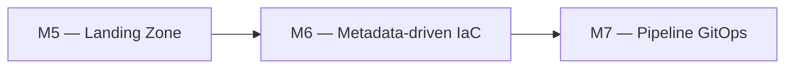

# 🧪 Lab M6 — Déploiement dynamique avec `for_each`, `for` et `dynamic`

> [<- Jour 2](../README.md) · [<- Module precedent](../module-05-modules/lab.md) · **Module 06** · [Module suivant ->](../module-07-cicd-pipeline/lab.md)

| Élément | Valeur |
|---|---|
| **Durée** | 60 min |
| **Piste** | `[CORE]` |
| **Workspace** | `$HOME/Data2AI-Labs/data-platform` (le clone) |
| **Dossier de travail** | `modules/landing-zone/` |
| **Coût** | Warehouses X-SMALL supplémentaires |
| **Cleanup** | Conserver jusqu'au Jour 3 |

## 🎯 Mission

La plateforme doit absorber de nouveaux schémas, warehouses et domaines sans dupliquer le code. Vous allez rendre le module `landing-zone` piloté par métadonnées avec `for_each`, `for` et `dynamic`.

## 🏗️ Architecture



## 🎯 Objectifs

- utiliser `for_each` pour créer plusieurs ressources à partir d'une map;
- utiliser `for` pour transformer des collections;
- utiliser `dynamic` pour générer des blocs répétitifs;
- comprendre la différence entre `count` et `for_each`.

## 📋 Prérequis

- [ ] M5 terminé : le module `landing-zone` existe et fonctionne;
- [ ] `terraform plan` affiche `No changes` dans `environments/dev/`.

## 📝 Partie 1 — for_each pour les schemas

### 📝 Étape 1.1 — Ajouter une variable `schemas` au module

Dans `modules/landing-zone/variables.tf`, ajoutez :

```hcl
variable "schemas" {
  type        = map(object({
    name    = string
    comment = string
  }))
  description = "Map of schemas to create in the RAW database"
  default = {
    ingestion = {
      name    = "INGESTION"
      comment = "Ingestion schema"
    }
  }
}
```

### 📝 Étape 1.2 — Remplacer la ressource schema par un for_each

Dans `modules/landing-zone/main.tf`, remplacez le bloc `snowflake_schema.ingestion` par :

```hcl
resource "snowflake_schema" "this" {
  for_each = var.schemas

  database = snowflake_database.raw.name
  name     = each.value.name
  comment  = each.value.comment
}
```

### 📝 Étape 1.3 — Mettre à jour les outputs

Dans `modules/landing-zone/outputs.tf`, remplacez l'output `schema_name` par :

```hcl
output "schema_names" {
  value       = { for k, v in var.schemas : k => snowflake_schema.this[k].name }
  description = "Map of created schema names"
}
```

### 📝 Étape 1.4 — Mettre à jour l'appelant

Dans `environments/dev/main.tf`, ajoutez le paramètre `schemas` :

```hcl
module "landing_zone" {
  source              = "../../modules/landing-zone"
  learner_prefix      = var.learner_prefix
  environment         = var.environment
  warehouse_size      = var.warehouse_size
  data_retention_days = var.data_retention_days
  auto_suspend_seconds = var.auto_suspend_seconds

  schemas = {
    ingestion = {
      name    = "INGESTION"
      comment = "Ingestion schema"
    }
    staging = {
      name    = "STAGING"
      comment = "Staging schema for raw data"
    }
  }
}
```

### 📝 Étape 1.5 — Mettre à jour les outputs de l'appelant

Dans `environments/dev/outputs.tf` :

```hcl
output "schema_names" {
  value       = module.landing_zone.schema_names
  description = "Map of created schema names"
}
```

### 📝 Étape 1.6 — Formater, valider, planifier

```bash
cd environments/dev
terraform fmt
terraform init
terraform validate
terraform plan
```

✅ **Checkpoint** : `1 to add` — le nouveau schema `STAGING`.

### 📝 Étape 1.7 — Appliquer

```bash
terraform apply
```

## 📝 Partie 2 — for_each pour les warehouses

### 📝 Étape 2.1 — Ajouter une variable `warehouses`

Dans `modules/landing-zone/variables.tf` :

```hcl
variable "warehouses" {
  type        = map(object({
    size             = string
    auto_suspend     = number
    comment          = string
  }))
  description = "Map of warehouses to create"
  default = {
    etl = {
      size         = "X-SMALL"
      auto_suspend = 60
      comment      = "ETL warehouse"
    }
  }
}
```

### 📝 Étape 2.2 — Remplacer la ressource warehouse par un for_each

Dans `modules/landing-zone/main.tf` :

```hcl
resource "snowflake_warehouse" "this" {
  for_each = var.warehouses

  name                = "WH_${var.learner_prefix}_${upper(each.key)}_${var.environment}"
  comment             = each.value.comment
  warehouse_size      = each.value.size
  auto_suspend        = each.value.auto_suspend
  auto_resume         = true
  initially_suspended = true
}
```

### 📝 Étape 2.3 — Mettre à jour les outputs

```hcl
output "warehouse_names" {
  value       = { for k, v in var.warehouses : k => snowflake_warehouse.this[k].name }
  description = "Map of created warehouse names"
}
```

### 📝 Étape 2.4 — Mettre à jour l'appelant

```hcl
module "landing_zone" {
  source              = "../../modules/landing-zone"
  learner_prefix      = var.learner_prefix
  environment         = var.environment
  data_retention_days = var.data_retention_days

  schemas = {
    ingestion = { name = "INGESTION", comment = "Ingestion schema" }
    staging   = { name = "STAGING",   comment = "Staging schema" }
  }

  warehouses = {
    etl = { size = "X-SMALL", auto_suspend = 60, comment = "ETL warehouse" }
    bi  = { size = "X-SMALL", auto_suspend = 120, comment = "BI warehouse" }
  }
}
```

### 📝 Étape 2.5 — Planifier et appliquer

```bash
terraform fmt
terraform validate
terraform plan
terraform apply
```

✅ **Checkpoint** : `1 to add` — le nouveau warehouse `WH_ABC_BI_DEV`.

## 📝 Partie 3 — for expressions et dynamic

### 📝 Étape 3.1 — Utiliser for pour un output consolidé

Dans `modules/landing-zone/outputs.tf` :

```hcl
output "all_resources" {
  value = {
    database   = snowflake_database.raw.name
    schemas    = [for k, v in var.schemas : snowflake_schema.this[k].name]
    warehouses = [for k, v in var.warehouses : snowflake_warehouse.this[k].name]
  }
  description = "Consolidated list of all resources"
}
```

### 📝 Étape 3.2 — Vérifier

```bash
terraform output all_resources
```

✅ **Checkpoint** : un objet avec la database, la liste des schemas et la liste des warehouses.

## 📝 Partie 4 — count vs for_each

### 📝 Étape 4.1 — Comprendre la différence

| Critère | `count` | `for_each` |
|---|---|---|
| Type d'entrée | `number` | `map` ou `set` |
| Index | `count.index` | `each.key` et `each.value` |
| Suppression | décale tous les index | supprime uniquement la clé visée |
| Recommandé pour | activer/désactiver | collections nommées |

### 📝 Étape 4.2 — Exemple de count pour un feature flag

Ajoutez dans `modules/landing-zone/variables.tf` :

```hcl
variable "enable_monitoring_schema" {
  type        = bool
  description = "Create a monitoring schema"
  default     = false
}
```

Dans `main.tf` :

```hcl
resource "snowflake_schema" "monitoring" {
  count = var.enable_monitoring_schema ? 1 : 0

  database = snowflake_database.raw.name
  name     = "MONITORING"
  comment  = "Monitoring schema"
}
```

### 📝 Étape 4.3 — Activer et tester

Dans `environments/dev/main.tf` :

```hcl
  enable_monitoring_schema = true
```

```bash
terraform fmt
terraform plan
terraform apply
```

✅ **Checkpoint** : `1 to add` — le schema `MONITORING`.

## 🏆 Challenge

Ajoutez une variable `tags` (map de strings) au module et utilisez `dynamic` pour appliquer ces tags à chaque ressource qui supporte les tags.

Critères :

- [ ] `terraform validate` réussit;
- [ ] `terraform plan` n'affiche pas de changement si les tags sont vides;
- [ ] les tags s'appliquent quand ils sont fournis.

## 🧹 Cleanup

Conservez les ressources pour le Jour 3.
