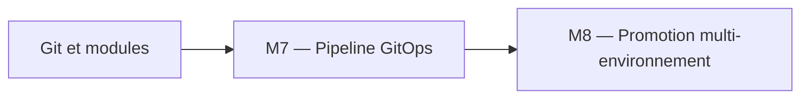
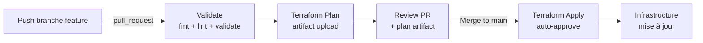
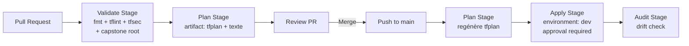
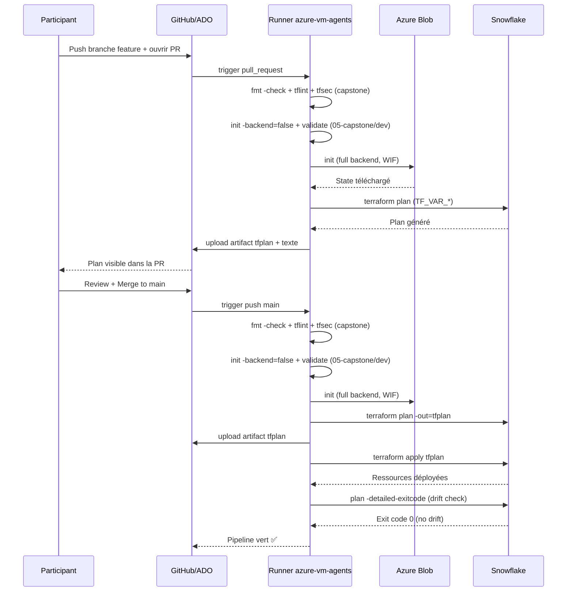

# Lab M7 -- Pipeline CI/CD Terraform avec GitHub Actions et Azure DevOps

**Durée :** 75 min
**Fichiers :** `.github/workflows/terraform.yml` , `azure-pipelines.yml`
**Patterns :** GitOps, plan-on-PR/apply-on-main, tflint, tfsec, artifacts, environment gates

---

## Contexte métier

Les changements manuels ne fournissent ni séparation des responsabilités ni preuve d'approbation. Le pipeline produit un plan immuable, applique après revue et audite la dérive.

## Contexte architecture



| Référentiel | Alignement |
|---|---|
| Pattern | GitOps Promotion Pipeline |
| Azure Well-Architected | Sécurité, Excellence opérationnelle |
| Azure CAF | Govern |
| Platform Engineering | Plan sur PR, apply approuvé, audit continu |

## Pattern d'entreprise

Le pattern **GitOps Promotion Pipeline** sépare validation, plan et apply, conserve l'artefact approuvé et interdit la reconstruction d'un plan différent au moment du déploiement.

## Objectifs

À l'issue de ce lab, vous serez capable de :

- ✅ Lire et comprendre un workflow GitHub Actions pour Terraform (validate, plan, apply, audit).
- ✅ Configurer les secrets GitHub (Snowflake `TF_VAR_*` + Azure `ARM_*`).
- ✅ Comprendre la séparation validate → plan (PR) → apply (main) → audit (drift + dbt).
- ✅ Configurer une approbation manuelle via GitHub Environments.
- ✅ Intégrer tflint et tfsec dans le pipeline CI.
- ✅ Comprendre le concept d'artifact de plan binaire et de matrix validation.
- ✋ Configurer un pipeline équivalent sur Azure DevOps (stages Validate/Plan/Apply/Audit).

---

## Prérequis

> **Prérequis communs :** le Lab M0 est terminé et `terraform plan` fonctionne dans `project/01-day1-basics`. En mode formation, utilisez uniquement le secret `SNOWFLAKE_PASSWORD` distribué par le formateur ; ne stockez jamais sa valeur dans Git.

- Labs M1 à M6 terminés
- Dépôt Git sur GitHub (et/ou Azure DevOps)
- Terraform >= 1.14.5
- Backend Azure Blob Storage configuré (Lab M2)
- `gh` CLI installé (pour GitHub) ou accès Azure DevOps
- Compréhension du workflow Git (branches, PR, merge)

---

## Concept — Pourquoi avant comment

Le **GitOps** consiste à utiliser Git comme source de vérité pour l'infrastructure. Le pipeline CI/CD applique automatiquement les changements : **validate** sur PR (fmt, lint, validate), **plan** sur PR (génère le plan), **apply** sur merge vers `main`. Cette séparation garantit que rien n'est appliqué sans revue.



**Patterns IaC :**
- **GitOps :** Git est la source de vérité, le pipeline applique automatiquement
- **Shift-Left :** Valider le plus tôt possible (fmt, lint, validate avant plan)
- **Plan Artifact :** Le plan binaire est conservé pour un apply ultérieur
- **Environment Gates :** L'environnement `dev` peut nécessiter une approbation manuelle
- **Secret Management :** Les secrets sont injectés via GitHub Secrets / Azure DevOps Variables

---

## Implémentation guidée

### Étape 1 -- Lire le workflow GitHub Actions existant (10 min)

**Objectif :** Comprendre la structure du pipeline CI/CD.

Ouvrir `.github/workflows/terraform.yml` :

```yaml
name: Terraform CI/CD

on:
  pull_request:
    branches: [main]
    paths: ["project/**", "finops/**", ".github/workflows/terraform.yml"]
  push:
    branches: [main]
    paths: ["project/**", "finops/**"]

env:
  TF_VERSION: "1.14.5"
  TFLINT_VERSION: "v0.50.0"
  DEPLOY_DIR: project/05-capstone/environments/dev

permissions:
  contents: read
  pull-requests: write

jobs:
  validate:
    name: Validate & Lint
    runs-on: ubuntu-latest
    steps:
      - uses: actions/checkout@v4
      - uses: hashicorp/setup-terraform@v3
        with:
          terraform_version: ${{ env.TF_VERSION }}
      - name: Terraform Format
        run: terraform fmt -check -recursive
        working-directory: project
      - uses: terraform-linters/setup-tflint@v4
        with:
          tflint_version: ${{ env.TFLINT_VERSION }}
      - name: Init tflint
        run: tflint --init
        working-directory: project
      - name: Run tflint
        run: tflint --recursive
        working-directory: project

  validate-matrix:
    name: Validate Root
    needs: validate
    runs-on: ubuntu-latest
    strategy:
      fail-fast: false
      matrix:
        root:
          - project/00-bootstrap
          - project/01-day1-basics
          - project/02-day1-state
          - project/03-day2-modules/environments/dev
          - project/03-day2-modules/environments/test
          - project/04-day3-rbac/environments/dev
          - project/04-day3-rbac/environments/test
          - project/05-capstone/environments/dev
          - project/05-capstone/environments/test
    steps:
      - uses: actions/checkout@v4
      - uses: hashicorp/setup-terraform@v3
        with:
          terraform_version: ${{ env.TF_VERSION }}
      - name: Terraform Init (no backend)
        run: terraform init -backend=false
        working-directory: ${{ matrix.root }}
        env:
          TF_VAR_snowflake_organization: ${{ secrets.SNOWFLAKE_ORGANIZATION }}
          TF_VAR_snowflake_account: ${{ secrets.SNOWFLAKE_ACCOUNT }}
          TF_VAR_snowflake_user: ${{ secrets.SNOWFLAKE_USER }}
          TF_VAR_snowflake_password: ${{ secrets.SNOWFLAKE_PASSWORD }}
          TF_VAR_snowflake_role: ${{ secrets.SNOWFLAKE_ROLE }}
          TF_VAR_deployment_mode: training
      - name: Terraform Validate
        run: terraform validate
        working-directory: ${{ matrix.root }}
```

**Questions de compréhension :**
1. Combien de jobs y a-t-il dans le stage `validate` ? (Réponse : 2 — `validate` et `validate-matrix`)
2. Pourquoi `terraform init -backend=false` dans le job `validate-matrix` ? (Réponse : pas besoin du backend pour valider la syntaxe)
3. Combien de roots sont validés dans la matrix ? (Réponse : 9 roots)
4. Pourquoi les secrets sont passés en `TF_VAR_*` et non en `-var` ? (Réponse : Terraform lit automatiquement les variables d'environnement préfixées `TF_VAR_`)

> **Tip :** `terraform init -backend=false` télécharge les providers sans configurer le backend. C'est suffisant pour `terraform validate` et plus rapide qu'un init complet. Les secrets sont injectés via `TF_VAR_*` (variables d'environnement) plutôt que via un fichier `terraform.tfvars` — c'est la pratique CI/CD recommandée.

---

### Étape 2 -- Configurer les secrets GitHub (10 min)

**Objectif :** Stocker les credentials de manière sécurisée.

```powershell
gh secret set SNOWFLAKE_ORGANIZATION --body "<snowflake-organization>"
gh secret set SNOWFLAKE_ACCOUNT --body "<snowflake-account>"
gh secret set SNOWFLAKE_USER --body "DATA2AI"
gh secret set SNOWFLAKE_PASSWORD --body "<SNOWFLAKE_PASSWORD>"
gh secret set SNOWFLAKE_ROLE --body "ACCOUNTADMIN"
```

> **Note :** Ce lab utilise l'authentification par mot de passe (`SNOWFLAKE_PASSWORD`) via `TF_VAR_deployment_mode: training`. Pour la JWT key-pair, remplacez `SNOWFLAKE_PASSWORD` par `SNOWFLAKE_PRIVATE_KEY` (base64) et restaurez l'écriture du fichier `.p8` dans le pipeline.

Pour le backend Azure Blob (credentials ARM) :

```powershell
gh secret set ARM_CLIENT_ID --body "VOTRE_CLIENT_ID"
gh secret set ARM_CLIENT_SECRET --body "VOTRE_CLIENT_SECRET"
gh secret set ARM_TENANT_ID --body "VOTRE_TENANT_ID"
gh secret set ARM_SUBSCRIPTION_ID --body "VOTRE_SUBSCRIPTION_ID"
```

Vérifier :

```powershell
gh secret list
```

> **Note :** Les secrets `ARM_*` sont utilisés par le backend `azurerm` pour s'authentifier auprès d'Azure Blob Storage. Ne les confondez pas avec les secrets `SNOWFLAKE_*` qui authentifient le provider Snowflake.

---

### Étape 3 -- Lancer le pipeline via Pull Request (10 min)

**Objectif :** Déclencher le pipeline et observer les jobs.

```powershell
git checkout -b feature/cicd-lab
git add -A
git commit -m "feat: enable CI/CD pipeline"
git push origin feature/cicd-lab
```

Ouvrir une Pull Request sur GitHub.

**Observer dans l'onglet Actions :**
- Le job `validate` se lance automatiquement
- Vérifier les logs : `tflint`, `terraform fmt`, `terraform validate`
- Vérifier qu'**aucun secret** n'apparaît en clair dans les logs

> **Pattern :** Les secrets GitHub sont masqués dans les logs automatiquement. Si vous voyez `***` dans les logs, c'est normal. Si vous voyez une valeur en clair, c'est un bug de configuration.

---

### Étape 4 -- Analyser le job `plan` (sur PR uniquement) (10 min)

**Objectif :** Comprendre comment le plan est généré et stocké.

Le job `plan` dépend de `validate-matrix` et ne s'exécute que sur `pull_request` :

```yaml
plan:
  name: Terraform Plan
  needs: validate-matrix
  if: github.event_name == 'pull_request'
  runs-on: ubuntu-latest
  defaults:
    run:
      working-directory: ${{ env.DEPLOY_DIR }}
  steps:
    - uses: actions/checkout@v4
    - uses: hashicorp/setup-terraform@v3
      with:
        terraform_version: ${{ env.TF_VERSION }}
    - name: Terraform Init
      run: terraform init
      env:
        ARM_CLIENT_ID: ${{ secrets.ARM_CLIENT_ID }}
        ARM_CLIENT_SECRET: ${{ secrets.ARM_CLIENT_SECRET }}
        ARM_TENANT_ID: ${{ secrets.ARM_TENANT_ID }}
        ARM_SUBSCRIPTION_ID: ${{ secrets.ARM_SUBSCRIPTION_ID }}
    - name: Terraform Plan
      run: |
        terraform plan -no-color -out=tfplan | tee tfplan.txt
        terraform show -no-color tfplan > tfplan_show.txt
      env:
        TF_VAR_snowflake_organization: ${{ secrets.SNOWFLAKE_ORGANIZATION }}
        TF_VAR_snowflake_account: ${{ secrets.SNOWFLAKE_ACCOUNT }}
        TF_VAR_snowflake_user: ${{ secrets.SNOWFLAKE_USER }}
        TF_VAR_snowflake_password: ${{ secrets.SNOWFLAKE_PASSWORD }}
        TF_VAR_snowflake_role: ${{ secrets.SNOWFLAKE_ROLE }}
        TF_VAR_deployment_mode: training
        ARM_CLIENT_ID: ${{ secrets.ARM_CLIENT_ID }}
        ARM_CLIENT_SECRET: ${{ secrets.ARM_CLIENT_SECRET }}
        ARM_TENANT_ID: ${{ secrets.ARM_TENANT_ID }}
        ARM_SUBSCRIPTION_ID: ${{ secrets.ARM_SUBSCRIPTION_ID }}
    - uses: actions/upload-artifact@v4
      with:
        name: tfplan
        path: ${{ env.DEPLOY_DIR }}/tfplan
    - uses: actions/upload-artifact@v4
      with:
        name: tfplan-text
        path: ${{ env.DEPLOY_DIR }}/tfplan.txt
```

Dans les logs du job `plan` :
1. `terraform init` est exécuté **avec** le backend (Azure Blob) — full init, utilisant les secrets `ARM_*`
2. `terraform plan -no-color -out=tfplan` produit le plan binaire + texte (`tee tfplan.txt`)
3. Le plan binaire et le texte sont uploadés en **artifacts** séparés (`tfplan` et `tfplan-text`)

> **Pattern :** Les secrets Snowflake sont passés via `TF_VAR_*` (variables d'environnement) et les secrets Azure via `ARM_*`. Le plan est un **artifact binaire** — pas un simple texte. Il peut être ré-appliqué plus tard si conservé.

---

### Étape 5 -- Tester le job `apply` (sur push main) (10 min)

**Objectif :** Déclencher le déploiement automatique après merge.

Après review et merge de la PR sur `main` :

```yaml
apply:
  name: Terraform Apply
  needs: validate-matrix
  if: github.ref == 'refs/heads/main' && github.event_name == 'push'
  runs-on: ubuntu-latest
  environment: dev
  defaults:
    run:
      working-directory: ${{ env.DEPLOY_DIR }}
  steps:
    - uses: actions/checkout@v4
    - uses: hashicorp/setup-terraform@v3
      with:
        terraform_version: ${{ env.TF_VERSION }}
    - name: Terraform Init
      run: terraform init
      env:
        ARM_CLIENT_ID: ${{ secrets.ARM_CLIENT_ID }}
        ARM_CLIENT_SECRET: ${{ secrets.ARM_CLIENT_SECRET }}
        ARM_TENANT_ID: ${{ secrets.ARM_TENANT_ID }}
        ARM_SUBSCRIPTION_ID: ${{ secrets.ARM_SUBSCRIPTION_ID }}
    - name: Terraform Apply
      run: terraform apply -auto-approve
      env:
        TF_VAR_snowflake_organization: ${{ secrets.SNOWFLAKE_ORGANIZATION }}
        TF_VAR_snowflake_account: ${{ secrets.SNOWFLAKE_ACCOUNT }}
        TF_VAR_snowflake_user: ${{ secrets.SNOWFLAKE_USER }}
        TF_VAR_snowflake_password: ${{ secrets.SNOWFLAKE_PASSWORD }}
        TF_VAR_snowflake_role: ${{ secrets.SNOWFLAKE_ROLE }}
        TF_VAR_deployment_mode: training
        ARM_CLIENT_ID: ${{ secrets.ARM_CLIENT_ID }}
        ARM_CLIENT_SECRET: ${{ secrets.ARM_CLIENT_SECRET }}
        ARM_TENANT_ID: ${{ secrets.ARM_TENANT_ID }}
        ARM_SUBSCRIPTION_ID: ${{ secrets.ARM_SUBSCRIPTION_ID }}
```

**Observer :**
- `environment: dev` signifie que le job peut nécessiter une **approbation manuelle** si configuré dans GitHub Environments
- `terraform apply -auto-approve` exécute le déploiement sans confirmation interactive
- L'apply utilise les mêmes secrets `TF_VAR_*` et `ARM_*` que le job `plan`

> **Tip :** Pour configurer l'approbation manuelle : GitHub repo → Settings → Environments → `dev` → Required reviewers → Ajouter les reviewers.

---

### Étape 6 -- Ajouter tfsec (audit sécurité) (bonus) (10 min)

**Objectif :** Intégrer l'analyse de sécurité dans le pipeline.

Ajouter tfsec dans le job `validate` :

```yaml
- name: Run tfsec
  uses: aquasecurity/tfsec-action@v1
  with:
    working_directory: ${{ env.WORKING_DIR }}
    sarif_file: tfsec.sarif

- name: Upload SARIF result
  uses: github/codeql-action/upload-sarif@v3
  with:
    sarif_file: tfsec.sarif
```

Tester localement :

```powershell
choco install tfsec
tfsec project/
```

> **Pattern :** tfsec analyse le code Terraform pour détecter les problèmes de sécurité (secrets en dur, ressources non chiffrées, etc.). Les résultats SARIF sont affichés directement dans l'onglet Security de GitHub.

---

### Étape 7 -- Workflow matrix (pattern avancé) (5 min)

**Objectif :** Valider plusieurs environnements en parallèle.

```yaml
strategy:
  matrix:
    env: [dev, test]

steps:
  - run: terraform plan
    working-directory: project/05-capstone/environments/${{ matrix.env }}
```

> **Pattern :** La stratégie `matrix` exécute le job en parallèle pour chaque valeur. Idéal pour valider dev et test simultanément sur chaque PR.

---

### Étape 8 -- Audit post-apply : drift detection (5 min)

**Objectif :** Comprendre le job `audit` qui s'exécute après `apply` sur `main`.

Le pipeline réel inclut un 4e job `audit` :

```yaml
audit:
  name: Post-Apply Drift Check
  needs: apply
  if: github.ref == 'refs/heads/main' && github.event_name == 'push'
  runs-on: ubuntu-latest
  steps:
    - uses: actions/checkout@v4
    - uses: hashicorp/setup-terraform@v3
    - name: Drift Check
      run: |
        terraform plan -detailed-exitcode -no-color || exit_code=$?
        if [ "$exit_code" -eq 0 ]; then
          echo "No drift detected."
        elif [ "$exit_code" -eq 2 ]; then
          echo "DRIFT DETECTED — infrastructure differs from state."
          exit 1
        fi
```

> **Note :** `terraform plan -detailed-exitcode` retourne : 0 = no changes, 1 = error, 2 = changes detected. Le stage `Audit` du pipeline `azure-pipelines.yml` est restreint au `Drift Check` pour rester exécutable sur un agent auto-hébergé (`azure-vm-agents`). Le projet dbt/FinOps reste disponible en tant qu'extension dans le Lab M13.

---

### Étape 9 -- Configuration Azure DevOps Pipelines (optionnel) (10 min)

**Objectif :** Reproduire le même pipeline GitOps sur Azure DevOps.

#### 1. Workload Identity Federation (WIF)

Le pipeline `azure-pipelines.yml` à la racine du repo utilise **WIF** au lieu de `ARM_CLIENT_SECRET`.

1. Dans Azure DevOps → Project Settings → Service connections
2. Créer une connexion `terraform-arm` de type **Azure Resource Manager** → **Workload Identity Federation**
3. Autoriser le pipeline à utiliser cette connexion

Le job `WIF Login` (`AzureCLI@2`) récupère un token OIDC et exporte :
- `ARM_CLIENT_ID`
- `ARM_TENANT_ID`
- `ARM_SUBSCRIPTION_ID`
- `ARM_OIDC_TOKEN`

```bash
SUBSCRIPTION_ID=$(az account show --query id -otsv)
echo "##vso[task.setvariable variable=ARM_SUBSCRIPTION_ID;issecret=true]$SUBSCRIPTION_ID"
```

> **Note :** `ARM_SUBSCRIPTION_ID` est récupéré dynamiquement depuis `az account show` car le token WIF ne le fournit pas.

#### 2. Le fichier `azure-pipelines.yml`

Le pipeline implémente 4 stages ciblés sur le capstone `project/05-capstone/environments/dev` :

- **Validate** : install Terraform, fmt check, `tflint`, `tfsec`, puis `init -backend=false` + `validate` de `project/05-capstone/environments/dev`
- **Plan** : s'exécute après `Validate` (PR et `main`). Génère `tfplan` + `tfplan.txt` et les publie comme artifacts
- **Apply** : s'exécute uniquement sur `main`, dépend du stage `Plan`. Télécharge l'artifact `tfplan` du run courant et l'applique
- **Audit** : `Drift Check` seul (`terraform plan -detailed-exitcode`)

> **Important :** `Apply` dépend de `Plan` afin de garantir que l'artefact est publié avant d'être téléchargé. Le stage `Plan` s'exécute sur `main` car le run courant consomme son propre artefact.

**Agent pool :** le pipeline cible le pool `azure-vm-agents` (agent Linux provisionné via `project/07-devops-agents` et cloud-init). S'assurer que le pool contient au moins un agent en ligne.

#### 3. Configurer l'approbation manuelle

1. Dans Azure DevOps : **Pipelines** → **Environments**
2. Créer un environnement nommé `dev`
3. Options (...) → **Approvals and checks** → Ajouter une étape **Approvals**
4. Assigner les utilisateurs chargés de valider les déploiements



### Séquence CI/CD complète



---

## Exercice challenge

**Objectif :** Ajouter une stratégie `matrix` pour planifier dev et test en parallèle sur chaque PR.

**Consignes :**
1. Modifier le job `plan` pour utiliser `strategy.matrix` avec `env: [dev, test]`
2. Adapter le `working-directory` pour pointer vers `project/05-capstone/environments/${{ matrix.env }}`
3. Uploader les plans comme artifacts séparés (`tfplan-dev`, `tfplan-test`)
4. Tester avec une PR

**Critères de validation :**
- [ ] Le job `plan` s'exécute en parallèle pour dev et test
- [ ] Les deux artifacts sont uploadés
- [ ] Les deux plans sont visibles dans la PR
- [ ] Aucune erreur de configuration

> **Hint :** Utilisez `matrix.env` pour paramétrer à la fois le `working-directory` et le nom de l'artifact. Le `runs-on` reste `ubuntu-latest`.

---

## Validation et auto-évaluation

### Checklist de compétences

- [ ] Je sais lire et comprendre un workflow GitHub Actions pour Terraform
- [ ] Je peux configurer les secrets GitHub (Snowflake + ARM)
- [ ] Je comprends la séparation validate → plan → apply
- [ ] Je sais configurer une approbation manuelle via GitHub Environments
- [ ] Je peux intégrer tflint et tfsec dans le pipeline
- [ ] Je comprends le concept d'artifact de plan binaire
- [ ] Je sais configurer un pipeline équivalent sur Azure DevOps

### Quiz rapide

1. **Pourquoi `terraform init -backend=false` dans le job validate ?**
   - [ ] C'est plus rapide
   - [ ] Pas besoin du backend pour valider la syntaxe, seulement les providers
   - [ ] Pour éviter de payer Azure
   - [ ] C'est obligatoire
   > Réponse : Pas besoin du backend pour valider

2. **Quand le job `apply` s'exécute-t-il ?**
   - [ ] Sur chaque push
   - [ ] Sur chaque PR
   - [ ] Uniquement sur push vers `main` (après merge)
   - [ ] Manuellement
   > Réponse : Sur push vers main

3. **Que fait `terraform plan -detailed-exitcode` ?**
   - [ ] Affiche plus de détails
   - [ ] Retourne 0=no changes, 1=error, 2=changes detected
   - [ ] Génère un plan détaillé
   - [ ] Valide le plan
   > Réponse : Code de sortie détaillé (0/1/2)

4. **Comment les secrets sont-ils injectés dans le pipeline ?**
   - [ ] En clair dans le YAML
   - [ ] Via GitHub Secrets / Azure DevOps Variables (masqués dans les logs)
   - [ ] Via un fichier .env
   - [ ] Via les variables d'environnement du runner
   > Réponse : Via GitHub Secrets / ADO Variables

5. **À quoi sert `environment: dev` dans le job apply ?**
   - [ ] À définir le nom de l'environnement Terraform
   - [ ] À activer l'approbation manuelle via GitHub Environments
   - [ ] À sélectionner le tfvars
   - [ ] À rien, c'est décoratif
   > Réponse : Approbation manuelle via Environments

---

### Diagnostic guidé

| Symptôme | Cause probable | Action |
|----------|----------------|--------|
| `terraform init` échoue dans CI | Credentials ARM manquants | Vérifier les secrets `ARM_*` dans GitHub |
| `tflint` erreur sur fichiers générés | Exclure `.terraform/` | Ajouter `--ignore-module=.terraform` |
| Secrets visibles dans les logs | Variable non marquée `sensitive` | Ajouter `sensitive = true` dans `variables.tf` |
| Plan non uploadé | Artifact déjà présent | Nettoyer les artifacts précédents ou changer le nom |
| `Error: No configuration files` | `WORKING_DIR` incorrect | Vérifier le chemin dans le workflow YAML |
| `apply` échoue avec `Lock not held` | State lock perdu | Re-lancer le pipeline ou `force-unlock` manuel |
| `Error: Invalid credentials` Snowflake | Clé privée mal encodée | Vérifier l'encodage base64 du secret |

---

## Bonus : Aller plus loin

- Configurer **GitHub Environments** avec approbation manuelle pour `apply`
- Ajouter un **commentaire automatique** sur la PR avec le résultat du plan :
  ```yaml
  - name: Post plan comment
    uses: actions/github-script@v7
    with:
      script: |
        const output = `\`\`\`<br/>${{ steps.plan.outputs.stdout }}<br/>\`\`\``;
        github.rest.issues.createComment({
          issue_number: context.issue.number,
          owner: context.repo.owner,
          repo: context.repo.repo,
          body: output
        });
  ```
- Utiliser **OpenID Connect (OIDC)** au lieu de clés ARM statiques pour l'authentification Azure
- Ajouter **terraform-compliance** pour des tests de conformité sur le plan
- Configurer **tfsec** avec résultats SARIF dans l'onglet Security de GitHub
- Utiliser **Azure DevOps provider** pour gérer le pipeline as code (voir cours M7)

---

## Troubleshooting

### `terraform init` échoue dans CI

Credentials `ARM_*` manquants ou incorrects. Vérifiez les secrets GitHub : `ARM_CLIENT_ID`, `ARM_CLIENT_SECRET`, `ARM_TENANT_ID`, `ARM_SUBSCRIPTION_ID`.

### `tflint` erreur sur fichiers générés

Exclure `.terraform/` : ajouter `--ignore-module=.terraform` ou configurer `.tflint.hcl`.

### Secrets visibles dans les logs

Variable non marquée `sensitive = true` dans `variables.tf`. Ajoutez `sensitive = true` sur les variables contenant des credentials.

### `Error: No configuration files`

Le `DEPLOY_DIR` ou `WORKING_DIR` est incorrect. Vérifiez le chemin dans le workflow YAML — il doit pointer vers un root module avec des `.tf` files.

### `apply` échoue avec `Lock not held`

Le state lock a été perdu (timeout, runner interrompu). Relancez le pipeline ou exécutez `terraform force-unlock` manuellement.

### `Error: Invalid credentials` Snowflake

En mode training, vérifiez que `SNOWFLAKE_PASSWORD` est correct. En mode production, vérifiez l'encodage base64 de `SNOWFLAKE_PRIVATE_KEY`.

### Le job `audit` échoue sur `dbt build`

Vérifiez que le projet `finops/` est à jour (`dbt deps`) et que les variables `SNOWFLAKE_*` sont correctement passées.
---

## Notes d'architecte

- **Décision :** la capacité du module est traitée comme un produit de plateforme, pas comme un exemple isolé.
- **Compromis :** le lab réduit volontairement l'échelle afin de rester exécutable en sandbox ; les contrôles de production restent obligatoires.
- **Garde-fou :** toute modification doit produire un plan relu, une validation technique et une preuve d'absence de dérive.

## Bonnes pratiques Enterprise

- Versionner les contrats et les modules, jamais les secrets ni les fichiers de state.
- Appliquer le moindre privilège aux identités humaines et techniques.
- Utiliser un state distant isolé, un artefact de plan immuable et une approbation avant production.
- Rendre sécurité, fiabilité, coût et observabilité vérifiables par le pipeline.

## Notes de production

| Dimension | Training | Production |
|---|---|---|
| Identité | Secret transmis hors Git | JWT, identité technique dédiée et rotation contrôlée |
| State | Backend simplifié ou sandbox | Azure Blob privé, chiffré, verrouillé et isolé |
| Déploiement | Exécution locale guidée | Azure DevOps, approbation et artefact de plan |
| Exploitation | Validation ponctuelle | SLO, alertes, runbooks, FinOps et contrôle continu de dérive |

## Réflexion

1. Quel risque métier réapparaît si cette capacité est gérée manuellement ?
2. Quel contrôle doit devenir obligatoire avant une promotion en production ?
3. Quelle preuve transmettre à l'équipe qui exploite la capacité suivante ?


