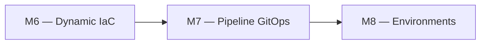
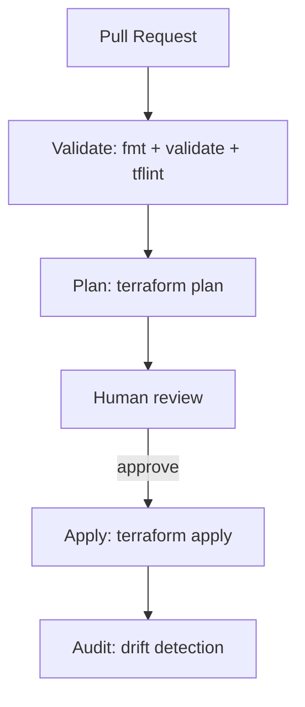

# 🧪 Lab M7 — Pipeline CI/CD Terraform avec Azure DevOps

> [<- Jour 2](../README.md) · [<- Module precedent](../module-06-dynamic-logic/lab.md) · **Module 07** · [Module suivant ->](../module-08-environments/lab.md)

| Élément | Valeur |
|---|---|
| **Durée** | 75 min |
| **Piste** | `[CORE]` |
| **Workspace** | `$HOME/Data2AI-Labs/data-platform` (le clone) |
| **Dossier de travail** | `azure-pipelines.yml` à la racine |
| **Coût** | Aucun (pipeline gratuit avec agent Microsoft) |
| **Cleanup** | Conserver jusqu'au Jour 5 |

> `[IMPORTANT]` Avant de commencer, vous devez etre dans la racine du clone
> et avoir execute `Learner-Login.ps1` dans **cette session** :
>
> ```powershell
> cd "$HOME\Data2AI-Labs\data-platform"
> .\scripts\Learner-Login.ps1 -LearnerPrefix APP01
> ```
>
> Cela set `TF_VAR_snowflake_token` (depuis `secrets/snowflake_pat.txt`)
> et les variables `ARM_*` pour Terraform. Sans cela, `terraform plan`
> vous demandera `var.snowflake_token` manuellement.

## 🎯 Mission

Les changements manuels ne fournissent ni séparation des responsabilités ni preuve d'approbation. Vous allez configurer un pipeline Azure DevOps qui produit un plan immuable, applique après revue et audite la dérive.

## 🏗️ Architecture





## 🎯 Objectifs

- comprendre le pipeline `azure-pipelines.yml` du projet type;
- configurer un service connection Azure DevOps;
- exécuter un plan sur une PR;
- appliquer après approbation;
- comprendre les gates d'environnement.

## 📋 Prérequis

- [ ] M5 et M6 terminés : les modules existent et fonctionnent;
- [ ] un projet Azure DevOps avec accès au repository;
- [ ] un service connection Azure DevOps pour Snowflake (ou PAT en variable group).

## 📝 Partie 1 — Lire le pipeline existant

### 📝 Étape 1.1 — Ouvrir `azure-pipelines.yml`

```bash
cd $HOME/Data2AI-Labs/data-platform
code azure-pipelines.yml
```

### 📝 Étape 1.2 — Comprendre les stages

Le pipeline contient 5 stages :

| Stage | Trigger | Rôle |
|---|---|---|
| `Validate` | PR et main | `terraform fmt -check`, `validate`, `tflint` |
| `Plan` | PR et main | `terraform plan -out=tfplan` |
| `Approval` | main only | Gate manuel avant apply |
| `Apply` | main only | `terraform apply tfplan` |
| `Audit` | main only | `terraform plan -detailed-exitcode` pour détecter la dérive |

### 📝 Étape 1.3 — Comprendre les variables

Le pipeline utilise des variables stockées dans un Variable Group Azure DevOps :

| Variable | Description |
|---|---|
| `ARM_SUBSCRIPTION_ID` | ID de souscription Azure |
| `ARM_TENANT_ID` | ID de tenant Azure |
| `SNOWFLAKE_CONNECTION` | Nom de connexion Snowflake CLI |
| `SNOWFLAKE_PAT` | PAT (secret, masqué) |

> 🔒 **SECURITY** : Les secrets sont stockés dans le Variable Group et jamais dans le code.

## 📝 Partie 2 — Configurer Azure DevOps

### 📝 Étape 2.1 — Créer un Variable Group

1. Dans Azure DevOps, allez dans **Pipelines > Library**;
2. cliquez **+ Variable group**;
3. nommez-le `data-platform-secrets`;
4. ajoutez les variables ci-dessus;
5. marquez `SNOWFLAKE_PAT` comme secret;
6. liez le variable group au pipeline.

### 📝 Étape 2.2 — Connecter le repository

1. Dans **Pipelines > Pipelines**, cliquez **New Pipeline**;
2. sélectionnez votre repository Git;
3. choisissez **Existing Azure Pipelines YAML file**;
4. sélectionnez `/azure-pipelines.yml`;
5. exécutez le pipeline.

## 📝 Partie 3 — Tester le pipeline sur une PR

### 📝 Étape 3.1 — Créer une branche

```bash
git checkout -b feature/add-staging-schema
```

### 📝 Étape 3.2 — Faire un changement mineur

Dans `environments/dev/main.tf`, ajoutez un schema supplémentaire :

```hcl
  schemas = {
    ingestion = { name = "INGESTION", comment = "Ingestion schema" }
    staging   = { name = "STAGING",   comment = "Staging schema" }
    archive   = { name = "ARCHIVE",   comment = "Archive schema" }
  }
```

### 📝 Étape 3.3 — Commit et push

```bash
git add environments/dev/main.tf
git commit -m "Add ARCHIVE schema to landing zone"
git push origin feature/add-staging-schema
```

### 📝 Étape 3.4 — Créer une PR

Dans Azure DevOps, créez une Pull Request vers `main`.

### 📝 Étape 3.5 — Observer le pipeline

Le pipeline exécute les stages `Validate` et `Plan`.

✅ **Checkpoint** :

- `Validate` : `terraform fmt -check` passe, `validate` passe, `tflint` passe;
- `Plan` : `1 to add` — le nouveau schema ARCHIVE.

### 📝 Étape 3.6 — Approuver et merger

1. Relisez le plan dans les logs du pipeline;
2. approuvez la PR;
3. mergez vers `main`.

### 📝 Étape 3.7 — Observer le pipeline sur main

Le pipeline exécute tous les stages :

- `Validate` : passe;
- `Plan` : `1 to add`;
- `Approval` : attend l'approbation manuelle;
- `Apply` : applique le changement;
- `Audit` : `No changes` — zéro dérive.

## 📝 Partie 4 — Comprendre les gates d'environnement

### 📝 Étape 4.1 — Gates par environnement

Le pipeline peut être étendu pour gérer DEV, UAT et PROD avec des gates :

| Environnement | Gate | Qui approuve |
|---|---|---|
| DEV | Automatique | — |
| UAT | Approval manuel | Tech lead |
| PROD | Approval manuel + fenêtre | Change advisory board |

### 📝 Étape 4.2 — Ajouter un stage UAT (concept)

```yaml
- stage: PlanUAT
  dependsOn: ApplyDev
  jobs:
  - job: PlanUAT
    steps:
    - script: |
        cd environments/uat
        terraform init
        terraform plan -out=tfplan
      displayName: 'Terraform Plan UAT'

- stage: ApplyUAT
  dependsOn: PlanUAT
  condition: and(succeeded(), eq(variables['Build.SourceBranch'], 'refs/heads/main'))
  jobs:
  - deployment: ApplyUAT
    environment: UAT
    strategy:
      runOnce:
        deploy:
          steps:
          - script: |
              cd environments/uat
              terraform apply tfplan
```

## 🏆 Challenge

Ajoutez un stage `tflint` au pipeline qui échoue si `tflint` détecte des problèmes dans `modules/`.

Critères :

- [ ] le stage `Validate` exécute `tflint`;
- [ ] le pipeline échoue si `tflint` retourne des erreurs;
- [ ] le pipeline passe après correction.

## 🧹 Cleanup

Conservez le pipeline pour le capstone.

---

## Navigation

[<- Lab M6](../module-06-dynamic-logic/lab.md) · [<- Jour 2](../README.md) · **Lab M7** · [Lab M8 ->](../module-08-environments/lab.md)
