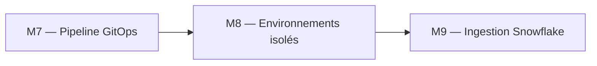
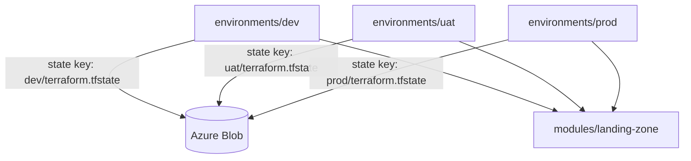

# 🧪 Lab M8 — Gestion multi-environnements : DEV, UAT, PROD

| Élément | Valeur |
|---|---|
| **Durée** | 50 min |
| **Piste** | `[CORE]` |
| **Workspace** | `$HOME/Data2AI-Labs/data-platform` (le clone) |
| **Dossier de travail** | `environments/dev/`, `environments/uat/`, `environments/prod/` |
| **Coût** | Warehouses X-SMALL en UAT, SMALL en PROD |
| **Cleanup** | Conserver jusqu'au Jour 3 |

## 🎯 Mission

DEV, UAT et PROD ont des risques, coûts et rythmes différents. Vous allez déployer le module `landing-zone` dans les trois environnements avec une isolation de state et de nommage.

## 🏗️ Architecture





## 🎯 Objectifs

- déployer le module dans DEV, UAT et PROD;
- isoler le state par environnement avec des clés distinctes;
- définir une matrice de paramètres par environnement;
- comprendre la différence entre workspaces et directories.

## 📋 Prérequis

- [ ] M5 et M6 terminés : le module `landing-zone` est piloté par métadonnées;
- [ ] le backend Azure Blob Storage fonctionne pour DEV;
- [ ] `terraform state list` affiche les ressources DEV.

## 📝 Partie 1 — Configurer UAT

### 📝 Étape 1.1 — Créer les fichiers Terraform dans `environments/uat/`

```bash
cd $HOME/Data2AI-Labs/data-platform/environments/uat
```

Créez `versions.tf` :

```hcl
terraform {
  required_version = "= 1.14.5"

  required_providers {
    snowflake = {
      source  = "snowflakedb/snowflake"
      version = "= 2.14.0"
    }
  }

  backend "azurerm" {
    resource_group_name  = "rg-data-platform-tfstate"
    storage_account_name = "stdataplatformtfstate"
    container_name       = "tfstate"
    key                  = "data-platform/uat/terraform.tfstate"
  }
}
```

> 💡 **Note** : La clé `data-platform/uat/terraform.tfstate` isole le state UAT du state DEV.

Créez `provider.tf` :

```hcl
provider "snowflake" {
  organization_name = var.snowflake_organization
  account_name      = var.snowflake_account
  user              = var.snowflake_user
  authenticator     = "PROGRAMMATIC_ACCESS_TOKEN"
  token             = var.snowflake_token
}
```

Créez `variables.tf` (identique à DEV) :

```hcl
variable "snowflake_organization" {
  type        = string
  description = "Snowflake organization name (from .env)"
}

variable "snowflake_account" {
  type        = string
  description = "Snowflake account name (from .env)"
}

variable "snowflake_user" {
  type        = string
  description = "Snowflake user name (from .env)"
}

variable "snowflake_token" {
  type        = string
  description = "Snowflake PAT (passed via TF_VAR_snowflake_token)"
  sensitive   = true
}
}

variable "learner_prefix" {
  type        = string
  validation {
    condition     = can(regex("^[A-Z][A-Z0-9]{2,4}$", var.learner_prefix))
    error_message = "learner_prefix must contain 3-5 uppercase letters or digits."
  }
}

variable "environment" {
  type    = string
  default = "UAT"
  validation {
    condition     = contains(["DEV", "UAT", "PROD"], var.environment)
    error_message = "environment must be DEV, UAT or PROD."
  }
}
```

Créez `main.tf` :

```hcl
module "landing_zone" {
  source              = "../../modules/landing-zone"
  learner_prefix      = var.learner_prefix
  environment         = "UAT"
  warehouse_size      = "X-SMALL"
  data_retention_days = 7
  auto_suspend_seconds = 120

  schemas = {
    ingestion = { name = "INGESTION", comment = "UAT ingestion" }
    staging   = { name = "STAGING",   comment = "UAT staging" }
  }

  warehouses = {
    etl = { size = "X-SMALL", auto_suspend = 120, comment = "UAT ETL" }
  }
}
```

Créez `outputs.tf` :

```hcl
output "database_name" {
  value = module.landing_zone.database_name
}

output "warehouse_names" {
  value = module.landing_zone.warehouse_names
}
```

Créez `terraform.tfvars` :

```hcl
snowflake_organization = "ZVFXOZW"
snowflake_account      = "PM71247"
snowflake_user         = "DATA2AI"
learner_prefix         = "ABC"
```

Remplacez `ABC` par votre préfixe.

### 📝 Étape 1.2 — Initialiser et planifier

```bash
terraform fmt
terraform init
terraform validate
terraform plan
```

✅ **Checkpoint** : `3 to add` — database, schema et warehouse UAT.

### 📝 Étape 1.3 — Appliquer

```bash
terraform apply
```

### 📝 Étape 1.4 — Vérifier dans Snowflake

```bash
snow sql -c training -q "SHOW DATABASES LIKE 'ABC_RAW_UAT'"
```

## 📝 Partie 2 — Configurer PROD

### 📝 Étape 2.1 — Créer les fichiers dans `environments/prod/`

Répétez les mêmes étapes que UAT avec ces différences :

- `backend` key : `data-platform/prod/terraform.tfstate`
- `environment` : `PROD`
- `warehouse_size` : `SMALL`
- `data_retention_days` : `30`
- `auto_suspend_seconds` : `300`

### 📝 Étape 2.2 — Initialiser, planifier, appliquer

```bash
cd environments/prod
terraform fmt
terraform init
terraform validate
terraform plan
terraform apply
```

### 📝 Étape 2.3 — Vérifier

```bash
snow sql -c training -q "SHOW DATABASES LIKE 'ABC_RAW_PROD'"
snow sql -c training -q "SHOW WAREHOUSES LIKE 'WH_ABC_ETL_PROD'"
```

## 📝 Partie 3 — Matrice de paramètres

### 📝 Étape 3.1 — Comparer les environnements

| Paramètre | DEV | UAT | PROD |
|---|---|---|---|
| Warehouse size | X-SMALL | X-SMALL | SMALL |
| Data retention | 1 jour | 7 jours | 30 jours |
| Auto-suspend | 60s | 120s | 300s |
| State key | dev/ | uat/ | prod/ |
| Schemas | INGESTION, STAGING | INGESTION, STAGING | INGESTION, STAGING |

### 📝 Étape 3.2 — Vérifier l'isolation du state

```bash
az storage blob list \
    --account-name "$ARM_STORAGE_ACCOUNT" \
    --container-name "$ARM_CONTAINER" \
    --query "[].name" -o tsv
```

✅ **Checkpoint** :

```text
data-platform/dev/terraform.tfstate
data-platform/uat/terraform.tfstate
data-platform/prod/terraform.tfstate
```

## 📝 Partie 4 — Workspaces vs directories

### 📝 Étape 4.1 — Comprendre les deux approches

| Critère | Workspaces | Directories |
|---|---|---|
| State | Même backend, workspace différent | Backends avec clés différentes |
| Code | Un seul dossier | Un dossier par environnement |
| Variables | `terraform.workspace` | Fichiers `.tfvars` séparés |
| Recommandé pour | Expérimentation | Production |

### 📝 Étape 4.2 — Pourquoi directories ici

L'approche par directories (utilisée dans ce lab) est préférée pour la production car :

- chaque environnement a son propre backend key;
- les variables sont explicites dans des fichiers séparés;
- le code est auditable indépendamment;
- pas de risque de workspace confusion.

## 🏆 Challenge

Ajoutez un environnement `DR` (Disaster Recovery) avec un warehouse `MEDIUM` et une rétention de 60 jours.

Critères :

- [ ] `terraform init` réussit dans `environments/dr/`;
- [ ] `terraform plan` crée les ressources DR;
- [ ] le state est isolé avec la clé `data-platform/dr/terraform.tfstate`;
- [ ] la database s'appelle `ABC_RAW_DR`.

## 🧹 Cleanup

Conservez les ressources pour le Jour 3. Pour nettoyer UAT et PROD :

```bash
cd environments/uat && terraform destroy
cd environments/prod && terraform destroy
```
