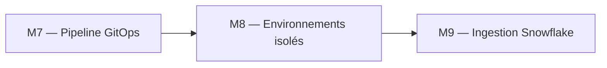
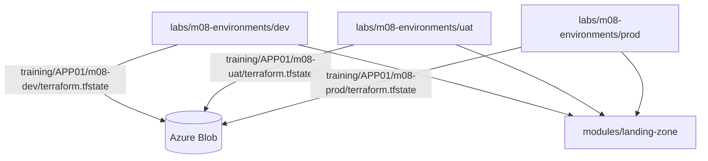

# 🧪 Lab M8 — Gestion multi-environnements : DEV, UAT, PROD

> [<- Jour 2](../README.md) · [<- Module precedent](../module-07-cicd-pipeline/lab.md) · **Module 08** · [Jour 3 ->](../../day-03/README.md)

| Élément | Valeur |
|---|---|
| **Durée** | 50 min |
| **Piste** | `[CORE]` |
| **Workspace** | `$HOME/Data2AI-Labs/data-platform` (le clone) |
| **Dossier de travail** | `labs/m08-environments/dev/`, `labs/m08-environments/uat/`, `labs/m08-environments/prod/` |
| **Coût** | Warehouses X-SMALL en DEV/UAT, SMALL en PROD |
| **Cleanup** | `terraform destroy -auto-approve` pour chaque environnement |

> `[IMPORTANT]` Avant de commencer, vous devez etre dans la racine du clone
> et avoir execute `Learner-Login.ps1` dans **cette session** :
>
> ```powershell
> cd "$HOME\Data2AI-Labs\data-platform"
> .\scripts\Learner-Login.ps1 -LearnerPrefix APP01
> ```
>
> Cela set `TF_VAR_snowflake_token` (depuis `secrets/snowflake_pat.txt`)
> et les variables `ARM_*` pour Terraform.
>
> Réinitialisez le lab pour partir d'un état propre :
>
> ```powershell
> .\scripts\Reset-Lab.ps1 -LearnerPrefix APP01 -Lab M08
> ```
>
> Puis placez-vous dans le dossier du lab et verifiez que tout est pret :
>
> ```powershell
> cd labs\m08-environments
> ..\..\scripts\Test-TerraformReady.ps1
> ```
>
> Si le pre-flight affiche `READY`, vous pouvez commencer.
> Sinon, suivez les corrections indiquees.

## 🎯 Mission

DEV, UAT et PROD ont des risques, coûts et rythmes différents. Vous allez créer un module `landing-zone`, puis le déployer dans les trois environnements avec une isolation de state et de nommage.

## 🏗️ Architecture





## 🎯 Objectifs

- créer un module `landing-zone` réutilisable;
- déployer le module dans DEV, UAT et PROD;
- isoler le state par environnement avec des clés distinctes;
- définir une matrice de paramètres par environnement;
- comprendre la différence entre workspaces et directories.

## 📋 Prérequis

- [ ] Jour 0 terminé : `Toolchain status: READY`;
- [ ] `snow sql -q 'SELECT 1' -c training` réussit;
- [ ] le clone `data-platform-starter` existe sous `$HOME/Data2AI-Labs/data-platform`.

## 📝 Partie 0 — Créer le module landing-zone

### 📝 Étape 0.1 — Créer la structure de dossiers

```bash
cd "$HOME/Data2AI-Labs/data-platform/labs/m08-environments"
mkdir -p modules/landing-zone
mkdir -p dev uat prod
```

### 📝 Étape 0.2 — Créer `modules/landing-zone/variables.tf`

```hcl
variable "learner_prefix" {
  type        = string
  description = "Unique uppercase prefix assigned to the learner"

  validation {
    condition     = can(regex("^[A-Z][A-Z0-9]{2,9}$", var.learner_prefix))
    error_message = "learner_prefix must contain 3-10 uppercase letters or digits."
  }
}

variable "environment" {
  type        = string
  description = "Deployment environment"

  validation {
    condition     = contains(["DEV", "UAT", "PROD"], var.environment)
    error_message = "environment must be DEV, UAT or PROD."
  }
}

variable "warehouse_size" {
  type        = string
  description = "Warehouse size"
  default     = "X-SMALL"

  validation {
    condition     = contains(["X-SMALL", "SMALL", "MEDIUM"], var.warehouse_size)
    error_message = "warehouse_size must be X-SMALL, SMALL or MEDIUM."
  }
}

variable "data_retention_days" {
  type        = number
  description = "Time travel retention in days"
  default     = 1

  validation {
    condition     = var.data_retention_days >= 0 && var.data_retention_days <= 90
    error_message = "data_retention_days must be between 0 and 90."
  }
}

variable "auto_suspend_seconds" {
  type        = number
  description = "Warehouse auto-suspend in seconds"
  default     = 60

  validation {
    condition     = var.auto_suspend_seconds >= 60 && var.auto_suspend_seconds <= 3600
    error_message = "auto_suspend_seconds must be between 60 and 3600."
  }
}
```

### 📝 Étape 0.3 — Créer `modules/landing-zone/main.tf`

```hcl
locals {
  database_name  = "${var.learner_prefix}_M08_RAW_${var.environment}"
  schema_name    = "INGESTION"
  warehouse_name = "WH_${var.learner_prefix}_M08_ETL_${var.environment}"
  common_comment = "Managed by Terraform | Landing Zone | ${var.learner_prefix}"
}

resource "snowflake_database" "raw" {
  name                        = local.database_name
  comment                     = local.common_comment
  data_retention_time_in_days = var.data_retention_days
}

resource "snowflake_schema" "ingestion" {
  database = snowflake_database.raw.name
  name     = local.schema_name
  comment  = local.common_comment
}

resource "snowflake_warehouse" "etl" {
  name                = local.warehouse_name
  comment             = local.common_comment
  warehouse_size      = var.warehouse_size
  auto_suspend        = var.auto_suspend_seconds
  auto_resume         = true
  initially_suspended = true
}
```

### 📝 Étape 0.4 — Créer `modules/landing-zone/outputs.tf`

```hcl
output "database_name" {
  value       = snowflake_database.raw.name
  description = "RAW database name"
}

output "schema_name" {
  value       = snowflake_schema.ingestion.name
  description = "Ingestion schema name"
}

output "warehouse_name" {
  value       = snowflake_warehouse.etl.name
  description = "ETL warehouse name"
}
```

### 📝 Étape 0.5 — Créer `modules/landing-zone/versions.tf`

```hcl
terraform {
  required_version = ">= 1.14.0, < 2.0.0"

  required_providers {
    snowflake = {
      source  = "snowflakedb/snowflake"
      version = "= 2.14.0"
    }
  }
}
```

### 📝 Étape 0.6 — Valider le module

```bash
cd modules/landing-zone
terraform init
terraform fmt
terraform validate
```

✅ **Checkpoint** : `The configuration is valid.`

## 📝 Partie 1 — Configurer DEV

### 📝 Étape 1.1 — Créer les fichiers Terraform dans `dev/`

```bash
cd ../dev
```

Créez `versions.tf` :

```hcl
terraform {
  required_version = "= 1.14.5"

  required_providers {
    snowflake = {
      source  = "snowflakedb/snowflake"
      version = "= 2.14.0"
    }
  }

  backend "azurerm" {
    resource_group_name  = "rg-data-platform-tfstate"
    storage_account_name = "stdataplatformtfstate"
    container_name       = "tfstate"
    key                  = "training/APP01/m08-dev/terraform.tfstate"
    use_azuread_auth     = true
  }
}
```

> 💡 **Note** : La clé `training/APP01/m08-dev/terraform.tfstate` isole le state DEV
> des states UAT et PROD. Remplacez `APP01` par votre préfixe.

Créez `provider.tf` :

```hcl
locals {
  # From labs/m08-environments/dev/, ../../../ = project root
  pat_file = "${path.module}/../../../secrets/snowflake_pat.txt"
  snowflake_token = try(trim(file(local.pat_file), "\n\r"), var.snowflake_token, "")
}

provider "snowflake" {
  organization_name = var.snowflake_organization
  account_name      = var.snowflake_account
  user              = var.snowflake_user
  authenticator     = "PROGRAMMATIC_ACCESS_TOKEN"
  token             = local.snowflake_token
}
```

> ⚠️ **IMPORTANT** : Depuis `labs/m08-environments/dev/`, le chemin vers `secrets/`
> est `../../../secrets/` (trois niveaux vers le haut). Adaptez le chemin si votre
> structure diffère.

Créez `variables.tf` :

```hcl
variable "snowflake_organization" {
  type        = string
  description = "Snowflake organization name (from .env)"
}

variable "snowflake_account" {
  type        = string
  description = "Snowflake account name (from .env)"
}

variable "snowflake_user" {
  type        = string
  description = "Snowflake user name (from .env)"
}

variable "snowflake_token" {
  type        = string
  description = "Snowflake PAT (passed via TF_VAR_snowflake_token)"
  sensitive   = true
  default     = ""
}

variable "learner_prefix" {
  type        = string
  description = "Unique uppercase prefix assigned to the learner"

  validation {
    condition     = can(regex("^[A-Z][A-Z0-9]{2,9}$", var.learner_prefix))
    error_message = "learner_prefix must contain 3-10 uppercase letters or digits."
  }
}
```

Créez `main.tf` :

```hcl
module "landing_zone" {
  source               = "../modules/landing-zone"
  learner_prefix       = var.learner_prefix
  environment          = "DEV"
  warehouse_size       = "X-SMALL"
  data_retention_days  = 1
  auto_suspend_seconds = 60
}
```

Créez `outputs.tf` :

```hcl
output "database_name" {
  value = module.landing_zone.database_name
}

output "warehouse_name" {
  value = module.landing_zone.warehouse_name
}
```

Créez `terraform.tfvars` :

```hcl
snowflake_organization = "ZVFXOZW"
snowflake_account      = "PM71247"
snowflake_user         = "DATA2AI"
learner_prefix         = "APP01"
```

Remplacez `APP01` par votre préfixe apprenant.

### 📝 Étape 1.2 — Initialiser et planifier

```bash
terraform fmt
terraform init
terraform validate
terraform plan -out "m08-dev.tfplan"
```

✅ **Checkpoint** : `3 to add` — database, schema et warehouse DEV.

### 📝 Étape 1.3 — Appliquer

```bash
terraform apply m08-dev.tfplan
```

### 📝 Étape 1.4 — Vérifier dans Snowflake

```powershell
snow sql -c training -q "SHOW DATABASES LIKE 'APP01_M08_RAW_DEV'"
```

> Remplacez `APP01` par votre préfixe.

## 📝 Partie 2 — Configurer UAT

### 📝 Étape 2.1 — Créer les fichiers dans `uat/`

```bash
cd ../uat
```

Répétez la même structure que DEV avec ces différences :

**`versions.tf`** — clé backend différente :

```hcl
  backend "azurerm" {
    resource_group_name  = "rg-data-platform-tfstate"
    storage_account_name = "stdataplatformtfstate"
    container_name       = "tfstate"
    key                  = "training/APP01/m08-uat/terraform.tfstate"
    use_azuread_auth     = true
  }
```

**`provider.tf`** — identique à DEV (chemin `../../../secrets/`).

**`variables.tf`** — identique à DEV.

**`main.tf`** — paramètres UAT :

```hcl
module "landing_zone" {
  source               = "../modules/landing-zone"
  learner_prefix       = var.learner_prefix
  environment          = "UAT"
  warehouse_size       = "X-SMALL"
  data_retention_days  = 7
  auto_suspend_seconds = 120
}
```

**`outputs.tf`** — identique à DEV.

**`terraform.tfvars`** — identique à DEV.

### 📝 Étape 2.2 — Initialiser, planifier, appliquer

```bash
terraform fmt
terraform init
terraform validate
terraform plan -out "m08-uat.tfplan"
terraform apply m08-uat.tfplan
```

✅ **Checkpoint** : `3 to add` — database, schema et warehouse UAT.

### 📝 Étape 2.3 — Vérifier dans Snowflake

```powershell
snow sql -c training -q "SHOW DATABASES LIKE 'APP01_M08_RAW_UAT'"
```

## 📝 Partie 3 — Configurer PROD

### 📝 Étape 3.1 — Créer les fichiers dans `prod/`

```bash
cd ../prod
```

Répétez la même structure avec ces différences :

**`versions.tf`** — clé backend différente :

```hcl
  backend "azurerm" {
    resource_group_name  = "rg-data-platform-tfstate"
    storage_account_name = "stdataplatformtfstate"
    container_name       = "tfstate"
    key                  = "training/APP01/m08-prod/terraform.tfstate"
    use_azuread_auth     = true
  }
```

**`main.tf`** — paramètres PROD :

```hcl
module "landing_zone" {
  source               = "../modules/landing-zone"
  learner_prefix       = var.learner_prefix
  environment          = "PROD"
  warehouse_size       = "SMALL"
  data_retention_days  = 30
  auto_suspend_seconds = 300
}
```

### 📝 Étape 3.2 — Initialiser, planifier, appliquer

```bash
terraform fmt
terraform init
terraform validate
terraform plan -out "m08-prod.tfplan"
terraform apply m08-prod.tfplan
```

### 📝 Étape 3.3 — Vérifier

```powershell
snow sql -c training -q "SHOW DATABASES LIKE 'APP01_M08_RAW_PROD'"
snow sql -c training -q "SHOW WAREHOUSES LIKE 'WH_APP01_M08_ETL_PROD'"
```

## 📝 Partie 4 — Matrice de paramètres

### 📝 Étape 4.1 — Comparer les environnements

| Paramètre | DEV | UAT | PROD |
|---|---|---|---|
| Warehouse size | X-SMALL | X-SMALL | SMALL |
| Data retention | 1 jour | 7 jours | 30 jours |
| Auto-suspend | 60s | 120s | 300s |
| State key | `training/APP01/m08-dev/terraform.tfstate` | `training/APP01/m08-uat/terraform.tfstate` | `training/APP01/m08-prod/terraform.tfstate` |
| Database | `APP01_M08_RAW_DEV` | `APP01_M08_RAW_UAT` | `APP01_M08_RAW_PROD` |
| Warehouse | `WH_APP01_M08_ETL_DEV` | `WH_APP01_M08_ETL_UAT` | `WH_APP01_M08_ETL_PROD` |

### 📝 Étape 4.2 — Vérifier l'isolation du state

```bash
az storage blob list \
    --account-name "$ARM_STORAGE_ACCOUNT" \
    --container-name "$ARM_CONTAINER" \
    --auth-mode login \
    --query "[].name" -o tsv
```

✅ **Checkpoint** :

```text
training/APP01/m08-dev/terraform.tfstate
training/APP01/m08-uat/terraform.tfstate
training/APP01/m08-prod/terraform.tfstate
```

## 📝 Partie 5 — Workspaces vs directories

### 📝 Étape 5.1 — Comprendre les deux approches

| Critère | Workspaces | Directories |
|---|---|---|
| State | Même backend, workspace différent | Backends avec clés différentes |
| Code | Un seul dossier | Un dossier par environnement |
| Variables | `terraform.workspace` | Fichiers `.tfvars` séparés |
| Recommandé pour | Expérimentation | Production |

### 📝 Étape 5.2 — Pourquoi directories ici

L'approche par directories (utilisée dans ce lab) est préférée pour la production car :

- chaque environnement a son propre backend key;
- les variables sont explicites dans des fichiers séparés;
- le code est auditable indépendamment;
- pas de risque de workspace confusion.

### 🌐 Étape 5.3 — Vérification Azure Portal & Snowsight

**Portail Microsoft Azure (`portal.azure.com`) :**
1. Naviguez vers votre compte de stockage > Conteneurs > `tfstate`.
2. Vérifiez la présence des **trois fichiers de state distincts** :
   - `training/APP01/m08-dev/terraform.tfstate`
   - `training/APP01/m08-uat/terraform.tfstate`
   - `training/APP01/m08-prod/terraform.tfstate`
3. Les trois fichiers sont physiquement séparés : aucune modification ne peut cascader d'un environnement à l'autre.

**Snowflake Snowsight (`app.snowflake.com`) :**
1. Naviguez dans **Data > Databases**.
2. Constatez la coexistence des objets DEV, UAT et PROD avec des préfixes distincts et des configurations adaptées (taille de warehouse, durée de rétention).

---

## 🐛 Chaos Lab M08 — Preuve d'Isolation Hermétique entre Environnements

*Démontrez que modifier DEV ne peut jamais impacter PROD :*

1. **Modification en DEV :** Dans le dossier `dev/`, modifiez le commentaire du warehouse ou un attribut quelconque.
2. **Vérification PROD :** Depuis le dossier `prod/`, lancez :
   ```powershell
   terraform plan
   ```
3. **Résultat attendu :** `No changes. Your infrastructure matches the configuration.` Le state PROD est totalement isolé du state DEV.
4. **Enseignement :** L'approche par répertoires dédiés garantit une isolation de production qui serait impossible avec les workspaces Terraform.

---

## 🤖 Validation Automatisée de votre Progression

```powershell
.\scripts\SelfPacedLab.ps1 -Module 8 -All -Report
```

✅ **Résultat attendu :**
```text
[PASS] T1 Directory-based layout (dev/uat/prod)
[PASS] T2 Isolated backend keys
[PASS] T3 Environment-specific variables
[PASS] T4 terraform fmt & validate
[PASS] T5 Cross-environment isolation verified
Result: 5/5 Tasks Passed.
```

---

## 🏆 Challenge

Auditez l'isolation des trois environnements et prouvez qu'aucune quatrième clé de state n'est créée.

Critères :

- [ ] `terraform init` réussit dans `dev/`, `uat/` et `prod/`;
- [ ] chaque backend contient `use_azuread_auth = true`;
- [ ] la liste Azure Blob, obtenue avec `--auth-mode login`, contient uniquement les clés `training/APP01/m08-dev|uat|prod/terraform.tfstate` attendues;
- [ ] les databases s'appellent `APP01_M08_RAW_DEV`, `APP01_M08_RAW_UAT` et `APP01_M08_RAW_PROD`.

## 🧹 Cleanup

Détruisez les ressources de chaque environnement, du plus risqué au moins risqué :

```bash
cd prod
terraform destroy -auto-approve

cd ../uat
terraform destroy -auto-approve

cd ../dev
terraform destroy -auto-approve
```

✅ **Checkpoint** : `Destroy complete!` pour chaque environnement.

> 💡 **Note** : Vous pouvez aussi utiliser `.\scripts\Reset-Lab.ps1 -LearnerPrefix APP01 -Lab M08`
> pour nettoyer automatiquement les ressources DEV. Pour UAT et PROD, utilisez
> `.\scripts\Reset-Lab.ps1 -LearnerPrefix APP01 -Lab M08 -Environment UAT` et
> `.\scripts\Reset-Lab.ps1 -LearnerPrefix APP01 -Lab M08 -Environment PROD`.

---

## Navigation

[<- Lab M7](../module-07-cicd-pipeline/lab.md) · [<- Jour 2](../README.md) · **Lab M8** · [Lab M9 ->](../../day-03/module-09-snowflake-advanced/lab.md)
