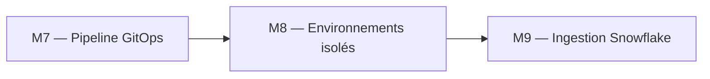
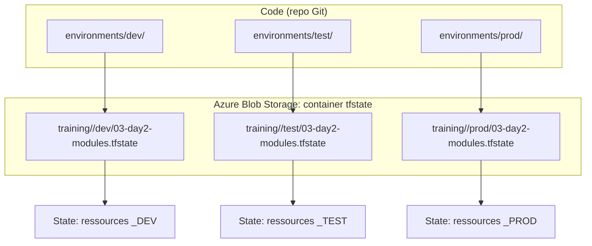
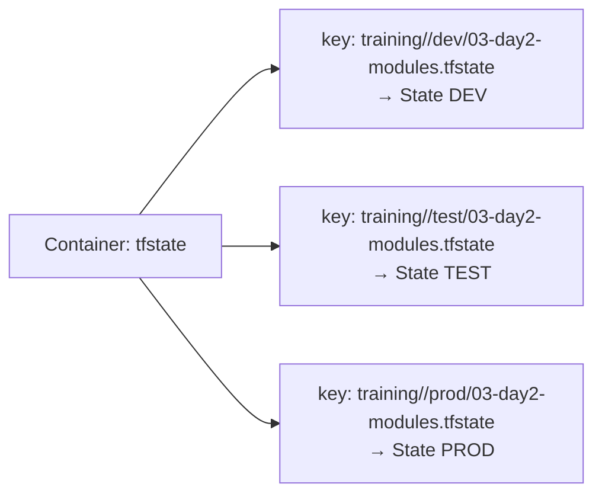
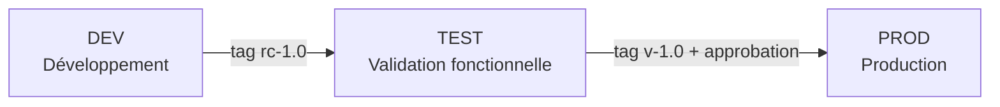
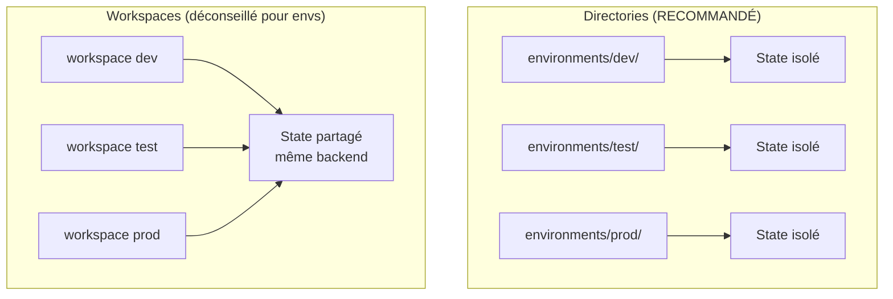

# Lab M8 -- Gestion multi-environnements : DEV, TEST, PROD

**Durée :** 50 min
**Code :** `project/03-day2-modules/environments/`
**Patterns :** Directory-based environments, state isolation, promotion flow, parameter matrix, workspaces vs directories

---

## Contexte métier

DEV, TEST et PROD ont des risques, coûts et rythmes différents. Leur isolation de state et de nommage évite les collisions tout en conservant un code commun.

## Contexte architecture



| Référentiel | Alignement |
|---|---|
| Pattern | Environment Isolation |
| Azure Well-Architected | Fiabilité, Optimisation des coûts |
| Azure CAF | Govern |
| Platform Engineering | Promotion contrôlée d'un même produit |

## Pattern d'entreprise

Le pattern **Environment Isolation** sépare les roots et les clés de backend tout en réutilisant les mêmes modules versionnés.

## Objectifs

À l'issue de ce lab, vous serez capable de :

- ✅ Créer un environnement indépendant (directory + backend key distinct).
- ✅ Comprendre l'isolation par state (clés de blob distinctes par environnement).
- ✅ Documenter une matrice de paramètres par environnement (DEV, TEST, PROD).
- ✅ Documenter et exécuter une procédure de promotion (DEV → TEST → PROD).
- ✅ Comprendre pourquoi directories > workspaces pour les environnements distincts.
- ✅ Utiliser des variables conditionnelles par environnement (`var.environment == "PROD" ? ...`).
- ✅ Vérifier l'isolation via drift detection multi-environnement.

---

## Prérequis

> **Prérequis communs :** le Lab M0 est terminé et `terraform plan` fonctionne dans `project/01-day1-basics`. En mode formation, utilisez uniquement le secret `SNOWFLAKE_PASSWORD` distribué par le formateur ; ne stockez jamais sa valeur dans Git.

- Labs M1 à M7 terminés
- Backend Azure Blob Storage configuré (Lab M2)
- Module `landing-zone` déployé en DEV (Lab M5)
- Terraform >= 1.14.5

---

## Concept — Pourquoi avant comment

Chaque environnement (DEV, TEST, PROD) est un **root module indépendant** avec son propre state, ses propres paramètres, et son propre backend key. L'isolation est totale : un `terraform destroy` sur TEST ne peut pas affecter DEV. La **matrice de paramètres** documente les différences entre environnements.



**Patterns IaC :**
- **Directory-Based Environments :** Un dossier par environnement, isolation totale
- **State Isolation :** Chaque environnement a sa propre clé Azure Blob, aucun overlap
- **Parameter Matrix :** Les différences entre environnements sont documentées dans un tableau
- **Promotion Flow :** Processus de promotion DEV → TEST → PROD avec tags Git
- **Workspaces vs Directories :** Directories pour les envs distincts, workspaces pour les variations intra-env

---

## Implémentation guidée

### Étape 1 -- Initialiser l'environnement TEST (10 min)

**Objectif :** Créer un root module indépendant pour TEST.

Si non fait au M5, copier `environments/dev/` vers `environments/test/` :

```powershell
New-Item -ItemType Directory -Path project/03-day2-modules/environments/test
Copy-Item project/03-day2-modules/environments/dev/* project/03-day2-modules/environments/test/ -Recurse
```

Ajuster `environments/test/terraform.tfvars` :

```hcl
deployment_mode        = "training"
snowflake_organization = "<snowflake-organization>"
snowflake_account      = "<snowflake-account>"
snowflake_user         = "DATA2AI"
snowflake_password     = "<SNOWFLAKE_PASSWORD>"
snowflake_role         = "ACCOUNTADMIN"
environment            = "TEST"
schemas                = ["SALES", "FINANCE", "MARKETING", "HR"]
```

> Si vous utilisez la Piste A (JWT), remplacez par `deployment_mode = "production"`, `snowflake_user = "TERRAFORM_SVC"` et ajoutez `private_key_path = "../../../../secrets/snowflake_key.p8"`.

> **Note :** Le `private_key_path` est le même que DEV (`../../../../secrets/snowflake_key.p8`) car les deux environnements sont à la même profondeur. Seul le contenu du tfvars change. En mode training, cette variable n'est pas nécessaire.

---

### Étape 2 -- Backend Azure Blob distinct par environnement (5 min)

**Objectif :** Configurer un state key différent pour TEST.

Créer ou éditer `environments/test/backend.tf` :

```hcl
terraform {
  backend "azurerm" {
    resource_group_name  = "rg-data2ai-tf-state"
    storage_account_name = "sadata2aitfstate"
    container_name       = "tfstate"
    key                  = "training/<team>/test/03-day2-modules.tfstate"
  }
}
```

> **Pattern :** Même container Azure Blob, **clé différente** = isolation totale. Un `apply` sur TEST n'affecte pas DEV. C'est le pattern recommandé par HashiCorp. Remplacez `<team>` par votre nom d'équipe.



> **⚠ Piège :** Si deux environnements utilisent la même clé de blob, ils partagent le même state. Un `apply` sur TEST écraserait le state de DEV. Vérifiez toujours l'unicité des clés !

---

### Étape 3 -- Déployer séquentiellement (10 min)

**Objectif :** Déployer DEV puis TEST et vérifier l'isolation.

```powershell
cd project/03-day2-modules/environments/dev
terraform init
terraform apply -auto-approve

cd ../test
terraform init
terraform apply -auto-approve
```

Vérifier l'isolation des states :

```powershell
cd ../dev
terraform state list
# Ressources suffixees _DEV

cd ../test
terraform state list
# Ressources suffixees _TEST, noms différents
```

Vérifier dans Snowflake :

```sql
SHOW DATABASES;
-- DB_RAW_DEV et DB_RAW_TEST doivent coexister
SHOW WAREHOUSES;
-- WH_ETL_DEV, WH_ANALYTICS_DEV, WH_ETL_TEST, WH_ANALYTICS_TEST, WH_REPORTING_TEST
```

> **Pattern :** Les ressources DEV et TEST coexistent dans le même compte Snowflake. Le suffixe `_${var.environment}` garantit l'unicité des noms.

---

### Étape 4 -- Matrice de paramètres (5 min)

**Objectif :** Documenter les différences entre environnements.

| Paramètre | DEV | TEST | PROD |
|-----------|-----|------|------|
| warehouse_size (ETL) | X-SMALL | SMALL | LARGE |
| data_retention_days | 1 | 3 | 30 |
| max_clusters (analytics) | 1 | 2 | 4 |
| auto_suspend (ETL) | 60 | 120 | 300 |
| schemas | 2-3 | 4 | 6 |
| prevent_destroy | non | non | oui |

> **Pattern :** La matrice de paramètres est le **contrat** entre l'équipe DevOps et les consommateurs. Elle documente les **ressources allouées** par environnement. En PROD, `prevent_destroy = true` protège les databases.

---

### Étape 5 -- Promotion flow (10 min)

**Objectif :** Documenter et tester la procédure de promotion.



**Étapes de promotion :**

1. **Développement sur DEV** → validation CI (fmt, lint, validate, plan)
2. **Tag `rc-x.y`** → déploiement TEST → validation fonctionnelle
3. **Tag `v-x.y`** → pull request → approbation → apply PROD

Script de promotion TEST → PROD (conceptuel) :

```powershell
# 1. Créer l'environnement PROD
New-Item -ItemType Directory -Path project/03-day2-modules/environments/prod
Copy-Item project/03-day2-modules/environments/test/* project/03-day2-modules/environments/prod/ -Recurse

# 2. Éditer terraform.tfvars : environment = "PROD", deployment_mode = "training"
# 3. Éditer backend.tf : key = "training/<team>/prod/03-day2-modules.tfstate"

cd project/03-day2-modules/environments/prod
terraform init
terraform plan -out=prod.tfplan
# Revue manuelle obligatoire avant apply !
terraform apply prod.tfplan
```

> **⚠ Piège :** En PROD, **jamais** d'`-auto-approve`. Utilisez toujours `terraform plan -out=prod.tfplan`, revoyez le plan, puis `terraform apply prod.tfplan`.

---

### Étape 6 -- Workspaces vs directories : le test (10 min)

**Objectif :** Comprendre les limitations des workspaces par rapport aux directories.

Tester les workspaces pour voir la différence :

```powershell
cd project/03-day2-modules/environments/dev
terraform workspace list       # default uniquement
terraform workspace new dev    # Crée workspace "dev"
terraform workspace new test   # Crée workspace "test"
terraform workspace select test
terraform plan
```

**Limitations des workspaces relevées :**
1. Tous les workspaces partagent le **même backend** (même container, clé dynamique `terraform.tfstateworkspace:${workspace}`)
2. Un `terraform destroy` par erreur peut cibler le **mauvais workspace**
3. Le code est le **même** — impossible d'avoir des variables différentes par workspace sans hacks
4. Pas d'isolation visuelle : `terraform workspace select test` est facile à oublier



> **Recommandation (HashiCorp) :** Utilisez **directories** pour les environnements distincts (DEV, TEST, PROD). Réservez les workspaces pour les **variations intra-environnement** (feature branches, PR previews).

---

### Étape 7 -- Variables conditionnelles par environnement (5 min)

**Objectif :** Adapter le comportement du module selon l'environnement.

Dans le module `landing-zone`, utiliser des **conditions** basées sur l'environnement :

```hcl
resource "snowflake_database" "raw" {
  name                        = "DB_RAW_${var.environment}"
  data_retention_time_in_days = var.environment == "PROD" ? 30 : 1
  comment                     = "Managed by Terraform | ${var.environment}"
}
```

Tester :

```powershell
cd environments/dev
terraform plan
# data_retention_time_in_days = 1 (DEV)

# Simuler PROD (sans déployer réellement)
terraform plan -var="environment=PROD"
# data_retention_time_in_days = 30 (PROD)
```

> **Tip :** Les conditions `var.environment == "PROD" ? X : Y` permettent d'adapter la configuration sans dupliquer le code. Utilisez-les avec parcimonie — trop de conditions rendent le code illisible.

---

### Étape 8 -- Drift detection multi-environnement (5 min)

**Objectif :** Prouver que la dérive sur DEV n'impacte pas TEST.

1. Modifier manuellement un warehouse dans l'environnement DEV :

```sql
ALTER WAREHOUSE WH_ETL_DEV SET AUTO_SUSPEND = 999;
```

2. Vérifier que TEST n'est pas impacté :

```powershell
cd environments/test
terraform plan
# Attendu : No changes (isolation prouvée)
```

3. Corriger DEV :

```powershell
cd ../dev
terraform plan
# Attendu : ~ auto_suspend = 999 -> 60 (dérive détectée)
terraform apply -auto-approve
```

> **Pattern :** L'isolation par directory garantit qu'une dérive sur un environnement n'affecte pas les autres. C'est la sécurité fondamentale du multi-environnement.

---

## Exercice challenge

**Objectif :** Créer un environnement PROD avec `prevent_destroy` sur les databases et une matrice de paramètres complète.

**Consignes :**
1. Créer `environments/prod/` avec backend key `training/<team>/prod/03-day2-modules.tfstate`
2. Configurer le tfvars : `environment = "PROD"`, `warehouses = { etl = { size = "LARGE" }, analytics = { size = "LARGE" } }`, `data_retention_days = 30`, `schemas = ["SALES", "FINANCE", "MARKETING", "HR", "OPS", "LEGAL"]`
3. Ajouter `lifecycle { prevent_destroy = true }` sur les databases dans le module (conditionnel : seulement en PROD)
4. Déployer et vérifier que `terraform destroy` est bloqué

**Critères de validation :**
- [ ] `terraform init` réussit avec un state key distinct
- [ ] `terraform plan` montre les ressources avec suffixe `_PROD`
- [ ] `terraform apply` réussit
- [ ] `terraform plan -destroy` échoue à cause de `prevent_destroy`
- [ ] `SHOW DATABASES` affiche DB_RAW_PROD, DB_RAW_DEV, DB_RAW_TEST

> **Hint :** Pour rendre `prevent_destroy` conditionnel : utilisez `prevent_destroy = var.environment == "PROD" ? true : false` dans le lifecycle block.

---

## Validation et auto-évaluation

### Checklist de compétences

- [ ] Je sais créer un environnement indépendant (directory + backend key)
- [ ] Je comprends l'isolation par state (clés de blob distinctes)
- [ ] Je peux documenter une matrice de paramètres par environnement
- [ ] Je sais documenter et exécuter une procédure de promotion
- [ ] Je comprends pourquoi directories > workspaces pour les environnements distincts
- [ ] Je peux utiliser des variables conditionnelles par environnement
- [ ] Je sais vérifier l'isolation via drift detection

### Quiz rapide

1. **Pourquoi préférer directories aux workspaces pour DEV/TEST/PROD ?**
   - [ ] Les directories sont plus rapides
   - [ ] Isolation totale (state, code, paramètres séparés) vs state partagé pour workspaces
   - [ ] Les workspaces sont obsolètes
   - [ ] Les directories sont obligatoires
   > Réponse : Isolation totale vs state partagé

2. **Comment isoler les states dans un seul container Azure Blob ?**
   - [ ] Créer un container par environnement
   - [ ] Utiliser des clés de blob différentes (`key = ".../dev/tfstate"` vs `.../test/tfstate`)
   - [ ] Utiliser des comptes de stockage différents
   - [ ] Ce n'est pas possible
   > Réponse : Clés de blob différentes

3. **Quelle est la procédure de promotion recommandée ?**
   - [ ] DEV → PROD directement
   - [ ] DEV → TEST (tag rc) → PROD (tag v + approbation)
   - [ ] PROD → TEST → DEV
   - [ ] Pas de procédure, on déploie où on veut
   > Réponse : DEV → TEST → PROD

4. **En PROD, pourquoi utiliser `prevent_destroy` ?**
   - [ ] Pour accélérer le déploiement
   - [ ] Pour empêcher la destruction accidentelle de ressources critiques
   - [ ] C'est obligatoire
   - [ ] Pour réduire les coûts
   > Réponse : Empêcher la destruction accidentelle

5. **Quand utiliser les workspaces Terraform ?**
   - [ ] Pour DEV, TEST, PROD
   - [ ] Pour les variations intra-environnement (feature branches, PR previews)
   - [ ] Jamais
   - [ ] Pour remplacer les directories
   > Réponse : Variations intra-environnement

---

### Diagnostic guidé

| Symptôme | Cause probable | Action |
|----------|----------------|--------|
| `Backend config already set` | Conflit entre backend.tf et init | Supprimer `.terraform/` et re-initialiser |
| Mauvais environnement déployé | `terraform.tfvars` non chargé | Vérifier le fichier et le flag `-var-file` |
| Noms de ressources identiques entre envs | Variable `environment` non utilisée | Vérifier les locals dans le module |
| `Error: Resource already exists` | Conflit entre environnements | Vérifier le backend Azure Blob et les clés |
| `AccessDenied` sur le container Azure | Rôle Azure insuffisant | Vérifier les rôles Azure RBAC |
| `terraform workspace select` oublié | Workspace par défaut utilisé | Toujours vérifier `terraform workspace show` |

---

## Bonus : Aller plus loin

- Configurer un **4ème environnement** (sandbox/staging) avec des paramètres différents
- Automatiser la promotion via CI/CD : tag Git → GitHub Actions déploie TEST automatiquement
- Ajouter **OpenID Connect (OIDC)** pour l'authentification Azure dans les environnements PROD
- Utiliser **`terraform workspace` pour les feature branches** : chaque PR crée un workspace temporaire
- Configurer des **alertes FinOps** différentes par environnement (resource monitors avec quotas distincts)
- Mettre en place un **terraform plan automatique** sur chaque environnement via cron dans CI/CD

---

## Troubleshooting

### `Backend config already set`

Conflit entre `backend.tf` et `terraform init` précédent. Supprimez `.terraform/` et re-initialisez.

### Mauvais environnement déployé

Le fichier `terraform.tfvars` n'est pas chargé ou contient la mauvaise valeur `environment`. Vérifiez le fichier et le flag `-var-file` si utilisé.

### Noms de ressources identiques entre envs

La variable `environment` n'est pas utilisée dans les noms de ressources. Vérifiez les locals dans le module (`DB_RAW_${var.environment}`).

### `Error: Resource already exists`

Conflit entre environnements — deux envs utilisent la même clé de backend Azure Blob. Vérifiez que chaque environnement a une `key` distincte.

### `AccessDenied` sur le container Azure

Rôle Azure RBAC insuffisant. Vérifiez que le Service Principal a le rôle `Storage Blob Data Contributor` sur le compte de stockage.

### `terraform workspace select` oublié

Si vous utilisez les workspaces (déconseillé), toujours vérifier `terraform workspace show` avant tout plan/apply. Avec les directories, ce problème n'existe pas.
---

## Notes d'architecte

- **Décision :** la capacité du module est traitée comme un produit de plateforme, pas comme un exemple isolé.
- **Compromis :** le lab réduit volontairement l'échelle afin de rester exécutable en sandbox ; les contrôles de production restent obligatoires.
- **Garde-fou :** toute modification doit produire un plan relu, une validation technique et une preuve d'absence de dérive.

## Bonnes pratiques Enterprise

- Versionner les contrats et les modules, jamais les secrets ni les fichiers de state.
- Appliquer le moindre privilège aux identités humaines et techniques.
- Utiliser un state distant isolé, un artefact de plan immuable et une approbation avant production.
- Rendre sécurité, fiabilité, coût et observabilité vérifiables par le pipeline.

## Notes de production

| Dimension | Training | Production |
|---|---|---|
| Identité | Secret transmis hors Git | JWT, identité technique dédiée et rotation contrôlée |
| State | Backend simplifié ou sandbox | Azure Blob privé, chiffré, verrouillé et isolé |
| Déploiement | Exécution locale guidée | Azure DevOps, approbation et artefact de plan |
| Exploitation | Validation ponctuelle | SLO, alertes, runbooks, FinOps et contrôle continu de dérive |

## Réflexion

1. Quel risque métier réapparaît si cette capacité est gérée manuellement ?
2. Quel contrôle doit devenir obligatoire avant une promotion en production ?
3. Quelle preuve transmettre à l'équipe qui exploite la capacité suivante ?


