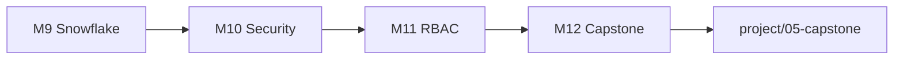

# Jour 3 — Snowflake avancé, RBAC, Capstone

**Objectif :** Plateforme Data gouvernée et auditable.

| Module | Durée | Code |
|--------|-------|------|
| [M9 Advanced](module-09-snowflake-advanced/) | 2h | stages, formats |
| [M10 Security](module-10-security-auth/) | 1h30 | Key pair rotation |
| [M11 RBAC](module-11-rbac/) | 1h30 | `modules/rbac` |
| [M12 Capstone](module-12-capstone/) | 2h | `project/05-capstone` |

