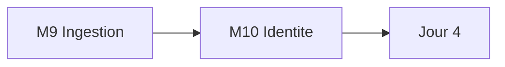

# Jour 3 — Securite et RBAC Snowflake

**Objectif :** Appliquer le moindre privilege avec une identite verifiable et une ingestion securisee.

> [<- Catalogue](../README.md) · [Jour 2](../day-02/README.md) · **Jour 3** · [Jour 4 ->](../day-04/README.md)

## Progression

## Modules

| Module | Duree | Lab | Course | Troubleshooting | Resultat attendu |
|---|---:|---|---|---|---|
| [M9 — Ingestion et ressources avancees](module-09-snowflake-advanced/lab.md) | 0h45 | [lab](module-09-snowflake-advanced/lab.md) | [cours](module-09-snowflake-advanced/course.md) | [guide](module-09-snowflake-advanced/troubleshooting.md) | [output](module-09-snowflake-advanced/expected-output.md) |
| [M10 — Identite technique et Key Vault](module-10-security-auth/lab.md) | 1h00 | [lab](module-10-security-auth/lab.md) | [cours](module-10-security-auth/course.md) | [guide](module-10-security-auth/troubleshooting.md) | [output](module-10-security-auth/expected-output.md) |

## Workflow du jour

1. **Lisez** le `course.md` du module (concepts, 15-20 min)
2. **Realisez** le `lab.md` pas a pas (creation de fichiers, execution, checkpoints)
3. **Comparez** avec `expected-output.md`
4. **Consultez** `troubleshooting.md` en cas d'erreur
5. **Passez** au module suivant

## Livrable du jour

Ingestion Azure Data Lake Storage vers Snowflake.
Identite technique securisee avec JWT key-pair et Azure Key Vault.

## Navigation

[<- Catalogue](../README.md) · [Jour 2](../day-02/README.md) · **Jour 3** · [Jour 4 ->](../day-04/README.md)
