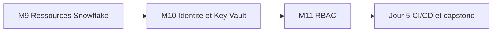

# Jour 4 — Sécurité, RBAC et identité technique

> Ce dossier historique porte le nom `day-03`. Dans le parcours officiel de 5 jours, son contenu correspond au **Jour 4**.

**Objectif :** appliquer le moindre privilège avec une identité vérifiable et une ingestion sécurisée.

**Références :** [catalogue](../README.md) · [programme](../../PROGRAMME_FORMATION.md) · [architecture](../../docs/reference-architecture.md)

| Module | Durée | Contenu |
|---|---:|---|
| [M9 — Ingestion et ressources avancées](module-09-snowflake-advanced/lab.md) | 0 h 45 | File formats, stages, storage integration Azure |
| [M10 — Identité technique et Key Vault](module-10-security-auth/lab.md) | 1 h 00 | JWT key-pair, stockage et rotation |
| [M11 — RBAC as Code](../day-04/module-11-rbac/lab.md) | 2 h 15 | Rôles, hiérarchie, grants actuels et futurs |

Les modules M11 et M12 se trouvent physiquement dans `courses/day-04/`. Le capstone est traité au **Jour 5**.
