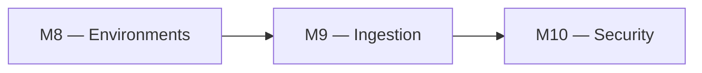
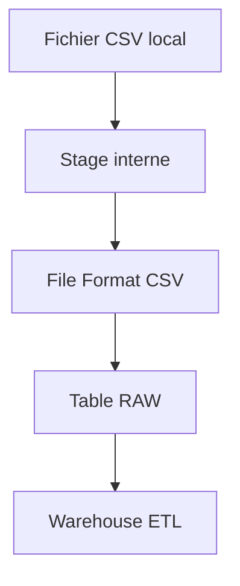

# 🧪 Lab M9 — Ressources Snowflake avancées : Stages, File Formats, Pipes

| Élément | Valeur |
|---|---|
| **Durée** | 90 min |
| **Piste** | `[CORE]` |
| **Workspace** | `$HOME/Data2AI-Labs/data-platform` (le clone) |
| **Dossier de travail** | `modules/ingestion/` et `environments/dev/` |
| **Coût** | Warehouse X-SMALL pour COPY |
| **Cleanup** | Conserver jusqu'au Jour 5 |

## 🎯 Mission

La valeur Data commence quand les fichiers arrivent de façon fiable dans Snowflake. Vous allez créer un module d'ingestion avec un stage interne, un file format CSV et une table cible.

## 🏗️ Architecture





## 🎯 Objectifs

- créer un module `ingestion` avec stage, file format et table;
- comprendre la différence entre stage interne et externe;
- configurer un file format CSV;
- charger un fichier de test via `snow sql`;
- vérifier les données chargées.

## 📋 Prérequis

- [ ] M8 terminé : DEV, UAT et PROD sont déployés;
- [ ] `terraform plan` affiche `No changes` dans `environments/dev/`.

## 📝 Partie 1 — Créer le module ingestion

### 📝 Étape 1.1 — Créer la structure

```bash
cd $HOME/Data2AI-Labs/data-platform
mkdir -p modules/ingestion
```

### 📝 Étape 1.2 — Créer `modules/ingestion/variables.tf`

```hcl
variable "database" {
  type        = string
  description = "Target database name"
}

variable "schema" {
  type        = string
  description = "Target schema name"
  default     = "INGESTION"
}

variable "table_name" {
  type        = string
  description = "Target table name"
  default     = "RAW_CUSTOMERS"
}

variable "stage_name" {
  type        = string
  description = "Internal stage name"
  default     = "STG_RAW_CUSTOMERS"
}
```

### 📝 Étape 1.3 — Créer `modules/ingestion/main.tf`

```hcl
resource "snowflake_file_format" "csv" {
  name        = "FF_CSV"
  database    = var.database
  schema      = var.schema
  format_type = "CSV"

  field_delimiter            = ","
  skip_header                = 1
  null_if                    = ["", "NULL"]
  field_optionally_enclosed_by = "\""
  empty_field_as_null        = true
  error_on_column_count_mismatch = true
}

resource "snowflake_stage" "raw" {
  name        = var.stage_name
  database    = var.database
  schema      = var.schema
  comment     = "Internal stage for raw customer files"

  file_format = "FORMAT_NAME = ${snowflake_file_format.csv.fully_qualified_name}"
}

resource "snowflake_table" "raw_customers" {
  name     = var.table_name
  database = var.database
  schema   = var.schema
  comment  = "Raw customer data loaded from stage"

  column {
    name = "ID"
    type = "NUMBER(38,0)"
  }

  column {
    name = "FIRST_NAME"
    type = "VARCHAR(100)"
  }

  column {
    name = "LAST_NAME"
    type = "VARCHAR(100)"
  }

  column {
    name = "EMAIL"
    type = "VARCHAR(255)"
  }

  column {
    name = "LOADED_AT"
    type = "TIMESTAMP_NTZ(9)"
    default = "CURRENT_TIMESTAMP()"
  }
}
```

### 📝 Étape 1.4 — Créer `modules/ingestion/outputs.tf`

```hcl
output "stage_name" {
  value = snowflake_stage.raw.name
}

output "file_format_name" {
  value = snowflake_file_format.csv.name
}

output "table_name" {
  value = snowflake_table.raw_customers.name
}
```

### 📝 Étape 1.5 — Créer `modules/ingestion/versions.tf`

```hcl
terraform {
  required_version = ">= 1.14.0, < 2.0.0"

  required_providers {
    snowflake = {
      source  = "snowflakedb/snowflake"
      version = "= 2.14.0"
    }
  }
}
```

### 📝 Étape 1.6 — Formater et valider

```bash
cd modules/ingestion
terraform fmt
terraform validate
```

## 📝 Partie 2 — Appeler le module depuis DEV

### 📝 Étape 2.1 — Ajouter l'appel dans `environments/dev/main.tf`

```hcl
module "ingestion" {
  source     = "../../modules/ingestion"
  database   = module.landing_zone.database_name
  schema     = "INGESTION"
  table_name = "RAW_CUSTOMERS"
  stage_name = "STG_RAW_CUSTOMERS"
}
```

### 📝 Étape 2.2 — Ajouter les outputs

Dans `environments/dev/outputs.tf` :

```hcl
output "ingestion_stage" {
  value = module.ingestion.stage_name
}

output "ingestion_table" {
  value = module.ingestion.table_name
}
```

### 📝 Étape 2.3 — Planifier et appliquer

```bash
cd environments/dev
terraform fmt
terraform init
terraform validate
terraform plan
terraform apply
```

✅ **Checkpoint** : `3 to add` — file format, stage et table.

## 📝 Partie 3 — Charger un fichier de test

### 📝 Étape 3.1 — Créer un fichier CSV de test

```bash
cat > /tmp/customers.csv << 'EOF'
ID,FIRST_NAME,LAST_NAME,EMAIL
1,Alice,Smith,alice@example.com
2,Bob,Jones,bob@example.com
3,Charlie,Brown,charlie@example.com
EOF
```

### 📝 Étape 3.2 — Uploader le fichier vers le stage

```bash
snow sql -c training -q "PUT file:///tmp/customers.csv @ABC_RAW_DEV.INGESTION.STG_RAW_CUSTOMERS AUTO_COMPRESS=TRUE"
```

Remplacez `ABC` par votre préfixe.

### 📝 Étape 3.3 — Charger les données dans la table

```bash
snow sql -c training -q "COPY INTO ABC_RAW_DEV.INGESTION.RAW_CUSTOMERS (ID, FIRST_NAME, LAST_NAME, EMAIL) FROM @ABC_RAW_DEV.INGESTION.STG_RAW_CUSTOMERS FILE_FORMAT = (FORMAT_NAME = ABC_RAW_DEV.INGESTION.FF_CSV) ON_ERROR = 'ABORT_STATEMENT'"
```

### 📝 Étape 3.4 — Vérifier les données

```bash
snow sql -c training -q "SELECT COUNT(*) FROM ABC_RAW_DEV.INGESTION.RAW_CUSTOMERS"
snow sql -c training -q "SELECT * FROM ABC_RAW_DEV.INGESTION.RAW_CUSTOMERS LIMIT 5"
```

✅ **Checkpoint** : 3 lignes avec les données du fichier CSV.

## 📝 Partie 4 — Stage externe Azure (concept)

### 📝 Étape 4.1 — Comprendre la différence

| Critère | Stage interne | Stage externe |
|---|---|---|
| Stockage | Dans Snowflake | Azure Blob Storage |
| Gestion | Snowflake gère les fichiers | Vous gérez les fichiers |
| Coût | Stockage Snowflake | Stockage Azure (moins cher) |
| Recommandé pour | Tests, petits volumes | Production, gros volumes |

### 📝 Étape 4.2 — Déclaration d'un storage integration (concept)

En production, vous utiliseriez :

```hcl
resource "snowflake_storage_integration" "azure" {
  name    = "INT_AZURE_BLOB"
  type    = "AZURE_BLOB_STORAGE"
  azure_tenant_id = var.arm_tenant_id
  enabled = true

  storage_allowed_locations = ["azure://<account>.blob.core.windows.net/raw/"]
}
```

> Ce lab utilise un stage interne pour éviter la configuration Azure Storage. Le module externe est couvert dans le capstone.

## 🏆 Challenge

Ajoutez une seconde table `RAW_ORDERS` avec 4 colonnes (ORDER_ID, CUSTOMER_ID, AMOUNT, ORDER_DATE) et chargez un fichier de test.

Critères :

- [ ] `terraform plan` crée la nouvelle table;
- [ ] le chargement `COPY INTO` réussit;
- [ ] `SELECT COUNT(*)` retourne le bon nombre de lignes.

## 🧹 Cleanup

Conservez les ressources pour le Jour 4 et 5.
