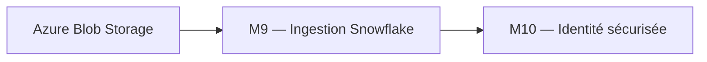
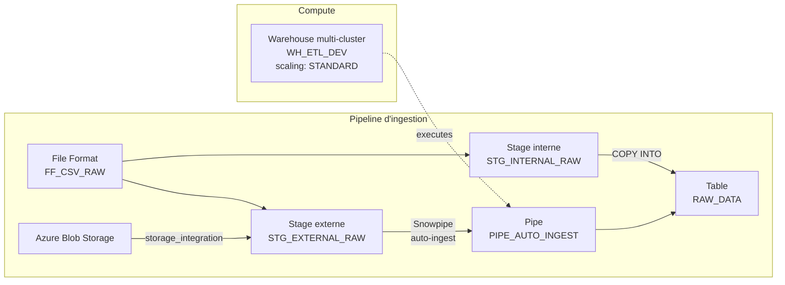
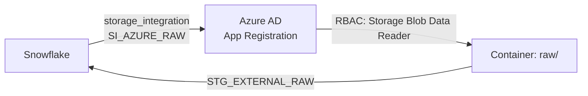

# Lab M9 -- Ressources Snowflake avancées : Stages, File Formats, Pipes

**Durée :** 90 min
**Code :** `project/04-day3-rbac/`
**Patterns :** Data ingestion pipeline, stage interne/externe, file format configuration, warehouse scaling, storage integration, FinOps

---

## Contexte métier

La valeur Data commence quand les fichiers Azure arrivent de façon fiable, observable et économiquement contrôlée dans Snowflake. Stages, formats et pipes forment cette chaîne d'ingestion.

## Contexte architecture



| Référentiel | Alignement |
|---|---|
| Pattern | Managed Ingestion Pipeline |
| Azure Well-Architected | Performance, Fiabilité, Coûts |
| Azure CAF | Adopt |
| Platform Engineering | Ingestion standardisée et observable |

## Pattern d'entreprise

Le pattern **Managed Ingestion Pipeline** découple format, stockage, stage et pipe afin que chaque composant soit sécurisé, testé et exploité indépendamment.

## Objectifs

À l'issue de ce lab, vous serez capable de :

- ✅ Créer un `snowflake_file_format` CSV avec options de parsing (`field_optionally_enclosed_by`, `skip_header`).
- ✅ Créer un `snowflake_stage_internal` pour le chargement manuel de fichiers.
- ✅ Comprendre la différence entre stage interne et stage externe (`snowflake_stage_external_azure`).
- ✅ Configurer un `snowflake_storage_integration` pour le pont Snowflake ↔ Azure Blob.
- ✅ Configurer un warehouse multi-cluster avec scaling policy (`STANDARD` vs `ECONOMY`).
- ✅ Comprendre le pipeline d'ingestion : File Format → Stage → Pipe → Table.
- ✅ Auditer la consommation des warehouses via `WAREHOUSE_METERING_HISTORY`.
- ✅ Détecter et corriger le drift sur les ressources d'ingestion.

---

## Prérequis

> **Prérequis communs :** le Lab M0 est terminé et `terraform plan` fonctionne dans `project/01-day1-basics`. En mode formation, utilisez uniquement le secret `SNOWFLAKE_PASSWORD` distribué par le formateur ; ne stockez jamais sa valeur dans Git.

- Labs M1 à M8 terminés
- Module `landing-zone` déployé (Lab M5)
- Terraform >= 1.14.5, Snowflake provider ~> 2.14.0
- (Optionnel) Compte Azure avec Storage Account pour le stage externe

---

## Concept — Pourquoi avant comment

Le pipeline d'ingestion Snowflake suit le pattern : **File Format** → **Stage** (interne ou externe) → **Pipe** (Snowpipe) → **Table**. Le `storage_integration` crée un pont sécurisé entre Snowflake et Azure Blob Storage sans clés d'accès en dur. Les warehouses multi-cluster avec scaling policy adaptent la puissance à la charge.



**Patterns IaC :**
- **Data Ingestion Pipeline :** File Format → Stage → Pipe → Table
- **Storage Integration :** Pont sécurisé Snowflake ↔ Azure Blob sans clés en dur
- **Multi-Cluster Warehouse :** Scaling horizontal pour les workloads de production
- **FinOps :** Auto-suspend, auto-resume, scaling policy ECONOMY pour les batchs
- **Resource Monitor :** Alertes sur la consommation de crédits (75/90/100/110%)

---

## Implémentation guidée

### Étape 1 -- File Format CSV (10 min)

**Objectif :** Créer un format de fichier réutilisable pour l'ingestion.

Dans `environments/dev/main.tf`, ajouter :

```hcl
resource "snowflake_file_format" "csv_raw" {
  depends_on = [module.landing_zone]

  name                         = "FF_CSV_RAW"
  database                     = module.landing_zone.raw_database_name
  schema                       = "INGESTION"
  format_type                  = "CSV"
  field_optionally_enclosed_by = "\""
  skip_header                  = 1
  comment                      = "CSV format for raw ingestion"
}
```

```powershell
cd project/04-day3-rbac/environments/dev
terraform init
terraform plan -out=ingestion.tfplan
terraform apply ingestion.tfplan
```

Vérifier dans Snowflake :

```sql
SHOW FILE FORMATS IN SCHEMA DB_RAW_DEV.INGESTION;
DESC FILE FORMAT DB_RAW_DEV.INGESTION.FF_CSV_RAW;
```

> **Tip :** Le `field_optionally_enclosed_by = "\""` permet de gérer les champs contenant des virgules (ex: `"Smith, John"`). C'est essentiel pour les CSV réels.

> **Note :** Le file format est attaché à un schema (`INGESTION`). Il ne peut être utilisé que dans ce schema ou en le référençant avec le nom complet `DB_RAW_DEV.INGESTION.FF_CSV_RAW`.

---

### Étape 2 -- Stage interne (10 min)

**Objectif :** Créer un stage interne pour charger des fichiers manuellement.

```hcl
resource "snowflake_stage_internal" "internal_raw" {
  depends_on = [module.landing_zone]

  name     = "STG_INTERNAL_RAW"
  database = module.landing_zone.raw_database_name
  schema   = "INGESTION"
  comment  = "Internal stage for lab ingestion"
}
```

```powershell
terraform apply -auto-approve
```

Vérifier :

```sql
LIST @DB_RAW_DEV.INGESTION.STG_INTERNAL_RAW;
DESC STAGE DB_RAW_DEV.INGESTION.STG_INTERNAL_RAW;
```

Tester le chargement manuel :

```sql
-- Charger un fichier CSV (depuis votre machine)
PUT file://./sample_data.csv @DB_RAW_DEV.INGESTION.STG_INTERNAL_RAW;

-- Vérifier le fichier chargé
LIST @DB_RAW_DEV.INGESTION.STG_INTERNAL_RAW;

-- Tester la lecture avec le file format
SELECT $1, $2, $3 FROM @DB_RAW_DEV.INGESTION.STG_INTERNAL_RAW
  (FILE_FORMAT => 'DB_RAW_DEV.INGESTION.FF_CSV_RAW') LIMIT 5;
```

> **Pattern :** Le stage interne stocke les fichiers **dans Snowflake** (gestion par Snowflake). Utile pour les chargements ponctuels et les tests. Pour l'ingestion automatisée, préférez le stage externe. Notez l'utilisation de `snowflake_stage_internal` (resource type spécifique du provider) avec `depends_on` sur le module `landing_zone` pour garantir l'ordre de création.

---

### Étape 3 -- Stage externe Azure Blob (15 min)

**Objectif :** Créer un stage externe connecté à Azure Blob Storage via storage integration.

```hcl
resource "snowflake_storage_integration_azure" "azure_raw" {
  name                      = "SI_AZURE_${var.environment}"
  comment                   = "Storage integration for Azure Blob Storage - ${var.environment}"
  enabled                   = true
  storage_allowed_locations = ["azure://<ACCOUNT>.blob.core.windows.net/raw/"]
  azure_tenant_id           = "<TENANT_ID>"
}

resource "snowflake_stage_external_azure" "azure_raw" {
  name                = "STG_AZURE_RAW"
  database            = module.landing_zone.raw_database_name
  schema              = "INGESTION"
  url                 = "azure://<ACCOUNT>.blob.core.windows.net/raw/"
  storage_integration = snowflake_storage_integration_azure.azure_raw.name
}
```

**Étapes Azure préalables :**

1. Récupérer le **Storage Account name** et le **tenant ID** :
   ```sql
   DESC STORAGE INTEGRATION SI_AZURE_RAW_DEV;
   -- Noter STORAGE_AZURE_TENANT_ID et AZURE_CONSENT_URL
   ```

2. Créer une **Azure AD App Registration** avec accès au Storage Account

3. Accorder le rôle **Storage Blob Data Reader** sur le conteneur

```powershell
terraform plan
terraform apply -auto-approve
```

> **Pattern :** Le `snowflake_storage_integration` est le **pont sécurisé** entre Snowflake et votre Azure Blob Storage. Évitez les clés d'accès en dur — utilisez l'authentification Azure AD via la storage integration.



> **⚠ Piège :** Après la création de la storage integration, vous devez accorder l'accès dans Azure **avant** que le stage externe fonctionne. Suivez les instructions de `DESC STORAGE INTEGRATION` (AZURE_CONSENT_URL et AZURE_MULTI_TENANT_APP_NAME).

---

### Étape 4 -- Warehouse avec scaling policy (10 min)

**Objectif :** Configurer un warehouse multi-cluster pour la production.

```hcl
resource "snowflake_warehouse" "etl_prod" {
  name                              = "WH_ETL_${var.environment}"
  warehouse_size                    = "X-SMALL"
  max_cluster_count                 = 3
  min_cluster_count                 = 1
  scaling_policy                    = "STANDARD"
  auto_suspend                      = 60
  auto_resume                       = true
  initially_suspended               = true
  enable_query_acceleration         = false
  max_concurrency_level             = 8
  statement_queued_timeout_in_seconds = 300
}
```

**Comparer les scaling policies :**

| Policy | Comportement | Quand l'utiliser |
|--------|-------------|------------------|
| `STANDARD` | Ajoute un cluster dès que la charge augmente | Workloads temps réel, SLA strict |
| `ECONOMY` | Attend que la file d'attente dépasse un seuil | Batch, ingestion, coût prioritaire |

```powershell
terraform plan
terraform apply -auto-approve
```

```sql
SHOW WAREHOUSES LIKE 'WH_ETL_DEV';
-- Vérifier : MAX_CLUSTER_COUNT=3, SCALING_POLICY=STANDARD
```

> **Tip :** Pour le DEV, un warehouse X-SMALL avec 1 cluster suffit. Le multi-cluster est pertinent en PROD où la charge est variable. Le scaling policy ECONOMY réduit les coûts mais augmente la latence.

---

### Étape 5 -- Snowpipe (automatisation) (10 min)

**Objectif :** Configurer l'ingestion automatique depuis Azure Blob.

```hcl
resource "snowflake_pipe" "auto_ingest" {
  name              = "PIPE_AUTO_INGEST_${var.environment}"
  database          = module.landing_zone.raw_database_name
  schema            = "INGESTION"
  comment           = "Auto-ingest from Azure Blob - Managed by Terraform"
  auto_ingest_enabled = true
  integration       = "SI_AZURE_RAW_${var.environment}"

  copy_statement = "COPY INTO DB_RAW_${var.environment}.INGESTION.RAW_DATA FROM @STG_EXTERNAL_RAW_${var.environment}"
}
```

```powershell
terraform apply -auto-approve
```

```sql
SHOW PIPES IN SCHEMA DB_RAW_DEV.INGESTION;
-- Vérifier : PIPE_AUTO_INGEST_DEV, auto_ingest = true
```

> **Pattern :** Snowpipe avec `auto_ingest_enabled = true` déclenche automatiquement le `COPY INTO` quand un nouveau fichier arrive dans le stage externe. L'intégration Azure Event Grid notifie Snowpipe.

> **Note :** Pour que l'auto-ingest fonctionne, vous devez configurer **Azure Event Grid** sur le conteneur Blob pour notifier Snowpipe. C'est une étape manuelle dans Azure (hors Terraform).

---

### Étape 6 -- Audit et FinOps des warehouses (10 min)

**Objectif :** Surveiller la consommation et l'activité des warehouses.

```sql
-- Vérifier le nombre de clusters actifs
SHOW WAREHOUSES LIKE 'WH_%';

-- Historique de charge sur 7 jours
SELECT *
FROM TABLE(INFORMATION_SCHEMA.WAREHOUSE_LOAD_HISTORY(
  DATE_RANGE_START => DATEADD('DAY', -7, CURRENT_DATE)
))
WHERE WAREHOUSE_NAME LIKE 'WH_%\_DEV'
ORDER BY START_TIME DESC;

-- Credits consommes par warehouse sur 30 jours
SELECT WAREHOUSE_NAME, SUM(CREDITS_USED) as TOTAL_CREDITS
FROM TABLE(INFORMATION_SCHEMA.WAREHOUSE_METERING_HISTORY(
  DATE_RANGE_START => DATEADD('DAY', -30, CURRENT_DATE)
))
GROUP BY WAREHOUSE_NAME
ORDER BY TOTAL_CREDITS DESC;
```

> **Pattern :** Le **FinOps** consiste à surveiller et optimiser les coûts. Les resource monitors (configurés dans le module landing-zone) alertent à 75/90/100/110% du quota. En DEV, un quota de 10 crédits/mois suffit.

---

### Étape 7 -- Drift detection sur les ressources ingestion (10 min)

**Objectif :** Détecter une modification manuelle sur le file format.

1. Modifier le file format dans Snowflake :

```sql
ALTER FILE FORMAT DB_RAW_DEV.INGESTION.FF_CSV_RAW SET SKIP_HEADER = 2;
```

2. Lancer `terraform plan` et observer la dérive :

```powershell
terraform plan
# ~ resource "snowflake_file_format" "csv_raw" {
#     ~ skip_header = 2 -> 1
#   }
```

3. Corriger :

```powershell
terraform apply -auto-approve
```

4. Vérifier :

```sql
DESC FILE FORMAT DB_RAW_DEV.INGESTION.FF_CSV_RAW;
-- skip_header doit être revenu à 1
```

> **Pattern :** Terraform gère la **configuration** du file format. Si quelqu'un modifie `SKIP_HEADER` manuellement, Terraform détecte la dérive et la corrige au prochain `apply`.

---

### Étape 8 -- Resource Monitor (FinOps) (10 min)

**Objectif :** Configurer des alertes de consommation sur les warehouses.

```hcl
resource "snowflake_resource_monitor" "etl" {
  name         = "RM_ETL_${var.environment}"
  credit_quota = 50
  frequency    = "MONTHLY"

  notify_triggers           = [75, 90]
  suspend_trigger           = 100
  suspend_immediate_trigger = 110
}
```

```sql
SHOW RESOURCE MONITORS;
-- Vérifier : RM_ETL_DEV, credit_quota=50, frequency=MONTHLY
```

> **Pattern :** Les resource monitors alertent (email + notification Snowflake) quand la consommation atteint les seuils. `notify_triggers = [75, 90]` envoie des notifications à 75% et 90%. `suspend_trigger = 100` suspend le warehouse à 100% du quota. `suspend_immediate_trigger = 110` suspend immédiatement à 110%. Notez que dans le module `landing-zone`, le resource monitor est déjà créé avec `var.credit_quota` et lié à tous les warehouses.

---

## Exercice challenge

**Objectif :** Créer un file format JSON et un stage pour l'ingestion de données semi-structurées.

**Consignes :**
1. Créer un `snowflake_file_format` `FF_JSON_RAW` avec `format_type = "JSON"`
2. Créer un `snowflake_stage` `STG_JSON_RAW` utilisant ce format
3. Créer une table `JSON_DATA` avec une colonne `VARIANT` pour stocker le JSON
4. Tester avec un fichier JSON manuellement chargé (`PUT` + `SELECT`)
5. Vérifier que `terraform plan` = `No changes` après déploiement

**Critères de validation :**
- [ ] `terraform plan` montre 2 ressources à ajouter (file format + stage)
- [ ] `terraform apply` réussit
- [ ] `SHOW FILE FORMATS` affiche `FF_JSON_RAW`
- [ ] `SELECT $1 FROM @STG_JSON_RAW (FILE_FORMAT => 'FF_JSON_RAW') LIMIT 5` retourne du JSON valide
- [ ] `terraform plan` = `No changes`

> **Hint :** Pour le format JSON, les paramètres clés sont `format_type = "JSON"`, `strip_outer_array = true` (si le fichier contient un tableau), et `compression_type = "AUTO"`.

---

## Validation et auto-évaluation

### Checklist de compétences

- [ ] Je sais créer un file format CSV avec options de parsing
- [ ] Je peux créer un stage interne et tester le chargement manuel
- [ ] Je comprends le concept de storage integration (pont Snowflake ↔ Azure)
- [ ] Je sais configurer un warehouse multi-cluster avec scaling policy
- [ ] Je peux configurer un Snowpipe avec auto-ingest
- [ ] Je sais auditer la consommation des warehouses (FinOps)
- [ ] Je peux configurer des resource monitors avec alertes

### Quiz rapide

1. **Quel est l'ordre du pipeline d'ingestion Snowflake ?**
   - [ ] Stage → Table → File Format → Pipe
   - [ ] File Format → Stage → Pipe → Table
   - [ ] Pipe → File Format → Stage → Table
   - [ ] Table → Stage → File Format → Pipe
   > Réponse : File Format → Stage → Pipe → Table

2. **Pourquoi utiliser `storage_integration` plutôt que des clés d'accès ?**
   - [ ] C'est plus rapide
   - [ ] Pont sécurisé via Azure AD, pas de clés en dur dans le code
   - [ ] C'est obligatoire
   - [ ] Pour réduire les coûts
   > Réponse : Pont sécurisé, pas de clés en dur

3. **Quand utiliser la scaling policy ECONOMY ?**
   - [ ] Pour les workloads temps réel
   - [ ] Pour les batchs et l'ingestion (coût prioritaire)
   - [ ] Jamais
   - [ ] Pour tous les warehouses
   > Réponse : Batchs et ingestion

4. **Que fait `auto_ingest_enabled = true` sur un pipe ?**
   - [ ] Déclenche le COPY automatiquement quand un fichier arrive
   - [ ] Démarre le warehouse automatiquement
   - [ ] Crée la table automatiquement
   - [ ] Active le monitoring
   > Réponse : COPY automatique à l'arrivée d'un fichier

5. **À quoi servent les resource monitors ?**
   - [ ] Surveiller les performances
   - [ ] Alerter et suspendre les warehouses selon la consommation de crédits
   - [ ] Monitorer les requêtes SQL
   - [ ] Auditer les rôles
   > Réponse : Alerter/suspendre selon la consommation

---

### Diagnostic guidé

| Symptôme | Cause probable | Action |
|----------|----------------|--------|
| `File format already exists` | Conflit de nom | Utiliser un nom unique basé sur l'environnement |
| `Stage not found` | Schema ou database incorrect | Vérifier `database` et `schema` dans la ressource |
| `Storage integration error` | Azure AD App mal configurée | Vérifier la confiance Snowflake et le rôle Storage Blob Data Reader |
| `Pipe not ingesting` | Event Grid non configuré | Configurer les événements Azure Event Grid sur le conteneur |
| `Multi-cluster inactive` | Warehouse en mode ECONOMY | Changer pour STANDARD ou augmenter la charge |
| `DESC STORAGE INTEGRATION` vide | Integration désactivée | Vérifier `enabled = true` dans la ressource |

---

## Bonus : Aller plus loin

- Configurer un **Snowpipe** avec notification Azure Event Grid pour l'ingestion automatique complète
- Ajouter un **file format PARQUET** pour les données columnaires
- Configurer **data masking policies** sur les données sensibles (PII)
- Utiliser `SELECT INFER_SCHEMA` pour détecter automatiquement le schéma des fichiers CSV
- Configurer un **stream** sur la table pour le CDC (Change Data Capture)
- Ajouter un **task** Snowflake pour orchestrer les transformations post-ingestion

---

## Troubleshooting

### `snowflake_file_format` resource type not found

Le provider Snowflake nécessite `preview_features_enabled` dans la configuration du provider. Vérifiez `provider.tf` : `preview_features_enabled = ["snowflake_file_format_resource", "snowflake_stage_internal_resource"]`.

### `snowflake_stage_internal` vs `snowflake_stage`

Le provider Snowflake 2.x distingue les ressources : `snowflake_stage_internal` pour les stages internes, `snowflake_stage_external_azure` pour les stages externes Azure. L'ancien type `snowflake_stage` est déprécié.

### `Storage integration error` ou `DESC STORAGE INTEGRATION` vide

L'intégration Azure AD n'est pas configurée. Après `terraform apply`, exécutez `DESC STORAGE INTEGRATION SI_AZURE_DEV` et suivez `AZURE_CONSENT_URL` pour accorder l'accès dans Azure.

### `Pipe not ingesting`

Azure Event Grid n'est pas configuré sur le conteneur Blob. C'est une étape manuelle dans Azure Portal (hors Terraform).

### `depends_on` manquant sur file_format ou stage

Si le schema `INGESTION` n'existe pas encore lors de la création du file format, ajoutez `depends_on = [module.landing_zone]` pour garantir l'ordre de création.
---

## Notes d'architecte

- **Décision :** la capacité du module est traitée comme un produit de plateforme, pas comme un exemple isolé.
- **Compromis :** le lab réduit volontairement l'échelle afin de rester exécutable en sandbox ; les contrôles de production restent obligatoires.
- **Garde-fou :** toute modification doit produire un plan relu, une validation technique et une preuve d'absence de dérive.

## Bonnes pratiques Enterprise

- Versionner les contrats et les modules, jamais les secrets ni les fichiers de state.
- Appliquer le moindre privilège aux identités humaines et techniques.
- Utiliser un state distant isolé, un artefact de plan immuable et une approbation avant production.
- Rendre sécurité, fiabilité, coût et observabilité vérifiables par le pipeline.

## Notes de production

| Dimension | Training | Production |
|---|---|---|
| Identité | Secret transmis hors Git | JWT, identité technique dédiée et rotation contrôlée |
| State | Backend simplifié ou sandbox | Azure Blob privé, chiffré, verrouillé et isolé |
| Déploiement | Exécution locale guidée | Azure DevOps, approbation et artefact de plan |
| Exploitation | Validation ponctuelle | SLO, alertes, runbooks, FinOps et contrôle continu de dérive |

## Réflexion

1. Quel risque métier réapparaît si cette capacité est gérée manuellement ?
2. Quel contrôle doit devenir obligatoire avant une promotion en production ?
3. Quelle preuve transmettre à l'équipe qui exploite la capacité suivante ?


