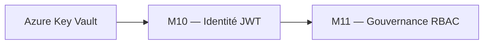
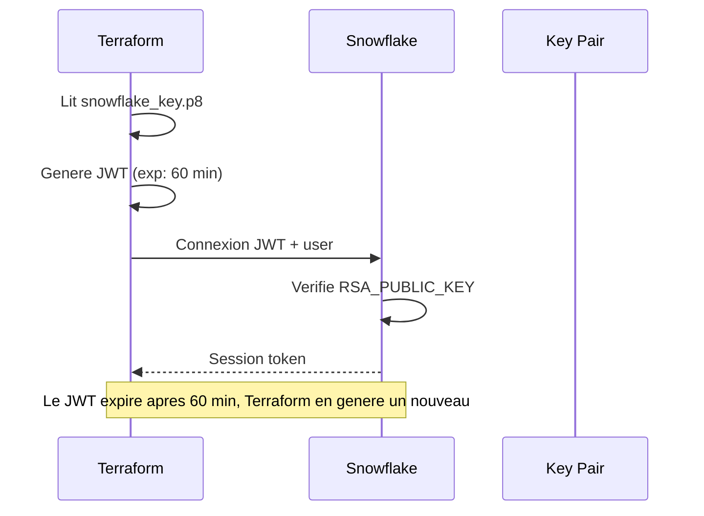
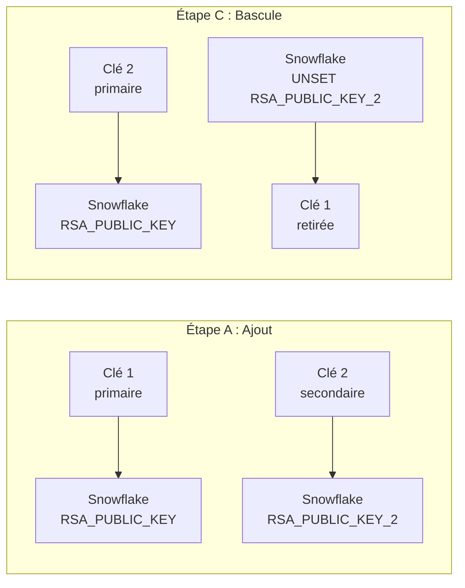
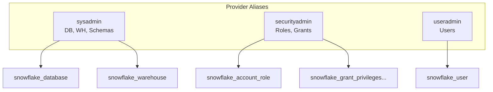

# Lab M10 -- Sécurité et authentification : Key Pair, rotation, moindre privilège

**Durée :** 50 min
**Patterns :** Key pair JWT, rotation sans interruption, `sensitive = true`, Network Policies, provider aliases, least privilege

---

## Contexte métier

Une identité partagée avec mot de passe empêche l'attribution des actions et augmente le risque de compromission. JWT, Key Vault et rotation séparent identité, secret et autorisation.

## Contexte architecture



| Référentiel | Alignement |
|---|---|
| Pattern | Workload Identity with Key Rotation |
| Azure Well-Architected | Sécurité, Fiabilité |
| Azure CAF | Govern |
| Platform Engineering | Identités techniques et séparation des rôles |

## Pattern d'entreprise

Le pattern **Workload Identity with Key Rotation** élimine les mots de passe permanents, prend en charge deux clés publiques et rend la rotation indépendante du code métier.

## Objectifs

À l'issue de ce lab, vous serez capable de :

- ✅ Comprendre l'authentification JWT du provider Snowflake (`deployment_mode` = `production` vs `training`).
- ✅ Effectuer une rotation de clé RSA sans interruption via `RSA_PUBLIC_KEY_2`.
- ✅ Marquer les variables et outputs comme `sensitive = true` pour masquer les secrets.
- ✅ Configurer une `snowflake_network_policy` pour restreindre l'accès par IP.
- ✅ Appliquer le principe de moindre privilège avec un role Terraform dédié.
- ✅ Utiliser les **provider aliases** (`sysadmin`, `useradmin`, `securityadmin`) pour séparer les responsabilités.
- ✅ Auditer les sessions Terraform via `ACCOUNT_USAGE.QUERY_HISTORY`.
- ✅ Détecter et corriger le drift sur les configurations de sécurité.

---

## Prérequis

> **Prérequis communs :** le Lab M0 est terminé et `terraform plan` fonctionne dans `project/01-day1-basics`. En mode formation, utilisez uniquement le secret `SNOWFLAKE_PASSWORD` distribué par le formateur ; ne stockez jamais sa valeur dans Git.

- Labs M1 à M9 terminés
- Terraform >= 1.14.5, Snowflake provider ~> 2.14.0
- Clé privée PKCS#8 dans `secrets/snowflake_key.p8`
- OpenSSL installé (pour générer de nouvelles clés)
- Compréhension du provider Snowflake (Lab M1)

---

## Concept — Pourquoi avant comment

L'authentification Snowflake via **key pair JWT** remplace les mots de passe par un token signé avec une clé privée RSA. La **rotation sans downtime** utilise `RSA_PUBLIC_KEY_2` pour avoir deux clés actives simultanément. Le **moindre privilège** consiste à créer un role dédié pour Terraform avec uniquement les permissions nécessaires.



**Patterns IaC :**
- **JWT Auth :** JSON Web Token sans mot de passe, clé privée lue via `file()`
- **Rotation Zero-Downtime :** Deux clés actives via `RSA_PUBLIC_KEY` et `RSA_PUBLIC_KEY_2`
- **Sensitive State :** Les secrets sont marqués `sensitive = true` dans les variables/outputs
- **Network Policy :** Restreindre l'accès par IP au compte Snowflake
- **Least Privilege :** Role Terraform dédié avec permissions minimales
- **Provider Aliases :** Multi-role Snowflake pour séparer les responsabilités

---

## Implémentation guidée

### Étape 1 -- Analyser la configuration actuelle du provider (5 min)

**Objectif :** Comprendre l'authentification JWT du provider Snowflake.

Lire `provider.tf` :

```hcl
provider "snowflake" {
  organization_name = var.snowflake_organization
  account_name      = var.snowflake_account
  user              = var.snowflake_user
  role              = var.snowflake_role

  # Training mode: password fallback
  password      = var.deployment_mode == "training" ? var.snowflake_password : null
  authenticator = var.deployment_mode == "training" ? "snowflake" : null

  # Production mode: JWT key-pair auth
  private_key_path = var.deployment_mode == "production" ? var.private_key_path : null

  preview_features_enabled = ["snowflake_file_format_resource", "snowflake_stage_internal_resource"]
}
```

> **Pattern :** Le provider utilise le pattern `deployment_mode` : en mode `training`, authentification par password (fallback). En mode `production`, authentification JWT (`SNOWFLAKE_JWT`) avec `private_key_path`. La clé privée est lue via `file()`, jamais copiée dans le code. Le JWT est généré automatiquement par le provider à chaque appel API.

**Questions de compréhension :**
1. Pourquoi `private_key_path` est marqué `sensitive = true` dans `variables.tf` ?
2. Quel est le format attendu de la clé (PKCS#8, PEM, avec/sans passphrase) ?
3. Que se passe-t-il si la clé expire (le JWT a une durée de vie de 60 min) ?

> **Note :** Le JWT a une expiration de 60 minutes. Le provider Snowflake génère un nouveau JWT automatiquement à chaque exécution. Vous n'avez pas besoin de le gérer manuellement.

---

### Étape 2 -- Rotation de clé sans interruption (10 min)

**Objectif :** Effectuer une rotation de clé sans interruption de service.

La rotation se fait via `RSA_PUBLIC_KEY_2` qui permet d'avoir **deux clés actives** simultanément.

```bash
# Générer la nouvelle clé
openssl genrsa 2048 | openssl pkcs8 -topk8 -inform PEM -out secrets/snowflake_key_v2.p8 -nocrypt
openssl rsa -in secrets/snowflake_key_v2.p8 -pubout -out secrets/snowflake_key_v2.pub
```

**Étape A -- Ajouter la nouvelle clé publique en secondaire :**

```sql
ALTER USER TERRAFORM_SVC SET RSA_PUBLIC_KEY_2='<contenu de snowflake_key_v2.pub sans marqueurs>';
```

**Étape B -- Tester Terraform avec la nouvelle clé :**

```powershell
$env:SNOWFLAKE_PRIVATE_KEY_PATH = "..\..\secrets\snowflake_key_v2.p8"
terraform plan
```

**Résultat attendu :** `No changes` — la nouvelle clé fonctionne, l'ancienne aussi.

**Étape C -- Basculer la clé primaire :**

```sql
ALTER USER TERRAFORM_SVC SET RSA_PUBLIC_KEY='<contenu de snowflake_key_v2.pub>';
ALTER USER TERRAFORM_SVC UNSET RSA_PUBLIC_KEY_2;
```

**Étape D -- Finaliser :**

```powershell
Remove-Item secrets/snowflake_key.p8  # Sécuriser avant !
Copy-Item secrets/snowflake_key_v2.p8 secrets/snowflake_key.p8
$env:SNOWFLAKE_PRIVATE_KEY_PATH = "..\..\secrets\snowflake_key.p8"
terraform plan
```



> **Pattern :** `RSA_PUBLIC_KEY_2` permet une **rotation sans fenêtre de vulnérabilité**. Les deux clés sont valides jusqu'à la bascule. Aucune interruption de service.

> **⚠ Piège :** Le contenu de la clé publique doit être inséré **sans les marqueurs** `-----BEGIN PUBLIC KEY-----` et `-----END PUBLIC KEY-----`. Utilisez un script pour nettoyer :
> ```powershell
> (Get-Content secrets/snowflake_key_v2.pub | Where-Object { $_ -notmatch '-----' }) -join ''
> ```

---

### Étape 3 -- Variables sensibles dans Terraform (5 min)

**Objectif :** Vérifier que les secrets sont correctement masqués.

Vérifier que la variable `private_key_path` est marquée `sensitive` :

```hcl
variable "private_key_path" {
  type        = string
  description = "Path to PKCS#8 private key"
  sensitive   = true
}
```

Tester :

```powershell
terraform output -json  # private_key_path n'apparait pas
```

```hcl
output "sensitive_check" {
  value     = var.private_key_path
  sensitive = true
}
```

```powershell
terraform output sensitive_check
# Attendu : <sensitive>
```

> **Pattern :** `sensitive = true` empêche l'affichage de la valeur dans les logs, outputs et plan. Indispensable pour les secrets, mots de passe, clés. La valeur est stockée dans le state mais jamais affichée.

> **Note :** Même si une variable est `sensitive`, elle est stockée **en clair** dans le `terraform.tfstate`. Protégez le state via RBAC Azure Blob (Lab M2).

---

### Étape 4 -- Network Policy Snowflake (10 min)

**Objectif :** Restreindre l'accès à Snowflake depuis des IP spécifiques.

```hcl
resource "snowflake_network_policy" "dev_policy" {
  name            = "NP_DEV_SECURITY"
  comment         = "Network policy for Dev environment - Well-Architected Security"
  allowed_ip_list = var.allowed_ips
  blocked_ip_list = []
}
```

```powershell
terraform plan
terraform apply -auto-approve
```

Vérifier :

```sql
SHOW NETWORK POLICIES;
DESC NETWORK POLICY NP_DEV_SECURITY;
```

> **⚠ Piège :** Ne bloquez pas votre propre IP ! Ajoutez toujours votre IP publique dans `allowed_ip_list` avant d'appliquer la policy. Pour trouver votre IP : `curl ifconfig.me`.

> **Tip :** En production, utilisez des plages CIDR restrictives (ex: IP du bureau, VPN). Évitez `0.0.0.0/0` dans `allowed_ip_list`.

---

### Étape 5 -- Principe de moindre privilège pour le provider (10 min)

**Objectif :** Créer un role dédié pour Terraform avec permissions minimales.

Actuellement, Terraform utilise `ACCOUNTADMIN`. En production, il faut un role **sur-mesure** avec les permissions minimales.

```hcl
# Role dédié pour Terraform
resource "snowflake_account_role" "terraform_role" {
  name    = "RL_TERRAFORM_${var.environment}"
  comment = "Terraform deployment role - least privilege"
}

# Grants spécifiques (à ajuster selon les ressources gérées)
resource "snowflake_grant_privileges_to_account_role" "terraform_create_database" {
  account_role_name = snowflake_account_role.terraform_role.name
  privileges        = ["CREATE DATABASE", "CREATE WAREHOUSE", "CREATE ROLE"]
  on_account        = true
}
```

Modifier `provider.tf` pour utiliser ce role :

```hcl
provider "snowflake" {
  organization_name = var.snowflake_organization
  account_name      = var.snowflake_account
  user              = var.snowflake_user
  role              = "RL_TERRAFORM_${var.environment}"

  password          = var.deployment_mode == "training" ? var.snowflake_password : null
  authenticator     = var.deployment_mode == "training" ? "snowflake" : null
  private_key_path  = var.deployment_mode == "production" ? var.private_key_path : null
}
```

> **Pattern :** En production, utilisez un role Terraform dédié avec **uniquement les droits nécessaires**. Cela limite l'impact d'un `terraform destroy` accidentel. Le role `ACCOUNTADMIN` donne un pouvoir total — trop dangereux.

---

### Étape 6 -- Provider Aliases : multi-role Snowflake (10 min)

**Objectif :** Séparer les responsabilités avec plusieurs aliases du provider Snowflake.

Le provider Snowflake supporte les **aliases** pour s'authentifier avec des roles différents dans la même exécution Terraform.

```hcl
# Provider alias: SYSADMIN for database/warehouse/schema operations
provider "snowflake" {
  alias             = "sysadmin"
  organization_name = var.snowflake_organization
  account_name      = var.snowflake_account
  user              = var.snowflake_user
  role              = "SYSADMIN"

  password          = var.deployment_mode == "training" ? var.snowflake_password : null
  authenticator     = var.deployment_mode == "training" ? "snowflake" : null
  private_key_path  = var.deployment_mode == "production" ? var.private_key_path : null

  preview_features_enabled = ["snowflake_file_format_resource", "snowflake_stage_internal_resource", "snowflake_stage_external_azure_resource"]
}

# Provider alias: USERADMIN for user and role management
provider "snowflake" {
  alias             = "useradmin"
  organization_name = var.snowflake_organization
  account_name      = var.snowflake_account
  user              = var.snowflake_user
  role              = "USERADMIN"

  password          = var.deployment_mode == "training" ? var.snowflake_password : null
  authenticator     = var.deployment_mode == "training" ? "snowflake" : null
  private_key_path  = var.deployment_mode == "production" ? var.private_key_path : null
}

# Provider alias: SECURITYADMIN for RBAC and security operations
provider "snowflake" {
  alias             = "securityadmin"
  organization_name = var.snowflake_organization
  account_name      = var.snowflake_account
  user              = var.snowflake_user
  role              = "SECURITYADMIN"

  password          = var.deployment_mode == "training" ? var.snowflake_password : null
  authenticator     = var.deployment_mode == "training" ? "snowflake" : null
  private_key_path  = var.deployment_mode == "production" ? var.private_key_path : null
}
```

Utiliser les aliases dans les ressources :

```hcl
# Databases et warehouses créés par SYSADMIN
resource "snowflake_database" "raw" {
  provider = snowflake.sysadmin
  name     = "DB_RAW_${var.environment}"
}

# Roles créés par SECURITYADMIN
resource "snowflake_account_role" "engineer" {
  provider = snowflake.securityadmin
  name     = "RL_DATA_ENGINEER_${var.environment}"
}

# Utilisateurs créés par USERADMIN
resource "snowflake_user" "analyst" {
  provider = snowflake.useradmin
  name     = "ANALYST_USER"
}
```



> **Pattern :** Les **provider aliases** permettent de respecter la **séparation des pouvoirs** (separation of duties) dans Snowflake. SYSADMIN gère les ressources, SECURITYADMIN gère les roles, USERADMIN gère les utilisateurs. C'est la bonne pratique en production.

> **Tip :** Pour le lab, vous pouvez rester avec `ACCOUNTADMIN` (qui a tous les droits). Les aliases sont utiles en production avec une hiérarchie de roles stricte.

---

### Étape 7 -- Audit des sessions Terraform (5 min)

**Objectif :** Surveiller l'activité de Terraform dans Snowflake.

```sql
-- Voir les sessions ouvertes par Terraform
SHOW LOCKS;

-- Historique des sessions
SELECT * FROM TABLE(INFORMATION_SCHEMA.SESSIONS_HISTORY())
WHERE USER_NAME = 'TERRAFORM_SVC'
ORDER BY STARTED_TIME DESC;

-- Voir les requêtes exécutées par Terraform
SELECT *
FROM SNOWFLAKE.ACCOUNT_USAGE.QUERY_HISTORY
WHERE USER_NAME = 'TERRAFORM_SVC'
  AND START_TIME > DATEADD('HOUR', -1, CURRENT_TIMESTAMP)
ORDER BY START_TIME DESC;
```

> **Pattern :** L'audit des sessions permet de détecter les activités suspectes (ex: un `terraform destroy` non autorisé). En production, configurez des alertes sur les requêtes destructrices.

---

### Étape 8 -- Drift detection sur la sécurité (5 min)

**Objectif :** Détecter une modification manuelle de la network policy.

1. Modifier la network policy dans Snowflake :

```sql
ALTER NETWORK POLICY NP_DEV_SECURITY SET ALLOWED_IP_LIST = ('0.0.0.0/0');
```

2. Lancer `terraform plan` et observer la dérive :

```powershell
terraform plan
# ~ resource "snowflake_network_policy" "dev_policy" {
#     ~ allowed_ip_list = ["0.0.0.0/0"] -> var.allowed_ips
#   }
```

3. Corriger :

```powershell
terraform apply -auto-approve
```

> **Pattern :** Une network policy modifiée manuellement pour ouvrir l'accès à tous (`0.0.0.0/0`) est une **faille de sécurité**. Terraform détecte et corrige cette dérive automatiquement.

---

## Exercice challenge

**Objectif :** Configurer les trois provider aliases (SYSADMIN, SECURITYADMIN, USERADMIN) et séparer la création des ressources.

**Consignes :**
1. Déclarer les trois aliases du provider Snowflake dans `provider.tf`
2. Créer les roles `RL_SYSADMIN_DEV`, `RL_SECURITYADMIN_DEV`, `RL_USERADMIN_DEV` avec `ACCOUNTADMIN`
3. Ajouter `provider = snowflake.sysadmin` sur les databases et warehouses
4. Ajouter `provider = snowflake.securityadmin` sur les account roles et grants
5. Tester `terraform plan` et vérifier que les ressources sont créées avec le bon role

**Critères de validation :**
- [ ] `terraform validate` réussit
- [ ] `terraform plan` ne montre pas d'erreur de provider
- [ ] Les databases sont créées avec `RL_SYSADMIN_DEV`
- [ ] Les roles sont créés avec `RL_SECURITYADMIN_DEV`
- [ ] `SHOW GRANTS TO ROLE RL_SYSADMIN_DEV` confirme la hiérarchie

> **Hint :** Commencez par créer les trois roles avec `ACCOUNTADMIN`, puis changez le provider par défaut pour utiliser `sysadmin` et ajoutez les aliases. Les ressources existantes garderont leur provider actuel.

---

## Validation et auto-évaluation

### Checklist de compétences

- [ ] Je comprends le mécanisme JWT de Snowflake (clé privée → token signé)
- [ ] Je sais effectuer une rotation de clé sans interruption
- [ ] Je peux marquer des variables et outputs comme `sensitive`
- [ ] Je sais configurer une Network Policy Snowflake
- [ ] Je comprends le principe de moindre privilège pour le provider
- [ ] Je sais utiliser les provider aliases pour séparer les responsabilités
- [ ] Je peux auditer les sessions Terraform dans Snowflake

### Quiz rapide

1. **Comment Terraform s'authentifie-t-il à Snowflake ?**
   - [ ] Username + password
   - [ ] JWT signé avec une clé privée RSA (`SNOWFLAKE_JWT`)
   - [ ] OAuth
   - [ ] SAML
   > Réponse : JWT signé avec clé privée RSA

2. **Comment faire une rotation de clé sans downtime ?**
   - [ ] Supprimer l'ancienne clé et ajouter la nouvelle
   - [ ] Utiliser `RSA_PUBLIC_KEY_2` pour avoir deux clés actives, puis basculer
   - [ ] Redémarrer Terraform
   - [ ] C'est impossible sans interruption
   > Réponse : RSA_PUBLIC_KEY_2 (deux clés actives)

3. **Que fait `sensitive = true` sur une variable ?**
   - [ ] Chiffre la valeur
   - [ ] Masque la valeur dans les logs, outputs et plan
   - [ ] Empêche l'utilisation de la variable
   - [ ] Supprime la variable du state
   > Réponse : Masque dans les logs, outputs et plan

4. **Pourquoi utiliser des provider aliases ?**
   - [ ] Pour accélérer Terraform
   - [ ] Pour séparer les responsabilités (SYSADMIN vs SECURITYADMIN vs USERADMIN)
   - [ ] Pour gérer plusieurs comptes Snowflake
   - [ ] C'est obligatoire
   > Réponse : Séparer les responsabilités

5. **Qu'est-ce que le moindre privilège pour Terraform ?**
   - [ ] Utiliser ACCOUNTADMIN pour tout
   - [ ] Créer un role dédié avec uniquement les permissions nécessaires
   - [ ] Ne donner aucun droit
   - [ ] Utiliser SYSADMIN uniquement
   > Réponse : Role dédié avec permissions minimales

---

### Diagnostic guidé

| Symptôme | Cause probable | Action |
|----------|----------------|--------|
| `JWT token is invalid` | Clé publique absente ou mal formatée | Vérifier `ALTER USER SET RSA_PUBLIC_KEY` sans marqueurs |
| `Insufficient privileges` | Role trop restreint | Utiliser ACCOUNTADMIN ou ajouter les grants nécessaires |
| `Network policy blocked` | IP non autorisée | Ajouter l'IP dans `allowed_ip_list` ou désactiver temporairement |
| `sensitive` value leaked | Output non marqué `sensitive` | Ajouter `sensitive = true` dans outputs.tf |
| `RSA_PUBLIC_KEY_2` conflict | Rotation incomplète | Vérifier que la clé primaire a bien été basculée |
| `Error: Duplicate provider` | Alias mal configuré | Vérifier que chaque alias a un nom unique |

---

## Bonus : Aller plus loin

- Configurer **MFA** (Multi-Factor Authentication) pour les utilisateurs humains
- Utiliser **Azure Key Vault** pour stocker la clé privée (au lieu d'un fichier local)
- Automatiser la rotation de clé via un **cron Terraform** mensuel
- Configurer une **alert** Snowflake sur les connexions suspectes
- Utiliser **SCIM** pour synchroniser les utilisateurs depuis Azure AD
- Configurer **policy attachments** pour appliquer la network policy au niveau du compte

---

## Troubleshooting

### `JWT token is invalid` (erreur 390144)

La clé publique n'est pas configurée sur l'utilisateur Snowflake, ou elle est mal formatée. Vérifiez :
1. La clé est au format PKCS#8 sans passphrase : `openssl pkcs8 -topk8 -inform PEM -out snowflake_key.p8 -nocrypt`
2. La clé publique a été ajoutée via `ALTER USER ... SET RSA_PUBLIC_KEY = '...'` **sans les marqueurs** `-----BEGIN/END PUBLIC KEY-----`
3. Si le JWT est rejeté en formation, basculez vers `deployment_mode = "training"` (password fallback)

### `Network policy blocked` — perte d'accès à Snowflake

Vous avez appliqué une network policy qui bloque votre IP. Solutions :
1. Ajouter votre IP dans `var.allowed_ips` et `terraform apply`
2. Si Terraform ne peut plus se connecter : `ALTER NETWORK POLICY ... UNSET ALLOWED_IP_LIST` via une session Snowflake existante
3. En dernier recours : `DROP NETWORK POLICY ...` via Snowsight

### `Insufficient privileges` lors de la création de ressources

Le role du provider n'a pas les permissions nécessaires. En mode `training` avec `ACCOUNTADMIN`, cela ne devrait pas arriver. Vérifiez `var.snowflake_role` dans `terraform.tfvars`.

### `Duplicate provider` error

Chaque alias doit avoir un nom unique. Vérifiez que `alias = "sysadmin"`, `alias = "useradmin"`, `alias = "securityadmin"` sont tous différents et qu'aucun alias n'est dupliqué.

### `sensitive` value affichée dans le plan

Si une valeur sensible apparaît dans `terraform plan`, vérifiez que **toutes** les variables et outputs qui la référencent sont marqués `sensitive = true`. Une seule référence non-sensitive suffit à exposer la valeur.
---

## Notes d'architecte

- **Décision :** la capacité du module est traitée comme un produit de plateforme, pas comme un exemple isolé.
- **Compromis :** le lab réduit volontairement l'échelle afin de rester exécutable en sandbox ; les contrôles de production restent obligatoires.
- **Garde-fou :** toute modification doit produire un plan relu, une validation technique et une preuve d'absence de dérive.

## Bonnes pratiques Enterprise

- Versionner les contrats et les modules, jamais les secrets ni les fichiers de state.
- Appliquer le moindre privilège aux identités humaines et techniques.
- Utiliser un state distant isolé, un artefact de plan immuable et une approbation avant production.
- Rendre sécurité, fiabilité, coût et observabilité vérifiables par le pipeline.

## Notes de production

| Dimension | Training | Production |
|---|---|---|
| Identité | Secret transmis hors Git | JWT, identité technique dédiée et rotation contrôlée |
| State | Backend simplifié ou sandbox | Azure Blob privé, chiffré, verrouillé et isolé |
| Déploiement | Exécution locale guidée | Azure DevOps, approbation et artefact de plan |
| Exploitation | Validation ponctuelle | SLO, alertes, runbooks, FinOps et contrôle continu de dérive |

## Réflexion

1. Quel risque métier réapparaît si cette capacité est gérée manuellement ?
2. Quel contrôle doit devenir obligatoire avant une promotion en production ?
3. Quelle preuve transmettre à l'équipe qui exploite la capacité suivante ?


