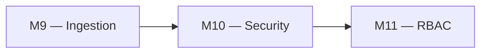
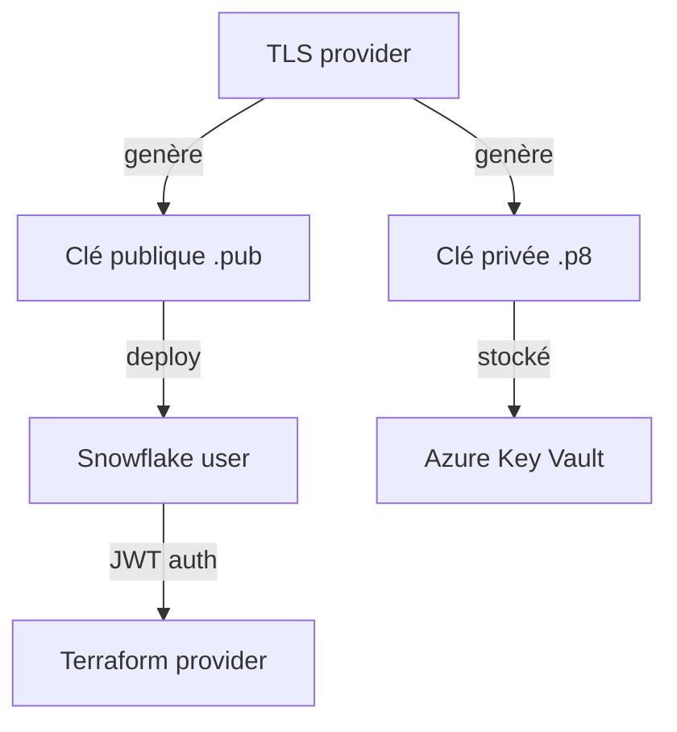

# 🧪 Lab M10 — Sécurité et authentification : Key Pair, rotation, moindre privilège

> [<- Jour 3](../README.md) · [<- Module precedent](../module-09-snowflake-advanced/lab.md) · **Module 10** · [Jour 4 ->](../../day-04/README.md)

| Élément | Valeur |
|---|---|
| **Durée** | 50 min |
| **Piste** | `[CORE]` |
| **Workspace** | `$HOME/Data2AI-Labs/data-platform` (le clone) |
| **Dossier de travail** | `modules/security/` et `environments/dev/` |
| **Coût** | Aucun |
| **Cleanup** | Conserver jusqu'au Jour 5 |

## 🎯 Mission

Une identité partagée avec un PAT empêche l'attribution des actions. Vous allez générer une paire de clés RSA, configurer l'authentification JWT pour un utilisateur technique Terraform et préparer la rotation.

## 🏗️ Architecture





## 🎯 Objectifs

- générer une paire de clés RSA avec le provider TLS;
- configurer un utilisateur Snowflake avec authentification key-pair;
- marquer les secrets comme `sensitive`;
- comprendre la rotation sans interruption.

## 📋 Prérequis

- [ ] M9 terminé;
- [ ] OpenSSL installé (vérifié au Jour 0);
- [ ] le dossier `secrets/` existe dans le clone.

## 📝 Partie 1 — Générer la paire de clés avec OpenSSL

### 📝 Étape 1.1 — Générer la clé privée

```bash
cd $HOME/Data2AI-Labs/data-platform
openssl genrsa -out secrets/snowflake_key.p8 2048
```

> 🔒 **SECURITY** : `secrets/` est gitignored. Vérifiez : `git check-ignore secrets/snowflake_key.p8` doit retourner le chemin.

### 📝 Étape 1.2 — Générer la clé publique

```bash
openssl rsa -in secrets/snowflake_key.p8 -pubout -out secrets/snowflake_key.pub
```

### 📝 Étape 1.3 — Vérifier

```bash
ls -la secrets/
git check-ignore secrets/snowflake_key.p8
git check-ignore secrets/snowflake_key.pub
```

✅ **Checkpoint** : les deux fichiers sont ignorés par Git.

## 📝 Partie 2 — Créer le module security

### 📝 Étape 2.1 — Créer la structure

```bash
mkdir -p modules/security
```

### 📝 Étape 2.2 — Créer `modules/security/variables.tf`

```hcl
variable "user_name" {
  type        = string
  description = "Snowflake technical user name"
}

variable "default_role" {
  type        = string
  description = "Default role for the technical user"
  default     = "SYSADMIN"
}

variable "default_warehouse" {
  type        = string
  description = "Default warehouse for the technical user"
}

variable "rsa_public_key" {
  type        = string
  description = "RSA public key content (PEM format)"
  sensitive   = true
}
```

### 📝 Étape 2.3 — Créer `modules/security/main.tf`

```hcl
resource "snowflake_user" "technical" {
  name                = var.user_name
  default_role        = var.default_role
  default_warehouse   = var.default_warehouse
  must_change_password = false

  rsa_public_key    = var.rsa_public_key
  rsa_public_key_2  = null
}
```

> `rsa_public_key_2` est laissé à `null`. Il sera utilisé lors de la rotation pour éviter une interruption.

### 📝 Étape 2.4 — Créer `modules/security/outputs.tf`

```hcl
output "user_name" {
  value       = snowflake_user.technical.name
  description = "Technical user name"
}

output "user_arn" {
  value       = snowflake_user.technical.name
  description = "User identifier"
  sensitive   = false
}
```

### 📝 Étape 2.5 — Créer `modules/security/versions.tf`

```hcl
terraform {
  required_version = ">= 1.14.0, < 2.0.0"

  required_providers {
    snowflake = {
      source  = "snowflakedb/snowflake"
      version = "= 2.14.0"
    }
    tls = {
      source  = "hashicorp/tls"
      version = ">= 4.0"
    }
  }
}
```

### 📝 Étape 2.6 — Formater et valider

```bash
cd modules/security
terraform fmt
terraform validate
```

## 📝 Partie 3 — Appeler le module depuis DEV

### 📝 Étape 3.1 — Lire la clé publique

```bash
cd environments/dev
export TF_VAR_rsa_public_key=$(cat ../secrets/snowflake_key.pub | grep -v 'BEGIN\|END' | tr -d '\n')
```

### 📝 Étape 3.2 — Ajouter l'appel dans `main.tf`

```hcl
module "security" {
  source            = "../../modules/security"
  user_name         = "TF_${var.learner_prefix}_SVC"
  default_role      = "SYSADMIN"
  default_warehouse = module.landing_zone.warehouse_names.etl
  rsa_public_key    = var.rsa_public_key
}
```

### 📝 Étape 3.3 — Ajouter la variable

Dans `variables.tf` :

```hcl
variable "rsa_public_key" {
  type        = string
  description = "RSA public key for the technical user"
  sensitive   = true
}
```

### 📝 Étape 3.4 — Ajouter l'output

```hcl
output "technical_user" {
  value       = module.security.user_name
  description = "Technical user for Terraform"
}
```

### 📝 Étape 3.5 — Planifier et appliquer

```bash
terraform fmt
terraform init
terraform validate
terraform plan
terraform apply
```

✅ **Checkpoint** : `1 to add` — l'utilisateur technique avec la clé RSA.

### 📝 Étape 3.6 — Vérifier

```bash
snow sql -c training -q "DESC USER TF_ABC_SVC"
```

Remplacez `ABC` par votre préfixe.

✅ **Checkpoint** : la ligne `RSA_PUBLIC_KEY_FP` contient une empreinte.

## 📝 Partie 4 — Rotation sans interruption

### 📝 Étape 4.1 — Principe

La rotation sans interruption utilise `rsa_public_key_2` :

1. générer une nouvelle paire de clés;
2. déployer la nouvelle clé publique dans `rsa_public_key_2`;
3. tester l'authentification avec la nouvelle clé;
4. déplacer la nouvelle clé vers `rsa_public_key` et retirer l'ancienne.

### 📝 Étape 4.2 — Simuler la rotation (concept)

Ajoutez une variable `rsa_public_key_new` et utilisez-la dans `rsa_public_key_2` :

```hcl
variable "rsa_public_key_new" {
  type      = string
  sensitive = true
  default   = null
}
```

```hcl
resource "snowflake_user" "technical" {
  name                = var.user_name
  default_role        = var.default_role
  default_warehouse   = var.default_warehouse
  must_change_password = false

  rsa_public_key    = var.rsa_public_key
  rsa_public_key_2  = var.rsa_public_key_new
}
```

> Pendant la transition, les deux clés sont valides. Une fois la nouvelle clé testée, vous inversez les rôles et retirez l'ancienne.

## 🏆 Challenge

Configurez une network policy qui restreint l'accès à une plage IP spécifique (votre IP publique).

Critères :

- [ ] `terraform plan` crée la network policy;
- [ ] `terraform apply` réussit;
- [ ] l'utilisateur technique est associé à la policy.

## 🧹 Cleanup

Conservez les ressources pour le Jour 4 et 5.
