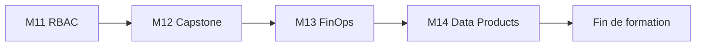

# Jour 4 — Capstone, FinOps, Data Products

**Objectif :** Composez, evaluez et livrez la plateforme complete.

> [<- Catalogue](../README.md) · [Jour 3](../day-03/README.md) · **Jour 4**

## Progression

## Modules

| Module | Duree | Lab | Course | Troubleshooting | Resultat attendu |
|---|---:|---|---|---|---|
| [M11 — RBAC as Code](module-11-rbac/lab.md) | 2h15 | [lab](module-11-rbac/lab.md) | [cours](module-11-rbac/course.md) | [guide](module-11-rbac/troubleshooting.md) | [output](module-11-rbac/expected-output.md) |
| [M12 — Capstone](module-12-capstone/lab.md) | 2h15 | [lab](module-12-capstone/lab.md) | [cours](module-12-capstone/course.md) | [guide](module-12-capstone/troubleshooting.md) | [output](module-12-capstone/expected-output.md) |
| [M13 — FinOps & Observabilite](module-13-finops-observability/lab.md) | 0h45 | [lab](module-13-finops-observability/lab.md) | [cours](module-13-finops-observability/course.md) | [guide](module-13-finops-observability/troubleshooting.md) | [output](module-13-finops-observability/expected-output.md) |
| [M14 — Data Products](module-14-data-products/lab.md) | 0h45 | [lab](module-14-data-products/lab.md) | [cours](module-14-data-products/course.md) | [guide](module-14-data-products/troubleshooting.md) | [output](module-14-data-products/expected-output.md) |

## Workflow du jour

1. **Lisez** le `course.md` du module (concepts, 15-20 min)
2. **Realisez** le `lab.md` pas a pas (creation de fichiers, execution, checkpoints)
3. **Comparez** avec `expected-output.md`
4. **Consultez** `troubleshooting.md` en cas d'erreur
5. **Passez** au module suivant

## Livrable du jour

Plateforme composee et evaluee, pipeline de qualite, indicateurs FinOps et Data Products gouvernes.
Capstone : soutenance avec zero-drift et cleanup verifie.

## Navigation

[<- Catalogue](../README.md) · [Jour 3](../day-03/README.md) · **Jour 4**
