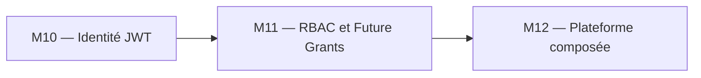
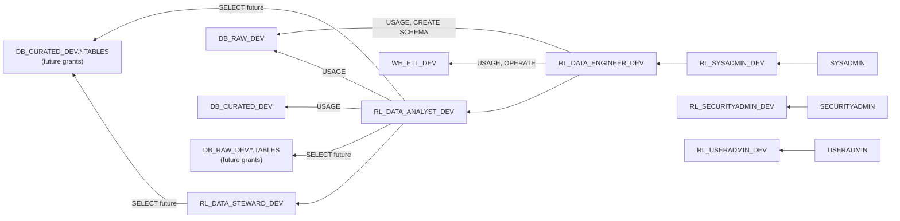
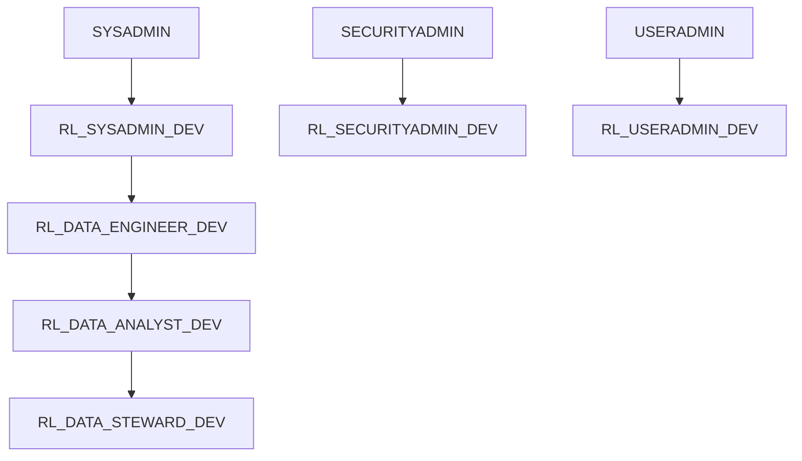
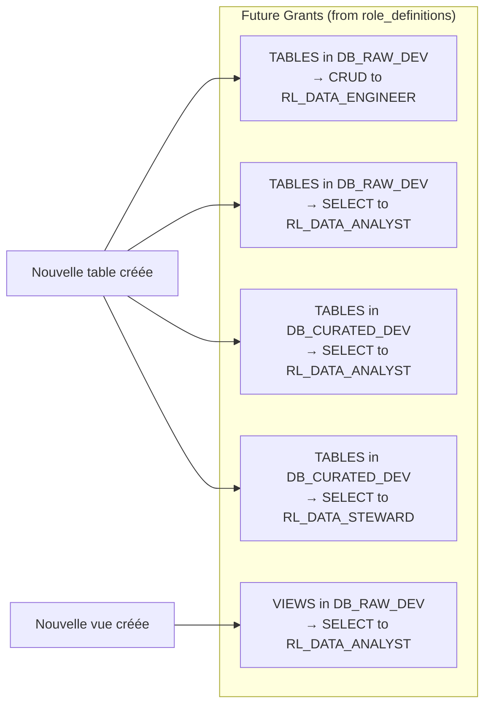

# Lab M11 -- Modèle RBAC scalable avec Future Grants

**Durée :** 60 min
**Code :** `project/04-day3-rbac/environments/dev/`
**Patterns :** Role hierarchy, privilege grants, future grants, least privilege, grants audit, managed access schema

---

## Contexte métier

L'accès aux données doit suivre les fonctions métier sans tickets manuels ni privilèges permanents. Une hiérarchie data-driven et les Future Grants appliquent le moindre privilège à l'échelle.

## Contexte architecture



| Référentiel | Alignement |
|---|---|
| Pattern | RBAC Hierarchy and Future Grants |
| Azure Well-Architected | Sécurité, Excellence opérationnelle |
| Azure CAF | Govern |
| Platform Engineering | Autorisation self-service gouvernée |

## Pattern d'entreprise

Le pattern **RBAC Hierarchy and Future Grants** sépare rôles d'accès, rôles fonctionnels et rôles système, puis automatise les droits sur les futurs objets.

## Objectifs

À l'issue de ce lab, vous serez capable de :

- ✅ Comprendre le module RBAC **data-driven** : `role_definitions` map avec `for_each` pour créer rôles, hiérarchie, grants et future grants en un seul pattern.
- ✅ Déployer la hiérarchie complète : `SYSADMIN → RL_SYSADMIN_DEV → RL_DATA_ENGINEER_DEV → RL_DATA_ANALYST_DEV → RL_DATA_STEWARD_DEV`.
- ✅ Comprendre la **séparation des pouvoirs** : technical roles (sysadmin, securityadmin, useradmin) vs business roles (data_engineer, data_analyst, data_steward).
- ✅ Configurer les **future grants** via la map `future_grants` (SELECT automatique sur les futures tables/vues).
- ✅ Chaîner les outputs du module `landing_zone` vers le module `rbac` (`raw_database_name`, `curated_database_name`, `warehouse_names["etl"]`).
- ✅ Tester les future grants en créant des tables et en vérifiant l'accès automatique.
- ✅ Auditer les grants avec `SHOW GRANTS` et `SHOW FUTURE GRANTS`.
- ✅ Détecter la dérive sur les grants (grant manuel hors Terraform).

---

## Prérequis

> **Prérequis communs :** le Lab M0 est terminé et `terraform plan` fonctionne dans `project/01-day1-basics`. En mode formation, utilisez uniquement le secret `SNOWFLAKE_PASSWORD` distribué par le formateur ; ne stockez jamais sa valeur dans Git.

- Labs M1 à M10 terminés
- Module `landing-zone` déployé (databases + warehouses + schemas)
- Terraform >= 1.14.5, Snowflake provider ~> 2.14.0
- Compréhension des resources Snowflake (database, warehouse, schema)
- Role `ACCOUNTADMIN` (pour créer et assigner des roles)

---

## Concept — Pourquoi avant comment

Le RBAC Snowflake repose sur une **hiérarchie de roles** : les roles techniques (SYSADMIN, SECURITYADMIN, USERADMIN) héritent des roles système, et les roles métier (Data Engineer, Data Analyst, Data Steward) héritent des roles techniques. Les **Future Grants** automatisent les permissions sur les objets créés dans le futur, éliminant la gestion manuelle.



**Patterns IaC :**
- **Role Hierarchy :** Les roles héritent des permissions des roles parents
- **Future Grants :** Les permissions s'appliquent automatiquement aux objets créés dans le futur
- **Least Privilege :** Chaque role a strictement les droits dont il a besoin
- **Grants Audit :** Audit régulier via `SHOW GRANTS` et `ACCOUNT_USAGE.GRANTS_TO_ROLES`
- **Granularité :** Permissions au niveau database, schema, ou type d'objet
- **Technical vs Business Roles :** Technical = infrastructure, Business = usage métier

---

## Implémentation guidée

### Étape 1 -- Analyser le module RBAC existant (10 min)

**Objectif :** Comprendre la structure des roles techniques et métier.

Lire `project/04-day3-rbac/environments/dev/main.tf` :

```hcl
module "landing_zone" {
  source = "../../../03-day2-modules/modules/landing-zone"

  environment = var.environment
  schemas     = var.schemas
}

module "rbac" {
  source = "../../../03-day2-modules/modules/rbac"

  environment           = var.environment
  raw_database_name     = module.landing_zone.raw_database_name
  curated_database_name = module.landing_zone.curated_database_name
  etl_warehouse_name    = module.landing_zone.warehouse_names["etl"]
}
```

Le module `rbac` est **data-driven** : il itère sur `var.role_definitions` avec `for_each`. Voici la structure interne (dans `modules/rbac/main.tf`) :

```hcl
# Create all roles from role_definitions map
resource "snowflake_account_role" "this" {
  for_each = var.role_definitions

  name    = local.role_names[each.key]
  comment = "${each.value.comment} - ${var.environment}"
}

# Role hierarchy: grant each role to its parent
resource "snowflake_grant_account_role" "hierarchy" {
  for_each = var.role_definitions

  role_name        = snowflake_account_role.this[each.key].name
  parent_role_name = local.parent_role_names[each.key]

  depends_on = [snowflake_account_role.this]
}
```

Et le `role_definitions` par défaut (dans `modules/rbac/variables.tf`) :

```hcl
variable "role_definitions" {
  type = map(object({
    parent_role      = string
    business         = bool
    comment          = string
    warehouse_grants = optional(list(string), [])
    database_grants  = map(list(string))
    future_grants = map(object({
      privileges  = list(string)
      object_type = string
      in_database = string
      in_schema   = optional(string, "")
    }))
  }))
  default = {
    sysadmin = {
      parent_role      = "SYSADMIN"
      business         = false
      comment          = "Technical Sysadmin role"
      warehouse_grants = []
      database_grants  = {}
      future_grants    = {}
    }
    # ... securityadmin, useradmin (same pattern)
    data_engineer = {
      parent_role      = "sysadmin"
      business         = true
      comment          = "Business Data Engineer role"
      warehouse_grants = ["USAGE", "OPERATE"]
      database_grants = {
        raw = ["USAGE", "CREATE SCHEMA"]
      }
      future_grants = {
        raw_tables = {
          privileges  = ["SELECT", "INSERT", "UPDATE", "DELETE", "TRUNCATE"]
          object_type = "TABLES"
          in_database = "raw"
        }
      }
    }
    data_analyst = {
      parent_role      = "data_engineer"
      business         = true
      comment          = "Business Data Analyst role"
      warehouse_grants = ["USAGE"]
      database_grants = {
        raw     = ["USAGE"]
        curated = ["USAGE"]
      }
      future_grants = {
        raw_tables      = { privileges = ["SELECT"], object_type = "TABLES", in_database = "raw" }
        raw_views       = { privileges = ["SELECT"], object_type = "VIEWS",  in_database = "raw" }
        curated_tables  = { privileges = ["SELECT"], object_type = "TABLES", in_database = "curated" }
      }
    }
    data_steward = {
      parent_role      = "data_analyst"
      business         = true
      comment          = "Business Data Steward role"
      warehouse_grants = []
      database_grants  = {}
      future_grants = {
        curated_tables = { privileges = ["SELECT"], object_type = "TABLES", in_database = "curated" }
      }
    }
  }
}
```

> **Pattern :** Le module RBAC est **data-driven** : un seul `for_each` sur `role_definitions` crée tous les rôles, la hiérarchie, les grants warehouse/database, et les future grants. Ajouter un rôle = ajouter une entrée dans la map, **aucun code Terraform supplémentaire**. La convention de nommage est `RL_{SUFFIX}_{ENV}` (ex: `RL_DATA_ENGINEER_DEV`).

**Questions de compréhension :**
1. Pourquoi les roles sont-ils suffixés par `_${var.environment}` ? (Isolation par environnement)
2. Quelle est la différence entre un role technique et un role métier ?
3. Pourquoi `RL_DATA_ENGINEER_DEV` hérite de `RL_SYSADMIN_DEV` et non de `SYSADMIN` directement ?

---

### Étape 2 -- Appliquer la hiérarchie des roles (10 min)

**Objectif :** Établir la hiérarchie : system roles → technical roles → business roles.

Le module utilise `locals` pour résoudre la hiérarchie. Le `parent_role` dans `role_definitions` peut référencer soit un rôle système (`SYSADMIN`), soit une autre clé de la map (`sysadmin`, `data_engineer`, `data_analyst`) :

```hcl
locals {
  role_names = {
    for key, def in var.role_definitions : key => "RL_${upper(key)}_${var.environment}"
  }

  parent_role_names = {
    for key, def in var.role_definitions : key => (
      contains(keys(var.role_definitions), def.parent_role) ? local.role_names[def.parent_role] : def.parent_role
    )
  }
}
```

> **Pattern :** Si `parent_role` est une clé de `role_definitions` (ex: `"sysadmin"`), le parent est résolu en `RL_SYSADMIN_DEV`. Si c'est un rôle système (ex: `"SYSADMIN"`), il est utilisé tel quel. C'est la **résolution dynamique de la hiérarchie**.

La hiérarchie réelle dans le code :

| Rôle | `parent_role` | Résolu en |
|------|---------------|-----------|
| `sysadmin` | `"SYSADMIN"` | `SYSADMIN` |
| `securityadmin` | `"SECURITYADMIN"` | `SECURITYADMIN` |
| `useradmin` | `"USERADMIN"` | `USERADMIN` |
| `data_engineer` | `"sysadmin"` | `RL_SYSADMIN_DEV` |
| `data_analyst` | `"data_engineer"` | `RL_DATA_ENGINEER_DEV` |
| `data_steward` | `"data_analyst"` | `RL_DATA_ANALYST_DEV` |

```powershell
cd project/04-day3-rbac/environments/dev
terraform init
terraform plan -out=rbac.tfplan
terraform apply rbac.tfplan
```



> **Pattern :** La hiérarchie suit le principe de **séparation des pouvoirs**. SYSADMIN gère les ressources, SECURITYADMIN gère les roles et grants, USERADMIN gère les utilisateurs. Les business roles héritent du technical role approprié.

---

### Étape 3 -- Vérifier la hiérarchie (5 min)

**Objectif :** Confirmer que la hiérarchie est correcte dans Snowflake.

```sql
-- Voir la hiérarchie complète
SHOW GRANTS TO ROLE RL_DATA_ENGINEER_DEV;
SHOW GRANTS TO ROLE RL_DATA_ANALYST_DEV;
SHOW GRANTS TO ROLE RL_DATA_STEWARD_DEV;
SHOW GRANTS TO ROLE RL_SYSADMIN_DEV;

-- Voir les roles parents
SHOW GRANTS OF ROLE RL_DATA_ENGINEER_DEV;
SHOW GRANTS OF ROLE RL_DATA_ANALYST_DEV;
```

```powershell
# Equivalent via Terraform
terraform state list | Select-String "snowflake_grant_account_role"
```

> **Tip :** `SHOW GRANTS TO ROLE` montre ce que le role possède. `SHOW GRANTS OF ROLE` montre qui hérite de ce role. Les deux sont complémentaires pour l'audit.

---

### Étape 4 -- Grants sur les objets existants (10 min)

**Objectif :** Attribuer les permissions sur les databases et warehouses.

Le module utilise `for_each` avec filtrage pour créer uniquement les grants nécessaires :

```hcl
# Warehouse grants (only for roles with warehouse_grants)
resource "snowflake_grant_privileges_to_account_role" "warehouse" {
  for_each = {
    for key, def in var.role_definitions : key => def
    if length(def.warehouse_grants) > 0
  }

  account_role_name = snowflake_account_role.this[each.key].name
  privileges        = each.value.warehouse_grants
  on_account_object {
    object_type = "WAREHOUSE"
    object_name = var.etl_warehouse_name
  }

  depends_on = [snowflake_account_role.this]
}

# Database grants (flattened from map of databases per role)
resource "snowflake_grant_privileges_to_account_role" "database" {
  for_each = {
    for pair in flatten([
      for role_key, def in var.role_definitions : [
        for db_key, privileges in def.database_grants : {
          role_key  = role_key
          db_key    = db_key
          privileges = privileges
        }
      ]
    ]) : "${pair.role_key}.${pair.db_key}" => pair
  }

  account_role_name = snowflake_account_role.this[each.value.role_key].name
  privileges        = each.value.privileges
  on_account_object {
    object_type = "DATABASE"
    object_name = local.database_name_map[each.value.db_key]
  }

  depends_on = [snowflake_account_role.this]
}
```

> **Pattern :** Le `for_each` sur les warehouse grants filtre avec `if length(def.warehouse_grants) > 0` — seuls les rôles ayant des grants warehouse les reçoivent. Pour les database grants, la map est **aplatie** (`flatten`) pour créer une clé composite `"role.db"`.

**Niveaux de privilèges (depuis `role_definitions` par défaut) :**

| Ressource | Privilèges Engineer | Privilèges Analyst | Privilèges Steward |
|-----------|---------------------|---------------------|---------------------|
| DB_RAW_DEV | USAGE, CREATE SCHEMA | USAGE | -- |
| DB_CURATED_DEV | -- | USAGE | -- |
| WH_ETL_DEV | USAGE, OPERATE | USAGE | -- |
| DB_RAW_DEV.*.TABLES | SELECT, INSERT, UPDATE, DELETE, TRUNCATE (future) | SELECT (future) | -- |
| DB_RAW_DEV.*.VIEWS | -- | SELECT (future) | -- |
| DB_CURATED_DEV.*.TABLES | -- | SELECT (future) | SELECT (future) |

> **Pattern :** Chaque role a **uniquement** les privilèges dont il a besoin. L'Engineer peut créer des schemas et écrire dans les tables RAW. L'Analyst peut seulement lire. Le Steward peut lire CURATED pour la gouvernance.

---

### Étape 5 -- Future grants : la clé de la scalabilité (10 min)

**Objectif :** Automatiser les permissions sur les objets futurs.

Les **Future Grants** s'appliquent automatiquement aux **objets créés dans le futur**. Le module les gère via `for_each` sur la map `future_grants` de chaque rôle :

```hcl
# Future grants on schema objects
resource "snowflake_grant_privileges_to_account_role" "future" {
  for_each = {
    for pair in flatten([
      for role_key, def in var.role_definitions : [
        for grant_key, grant in def.future_grants : {
          role_key  = role_key
          grant_key = grant_key
          grant     = grant
        }
      ]
    ]) : "${pair.role_key}.${pair.grant_key}" => pair
  }

  account_role_name = snowflake_account_role.this[each.value.role_key].name
  privileges        = each.value.grant.privileges
  on_schema_object {
    future {
      object_type_plural = each.value.grant.object_type
      in_database        = local.database_name_map[each.value.grant.in_database]
    }
  }

  depends_on = [snowflake_account_role.this]
}
```

> **Pattern :** La map `future_grants` est **aplatie** en une liste de paires `role_key.grant_key`. Chaque entrée crée un future grant. Le `database_name_map` traduit `"raw"` → `DB_RAW_DEV` et `"curated"` → `DB_CURATED_DEV`.

```powershell
terraform apply -auto-approve
```



> **Pattern :** Les **Future Grants** éliminent la gestion manuelle des permissions. Chaque nouvelle table dans `DB_CURATED_DEV` est automatiquement accessible au role `RL_DATA_ANALYST_DEV`. C'est la **scalabilité** du RBAC.

> **Tip :** `object_type_plural` doit être au pluriel : `TABLES`, `VIEWS`, `FUNCTIONS`, `PROCEDURES`, `SEQUENCES`, `STAGES`.

---

### Étape 6 -- Tester les Future Grants (10 min)

**Objectif :** Vérifier que les Future Grants fonctionnent en pratique.

```sql
-- Créer une table dans la database gérée par future grants
CREATE TABLE DB_CURATED_DEV.SALES.TEST_FUTURE_GRANT (id INT);

-- Se connecter avec RL_DATA_ANALYST_DEV et tester
USE ROLE RL_DATA_ANALYST_DEV;
SELECT * FROM DB_CURATED_DEV.SALES.TEST_FUTURE_GRANT;  -- Doit fonctionner (future grant)

-- Vérifier que le grant a été automatiquement appliqué
SHOW GRANTS TO ROLE RL_DATA_ANALYST_DEV;
```

**Contraste :** l'Analyst a aussi un future grant SELECT sur `DB_RAW_DEV.*.TABLES`, mais l'Engineer a les droits CRUD :

```sql
CREATE TABLE DB_RAW_DEV.SALES.TEST_RAW_TABLE (id INT);

USE ROLE RL_DATA_ANALYST_DEV;
SELECT * FROM DB_RAW_DEV.SALES.TEST_RAW_TABLE;
-- Doit fonctionner : future grant SELECT sur raw_tables pour analyst

USE ROLE RL_DATA_ENGINEER_DEV;
INSERT INTO DB_RAW_DEV.SALES.TEST_RAW_TABLE VALUES (1);
-- Doit fonctionner : future grant CRUD sur raw_tables pour engineer
```

> **Pattern :** Les Future Grants s'appliquent **que** dans la database/zone configurée. Une table créée dans `DB_RAW_DEV` est automatiquement lisible par l'Analyst (SELECT) et modifiable par l'Engineer (CRUD).

---

### Étape 7 -- Audit complet des grants (5 min)

**Objectif :** Auditer l'ensemble des permissions.

```sql
-- Audit complet par role
SELECT *
FROM TABLE(RESULT_SCAN(LAST_QUERY_ID()))
WHERE GRANTEE_NAME IN ('RL_SYSADMIN_DEV', 'RL_DATA_ENGINEER_DEV', 'RL_DATA_ANALYST_DEV', 'RL_DATA_STEWARD_DEV');

-- Voir les Future Grants
SHOW FUTURE GRANTS IN DATABASE DB_CURATED_DEV;

-- Script d'audit pour tous les roles personnalisés
SELECT
    GRANTEE_NAME as ROLE_NAME,
    LISTAGG(PRIVILEGE || ' ON ' || OBJECT_TYPE || ' ' || OBJECT_NAME, ', ') WITHIN GROUP (ORDER BY PRIVILEGE) as GRANTS
FROM SNOWFLAKE.ACCOUNT_USAGE.GRANTS_TO_ROLES
WHERE GRANTEE_NAME LIKE 'RL\_%\_DEV'
  AND DELETED_ON IS NULL
GROUP BY GRANTEE_NAME;
```

> **Pattern :** L'audit régulier des grants est essentiel. `SHOW FUTURE GRANTS` liste tous les future grants configurés. `ACCOUNT_USAGE.GRANTS_TO_ROLES` donne une vue historique avec `DELETED_ON` pour traquer les grants supprimés.

---

### Étape 8 -- Approfondissement : grants sur schemas spécifiques (5 min)

**Objectif :** Affiner les permissions au niveau du schema.

Pour un contrôle plus granulaire que `in_database` :

```hcl
resource "snowflake_grant_privileges_to_account_role" "analyst_schema_select" {
  account_role_name = snowflake_account_role.analyst.name
  privileges        = ["SELECT"]
  on_schema_object {
    future {
      object_type_plural = "TABLES"
      in_schema          = "${var.curated_database_name}.SALES"
    }
  }
}
```

> **Note :** `in_schema` restreint le future grant à un schema spécifique. Utile quand tous les schemas n'ont pas les mêmes règles d'accès. Comparez : `in_database` = tous les schemas, `in_schema` = un seul.

---

### Étape 9 -- Drift detection sur les grants (5 min)

**Objectif :** Détecter un grant manuel non géré par Terraform.

1. Ajouter un grant manuellement dans Snowflake :

```sql
GRANT MONITOR ON WAREHOUSE WH_ETL_DEV TO ROLE RL_DATA_ANALYST_DEV;
```

2. Lancer `terraform plan` et observer la dérive :

```powershell
terraform plan
# Terraform détecte le grant non déclaré et propose de le retirer
```

3. Corriger en ajoutant le grant dans le code ou en le retirant de Snowflake :

```powershell
terraform apply -auto-approve  # Retire le grant non désiré
```

> **⚠ Piège :** Terraform gère uniquement les grants qu'il a créés. Un grant ajouté manuellement n'est pas détecté comme dérive par défaut. Pour le détecter, utilisez `terraform plan` après avoir importé le grant, ou utilisez `snowflake_grant_privileges_to_account_role` avec `enable_multiple_grants = false` (comportement par défaut : Terraform retire les grants non déclarés).

---

## Exercice challenge

**Objectif :** Ajouter un role `RL_DATA_SCIENTIST_DEV` avec SELECT + CREATE VIEW sur `DB_CURATED_DEV` et un future grant sur les futures vues.

**Consignes :**
1. Créer le role `RL_DATA_SCIENTIST_DEV` (business role, hérite de `RL_SYSADMIN_DEV`)
2. Accorder `USAGE` sur `DB_CURATED_DEV` et `USAGE` sur `WH_ANALYTICS_DEV`
3. Ajouter un future grant : `SELECT` sur les futures `TABLES` dans `DB_CURATED_DEV`
4. Ajouter un future grant : `SELECT` sur les futures `VIEWS` dans `DB_CURATED_DEV`
5. Tester en créant une table et une vue, puis en les lisant avec le nouveau role

**Critères de validation :**
- [ ] `terraform plan` montre les nouvelles ressources sans erreur
- [ ] `terraform apply` réussit
- [ ] `SHOW GRANTS TO ROLE RL_DATA_SCIENTIST_DEV` affiche les grants
- [ ] `SHOW FUTURE GRANTS IN DATABASE DB_CURATED_DEV` inclut le nouveau role
- [ ] Une table créée dans `DB_CURATED_DEV` est automatiquement lisible par le role

> **Hint :** Suivez le même pattern que les roles Analyst et Steward. La hiérarchie est : `SYSADMIN → RL_SYSADMIN_DEV → RL_DATA_SCIENTIST_DEV`.

---

## Validation et auto-évaluation

### Checklist de compétences

- [ ] Je sais créer une hiérarchie de roles (system → technical → business)
- [ ] Je peux attribuer des privilèges sur des objets existants (database, warehouse)
- [ ] Je comprends le concept de Future Grants et leur valeur
- [ ] Je sais tester les Future Grants en créant des objets et en vérifiant l'accès
- [ ] Je peux auditer les grants avec `SHOW GRANTS` et `ACCOUNT_USAGE`
- [ ] Je comprends la différence entre `in_database` et `in_schema` pour les future grants
- [ ] Je sais détecter et corriger une dérive sur les grants

### Quiz rapide

1. **Que sont les Future Grants ?**
   - [ ] Des grants qui s'appliquent dans le futur à une date précise
   - [ ] Des permissions qui s'appliquent automatiquement aux objets créés dans le futur
   - [ ] Des grants temporaires
   - [ ] Des grants planifiés
   > Réponse : Permissions automatiques sur les objets futurs

2. **Quelle est la convention de nommage des roles ?**
   - [ ] `ROLE_{DOMAIN}_{ENV}`
   - [ ] `RL_{DOMAIN}_{ENV}` (ex: `RL_DATA_ENGINEER_DEV`)
   - [ ] `{DOMAIN}_{ENV}_ROLE`
   - [ ] N'importe quel nom
   > Réponse : `RL_{DOMAIN}_{ENV}`

3. **Quelle est la hiérarchie correcte ?**
   - [ ] SYSADMIN → RL_DATA_ENGINEER_DEV directement
   - [ ] SYSADMIN → RL_SYSADMIN_DEV → RL_DATA_ENGINEER_DEV → RL_DATA_ANALYST_DEV → RL_DATA_STEWARD_DEV
   - [ ] RL_DATA_ENGINEER_DEV → RL_SYSADMIN_DEV → SYSADMIN
   - [ ] Pas de hiérarchie nécessaire
   > Réponse : SYSADMIN → RL_SYSADMIN_DEV → RL_DATA_ENGINEER_DEV → RL_DATA_ANALYST_DEV → RL_DATA_STEWARD_DEV

4. **Quelle est la différence entre `in_database` et `in_schema` dans un future grant ?**
   - [ ] Aucune
   - [ ] `in_database` s'applique à tous les schemas de la database, `in_schema` à un seul
   - [ ] `in_schema` s'applique à toutes les databases
   - [ ] `in_database` est obsolète
   > Réponse : `in_database` = tous les schemas, `in_schema` = un seul

5. **Pourquoi séparer technical roles et business roles ?**
   - [ ] Pour des raisons de performance
   - [ ] Séparation des pouvoirs : technical = infrastructure, business = usage métier
   - [ ] C'est obligatoire
   - [ ] Pour réduire le nombre de grants
   > Réponse : Séparation des pouvoirs

---

### Diagnostic guidé

| Symptôme | Cause probable | Action |
|----------|----------------|--------|
| `Grant already exists` | Grant déjà appliqué manuellement | Vérifier avec `SHOW GRANTS TO ROLE` |
| `Insufficient privileges` sur Future Grant | Role parent n'a pas les droits | Vérifier les grants sur la database parente |
| Future Grant ne s'applique pas | Objet créé dans un schema différent | Vérifier `in_database` vs `in_schema` |
| `Role not found` | Ordre de création incorrect | Vérifier les dépendances (role avant grant) |
| `SHOW FUTURE GRANTS` vide | Aucun future grant configuré | Vérifier le code Terraform et re-appliquer |
| `Error: duplicate grant` | Même grant déclaré deux fois | Dédupliquer dans le code Terraform |

---

## Bonus : Aller plus loin

- Ajouter un role `RL_DATA_SCIENTIST_DEV` avec accès à `DB_CURATED_DEV` en SELECT + CREATE VIEW
- Configurer des **grants révocables** avec `snowflake_grant_privileges_to_account_role` + conditionnel
- Automatiser l'audit des grants via une requête `ACCOUNT_USAGE.GRANTS_TO_ROLES` programmée
- Ajouter une **Managed Access Schema** pour un contrôle encore plus strict
- Utiliser le module `user-role-assignment` pour assigner des utilisateurs aux roles
- Configurer des **tag-based masking policies** pour masquer les données sensibles selon le role

---

## Troubleshooting

### `Grant already exists` lors du `terraform apply`

Un grant a été appliqué manuellement dans Snowflake. Vérifiez avec `SHOW GRANTS TO ROLE RL_DATA_ENGINEER_DEV` et supprimez le grant conflictuel, ou importez-le dans le state Terraform.

### `Insufficient privileges` sur Future Grant

Le rôle parent n'a pas les droits sur la database. Vérifiez que `RL_SYSADMIN_DEV` a bien reçu `USAGE` sur `DB_RAW_DEV` via les `database_grants` dans `role_definitions`.

### Future Grant ne s'applique pas

Vérifiez que la table est créée dans la bonne database (`in_database` dans `future_grants`). Si `in_database = "raw"`, la table doit être dans `DB_RAW_DEV`. Vérifiez avec `SHOW FUTURE GRANTS IN DATABASE DB_RAW_DEV`.

### `Role not found` lors du `terraform plan`

L'ordre de création est incorrect. Le module utilise `depends_on = [snowflake_account_role.this]` sur tous les grants pour garantir que les rôles existent avant les grants. Vérifiez que vous n'avez pas modifié cet ordre.

### `Error: duplicate grant` dans le plan

Le même grant est déclaré deux fois dans `role_definitions`. Vérifiez que chaque clé dans `future_grants` est unique (ex: `raw_tables`, `raw_views`, `curated_tables` — pas deux fois `raw_tables`).
---

## Notes d'architecte

- **Décision :** la capacité du module est traitée comme un produit de plateforme, pas comme un exemple isolé.
- **Compromis :** le lab réduit volontairement l'échelle afin de rester exécutable en sandbox ; les contrôles de production restent obligatoires.
- **Garde-fou :** toute modification doit produire un plan relu, une validation technique et une preuve d'absence de dérive.

## Bonnes pratiques Enterprise

- Versionner les contrats et les modules, jamais les secrets ni les fichiers de state.
- Appliquer le moindre privilège aux identités humaines et techniques.
- Utiliser un state distant isolé, un artefact de plan immuable et une approbation avant production.
- Rendre sécurité, fiabilité, coût et observabilité vérifiables par le pipeline.

## Notes de production

| Dimension | Training | Production |
|---|---|---|
| Identité | Secret transmis hors Git | JWT, identité technique dédiée et rotation contrôlée |
| State | Backend simplifié ou sandbox | Azure Blob privé, chiffré, verrouillé et isolé |
| Déploiement | Exécution locale guidée | Azure DevOps, approbation et artefact de plan |
| Exploitation | Validation ponctuelle | SLO, alertes, runbooks, FinOps et contrôle continu de dérive |

## Réflexion

1. Quel risque métier réapparaît si cette capacité est gérée manuellement ?
2. Quel contrôle doit devenir obligatoire avant une promotion en production ?
3. Quelle preuve transmettre à l'équipe qui exploite la capacité suivante ?


