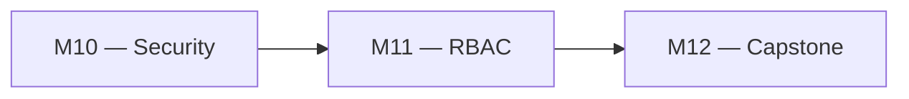
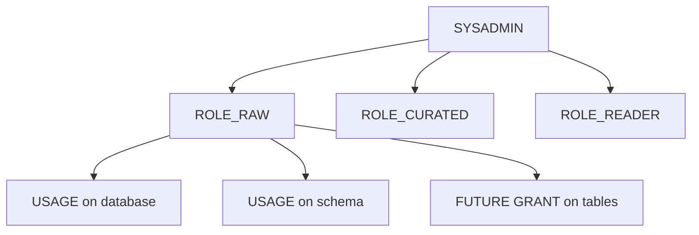

# 🧪 Lab M11 — Modèle RBAC scalable avec Future Grants

| Élément | Valeur |
|---|---|
| **Durée** | 60 min |
| **Piste** | `[CORE]` |
| **Workspace** | `$HOME/Data2AI-Labs/data-platform` (le clone) |
| **Dossier de travail** | `modules/rbac/` et `environments/dev/` |
| **Coût** | Aucun |
| **Cleanup** | Conserver jusqu'au Jour 5 |

## 🎯 Mission

L'accès aux données doit suivre les fonctions métier sans tickets manuels. Vous allez créer une hiérarchie de rôles, appliquer le moindre privilège avec des grants ciblés et configurer des Future Grants pour les nouvelles tables.

## 🏗️ Architecture





## 🎯 Objectifs

- créer une hiérarchie de rôles Snowflake avec Terraform;
- accorder des privilèges ciblés par rôle;
- configurer des Future Grants pour les nouvelles tables;
- auditer les grants avec une requête SQL.

## 📋 Prérequis

- [ ] M10 terminé : l'utilisateur technique existe;
- [ ] `terraform plan` affiche `No changes` dans `environments/dev/`.

## 📝 Partie 1 — Créer le module RBAC

### 📝 Étape 1.1 — Créer la structure

```bash
cd $HOME/Data2AI-Labs/data-platform
mkdir -p modules/rbac
```

### 📝 Étape 1.2 — Créer `modules/rbac/variables.tf`

```hcl
variable "learner_prefix" {
  type        = string
  description = "Learner prefix for role naming"
}

variable "environment" {
  type        = string
  description = "Deployment environment"
  default     = "DEV"
}

variable "database_name" {
  type        = string
  description = "RAW database name"
}

variable "schema_name" {
  type        = string
  description = "Schema name for grants"
  default     = "INGESTION"
}
```

### 📝 Étape 1.3 — Créer `modules/rbac/main.tf`

```hcl
locals {
  role_raw     = "ROLE_${var.learner_prefix}_RAW_${var.environment}"
  role_curated = "ROLE_${var.learner_prefix}_CUR_${var.environment}"
  role_reader  = "ROLE_${var.learner_prefix}_RDR_${var.environment}"
}

# ------------------------------------------------------------------
# Role hierarchy: SYSADMIN > RAW > CURATED > READER
# ------------------------------------------------------------------

resource "snowflake_account_role" "raw" {
  name    = local.role_raw
  comment = "RAW access role for ${var.learner_prefix}"
}

resource "snowflake_account_role" "curated" {
  name    = local.role_curated
  comment = "Curated access role for ${var.learner_prefix}"
}

resource "snowflake_account_role" "reader" {
  name    = local.role_reader
  comment = "Read-only role for ${var.learner_prefix}"
}

# Grant hierarchy
resource "snowflake_grant_privileges_to_account_role" "curated_to_raw" {
  privileges        = ["USAGE"]
  account_role_name = snowflake_account_role.raw.name
  on_account_role   = snowflake_account_role.curated.name
}

resource "snowflake_grant_privileges_to_account_role" "reader_to_curated" {
  privileges        = ["USAGE"]
  account_role_name = snowflake_account_role.curated.name
  on_account_role   = snowflake_account_role.reader.name
}

# ------------------------------------------------------------------
# Database and schema grants
# ------------------------------------------------------------------

resource "snowflake_grant_privileges_to_account_role" "raw_db" {
  privileges        = ["USAGE"]
  account_role_name = snowflake_account_role.raw.name

  on_schema {
    schema_name = "${var.database_name}.${var.schema_name}"
  }
}

# ------------------------------------------------------------------
# Future Grants: new tables in the schema get SELECT automatically
# ------------------------------------------------------------------

resource "snowflake_grant_privileges_to_account_role" "future_tables" {
  privileges        = ["SELECT", "INSERT", "UPDATE"]
  account_role_name = snowflake_account_role.raw.name

  on_schema_object {
    future {
      database_name = var.database_name
      schema_name   = var.schema_name
      object_type   = "TABLE"
    }
  }
}

resource "snowflake_grant_privileges_to_account_role" "reader_future" {
  privileges        = ["SELECT"]
  account_role_name = snowflake_account_role.reader.name

  on_schema_object {
    future {
      database_name = var.database_name
      schema_name   = var.schema_name
      object_type   = "TABLE"
    }
  }
}
```

### 📝 Étape 1.4 — Créer `modules/rbac/outputs.tf`

```hcl
output "role_raw" {
  value = snowflake_account_role.raw.name
}

output "role_curated" {
  value = snowflake_account_role.curated.name
}

output "role_reader" {
  value = snowflake_account_role.reader.name
}
```

### 📝 Étape 1.5 — Créer `modules/rbac/versions.tf`

```hcl
terraform {
  required_version = ">= 1.14.0, < 2.0.0"

  required_providers {
    snowflake = {
      source  = "snowflakedb/snowflake"
      version = "= 2.14.0"
    }
  }
}
```

### 📝 Étape 1.6 — Formater et valider

```bash
cd modules/rbac
terraform fmt
terraform validate
```

## 📝 Partie 2 — Appeler le module depuis DEV

### 📝 Étape 2.1 — Ajouter l'appel dans `environments/dev/main.tf`

```hcl
module "rbac" {
  source        = "../../modules/rbac"
  learner_prefix = var.learner_prefix
  environment   = "DEV"
  database_name = module.landing_zone.database_name
  schema_name   = "INGESTION"
}
```

### 📝 Étape 2.2 — Ajouter les outputs

```hcl
output "rbac_roles" {
  value = {
    raw     = module.rbac.role_raw
    curated = module.rbac.role_curated
    reader  = module.rbac.role_reader
  }
  description = "RBAC role hierarchy"
}
```

### 📝 Étape 2.3 — Planifier et appliquer

```bash
cd environments/dev
terraform fmt
terraform init
terraform validate
terraform plan
terraform apply
```

✅ **Checkpoint** : 3 rôles créés + grants.

## 📝 Partie 3 — Auditer les grants

### 📝 Étape 3.1 — Lister les rôles

```bash
snow sql -c training -q "SHOW ROLES LIKE 'ROLE_ABC_%'"
```

Remplacez `ABC` par votre préfixe.

### 📝 Étape 3.2 — Vérifier les Future Grants

```bash
snow sql -c training -q "SHOW FUTURE GRANTS IN SCHEMA ABC_RAW_DEV.INGESTION"
```

✅ **Checkpoint** : des lignes avec `GRANT SELECT` et `GRANT INSERT` pour les futures tables.

### 📝 Étape 3.3 — Tester le Future Grant

Créez une table manuellement et vérifiez que les grants s'appliquent automatiquement :

```bash
snow sql -c training -q "CREATE TABLE ABC_RAW_DEV.INGESTION.TEST_FUTURE (ID INT)"
snow sql -c training -q "SHOW GRANTS ON TABLE ABC_RAW_DEV.INGESTION.TEST_FUTURE"
```

✅ **Checkpoint** : les grants SELECT et INSERT sont déjà présents grâce au Future Grant.

### 📝 Étape 3.4 — Nettoyer la table de test

```bash
snow sql -c training -q "DROP TABLE ABC_RAW_DEV.INGESTION.TEST_FUTURE"
```

## 📝 Partie 4 — Principe du moindre privilège

### 📝 Étape 4.1 — Vérifier la séparation des rôles

| Rôle | Privilèges | Usage |
|---|---|---|
| `ROLE_ABC_RAW_DEV` | USAGE schema, INSERT, UPDATE, SELECT | Ingestion ETL |
| `ROLE_ABC_CUR_DEV` | USAGE schema, SELECT | Transformation dbt |
| `ROLE_ABC_RDR_DEV` | USAGE schema, SELECT | Lecture BI |

### 📝 Étape 4.2 — Attribuer le rôle à l'utilisateur technique

Ajoutez dans `environments/dev/main.tf` :

```hcl
resource "snowflake_grant_account_role" "tech_raw" {
  role_name  = module.rbac.role_raw
  user_name  = module.security.user_name
}
```

### 📝 Étape 4.3 — Planifier et appliquer

```bash
terraform plan
terraform apply
```

### 📝 Étape 4.4 — Vérifier

```bash
snow sql -c training -q "SHOW GRANTS TO USER TF_ABC_SVC"
```

✅ **Checkpoint** : le rôle `ROLE_ABC_RAW_DEV` est attribué à l'utilisateur technique.

## 🏆 Challenge

Ajoutez un rôle `ROLE_ABC_ADMIN_DEV` qui a le droit de créer des schemas dans la database, et attribuez-le à un utilisateur `ADMIN_ABC`.

Critères :

- [ ] `terraform plan` crée le rôle et le grant;
- [ ] `SHOW GRANTS TO USER ADMIN_ABC` affiche le rôle;
- [ ] le rôle peut créer un schema de test.

## 🧹 Cleanup

Conservez les ressources pour le Jour 5.
